# PISA: Block Sparse Attention with Log-Linear Complexity

**Source:** HuggingFace Daily Papers, listed 2026-09-28 · [arXiv 2609.31093](https://arxiv.org/abs/2609.31093)
**Raw:** [raw/huggingface/2026-09-28-block-sparse-attention-with-log-linear-complexity.md](../../raw/huggingface/2026-09-28-block-sparse-attention-with-log-linear-complexity.md)

## TL;DR

Block-sparse attention lets each query attend to only a few blocks of past keys, which makes the attention itself cheap. The catch is choosing the blocks. Standard selection scores every query against every key block, and that scoring step is still quadratic in sequence length. PISA replaces the flat scan with a pyramid search. Keys are pooled into a coarse-to-fine hierarchy with O(log N) levels. Selection starts at the coarsest level, keeps a bounded Top-K set of candidates, expands only those into the next finer level, and repeats until it reaches real key blocks. Each level scores its candidates with LogSumExp, a soft maximum that keeps a block's score high when one key inside it matches strongly. Total cost is O(N log N). The authors ship fused Triton kernels for training and inference that do the routing and scoring without ever materializing the query-key score matrix. On language modeling, PISA matches the baseline on commonsense reasoning and does better on retrieval.

```mermaid
flowchart LR
  Q["Query<br/><small>current token</small>"] --> L0["Coarsest level<br/><small>few pooled key blocks</small>"]
  L0 --> S["LSE Top-K<br/><small>keep bounded set</small>"]
  S -->|expand kept| L1["Finer level<br/><small>children of survivors</small>"]
  L1 -->|repeat log N| S
  L1 --> B["Finest blocks<br/><small>real key-value blocks</small>"]
  B --> A["Sparse attention<br/><small>exact, fused kernel</small>"]
  A --> O["Output<br/><small>no N x N matrix</small>"]
  classDef input fill:#d0ebff,stroke:#1971c2,color:#1b1b1b,stroke-width:2px
  classDef core fill:#e5dbff,stroke:#6741d9,color:#1b1b1b,stroke-width:2px
  classDef loop fill:#fff3bf,stroke:#f08c00,color:#1b1b1b,stroke-width:2px
  classDef exit fill:#d3f9d8,stroke:#2f9e44,color:#1b1b1b,stroke-width:2px
  class Q,L0,L1 input
  class S loop
  class B,A core
  class O exit
  linkStyle 3 stroke:#f08c00,stroke-width:2px
```

Find the right blocks by zooming in, not by scanning

Each level only scores a fixed-size candidate set, so selection cost grows with log N, not N.

Blue is the key hierarchy, amber is the selection loop, purple is the attention compute, green is the result.

## Key findings

- **The selector, not the attention, was the remaining quadratic term.** Every flat block selector scores all query-block pairs. PISA's pyramid bounds the candidate set at each level, so selection becomes O(N log N).
- **LogSumExp scoring is the detail that makes coarse levels safe.** Mean pooling would blur a single sharp key into its neighbours. A LogSumExp score behaves like a soft maximum, so a coarse block that contains one highly relevant key still ranks high and survives.
- **Kernel first.** The Triton kernels fuse hierarchical routing and scoring for both training and inference and never materialize the score matrix.
- **Quality holds, retrieval improves.** Comparable to the baseline on commonsense reasoning, better on retrieval tasks, per the abstract.

## How this relates to prior wiki pages

- **It attacks the cost DeepSeek-style indexers still pay.** SemiAnalysis's [GLM-5.3 sparse attention piece](../../raw/rss/2026-09-28-semianalysis-how-glm5-3-sparse-attention-affects-hbm-memory-usage.md) (09-28) walks through DeepSeek Sparse Attention's lightning indexer: a small multi-head scorer that computes a relevance score for **every** prior token for each query, then keeps the top K. That is linear work per query and quadratic over a sequence, which is why GLM-5.3 added IndexShare (one indexer shared by four layers, 75% fewer indexer FLOPs). PISA removes the flat scan instead of sharing it.
- **It extends the indexer-cost thread.** [MISA (05-11)](../inference-efficiency/2026-05-11-misa-mixture-of-indexer-sparse-attention.md) cut the indexer's cost by routing each query to 8 of its 64 heads, but still scored every token with those heads. [MiniMax Sparse Attention (06-12)](../inference-efficiency/2026-06-12-minimax-sparse-attention-msa.md) scores key-value blocks per GQA group, which shrinks N by the block size but stays linear per query. PISA is the first entry on this wiki to change the asymptotic cost of selection.
- **Its closest prior art is Lighthouse.** [Lighthouse Attention (05-16)](../inference-efficiency/2026-05-16-lighthouse-attention-long-context-pretraining.md) also pooled into a multi-resolution pyramid and ran a top-k cascade, but as a training-only wrapper that is removed before inference. PISA keeps the pyramid at inference and supplies an inference kernel. Whether PISA's LogSumExp scoring is the reason it can stay on at inference is not tested against Lighthouse.
- **It inherits SAS's training question.** [SAS (09-14)](../inference-efficiency/2026-09-14-sas-attention-sparsification-end-to-end.md) argued that selectors trained to imitate dense attention rank blocks wrongly under a tight budget. A greedy pyramid is more exposed to this than a flat scan, because a block pruned at a coarse level can never come back.
- **It does not fix memory capacity.** The same SemiAnalysis piece stresses that top-k selection needs the full context resident in HBM, so sparse attention saves bandwidth and compute but not capacity. PISA speeds up selection. The KV cache is still full size (see [kv-cache.md](../inference-efficiency/kv-cache.md)).
- **Kernel rule holds.** [attention-mechanisms.md](attention-mechanisms.md) recorded on 09-14 that in sparse attention "the sparsity idea is never the hard part, the kernel is." PISA ships its kernel, so it clears that bar.

## Gaps

- The abstract gives no model scale, no context length and no wall-clock numbers against FlashAttention or a flat block selector. O(N log N) only matters once N is large enough that selection dominates.
- Greedy coarse-to-fine search can prune a block early and never recover it. No recall-versus-depth analysis is reported in the abstract.
- No comparison against DSA, MSA, or Lighthouse on the same budget.

## Related

- [attention-mechanisms.md](attention-mechanisms.md) · [kv-cache.md](../inference-efficiency/kv-cache.md) · [MISA](../inference-efficiency/2026-05-11-misa-mixture-of-indexer-sparse-attention.md) · [MSA](../inference-efficiency/2026-06-12-minimax-sparse-attention-msa.md) · [Lighthouse](../inference-efficiency/2026-05-16-lighthouse-attention-long-context-pretraining.md) · [SAS](../inference-efficiency/2026-09-14-sas-attention-sparsification-end-to-end.md) · [CompactAttention](../inference-efficiency/2026-05-19-compactattention-chunked-prefill-block-union-kv-selection.md)

**Source:** [arXiv 2609.31093](https://arxiv.org/abs/2609.31093) · [raw file](../../raw/huggingface/2026-09-28-block-sparse-attention-with-log-linear-complexity.md)
