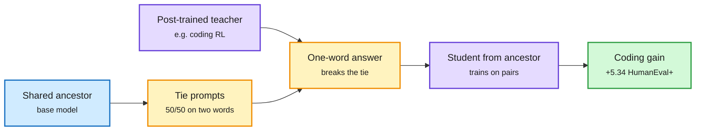

# Post-Training Leaves Behavioral Shadows on Unrelated Decisions (Active Taskless Distillation)

**Source:** HuggingFace Daily Papers, listed 2026-09-29 (254 upvotes, #1 of the day) · [arXiv 2609.29233](https://arxiv.org/abs/2609.29233)
**Raw:** [raw/huggingface/2026-09-29-post-training-leaves-behavioral-shadows-on-unrelated-decisio.md](../../raw/huggingface/2026-09-29-post-training-leaves-behavioral-shadows-on-unrelated-decisio.md)

## TL;DR

Post-training a model on coding changes how it behaves on prompts that have nothing to do with code. The paper calls this a "behavioral shadow" and shows you can distill capability through it. **Active Taskless Distillation (ATD)** picks prompts where the teacher's and student's shared ancestor (the base model both came from) is almost exactly 50/50 between two ordinary words. The post-trained teacher breaks the tie one way. A student initialized from the same ancestor trains only on those prompt-word pairs: no coding examples, no teacher logits, no teacher weights. On Qwen2.5-1.5B, 5,664 such single-word answers give +5.34 points on HumanEval+ over a control matched for nuisance effects. Transfer also shows up for scientific knowledge, commonsense reasoning and reading comprehension, across model generations, sizes and families, and the strength of the shadow tracks how strongly the teacher was updated.

A single word per prompt carries the update

Choose prompts where the base model is undecided. The teacher's tie-break leaks its training.

Blue is the shared base, amber is the probe and its one-word signal, purple is teacher and student, green is the transferred capability.

## Key findings

- Capability transfer with one word per prompt, no task data. Prior subliminal-learning work moved traits or preferences using long teacher outputs.
- Controls matter: the gain is measured against a nuisance-matched control that disrupts the prompt-response link.
- The learned shift is composable and scales with the teacher's update strength.
- Requires a shared public ancestor. It does not (as shown) transfer across unrelated bases.

## How this relates to prior wiki pages

- **Security reading:** pairs with [Distillation Defenses Easily Break After RL (09-30)](../responsible-ai/2026-09-30-distillation-defenses-break-after-rl.md). Hiding reasoning traces does nothing against a channel that uses one ordinary word. Any fine-tune of a public open base (Qwen, Llama) that exposes even token choices leaks its update.
- **Distillation reading:** the extreme end of the "less signal per example" trend on the [distillation page](../inference-efficiency/knowledge-distillation.md), where TIP (04-16) showed most teacher tokens carry no signal. ATD shows the minimum can be one token, if it is chosen where the base is indifferent. Active selection of maximally informative prompts is the lever.
- **Gap:** 1.5B scale for the headline; no test of whether the channel survives a teacher that samples at temperature or returns only top-1 text through an API.

## Related

- [Responsible AI](../responsible-ai/responsible-ai.md)
