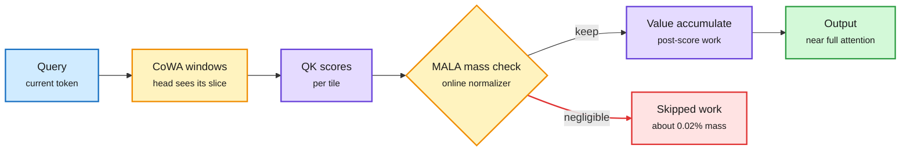

# MassAlloc and CoWindow Attention: Two Ways to Stop Paying for Attention You Do Not Use

**Source:** HuggingFace Daily Papers, listed 2026-09-29 · [MassAlloc, arXiv 2609.32712](https://arxiv.org/abs/2609.32712) (64 upvotes) · [CoWindow, arXiv 2609.32704](https://arxiv.org/abs/2609.32704) (59 upvotes)
**Raw:** [MassAlloc](../../raw/huggingface/2026-09-29-massalloc-attention-let-attention-allocate-its-own-compute.md) · [CoWindow](../../raw/huggingface/2026-09-29-cowindow-attention-full-causal-coverage-is-a-collective-prop.md)

## TL;DR

Two attention papers posted the same day with an identical evaluation stack (8K associative recall, a 128K tensor-parallel operator benchmark, scaling runs from 0.6B to 14B, 14B and 32B continued-training checkpoints), so they read as one group's two answers to one question: full attention does work that contributes almost nothing, so where do you cut? **MassAlloc (MALA)** keeps every query-key score but skips the post-score work (the softmax-weighted value accumulation) for entries whose normalized probability mass is negligible, using the online-softmax normalizer it already computes. **CoWindow (CoWA)** cuts earlier and by position: every KV head sees a shared local window and a prefix sink, and the distant history is split so each head covers a different slice. No head sees everything, but the ensemble does. MALA is the conservative cut (1.6x faster decoding at 128K); CoWA is the aggressive one (3.0x faster decoding and 7.6x lower decode memory per rank at 128K). Both track full attention in perplexity across the scaling ladder.

Two cuts in the same attention pipeline

MALA prunes after scoring by probability mass. CoWA prunes before scoring by giving each head a different slice of history.

Blue is input, amber marks the two cutting points, purple is attention compute, red is skipped work, green is the output.

## Key findings

**MassAlloc (MALA)**
- A fused attention primitive. Forward uses the evolving online-softmax normalizer to decide which tiles' post-score work to run; backward reuses the finalized normalizer, so no extra state is stored.
- Under exactly matched post-score work at 8K, MALA's omitted mass (0.0188%) nearly matches a per-instance oracle (0.0182%).
- Associative recall at 8K: 89.67% vs 89.97% for full attention.
- At 128K with tensor parallelism: 2.2x faster forward and 3.0x faster backward in training, 1.6x faster decoding.

**CoWindow (CoWA)**
- Position-defined, so there is no learned router or lightning indexer (the cheap top-k scorer DeepSeek Sparse Attention uses) to pay for. The pattern is identical in training and inference and splits cleanly across KV-head tensor parallelism.
- The key ablation: complementary long-range windows (100% collective coverage) reach 89.73% at 8K, while duplicated windows of the same size do "substantially worse." Coverage by the ensemble, not per head, is what matters.
- At 128K: 7.4x faster forward, 8.6x faster backward, 3.0x faster decoding; decode memory per rank 7.6x lower.

## How this relates to prior wiki pages

- **Answers the selector-cost problem from the other side.** [PISA (09-29)](2026-09-29-pisa-log-linear-block-sparse-attention.md) made block selection O(N log N) with a pyramid search, and the [SemiAnalysis GLM-5.3 piece (09-29)](../hardware/2026-09-29-semianalysis-glm53-sparse-attention-hbm.md) showed DeepSeek's indexer must keep every token resident. CoWA removes the selector entirely. That is the first design on this page where sparse attention also shrinks per-rank KV capacity, the thing SemiAnalysis said sparse attention does not do.
- **MALA is a kernel-level version of the "negligible mass" argument** behind top-k sparse attention, but without committing to k in advance.
- **Open question:** CoWA's decode-memory saving is per rank under tensor parallelism. The total cache across ranks may not shrink; the abstract does not say.

## Related

- [Attention mechanisms concept page](attention-mechanisms.md)
- [KV cache concept page](../inference-efficiency/kv-cache.md)
