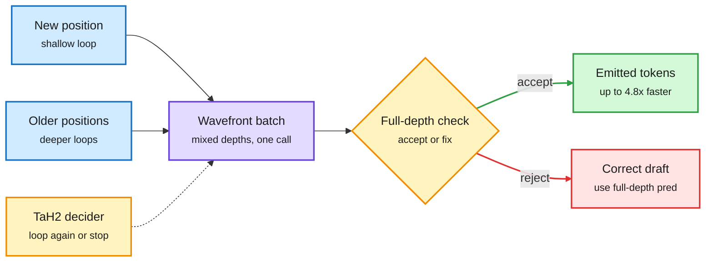

# WaveFront Decoding and TaH2: Looped Models Get Faster Decoding and a Learned Per-Token Loop Count

**Source:** HuggingFace Daily Papers, listed 2026-09-29 · [WaveFront Decoding, arXiv 2609.23033](https://arxiv.org/abs/2609.23033) · [TaH2, arXiv 2609.35748](https://arxiv.org/abs/2609.35748) (46 upvotes, alphaxiv overview available)
**Raw:** [WFD](../../raw/huggingface/2026-09-29-wavefront-decoding-parallelized-self-speculative-decoding-fo.md) · [TaH2](../../raw/huggingface/2026-09-29-improving-test-time-scaling-with-adaptive-looped-transformers.md)

## TL;DR

A looped language model runs the same block of layers T times per token. That saves parameters but makes decoding T times more sequential. Two papers attack the two costs.

**WaveFront Decoding (WFD)** is training-free self-speculative decoding (draft cheap, verify expensive) built from the loop itself. An early loop's output is a decent draft of the final token. Because the block's weights are shared, states at different positions and different loop depths can run in one batched call. WFD arranges them on a diagonal "wavefront": new positions are drafted at shallow depth while older positions advance to full depth for verification, all in the same call. 2.42x on Ouro-2.6B, 3.54x on Huginn-3.5B over plain decoding, and 4.81x on Huginn when adjacent loops share KV.

**TaH2** asks whether looping helps test-time scaling (accuracy per doubling of decoding compute). Existing looped models have steeper curves than non-looped baselines but still lose at matched compute, because fixed depth spends extra loops on tokens that do not need them. TaH2 post-trains the backbone together with a small **iteration decider** that picks, per token, whether to loop again. It is supervised online by whether one more iteration actually lowers that token's loss ("lookahead depth supervision"). On AIME, TaH2's slope is 2.74 vs 1.79 for the non-looped baseline (+53%), and it beats the baseline's peak accuracy by about 3.4 points at matched compute. Its advantage keeps growing with max depth (+2.8 at depth 2 to +3.9 at depth 8) where other looped models plateau.

Draft shallow, verify deep, in one call

WFD reuses early loops as drafts. TaH2 decides per token whether another loop is worth it.

Blue is tokens at different depths, purple is the shared block call, amber is verification and the learned depth decider, green is accepted output, red is the correction path.

## Key findings

- **WFD:** drafting and verification run concurrently in the same recurrent calls, unlike phase-separated draft-then-verify. Six Spec-Bench categories. Cross-recurrence KV sharing cuts wavefront KV traffic.
- **TaH2:** per alphaxiv's overview, over half of tokens do not change prediction after extra iterations in Ouro, which is why fixed depth wastes compute. The decider's label is online and loss-based, not a fixed confidence threshold or an offline mismatch label.

## How this relates to prior wiki pages

- **Resolves a Looking Ahead from 09-28/09-29.** The 09-28 digest predicted, after [LoopFormer](2026-09-28-loopformer-elastic-depth.md) made loop count a per-request dial, that a small decision model would learn to pick a looped model's loop count per input within 90 days. On 09-29 [Continuous Depth Batching](2026-09-29-continuous-depth-batching-looped-lms.md) only predicted exits for scheduling. TaH2 trains exactly that decider, per token, two days later. Resolved at the token level; per-request routing across depths is still untested.
- **The looped serving stack now has four parts:** cheaper loops ([FlashLoop, 09-27](2026-09-27-flashloop-lazy-updates.md), lazy updates, 1.64x), batchable adaptive depth (CDB, 09-29), speculative decoding from the loop (WFD), and a learned per-token depth policy (TaH2).
- **Tension:** all of this is on dense looped models. [Sparse Layers are Critical (09-27)](2026-09-27-sparse-layers-looped-moe.md) and SMELT (09-02) say looped models only scale with MoE layers. Mixed-depth batched calls in WFD would route different experts per depth, which may break the batching win.

## Related

- [Looped transformers concept page](looped-transformers.md)
- [Speculative decoding](../inference-efficiency/speculative-decoding.md)
