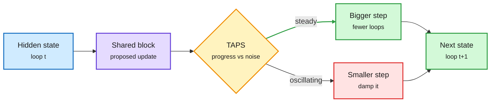

# Looped Models: Step Size, Placement, and Supervising the Thought

**Source:** HuggingFace Daily Papers, listed 2026-09-30 · [TAPS, arXiv 2609.36653](https://arxiv.org/abs/2609.36653) · [What Makes Recurrence Effective, arXiv 2609.36636](https://arxiv.org/abs/2609.36636) · [REST, arXiv 2609.36159](https://arxiv.org/abs/2609.36159)
**Raw:** [TAPS](../../raw/huggingface/2026-09-30-scheduling-recursive-reasoning-in-looped-transformers.md) · [Recurrence](../../raw/huggingface/2026-09-30-what-makes-recurrence-effective-in-looped-language-models.md) · [REST](../../raw/huggingface/2026-09-30-principled-thoughts-for-latent-recursive-llm-systems.md)

## TL;DR

Three papers on looped (recurrent-depth) models, which reuse the same layers several times to buy extra compute without extra parameters.

- **TAPS** (Trajectory Adaptive Progress-Fluctuation Scheduler): every loop applies its update at a fixed size of 1. That is too timid when updates keep making progress and too aggressive when they oscillate. TAPS splits the loss sensitivity to step size exactly into a "persistent progress" part and a "fluctuation" part, and adapts the step size online. Training-free, it raises final accuracy on structured reasoning tasks. Folded into training, it reaches baseline accuracy **up to 1.56x faster in wall-clock**.
- **What Makes Recurrence Effective:** a controlled study. Extra loops help reasoning beyond the training horizon but **hurt knowledge recall**, and harder problems do not reliably gain more. Where you put the unshared input and output layers matters, so effective depth alone does not predict behavior. Non-looped output layers make models robust to running fewer loops. The standard trick of re-injecting the initial state each loop is weak. **Channel-wise history-state injection plus a timestep signal** keeps knowledge intact under longer unrolling.
- **REST** (Representation-Supervised Thoughts): latent reasoning (loops over hidden states, or agents passing hidden states) is usually trained only on the final answer's cross-entropy. That lets thoughts collapse across different questions or carry junk. REST adds four losses (causality, minimality, separability, stability). Up to +7.5 points on seven benchmarks and 30% better convergence, with no inference cost.

The loop now has a speed dial, not just a count

TAPS sizes each loop's step from how steady the progress is.

Blue is the state, purple is the shared block, amber is the scheduler, green speeds up, red damps.

## How it relates to prior wiki pages

- **A fifth control knob on [looped-transformers](looped-transformers.md).** The page's serving stack had cheaper loops (FlashLoop, 09-27), robust any-depth inference (LoopFormer, 09-28), batchable exits (Continuous Depth Batching, 09-29), and a learned per-token loop count plus speculative decoding (TaH2 and WaveFront, 09-30). TAPS adds update *size*. Loop count times step size is the real compute budget, and nobody has learned both jointly.
- **A caution for TaH2's gains.** TaH2 (09-30) showed its gain grows with depth on AIME. "What Makes Recurrence Effective" says extra depth trades knowledge for reasoning. That fits TaH2 being a math result, and predicts weaker gains on knowledge-heavy evaluations.
- **REST links to the [CLM](../agentic-systems/2026-10-01-context-language-models.md) and latent-communication threads:** supervising what the hidden "thought" contains also makes it easier to decode, which matters for monitoring.

## Links

- Concept: [Looped transformers](looped-transformers.md) · [Test-time compute allocation](../inference-efficiency/test-time-compute-allocation.md)
- Digest: [2026-10-01](../daily-digest/2026-10/2026-10-01.md)
