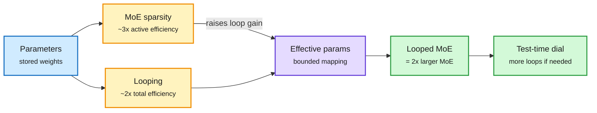

# Loop Scaling Laws: Recurrence and Sparsity in One Law

**Source:** HuggingFace Daily Papers, listed 2026-10-01 · [arXiv 2609.40316](https://arxiv.org/abs/2609.40316)
**Raw:** [raw/huggingface/2026-10-01-scaling-laws-for-looped-mixture-of-experts.md](../../raw/huggingface/2026-10-01-scaling-laws-for-looped-mixture-of-experts.md)

## TL;DR

Two cheap ways to scale a model pull in different directions. **Looping** (running the same layers several times) adds compute depth without adding parameters. **MoE** (mixture-of-experts, where each token uses only a few of many expert sub-networks) adds total capacity without adding active compute per token. Existing scaling laws model each alone. This paper fits the first law that models both together with size and data. Its core is a bounded mapping that says how many "effective parameters" one extra loop is worth, and how sparsity raises that worth. The law predicts held-out loss better than alternatives and reduces to the standard dense and MoE laws as special cases. Downstream, sparsity gives about **3x active-parameter efficiency** and recurrence about **2x total-parameter efficiency on reasoning**. At trillion-token scale and matched training compute, a looped MoE with the law-chosen loop count **matches a non-looped MoE about twice its size** on reasoning benchmarks, and keeps loop count as a test-time compute dial.

Loops buy depth, experts buy capacity, and they multiply

Sparsity raises how much each extra loop is worth.

Blue is the parameter budget, amber is each scaling axis, purple is the law's combined quantity, green is the result.

## How it relates to prior wiki pages

- **Quantifies the 09-27 finding.** [Sparse Layers are Critical to Scaling Looped LMs (09-27)](2026-09-27-sparse-layers-looped-moe.md) showed looped MoE scales better than dense looping because the router picks different experts on each pass. This paper turns that into a fitted law with a sparsity-conditional loop gain.
- **Partly resolves the 09-30 Looking Ahead** that adaptive-depth looped models must beat a normal model at matched compute outside math. "Reasoning benchmarks" here likely still means math-heavy suites; code or agent wins are not claimed in the abstract. Partial.
- **Week-long thread.** With [TAPS (10-01)](2026-10-01-taps-looped-recurrence-design.md) (adaptive step size per loop), [Continuous Depth Batching (09-29)](2026-09-29-continuous-depth-batching-looped-lms.md) and [TaH2 (09-30)](2026-09-30-wavefront-decoding-tah2-looped.md), looped models now have training laws, serving batching, learned exit policies and step-size control. The missing piece is a released production model.

## Gaps

- Memory: the claimed parameter savings ignore that each loop still stores its own KV cache unless a FlashLoop-style delta (09-27) is used.
- Exact benchmark list and whether gains hold on knowledge tasks (the 10-01 REST paper found depth trades knowledge for reasoning) are not in the abstract.

Related: [Looped transformers](looped-transformers.md) · [Scaling laws](scaling-laws.md)
