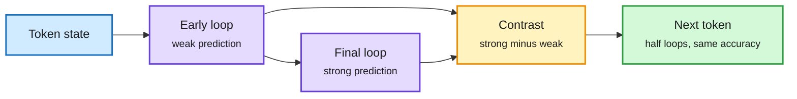

# LoopCD: A Looped Model's Early Passes Are a Free Weak Model

**Source:** HuggingFace Daily Papers, 2026-10-02 · [arXiv 2610.02185](https://arxiv.org/abs/2610.02185), also on X ([@WeihaoUIC](https://x.com/WeihaoUIC/status/2105903101316133186))
**Raw:** [raw/huggingface/2026-10-02-decoding-looped-transformers-better-for-almost-free.md](../../raw/huggingface/2026-10-02-decoding-looped-transformers-better-for-almost-free.md)

## TL;DR

A looped transformer runs one shared block several times per token. Each loop already produces a representation you could decode into the same next token; standard decoding throws the early ones away. Contrastive decoding normally needs two models: steer the strong model's choice away from what a weak model would pick. In a looped model the early loop *is* the weak model, aligned with the strong one for free. LoopCD contrasts the final loop with an earlier one, either in logit space (one extra output projection) or in hidden-state space (zero extra output cost). Across four looped families, Ouro-2.6B-Thinking's AIME 2024 pass@1 rises from **61.88% to 73.33%**, and Huginn's HumanEval from 22.56% to 31.71%. Because guided decoding is stronger, you can **halve the loops** and still match the unguided full-depth model, cutting forward FLOPs by **22.5% to 48.2%**.

Depth becomes a dial you can turn down

The early loop's guess steers the final loop's choice.

Blue is input, purple are passes of the same block, amber is the contrast step, green is the output.

## How it relates to prior wiki pages

- **Second "use the early loops" result in four days.** [WaveFront Decoding (09-30)](2026-09-30-wavefront-decoding-tah2-looped.md) used early loops as speculative drafts. LoopCD uses them as a contrast signal. Both treat recurrence as a source of free weak predictions.
- **Joins the loop-count policy thread.** The [looped transformers page](looped-transformers.md) tracked learned loop counts (09-30), step size (10-01) and a joint loops-and-experts scaling law (10-02). LoopCD gives a training-free way to cut loops at serving time.

## Gaps

- Contrastive decoding can amplify errors when the weak and strong predictions agree on a wrong token; failure analysis is limited.
- Tested on models up to a few billion parameters; no frontier-scale looped model exists to test on.

## Related

[Looped transformers](looped-transformers.md) · [Speculative decoding](../inference-efficiency/speculative-decoding.md)
