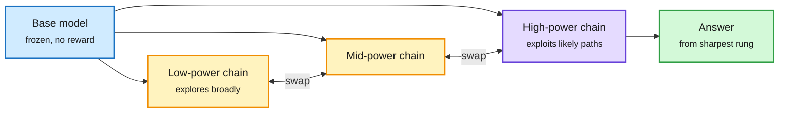

# Parallel Power Tempering and the Sharpening Tax: What RL Buys, and What Sampling Gets for Free

**Sources:** HuggingFace Daily Papers 2026-10-02 · [Explore Broadly, Reason Sharply (PPT), arXiv 2609.38104](https://arxiv.org/abs/2609.38104), **cross-source confirmed (HF + Kurate cs.LG #4)** · [Sharpening Tax in Post-Training, arXiv 2610.01509](https://arxiv.org/abs/2610.01509)
**Raw:** [PPT](../../raw/huggingface/2026-10-02-explore-broadly-reason-sharply-push-small-models-toward-the.md) · [Sharpening Tax](../../raw/huggingface/2026-10-02-sharpening-tax-in-post-training.md) · [Kurate cs.LG](../../raw/kurate/2026-10-03-cs-lg.md)

## TL;DR

Both papers ask what RL post-training really adds. **Sharpening Tax** finds that base models with a light harness are capable agents: far lower pass@1, but often **higher pass@K** than their post-trained versions given enough samples. Post-training pushes tasks to two extremes (always solved or never solved). That buys consistency and costs coverage. The paper measures this loss as the "sharpening tax" across 14 base/post-trained pairs from four families on three agentic benchmarks (42 cases); the tax is present in most, can be estimated from a few rollouts, and is reduced by PTGS, a sampler that sets temperature per prompt from its estimated difficulty during RL. **PPT** (Georgia Tech and Morgan Stanley) gets sharpening without training. Power sampling targets the base model's sequence probability raised to a power above 1, concentrating mass on answers the model already prefers. One chain at high power gets stuck on a plausible wrong path; at low power it stays diffuse. PPT runs several replicas at different powers and swaps states between them (parallel tempering, borrowed from physics MCMC), so explorers find paths and sharp chains refine them. It fixes a truncation bias in earlier power samplers and reports outperforming RL-post-trained models, approaching frontier models with small ones.

Explorers find paths, sharp chains finish them

PPT swaps states between replicas at different sharpening powers.

Blue is the frozen model, amber the exploring chains, purple the sharpest chain, green the answer.

## Cost angle

PPT trades training compute for inference compute: several chains and MCMC refinement steps per answer. That is cheap when a task is rare and expensive at serving volume. The Sharpening Tax result is the reverse warning: an RL-trained model is cheaper per answer (high pass@1) but loses tasks you could have solved by sampling the base model more.

## How it relates to prior wiki pages

- **Pattern established (≥3 entries this week): sampling is a post-training primitive.** PPT (sharpen at inference instead of RL), Finetuning with Sampling (MCMC reshapes SFT data so SFT rivals RL, [10-03 distillation page](../inference-efficiency/2026-10-03-distillation-dynamics-and-sampling.md)), and Sharpening Tax (RL mostly sharpens, and that sharpening has a measurable coverage cost). All three treat RL's main effect as distribution sharpening, and two recover it with sampling.
- **Links to test-time compute allocation.** The [test-time compute page](../inference-efficiency/test-time-compute-allocation.md) tracks when more samples beat a better model. Sharpening Tax quantifies the crossover per task.
- **Contrast with RIDE (10-02).** RIDE argued the RL residual carries real new signal worth extrapolating. Sharpening Tax says much of it is concentration. Both can be true on different task types; agentic tasks are where Sharpening Tax measured.

## Gaps

- PPT's "comparable to frontier" claim needs the exact benchmarks and sample budgets; cost per answer is not reported in the abstract.
- Sharpening Tax uses pass@K with a "sufficient" budget; in production, K is limited by cost.

## Related

[RL for LLMs](rl-for-llms.md) · [Test-time compute allocation](../inference-efficiency/test-time-compute-allocation.md)
