# Foil: how to loop a mixture-of-experts model

**TL;DR.** A looped transformer reuses one block of layers several times, buying depth without storing more parameters. A sparse MoE (mixture-of-experts) stores many expert feed-forward networks but sends each token to only a few. Foil (Case Western, Kyoto, NII; arXiv 2609.35751, Kurate cs.LG #18 this week) asks how to arrange a *fixed* expert budget across physical layers (D), experts per layer (E) and loop passes (L). Its answer: **flatten**, (E, D, L) to (2E, D/2, 2L), which keeps stored experts (E×D), effective depth (D×L) and top-2 expert calls per token constant, but lets every routing decision choose from a pool twice as large; and **untie the attention**, giving each pass its own attention weights while experts and routers stay shared. At 100B tokens, loss falls monotonically with flattening; the most flattened shape (64 experts, 1 layer, 16 passes) ends **0.012 nat below the base looped MoE at equal parameters and compute**, with downstream accuracy on par or better.

```mermaid
flowchart LR
  B["Base looped MoE<br/><small>8 experts, 8 layers, 2 loops</small>"] --> F["Flatten<br/><small>2E, D/2, 2L</small>"]
  F --> P["Foil-1<br/><small>64 experts, 1 layer, 16 loops</small>"]
  P --> U["Untie attention<br/><small>own weights per pass</small>"]
  U --> R["Router<br/><small>shared, more confident</small>"]
  R --> O["Lower loss<br/><small>-0.012 nat at 100B</small>"]
  classDef input fill:#d0ebff,stroke:#1971c2,color:#1b1b1b,stroke-width:2px
  classDef core fill:#e5dbff,stroke:#6741d9,color:#1b1b1b,stroke-width:2px
  classDef loop fill:#fff3bf,stroke:#f08c00,color:#1b1b1b,stroke-width:2px
  classDef exit fill:#d3f9d8,stroke:#2f9e44,color:#1b1b1b,stroke-width:2px
  class B input
  class F,P core
  class U,R loop
  class O exit
  linkStyle 4 stroke:#2f9e44,stroke-width:2px
```

Same experts, same compute, bigger choice per decision

Halve the layers, double the experts per layer, double the passes.

Blue is the baseline shape, purple the flattened shapes, amber the attention and routing changes, green the result.

## Key findings

- At 20B tokens every Foil shape beats the unflattened looped baseline; at 100B the ordering is monotonic in flattening.
- Untying attention yields more balanced *and* more confident routing at equal shape.
- Design guidance from the ablations: returns from looping and from widening expert layers amplify each other; **routing confidence tracks healthy expert use better than load balance does**; a sparse looped MoE should use more experts per layer and more passes.

## How this relates to prior wiki pages

- **Extends Loop Scaling Laws (10-02)**, which fit recurrence and sparsity jointly and found a law-tuned looped MoE matches a non-looped MoE about twice its size at matched compute ([page](2026-10-02-loop-scaling-laws-looped-moe.md)). That paper said looping and sparsity combine well; Foil says *how to shape* the combination.
- **Pattern with Looped-DiT (10-02, 260M looped image model beats one 6.5x larger at 4.9x less compute)** and LoopCD (10-03, early loops as a free contrastive signal): three loop papers in three days, all treating recurrence as a cheaper substitute for stored parameters. See [looped-transformers](looped-transformers.md).
- **Routing angle.** "Confidence beats load balance as a health metric" is a claim about the MoE router, relevant to [llm-routing](../ai-routing/llm-routing.md) where calibrated confidence is the core signal.

## Gaps

- 0.012 nat is small; the scale is modest (100B tokens) and no wall-clock numbers are given. A 1-layer, 16-pass model is sequential by construction, so latency per token may rise even at equal FLOPs.
- Shared experts across 16 passes concentrate memory traffic on one layer's experts; the effect on expert-parallel serving is not studied.

**Raw source:** [Kurate cs.LG leaderboard](../../raw/kurate/2026-10-04-cs-lg.md); paper linked above.
