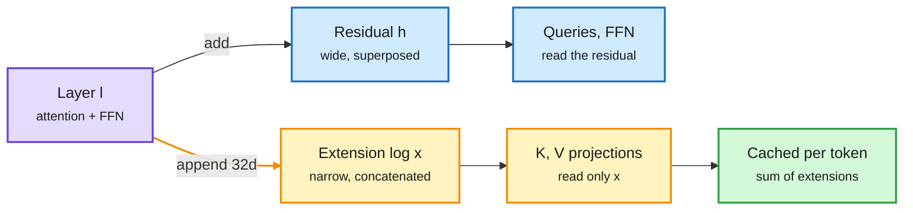

# The Extender: a log-structured Transformer with a 104x smaller attention memory

**Source:** HuggingFace Daily Papers, 2026-10-05 · [arXiv 2609.32759](https://arxiv.org/abs/2609.32759) · raw: [raw/huggingface/2026-10-05-the-extender-a-log-structured-transformer.md](../../raw/huggingface/2026-10-05-the-extender-a-log-structured-transformer.md)

**TL;DR.** In a normal Transformer each layer talks to later layers only through the residual stream, a wide vector everything is added into. The Extender adds a second, append-only channel. Each layer adds its usual update to the residual, and also appends a tiny extension (32 dimensions) to a growing concatenated vector x. Queries and the FFN still read the residual, but the key and value projections of every layer read only x. Since x is small and shared, what you must keep per token for attention shrinks from 2 x L x d_model to the sum of the extensions. At 924M parameters and width 1664, persistent attention memory is 104x smaller than multi-head attention. Short-context (CORE) accuracy matches the baseline from 199M to 924M; long-context (RULER) accuracy is higher at 924M. Savings grow with width.

Keys and values read a thin log, not the fat residual

Only the small appended channel has to be cached per token.

Purple is the layer, blue is the usual residual path, amber is the new append-only channel, green is what the cache stores.

## Key claims
- Two channels: residual (superposition) and extension log (concatenation). KV projections take only the log.
- With |ε| = 32 per layer, matches Transformer accuracy on CORE tasks at 199M to 924M.
- Beats the Transformer on RULER long-context at 924M.
- 104x smaller persistent attention memory than MHA at 1664 width; the ratio grows with width.

## How it relates to prior wiki pages
- **Same goal as MLA** (DeepSeek's low-rank latent KV, see [attention mechanisms](attention-mechanisms.md)), different route. MLA compresses each layer's KV into a latent. The Extender makes all layers share one growing low-dimensional source, so it is closer to cross-layer KV sharing (HySparse2, 09-24, on the [KV cache page](../inference-efficiency/kv-cache.md)) built into the architecture.
- **Fits the "caches live in small subspaces" pattern** the KV page has tracked: KVCMAS/PReCache low-rank per-agent deltas (09-30), FlashLoop per-loop deltas (09-27).
- **Contrast with linear attention** (Triadic linear attention, same day, [shorts page](../inference-efficiency/2026-10-06-efficiency-shorts.md)): linear attention fixes memory per sequence; the Extender keeps exact attention but makes each token's footprint tiny.

## Gaps
- Largest model is 924M. Behavior at 7B+ and with GQA baselines (not MHA) is untested; GQA already cuts the 104x a lot.
- No kernel or throughput numbers; attention compute is unchanged, only memory.
- RULER win is at one scale.

## Related
[Attention mechanisms](attention-mechanisms.md) · [KV cache](../inference-efficiency/kv-cache.md) · [Daily digest 2026-10-06](../daily-digest/2026-10/2026-10-06.md)
