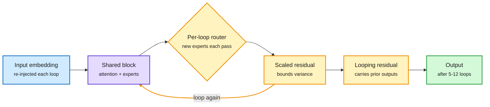

# LOOM: looping a mixture-of-experts model 9 to 12 times without collapse

**Source:** HuggingFace Daily Papers, 2026-10-05 · [arXiv 2610.01153](https://arxiv.org/abs/2610.01153) · [code](https://github.com/hed-ucas/LOOM) · raw: [raw/huggingface/2026-10-05-looping-beyond-twice-a-scalable-recipe-for-looped-mixture-of.md](../../raw/huggingface/2026-10-05-looping-beyond-twice-a-scalable-recipe-for-looped-mixture-of.md)

**TL;DR.** Looped Transformers reuse the same blocks several times to get more depth without more parameters. For large MoE (mixture-of-experts) models, gains have stalled after two loops. LOOM names two causes. First, hidden-state variance grows each loop as residual updates pile up (the "curse of depth"), so the state drifts. Second, "expert selection collapse": the router picks the same experts every loop, so extra loops add compute but no new computation. Fixes: scale residual updates to bound variance, re-inject the input embedding every loop, give each loop its own router, and carry earlier loop outputs forward with a "looping residual." Results from 100M to 1.7B: stable scaling to 9-12 loops. At near-equal FLOPs, 700M is best at 5 loops (perplexity 18.36 to 16.54). Without FLOP matching, 1.7B on 60B tokens peaks at 9 loops (perplexity 9.62 to 7.77; zero-shot 42.4% to 47.7%).

Each loop must add new computation and keep the state stable

Per-loop routers fix expert collapse; scaled residuals and re-injection fix drift.

Blue is the input, purple is the shared block, amber are the loop controls, green is the result.

## How it relates to prior wiki pages
- **Fourth looped-MoE paper in five days.** Loop Scaling Laws (10-02) gave a joint law for loops and sparsity; LoopCD (10-03) used early loops as a free contrastive signal; Foil (10-04) said flatten the expert pool and untie attention per pass while sharing routers. LOOM disagrees with Foil on one point: it unties the *routers* per loop. Foil found routing confidence predicts healthy expert use; LOOM found shared routers collapse. Open contradiction, possibly reconciled by Foil's larger flattened pool. See [looped transformers](looped-transformers.md).
- Still no latency numbers; the page's standing open question (a looped model is sequential by construction) remains.

## Gaps
- Largest model 1.7B; "near-iso-FLOP" gains are modest (+0.7 points zero-shot at 700M).
- No inference latency or KV-cache cost per loop.

## Related
[Looped transformers](looped-transformers.md) · [Daily digest 2026-10-06](../daily-digest/2026-10/2026-10-06.md)
