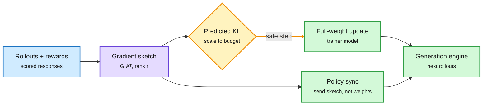

# LoGRA: RL post-training with low-rank gradient sketches and a predicted-KL step size

**Source:** HuggingFace Daily Papers 2026-10-06 · [arXiv 2610.06647](https://arxiv.org/abs/2610.06647) (NVIDIA) · [code (Molt library)](https://github.com/skzhang1/labs-molt/tree/logra/examples/scripts/logra)
**Raw:** [HF entry](../../raw/huggingface/2026-10-06-logra-scaling-llm-reinforcement-learning-with-low-rank-gradi.md)

## TL;DR

RL post-training needs memory for weights, gradients, optimizer states, activations and the buffers that sync weights to the generation engine. A model that fits for inference often does not fit for RL. LoGRA keeps full-weight updates but stores the gradient as a **sketch**: for each weight matrix W (d x k) it multiplies the gradient by a fixed random sign matrix A (r x k, r much smaller) and keeps only S = G·Aᵀ (d x r). The sketch is accumulated directly across microbatches, so the full gradient is never materialized. The same compact sketch is what gets sent to update the rollout policy, which also cuts sync traffic. Because a compressed step can still move the policy too far, LoGRA **predicts the KL change** in next-token probabilities before applying an update and scales the step to a KL budget. Result: **up to 45.7% less training memory with no loss on reasoning tasks, and stable RL on a 27B model for over 1,100 steps on one 8-GPU node where dense Adam runs out of memory.**

The full gradient never exists in memory

One small sketch serves both the update and the policy sync.

Blue is the RL signal, purple is the compressed gradient, amber is the step-size guard, green is what changes downstream.

## Key findings

- Random projection, not learned (GaLore-style methods use SVD-derived projections); entries are ±1/√r.
- Memory down up to 45.7% on models that already fit; enables 27B RL on 8 GPUs.
- Ablations on projection rank, refresh schedule, projection distribution and KL budget are reported.

## Gaps

- "No performance loss" is on outcome-reward reasoning tasks, where the useful signal may be low-rank by nature. Long-horizon agent RL with dense process rewards may not compress as well.
- No wall-clock comparison against LoRA-RL at matched memory, which is the obvious cheaper alternative.

## Relation to prior wiki pages

- **Two RL-infra results the same day.** RL-Kernel (reposted by the reader, see [kernel summary](../hardware/2026-10-07-fbtriton-tbe-rl-kernel-coco.md)) attacks RL post-training cost at the kernel level; LoGRA attacks it at the optimizer level. Reflection's Beam (10-06) used 10,500 GB300s for RL, more than for pretraining. RL memory is now the binding cost.
- **BF16 caveat from 10-06.** The multi-teacher diagnostics paper found only 7-11% of BF16 weights actually move per update. A low-rank sketch may be compressing an update that BF16 was already silently truncating. Worth checking in an FP32-master setting.
- Fits the [RL for LLMs](rl-for-llms.md) page's "RL as sharpening" thread: if RL mostly sharpens (10-03), a low-rank update is plausibly enough.

## Related

[RL for LLMs](rl-for-llms.md) · [Compute economics](../hardware/compute-economics.md) · [Knowledge distillation](../inference-efficiency/knowledge-distillation.md)
