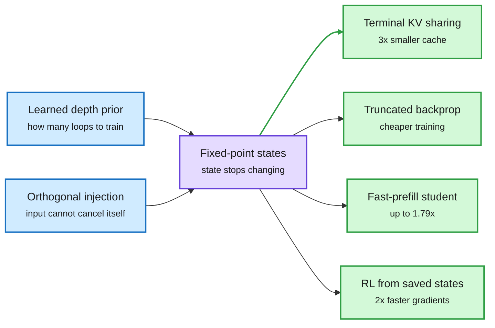

# Looped models at fixed points, plus adaptive loops for diffusion LMs and images

**Source:** HuggingFace Daily Papers 2026-10-06 · [Looped Models Done Right II, arXiv 2610.06833](https://arxiv.org/abs/2610.06833) · [ALoDLM, arXiv 2610.04198](https://arxiv.org/abs/2610.04198) · [LiFT, arXiv 2610.05538](https://arxiv.org/abs/2610.05538) · [Foil, arXiv 2609.35751](https://arxiv.org/abs/2609.35751) (re-listed on HF)
**Raw:** [Done Right II](../../raw/huggingface/2026-10-06-towards-looped-models-done-right-part-ii-rethinking-at-fixed.md) · [ALoDLM](../../raw/huggingface/2026-10-06-alodlm-adaptively-looped-diffusion-language-models.md) · [LiFT](../../raw/huggingface/2026-10-06-lift-loop-flow-transformers.md) · [Foil](../../raw/huggingface/2026-10-06-how-to-loop-moe-flatten-the-experts-untie-the-attention.md)

## TL;DR

A looped model reuses one block of layers several times, so it gets more depth without more weights. The catch is that every extra loop costs compute in training, prefill, decoding and RL. **Looped Models Done Right II** argues the fix is to train loops that settle into *fixed points* (the hidden state stops changing between passes). Once states are near a fixed point, the path to them no longer matters, which unlocks four savings at once: truncated backpropagation in training, **terminal KV sharing** in decoding (store keys and values from the last loop only), a distilled student that prefills up to 1.79x faster, and RL gradients computed from saved rollout states, 2x faster than backpropagating through the replayed trajectory. Two training changes make fixed points reliable: a **learned depth prior** (the distribution over how many loops to train at, learned from prediction feedback with an entropy term to keep it broad) and **orthogonal input injection** (re-inject the input with its component along the current state removed, so injection cannot cancel or amplify itself). From 100M to 1.6B both lower perplexity at every scale. **At 1.6B, the learned prior with a 3x smaller KV cache matches fixed-depth training with the full cache.**

Three companions on the same HF list: **ALoDLM** (Amazon) gives diffusion LMs per-token loop counts, so easy masked tokens commit early and hard ones keep refining latents; at 1.7B and 8B it beats all evaluated diffusion LMs *and* the matching autoregressive baselines on the 11-benchmark average while keeping parallel decoding. **LiFT** loops a shared DiT core for image generation and trains each step toward a point on a straight path to the target, so it can loop past its training depth at inference; LiFT-L/2 beats DiT-XL/2 by 3.34 FID with ~60% fewer parameters, 32% fewer training FLOPs and 52% fewer inference FLOPs. **Foil** (how to loop an MoE), covered here on 10-04 from Kurate, is now on HF as well.

Converge first, then every phase gets cheaper

Fixed points are the enabling property; the four savings all fall out of it.

Blue is the two training changes, purple is the property they create, green is each cost saving.

## Key findings

- Fixed-depth training breaks KV sharing; Huginn's broad depth prior allows it but dilutes supervision at the target depth. A learned prior gets both.
- Learned prior + 3x smaller KV cache = fixed-depth + full cache on the downstream average at 1.6B.
- ALoDLM learns computation schedules as latent variables (a conditional NELBO), not with a heuristic exit rule.
- LiFT's continuous depth coordinate lets compute scale at inference with no retraining.

## Gaps

- Done Right II tops out at 1.6B and reports downstream averages, not long-context or reasoning-heavy evals where loop depth should matter most.
- ALoDLM's "fast parallel decoding" claim is qualitative in the abstract; tokens/s against an AR model on the same engine are what serving teams need.
- None of the three is tested on an MoE backbone, which is where Foil and LOOM (10-06) disagree.

## Relation to prior wiki pages

- **Serving thread.** Continuous Depth Batching (09-29) made adaptive-depth tokens batchable in vLLM-style engines. Terminal KV sharing removes the second serving cost of loops: a KV cache per loop.
- **Adaptive depth thread.** TaH2 (09-30) post-trained a per-token "one more loop?" decider. ALoDLM brings the same idea to diffusion LMs, where it also closes the quality gap to AR models.
- **Open contradiction stays open.** LOOM (10-06) gave each loop its own router; Foil (10-04) shares routers and unties attention. Neither of today's papers touches routing.
- Social context: practitioners on X said Microsoft disclosed GPT-6 uses looped transformers; unverified, but it explains the surge of loop papers.

## Related

[Looped transformers](looped-transformers.md) · [KV cache](../inference-efficiency/kv-cache.md) · [Test-time compute allocation](../inference-efficiency/test-time-compute-allocation.md)
