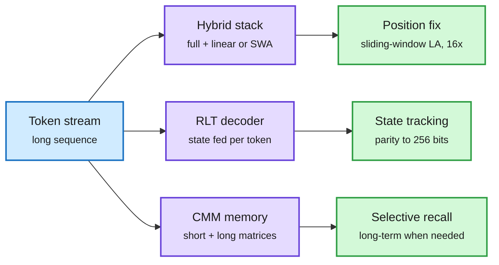

# Fixed-state architectures: hybrid mechanics, Recurrent Looped Transformer, Continuous Memory Machine (2026-10-09)

**Sources:** HuggingFace Daily Papers 2026-10-08: Mechanics of Long-Context Hybrid Models Part 1.1 ([arXiv 2610.10114](https://arxiv.org/abs/2610.10114), [raw](../../raw/huggingface/2026-10-08-mechanics-of-long-context-hybrid-models-part-1-1-from-hybrid.md)) and Recurrent Looped Transformer ([arXiv 2610.07591](https://arxiv.org/abs/2610.07591), [raw](../../raw/huggingface/2026-10-08-recurrent-looped-transformer.md)). X home feed: Sakana AI's Continuous Memory Machine ([arXiv 2610.07907](https://arxiv.org/abs/2610.07907), via [DAIR.AI](https://x.com/dair_ai/status/2108359294609768715) and LinkedIn). Abstracts and curator summaries only.

**TL;DR.** Three papers on the same design question: how much should a model keep in a fixed-size state, and how should it read it? **Hybrid Mechanics 1.1** compares hybrids of full attention with sliding-window attention (SWA) versus gated linear attention (GLA, GDN). It finds a *seesaw*: linear-attention hybrids gain more from long-context continual pretraining, while SWA hybrids extrapolate better without it, and traces both to positional biases. Its fix, Sliding-Window Linear Attention, gives **16x training-free length extrapolation with 100% NIAH accuracy at 64K**. The **Recurrent Looped Transformer (RLT)** splits layers into a parallel encoder and a recurrent decoder that feeds each token's final state into the next token, so depth grows with sequence length at fixed per-token cost: parity generalizes from 40 to 256 bits at 100% (a Transformer stays at chance), S5 permutation tracking reaches 97% at 8x training length (vs under 1%). Sakana's **Continuous Memory Machine** gives a recurrent model two matrix memories, short-term and long-term, read and written by a Transformer each step; it beats LSTM, DNC, RMC and CTM on copy, recall, sorting and mazes, and skips long-term memory when the task does not need it.

Three ways to give a fixed state more reach

Fix positions (hybrids), feed state back per token (RLT), or split memory by lifetime (CMM).

Blue is input, purple the three architectures, green what each one buys.

## Key points

- **Contradiction with 10-08 on RLT.** The 10-08 efficiency shorts recorded an independent 140M test in which RLT lost to a plain Transformer at about 20x the GPU-hours. Today's paper reports large wins, but on algorithmic tasks (parity, permutations, modular arithmetic), not language modeling. Both can be true: RLT buys state tracking, not perplexity per FLOP. Unresolved until someone runs RLT on a language benchmark at matched compute.
- **Chunked feedback is the efficiency knob.** Updating feedback once per four-token chunk keeps 64-bit parity at 99% and lets tokens in a chunk run in parallel, but S5 tracking drops from 100% to 20%. Training parallelism and state tracking trade off directly.
- **Hybrid choice now has a rule.** If you plan long-context continual pretraining, pick linear-attention hybrids; if you need length extrapolation without retraining, SWA hybrids, or the paper's sliding-window LA. This connects to [STEPQuant](../inference-efficiency/2026-10-09-stepquant-recurrent-state-quantization.md): the LA hybrid that wins here is the one whose state needs compressing.
- **CMM extends the fixed-state capacity thread.** Proteus (09-25, unlocking state blocks over time), ARM (09-23, learned slot routing) and triadic linear attention (10-06, 3D states) all try to stop recent tokens overwriting old ones. CMM separates them by lifetime instead. See [attention mechanisms](attention-mechanisms.md) and [looped transformers](looped-transformers.md).

## Gaps

- RLT: eight-layer models, algorithmic tasks, three seeds. No language modeling.
- CMM: workshop paper (NeurIPS PALM), small algorithmic tasks.
- Hybrid Mechanics: no serving-cost comparison between SWA and LA hybrids.

## Related

[Attention mechanisms](attention-mechanisms.md) · [Looped transformers](looped-transformers.md) · [KV cache](../inference-efficiency/kv-cache.md) · [Efficiency shorts 10-08](../inference-efficiency/2026-10-08-efficiency-shorts.md)
