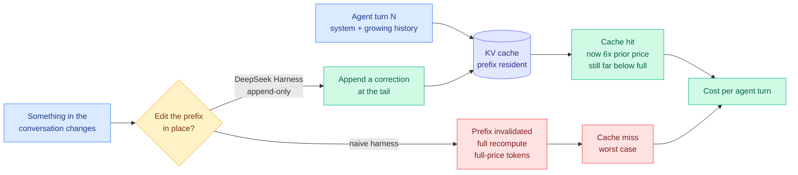

# Media Zone | 2026-08-14

> Social spent the day on one thing: the cache got a price, and the harness built to protect it got given away for free.

## Today's signal

- **Dominant story:** DeepSeek raised cache-hit token prices roughly six-fold and open-sourced the harness engineered never to invalidate the cache. Cost optimization, stated as a product decision.
- **Pattern:** three independent posts converge on cost per completed task over price per token. Cognition's benchmark, Elie Bakouch's harness teardown, and Jensen Huang's fungibility argument all land there.
- **Counter-signal:** Matt Shumer notes not all models can sustain a day-long unattended loop, which no benchmark on any leaderboard currently measures.
- **Quiet area:** all eight tracked subreddits returned zero posts past their filters, so there is no practitioner ground truth today. Multimodal and vision were similarly silent.
- **Bookmark note:** the saved-posts feed captured zero new items this run, so today's Media Zone is built from the AI-handle scrape rather than curated saves. If saves exist on the account, the X cookies or the bookmarks query id likely need refreshing.

---

## Routing, KV cache, compression, GPU

### The cache became a line item, and the harness became the defense

The anchor concept, in one picture: what an append-only harness protects and what an editing harness destroys.

- **Elie Bakouch read DeepSeek's harness code and found the design rule.** It is built so the KV cache is never altered: when the conversation changes, it appends a note at the tail rather than editing history, because editing invalidates every cached token after that point. Cost angle, and it is the whole story.
- **The six-fold cache-hit price increase shipped in the same release.** Agent loops re-send a growing prefix every turn, so they are the heaviest cache-hit consumers alive. This is a targeted tax on agent loops, not a general price rise.
- **The harness itself is MIT-licensed and spawns Claude Code and Codex through their SDKs**, with swappable modes: TypeScript programmatic tool calling, bash-plus-edit for evals, and standard read/write/edit. Influence angle: give away the scaffold, charge for the resource it burns.
- **Roughly 20% of the harness's own commits came from Codex worktrees.** DeepSeek built its agent software with agents, which is a small detail that says more about the current state of practice than most benchmark posts.

[@eliebakouch](https://x.com/eliebakouch/status/2087908415775408346) · [DeepSeek Harness v0.1 wiki](../../inference-efficiency/2026-08-14-deepseek-harness-kv-cache-economics.md) · [KV cache concept page](../../inference-efficiency/kv-cache.md)

### Cheap model, expensive model, and the metric nobody agrees on

- **Cognition put Gemini 3.7 Flash in Devin at 56.3 on their FrontierCode 1.1 benchmark**, against Claude Sonnet 5 at 56.2, for under half the cost. Their published chart plots score against dollars per rollout, which is the right axis.
- **The specific behavioral note is more useful than the headline.** Gemini 3.7 Flash does best on tightly scoped refactors, producing minimal diffs that match existing repo conventions. That is a routing hint, not a ranking.
- **Today's research says the same thing from the other side.** The AlphaSense study found Opus 4.8 finished 246 real tasks at half of Kimi K3's cost with higher quality, because capable models spend fewer tokens. Cost angle: the price list ranks models backwards.
- **Not settled.** Artificial Analysis reaches the opposite conclusion on its own task set, so the honest position is that the answer is workload-shaped and everyone should measure their own.

[@cognition](https://x.com/cognition/status/2087994792819237357) · [Devin blog](https://devin.ai/blog/gemini-37-flash) · [Token price is not task cost](../../ai-industry/2026-08-14-alphasense-token-price-vs-task-cost.md)

---

## LLMs, agents, safety

### Harnesses that run for a day, and harnesses that evolve

- **Matt Shumer has a Gauntlet Loop running unattended on Grok 4.6 for over a day** and observes that not all models can sustain this. Loop-duration capability is orthogonal to benchmark score and no public leaderboard measures it.
- **This is the practitioner echo of yesterday's step-efficiency number**, where Grok 4.6 finished agent workflows in 53 steps against Claude Opus 5's 103 at 60% lower price. Cost angle: steps, not tokens, is the unit that moved.
- **Research shipped the generalization result the same day.** DarwinX evolves a population of harnesses with the model frozen and gets a Terminal-Bench harness that transfers unchanged to SWE-bench Verified. AutoDesign meta-optimizes one harness and lifts seven different model-agent configurations.
- **Ken Huang's Harness Engineering book landed in the inbox this week** arguing the harness is now the product boundary, organized around ten pattern families from autonomy gates to reversible memory. Three research papers and one book, one week, same claim.

[@mattshumer_](https://x.com/mattshumer_/status/2088026930104684962) · [DarwinX wiki](../../agentic-systems/2026-08-14-darwinx-harness-population-evolution.md) · [AutoDesign wiki](../../agentic-systems/2026-08-14-autodesign-meta-harness-optimization.md) · [Harness engineering concept page](../../agentic-systems/agent-harness-engineering.md)

### The X algorithm went public, and the weights are lopsided

- **xAI released the recommendation algorithm with a browsable repo.** The largest single positive boost comes from copying a post's link to share it, which is a distribution mechanic worth knowing if you publish anything here.
- **The punishment weights dwarf the rewards.** Report post scores -234.0, mute author -58.8, not interested -43.2. The system is tuned an order of magnitude more aggressively against negative signal than for positive engagement.
- **The repo covers the full stack**: candidate pipeline, Phoenix retrieval and ranking models, a Rust serving engine, SimClusters community detection, and the safety and abuse enforcement path. Influence angle: this is a production recommender's complete source, rare enough to be worth reading for the architecture alone.

[@cognition](https://x.com/cognition/status/2087997839230275704) · [xai-org/x-algorithm on DeepWiki](https://deepwiki.com/xai-org/x-algorithm)

---

## Industry and business

- **Jensen Huang made the compute-as-financeable-asset argument explicitly**, noting the A100 fleet stays mission-capable from 2020 through 2029 and that CUDA is what lets Ampere, Hopper and Blackwell keep improving across their lives. His chain: versatility makes compute fungible, fungibility drives utilization, utilization makes it durable and financeable.
- **The occasion was CoreWeave committing to A100s through 2029**, which cuts against the story that AI chips go obsolete in three years. Cost angle: if depreciation schedules stretch, the unit economics of everything downstream change.
- **Nebius held its first compute auction with Blackwell prices 15% above anything it had charged before**, and NVIDIA's market cap now sits a trillion dollars above Apple's after a 18% two-week run.
- **NVIDIA and LG announced a bipedal humanoid on Isaac GR00T**, alongside a broader infrastructure and robotics partnership. Runway separately brought Gen-4.5 up on Vera Rubin in one day, which says the software stack on that platform is already mature.
- **Devin now queries and provisions live MongoDB Atlas databases mid-task**, removing stale schemas and hand-copied context. Small release, but it is the harness claiming more of the environment rather than the model getting better.

[@JensenHuang](https://x.com/JensenHuang/status/2087755674650603534) · [@nvidia on LG](https://x.com/nvidia/status/2088095122831622569) · [@cognition on MongoDB](https://x.com/cognition/status/2087892577185829004) · [NVIDIA as compute asset class](../../ai-industry/2026-08-11-nvidia-compute-asset-class.md)

---

*Practitioner ground truth is omitted today: all eight tracked subreddits (LocalLLaMA, MachineLearning, MLScaling, CUDA, LLMDevs, ControlProblem, HPC, reinforcementlearning) returned no posts past their score and flair filters in the 24-hour window.*
