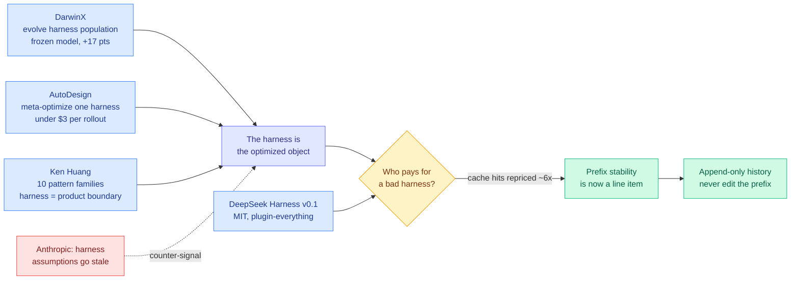

# Media Zone | 2026-08-14

> The day social and video signal converged on one object: the harness. DeepSeek gave one away and taxed the resource it consumes, Cognition priced a cheaper model into the same slot, and the best video on the pile argues an evolved harness becomes a liability the moment the model moves.

## Today's signal

- **Dominant story:** DeepSeek open-sourced its agent harness under MIT and repriced cache-hit tokens roughly 6x the same day. Cost optimization, from the provider side.
- **The mechanism everyone should copy:** DeepSeek Harness never edits conversation history. Corrections are appended, so the KV cache prefix is never invalidated.
- **Pattern:** four separate sources say the harness is now the unit of cost. Two papers optimize it, one provider prices it, one book governs it.
- **Counter-signal:** Anthropic's own applied team says harnesses encode assumptions that go stale. Their Sonnet 4.5 fix became active harm on Opus 4.5.
- **Cost, not capability, is where product competition landed:** Gemini 3.7 Flash ties Sonnet 5 in Devin at under half the price; Fable 5 is six percent of Anthropic tokens sold.
- **Quiet areas:** bookmarks feed returned zero new saves, and all eight Reddit subs were empty for a sixth day. No practitioner ground truth today.

> *Note on sourcing: the saved-posts (bookmarks) feed captured **zero new saves** this run, so this Media Zone is built from the general X scrape, the AI-handle feed, and the recent YouTube pile rather than curated saves. The dominant theme in the private curation index, harness and loop engineering at roughly twelve saves, is nonetheless exactly what today's scrape and video are about, so the trajectory is intact even though the feed was empty.*

---

## Routing, KV cache, compression, GPU

### The harness became a priced resource

- **The design rule worth stealing today.** DeepSeek Harness guarantees the KV cache (the store of already-computed attention keys and values that lets a model skip recomputing tokens it has seen) is never altered. When something in the conversation must change, it appends a statement describing the modification instead of editing the earlier message, because an in-place edit invalidates every cached token downstream. Cost angle: this is the cheapest cache-preservation mechanism anyone has shipped.
- **And the reason it matters landed the same day.** DeepSeek raised API prices with cache-hit tokens up roughly 6x, the biggest single increase in the transition, hitting exactly the workload that re-reads the same files every turn. Read together: give the harness away, charge for what a badly built one wastes.
- **Elie Bakouch's teardown adds the detail nobody expected.** At least ~20% of the harness's own commits and PRs came from Codex worktrees, counting only worktree and named-branch signals, so the real number is higher. The harness was substantially built by the kind of agent it runs.
- **Peak and off-peak rates 50% apart** arrive 2026-08-16, which makes *when* you run a cost variable. Nothing in the routing literature models time of day, including [LLMRouter](../../ai-routing/2026-08-14-llmrouter-unified-routing-infrastructure.md), published today.

[@deepseek_ai](https://x.com/deepseek_ai/status/2087887408440164663) · [@eliebakouch teardown](https://x.com/eliebakouch/status/2087904176357437820) · [repo](https://github.com/deepseek-ai/deepseek-harness) · [wiki summary](../../inference-efficiency/2026-08-14-deepseek-harness-kv-cache-economics.md)

### The counter-signal: an evolved harness is a depreciating asset

This is the sharpest thing in the whole media pile today, and it argues against the day's dominant research claim.

Talk · Anthropic Applied AI
<h4>Evolution of Agentic Surfaces</h4>

Gagan Bhat and Isabella Kai He trace three generations of agent-building surface at Anthropic, and bury one sentence worth memorising: harnesses encode assumptions about what the model cannot do on its own, and those assumptions go stale as models improve. Their example is unusually candid. Sonnet 4.5 showed context anxiety, wrapping up work early as it neared its window even with room left, so they built context resets into the harness. Opus 4.5 no longer did it, and the fix became not just dead weight but active harm, adding latency and discarding cache incorrectly. The architectural core is decoupling the brain (agent loop) from the hands (tool execution), which they had originally run in one container: splitting them bought independent failure recovery and 60% faster time to first token at P50, over 90% at P95, because container setup left the critical path.

<a href="https://youtube.com/watch?v=K0X9QDRkIdg">Watch the talk →</a>

Talk · OpenAI
<h4>Codex, Behind the Harness</h4>

Dominik Kundel walks the Codex harness internals as a blueprint others can copy, and the recurring point is that most distinguishing Codex behaviour is a Responses API capability rather than harness magic. The cache-relevant part is how context is constructed: split by predictability, so stable model instructions never perturb the cache prefix while the volatile parts (skills manifest, tool registry) are kept out of the window by deferred tools plus tool search, with a hard cap of 2% of the context window on the skills manifest. His framing line is the one to keep: once inference hit 1,000 tokens per second on Cerebras, the bottleneck moved to the network, so the harness was rearchitected around persistent WebSocket transport with stateful context where only deltas cross the wire.

<a href="https://youtube.com/watch?v=shRR1e2HXMk">Watch the talk →</a>

- **Why this cuts against today's papers.** DarwinX and AutoDesign both treat an evolved harness as durable capability. Anthropic's team says the opposite from production experience: a harness is a set of bets on current model weaknesses, and every model upgrade silently converts some of those bets into overhead. The reconciliation nobody has published is a harness that carries the *reason* for each component so a model upgrade can retire it.
- **The concrete design lesson.** Rigid customer harnesses built around older Claude models take weeks or months to migrate, which is a real liability at current release cadence. Their prescription is a small set of independently swappable primitives, which is modularity as a hedge against model change rather than as general hygiene.
- **Cost angle on the split.** Decoupling brain from hands is not an abstraction exercise: it moved container setup off the critical path, which is where the 60% and 90% latency wins came from. Same shape of result as append-only history, a structural change that stops paying for something twice.

- **Bonus from the same pile, and the best pure efficiency argument in it.** Modal's Nan Jiang points out roughly **99% of rollout-visible weights are bit-identical between consecutive optimizer steps**, because Adam's per-parameter step is on the order of the learning rate while the BF16 rounding boundary is about |w|/256, so most updates are too small to survive the cast. Ship a lossless bit-level patch instead of a checkpoint and the weight-sync link falls from about 500 GB to about 500 MB, at which point rollout workers can live on any provider in any region. Cost angle: inference capacity becomes RL capacity.

---

## LLMs, agents, safety

### Cost is where the model competition actually happened this week

- **Gemini 3.7 Flash in Devin ties Sonnet 5 for under half the price.** On Cognition's FrontierCode 1.1 (real engineering tasks graded on quality and mergeability, with non-mergeable solutions scored zero) Flash lands at 56.3 against Sonnet 5's 56.2, with Fable 5 topping the board at 64.9. It is parity at the mid-tier, not a frontier win.
- **The routing-relevant detail is narrower than the headline.** Inside Devin, Flash is strongest on tightly scoped refactors where it produces minimal diffs matching repo conventions. That names a task class where the cheap model is *preferred*, which is what a router needs and what a benchmark average hides.
- **Demand side agrees.** Fable 5 is the most capable model on the market and accounts for only **six percent of Anthropic tokens sold** per Ramp data, which is the clearest available evidence that corporate willingness to pay for the frontier tier has a ceiling.
- **DeepSeek V4-Pro shipped with a reasoning-effort dial** (low, high, max) and open MIT weights, to split reviews: second on Vals AI's leaderboard while some users were disappointed. The dial is the interesting part, because it puts the compute/quality tradeoff in the caller's hands rather than the router's.

[@cognition on Flash in Devin](https://x.com/cognition/status/2087994792819237357) · [Devin blog](https://devin.ai/blog/gemini-37-flash) · [Fable 5 adoption](https://the-decoder.com/fable-5s-slow-adoption-suggests-corporate-willingness-to-pay-for-frontier-ai-has-hit-a-ceiling/) · [wiki: token price is not task cost](../../ai-industry/2026-08-14-alphasense-token-price-vs-task-cost.md)

### Loops that run for a day, and agents that hold a live database

- **A Gauntlet Loop has been running unattended on Grok 4.6 for over 24 hours**, with the operator noting that not all models can sustain it. That is the practitioner form of model-bound versus harness-bound: identical loop, and whether it survives a day is a property of the model.
- **Devin can now query, manage, and provision MongoDB Atlas databases mid-task.** The pitch is no stale schemas and no copied-in context, and the reason it matters is that reasoning correctly over a snapshot that no longer matches production is one of the standard data-agent failure modes. Moving the schema from context to tool call is the same "take the decision away from the model" move the harness research keeps landing on.
- **Cursor cloud agents start 3x faster** using prebuilt development environments it calls builds, prepared continuously in the background at no extra cost, with Faire, Headway and Descript reporting start times dropping from minutes to seconds. A failed build never goes live, so agents keep working from the last good one. Cost angle: this is warm-start amortization, the container-level analogue of a cache hit.
- **Anthropic put Claude Cowork in its Chrome extension side panel** with skills and plugins, moving the harness into the browser where the untrusted context lives.

[@mattshumer_](https://x.com/mattshumer_/status/2088026930104684962) · [@cognition on MongoDB](https://x.com/cognition/status/2087892577185829004) · [Cursor builds](https://cursor.com/blog/builds) · [Claude Cowork in Chrome](https://the-decoder.com/anthropic-brings-claude-cowork-to-its-chrome-extension-adding-skills-and-plugins-to-the-browser/)

### Recursive self-improvement, from warning to checklist

- **IAPS fellow Severin Field interviewed 25 researchers** at OpenAI, Anthropic, Google DeepMind, Meta and US universities about recursive self-improvement, and reports several of the milestones they named have already been hit. Worth reading against the day's harness papers, which are recursive self-improvement running in production with a verifier attached.
- **Ken Huang published a design-pattern language for exactly this**, organizing secure agentic AI into ten pattern families and using "hill climbing" in its optimization sense: the danger is not improvement but improvement without measurement, boundaries, or a way to reverse a harmful change. DarwinX's preserve-and-extend contract is that rule implemented, one day later, by people who almost certainly had not read him.
- **Hugging Face reported on reproducing 2,200 ICML papers**, the largest open reproduction effort so far. Influence angle: a reproduction corpus at that scale is infrastructure, and it changes what a citation is worth.

[The Decoder on RSI milestones](https://the-decoder.com/top-ai-lab-researchers-warned-about-automated-ai-research-and-several-of-their-predicted-milestones-have-already-fallen/) · [Ken Huang essay](https://kenhuangus.substack.com/p/harness-engineering-design-patterns) · [HF ICML reproductions](https://huggingface.co/blog/icml-2026-open-reproductions) · [wiki summary](../../agentic-systems/2026-08-14-ken-huang-harness-engineering-patterns.md)

---

## Industry and business

- **Nebius cleared Blackwell capacity 15% above its highest-ever price** in its first compute auction, and is now deliberately selling closer to when customers need it to capture the spot premium. Compute moved from a contract market to a spot market.
- **The squeeze lands on the smallest trainers.** One founder talked to about 17 cloud providers hunting chips and reports the reasonable one-year contracts of a year ago are gone. His line, "it's like VC currency right now to know the current price of GPUs," is a scarcity signal: the price of the input has become private information.
- **The counterweight is asset life.** Responding to CoreWeave committing to A100s through 2029, Jensen Huang argued CUDA continuity produces versatility, versatility produces fungibility, fungibility drives utilization, and utilization makes the fleet **financeable**. A nine-year fleet life is a claim about a depreciation denominator, not nostalgia. Runway bringing Gen-4.5 up on the brand-new Vera Rubin platform **in one day** is that argument as a data point.
- **xAI published the X algorithm weights.** The largest positive signal is a share via copy link at 20.0, against 0.5 for a like and 0.4 for a click, so the system optimizes for off-platform propagation roughly 50x harder than for on-platform engagement. The negative side dwarfs all of it: not interested -43.2, mute author -58.8, report post -234.0. One report costs more than eleven copy-link shares earn.
- **Money moves:** Robinhood's RVII closed-end fund raised **$225.5M** and listed on the NYSE to back Y Combinator startups; Workday jumped **18%** on Silver Lake takeover talks; Mercor offered up to **$300,000** for a single acquired startup's Slack, GitHub, Asana and meeting-transcript archives, and Warmly fielded four such approaches in days; OpenAI replaced its CRO after eight months with Wiz president Dali Rajic.

[Nebius and CoreWeave](https://www.theinformation.com/articles/nebius-coreweave-cashing-soaring-ai-compute-prices) · [neolabs squeeze](https://www.theinformation.com/articles/ai-compute-crunch-hitting-neolabs-especially-hard) · [@JensenHuang](https://x.com/JensenHuang/status/2087755674650603534) · [X algorithm on DeepWiki](https://deepwiki.com/xai-org/x-algorithm) · [Robinhood RVII](https://www.theinformation.com/articles/y-combinator-startups-get-new-backer-robinhood) · [wiki: compute economics](../../hardware/compute-economics.md)

---

*Practitioner ground truth omitted: all eight configured subreddits returned zero posts passing filters for a sixth consecutive day, including r/LocalLLaMA, r/CUDA and r/HPC. At six days this reads as a farmer-filter problem rather than genuine silence.*
