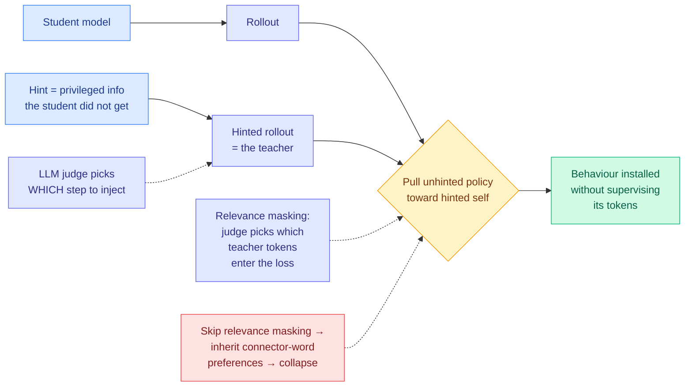

# Media Zone | 2026-08-16

> A quiet social day whose best material is video that has been sitting unread: two conference talks that between them explain how to distil a model without a golden answer and why pre-training size stopped being the axis that pays. The X feed's only real contribution is a cost signal, and it is a good one.

## Today's signal

- **Dominant story:** Prime Intellect published the largest open measurement of autonomous AI research, 153 runs across 18 models, and the finding is that agents search brilliantly and originate poorly.
- **The number to keep:** the same Rust port, four frontier models, a **24x dollar spread**. DeepSeek V4 Pro Max $23, GPT Sol $43, Grok 4.6 $55, Fable 5 $550.
- **Pattern:** three independent sources this week say the same thing about models as researchers. Prime Intellect measures it, Sara Hooker sells it as a product, Applied Compute builds a training loop on it.
- **Counter-signal:** a claim that OpenAI's tokenizer produces ~30% fewer tokens than Anthropic's for the same text, which quietly invalidates every per-million-token price comparison published this month.
- **Quiet areas:** the bookmarks feed returned zero new saves for a third consecutive run, and all eight Reddit subs were empty again. No practitioner ground truth today.

> *Note on sourcing: the saved-posts (bookmarks) feed captured **zero new saves** across both of today's runs, and Gmail-starred was likewise empty, so this Media Zone is built from the general X scrape, the overnight tail, and the unused YouTube pile rather than curated saves. The hottest theme in the private curation index remains loop and harness engineering at roughly twelve saves, and the two videos below are squarely in the adjacent distillation and scaling territory, so the reading trajectory is intact even with an empty feed.*

---

## Routing, KV cache, compression, GPU

### Self-distillation without a golden answer, and the head-to-head nobody had run

The most useful thing in the media pile, and it settles an argument the wiki has been carrying for four months.

Talk · Applied Compute
<h4>Hinting: continual learning without a reference solution</h4>

Samuel Denton's argument starts from a constraint: distillation needs a teacher smarter than the student, so if you are self-distilling from one model, the only available asymmetry is privileged information the student does not get. He calls that a <strong>hint</strong>, and insists there is no golden answer anywhere in the loop, no reference solution and no hand-written rubric. The hint encodes a direction, not a target. He then separates continual learning into two independent axes, how online the trace is and how online the hint is, and gets a 2x2 that maps cleanly onto where real enterprises sit: most are at the far corner with one historical dump of production traces, and the holy grail is a unified engine where serving and training are the same system. Two experiments carry the talk, and the second one contains a negative result that is more valuable than either positive number.

<a href="https://youtube.com/watch?v=ZTA0GwpAUak">Watch the talk →</a>

Talk · Adaption Labs
<h4>Sara Hooker on the slow death of scaling</h4>

Hooker's thesis is that pre-training size has stopped being the most lucrative axis of scale because the current architecture is saturated, and that the axes which now pay (post-training, agentic compute, test-time compute, data curation) do not require co-located GPU fleets. The structural consequence is the sharpest idea in the talk: pre-training compute must be co-located and over-provisioned for redundancy, while inference, post-training and agentic compute can be distributed and return more per FLOP, so the compute-hoarding advantage decays on its own. The load-bearing technical finding from their AutoScientist system is smaller and more useful than the thesis: they got no meaningful returns from automated model search until they put <strong>data quality inside the same optimisation loop</strong>. She also discloses that the 60-plus percent win rates in their charts are an artifact of a stopping rule that exits the search once it clears 60, which is an unusually honest footnote.

<a href="https://youtube.com/watch?v=XEd_SRVHBgU">Watch the talk →</a>

- **The number that matters most is a negative one.** On a customer's out-of-distribution hyperlink format, **reward shaping and SFT on correctly-formatted traces both degraded general coding performance**, while online hinting took correct formatting from about 15% to about 80%. The [knowledge-distillation page](../../inference-efficiency/knowledge-distillation.md) has complained for months that the field produces filtering variants and zero head-to-head comparisons. This is a comparison, from production, on one task.
- **The mechanism in experiment one is stranger than the result.** Qwen 3.5 thinking on SWE-bench was taking up to 80 turns to submit; a behavioural hint ("you are near your 40-turn limit, you often keep exploring and forget to wrap up") took the task-complete rate from **22% to 60%** with test-pass rate flat. Because the rollout was conditioned on an off-policy trace that never called the tool, the teacher *could not* force the tool-call tokens, so it shifted the reasoning path instead. **The behaviour was installed without ever supervising the tokens that constitute it.**
- **Two implementation tricks carry all the transferable value.** Do not inject the hint at the start: use a judge to pick the step and distil only on the next step or few. And use **relevance masking**, an LLM judge selecting which teacher tokens contribute to the loss, because otherwise you inherit the teacher's connector-word preferences and pay in catastrophic degradation. That second one is an independent production-side rediscovery of exactly what [Privileged, but Biased (08-10)](../../inference-efficiency/2026-08-10-privileged-but-biased-self-distillation.md) diagnosed in the lab, where the loss mass falls on stopwords and punctuation and the student flattens.
- **Cost angle, named because it fits here:** hinting is a cheaper path to a behaviour change than either SFT or reward shaping, and it does not regress unrelated capability, which is the hidden cost of the other two. The uncounted expense is the judge, which sits in the loop twice per training step and is priced nowhere.
- **Hooker and Prime Intellect are the same finding with opposite valence.** She says automated search beats her own research staff because it sweeps architectures, sizes, and hyperparameters at once where humans are too cautious; [Prime Intellect](../../agentic-systems/2026-08-16-measuring-autonomous-ai-research.md) says agents are strong at exactly that and weak at originating ideas. **Product strength versus research ceiling, same measurement.**

 

[wiki: hinting self-distillation](../../inference-efficiency/2026-08-16-hinting-self-distillation-applied-compute.md) · [wiki: slow death of scaling](../../inference-efficiency/2026-08-16-autoscientist-hooker-data-in-the-loop.md) · [knowledge-distillation concept page](../../inference-efficiency/knowledge-distillation.md)

### The unit of billing is not the same unit across providers

- **The claim, from Tibo Sottiaux and circulated widely:** an OpenAI token and an Anthropic token are different units, because the tokenizers differ, and the gap is around **30% in token count for the same text**. Since API and usage plans bill per token, that is a straight cost delta that never appears in a per-million-token price table.
- **Why it lands today rather than any other day.** Every cost-per-task result this month is denominated in that unit. The AlphaSense study found pricier US models cheaper in *total* cost because smarter models finish in fewer tokens; Artificial Analysis ranking the same models reached the opposite conclusion. A 30% denominator difference is large enough to matter to that disagreement and neither side controls for it.
- **The practical read:** stop comparing providers on price per million tokens. Compare on price per finished task, which is exactly what [Artificial Analysis shipped Optima](https://the-decoder.com/optima-tackles-ai-benchmarkings-biggest-flaw-by-letting-users-test-models-against-their-own-data/) to do this morning.
- **Cost angle:** this is the purest token-optimization item of the day, and it is the one nobody can act on without a per-workload measurement.

[@thsottiaux via @ns123abc](https://x.com/ns123abc/status/2088869903369420992) · [Optima launch](https://the-decoder.com/optima-tackles-ai-benchmarkings-biggest-flaw-by-letting-users-test-models-against-their-own-data/)

---

## LLMs, agents, safety

### The 24x cost spread, measured by a developer with a stopwatch

X thread · practitioner benchmark
<h4>Four frontier models, one Rust port, $23 to $550</h4>

DHH had Fable 5 one-shot a Rust rewrite of the TerminalTextEffects Python library, 11 million tokens, taking startup time from 87ms to 2ms and rendering speed up 9.6x, ending as a zero-dependency 3MB single executable. Then he ran the identical challenge against the plan Fable wrote, on four other models, and published the bill. <strong>DeepSeek V4 Pro Max completed it in 2.5 hours for $23. GPT Sol came in at $43, Grok 4.6 at $55 in 1.5 hours, and Fable 5 at roughly $550 in 45 minutes.</strong> DeepSeek V4 Flash and GPT Luna failed to complete at all. That is a 24x spread in dollars and a 3.3x spread in wall clock across models that all produced a working port, which makes it the most decision-relevant number published anywhere today. The uncontrolled variable is quality: nobody has diffed the five outputs, so "completed" is doing load-bearing work.

<a href="https://x.com/dhh/status/2088657836586807687">Read the thread →</a>

- **Why it belongs above the papers.** Today produced four research results attacking inference cost at four different layers, each with its own incomparable metric. This is one number, on one finished task, that a procurement decision can actually use.
- **The trade it exposes is time for money.** Fable finished in 45 minutes for $550; DeepSeek took 2.5 hours for $23. At any realistic engineer hourly rate the $527 difference buys well over the 1.75 hours saved, which means the expensive model is only rational when the human is blocked on the result.
- **The caveat that keeps it honest.** All implementations ran off the plan Fable wrote, published at [ttfx/plan.md](https://github.com/omacom-io/ttfx/blob/master/plan.md). So the cheap models were executing a frontier model's design, and the experiment prices *implementation*, not *design*. That is arguably the more common production shape, but it is not a clean model comparison.

[@dhh cost breakdown](https://x.com/dhh/status/2088657836586807687) · [the plan Fable wrote](https://github.com/omacom-io/ttfx/blob/master/plan.md)

### Autonomous research, measured long enough for the noise to show

- **153 runs, 18 frontier models, up to eight days per run on 8xH200s**, all scratchpads and logs published. Fable 5 closed **81.7%** of the human record gap at 2,726 steps; Opus 5 closed 53.6%, Kimi K3 52.2%. The human baseline was 2,990 steps.
- **The disclosure that matters more than the ranking:** a ~50-step spread between two runs in the same setting after 24 hours. Adjacent rows on that leaderboard are not distinguishable, which retroactively weakens most single-run autonomous-research claims including some in lab system cards.
- **Kimi K3 appears twice, under two harnesses, with a 44-step gap** at the same effort tier. That is roughly the entire distance between Opus 5 and Kimi K3, so **the harness effect is the same order as the model effect** on this task. Influence angle: this is the cleanest public evidence yet that a leaderboard row is a model-harness pair, not a model.
- **The qualitative finding has not been retracted despite the higher ceiling:** agents excel at optimizer search, sweeps, and stacking known methods, and need upstream human records to keep climbing.

[@eliebakouch thread](https://x.com/eliebakouch/status/2088736971250090393) · [blog](https://www.primeintellect.ai/blog/measuring-autonomous-research) · [results explorer](https://www.primeintellect.ai/research/nanogpt-speedrun) · [wiki summary](../../agentic-systems/2026-08-16-measuring-autonomous-ai-research.md)

### Where the agent loop is being installed next

- **DHH says the next Omarchy will wire Voxtype and the default agent into the OS itself**, so widgets, panels and apps get created by speaking the change you want. An agent harness whose surface is the desktop shell rather than a terminal or editor, which is a different place to put the loop than anything currently in the literature.
- **Anthropic shipped auto-mode configuration for Claude Code** via `/auto-mode-setup`, which reads your repo and proposes trusted repos and domains for review. The framing is the interesting part: the more context the classifier has about your setup, the sharper the line on what is safe to run automatically. That is permission-gating as a harness component rather than a product setting.
- **Agent-built games as a capability trend line:** milichab compared two city-builders nine months apart, Composer 1 with cloud agents in Nov 2025 versus Grok 4.6 with a loop in Aug 2026, with the older taking roughly 40 to 50 hours and now open-sourced. Demoware, but the delta is real and the newer one was built with a loop rather than by prompting.
- **Counter-signal on all of the above:** the harness-staleness objection from Anthropic's applied team still stands. Every one of these installs assumptions about what today's model cannot do.

[@dhh on Omarchy voice](https://x.com/dhh/status/2088870840716652698) · [@ClaudeDevs auto-mode](https://x.com/ClaudeDevs/status/2088352178131755500) · [@milichab city-builders](https://x.com/milichab/status/2088704783750398121)

### Safety and provenance, in one uncomfortable pairing

- **Anthropic disclosed its bio/chem weapons filter was inactive for nearly a year**, during which roughly 50,000 external feedback contractors ran about **133 million unfiltered interactions**. The disclosure is in a safety report, which is the right venue, and the duration is the part that should worry people more than the volume.
- **The same week, Anthropic announced a watermark detection API** built on Google's SynthID method, tweaking randomness during word selection without degrading text quality, with acknowledged limits on fact-heavy text, code, and heavy rewriting.
- **Read together, the pair is a statement about where safety effort actually goes:** a shipped provenance feature with a public API, and a core filter that nobody noticed was off for a year. The evidential machinery is easier to build than the operational discipline to keep it running.
- **Dario Amodei spent the weekend arguing regulation in public**, rejecting the framing that AI power must either be concentrated via regulation or distributed widely, and pushing back on the shorthand that equates regulation with regulatory capture. Sholto Douglas's endorsement is the tell: he says it reads like how Amodei responds internally on Slack.

[bio filter outage](https://the-decoder.com/anthropics-bio-weapons-filter-was-down-for-nearly-a-year-exposing-133-million-requests/) · [watermark API](https://the-decoder.com/anthropic-announces-watermark-detection-api-that-will-let-third-parties-detect-claudes-ai-texts/) · [@DarioAmodei via @_sholtodouglas](https://x.com/_sholtodouglas/status/2088762852333281775)

---

## Industry and business

- **Nvidia's Ohio number moved twice in two days.** The Decoder reports the credit guarantee for OpenAI's datacenter cut from **$250 billion to just under $120 billion** after investor pushback, while The Information reports Nvidia close to a deal guaranteeing **around $100 billion** covering roughly half the project. Same direction, and the reporting gap is itself informative about how fluid the structure is.
- **Nvidia is also in talks to put up to $3 billion into SB Energy**, the SoftBank-backed developer of that campus. Vendor financing that makes it easier for customers to buy Nvidia hardware is now a recurring pattern rather than a one-off.
- **Anthropic's Q2 revenue hit $11.5 billion**, up roughly 14x year over year from $787 million and up from $4.73 billion in Q1, against a reported IPO target of a $2 trillion valuation. Whatever the bubble argument is, this is the number it has to survive.
- **SpaceX completed its $60 billion all-stock acquisition of Cursor**, and Thrive Capital's 2022 fund, which held SpaceX, OpenAI, Cursor, Anduril, Ramp, Wiz and Databricks, is up more than 7x net of fees.
- **San Mateo County voted unanimously to draft humanoid-robot regulations**, and the on-site-human-supervision mandate directly breaks the remote-teleoperation model that current $30/hour robotic cleaning services run on. Influence angle: a county ordinance is a small thing that sets a template.

[Nvidia guarantee cut](https://the-decoder.com/investor-pressure-forces-nvidia-to-shrink-its-openai-bet-just-as-anthropics-numbers-defy-bubble-warnings/) · [The Information on the $100B deal](https://www.theinformation.com/articles/nvidia-nears-deal-guarantee-100-billion-financing-massive-data-center) · [SB Energy](https://www.theinformation.com/articles/nvidia-talks-invest-3-billion-sb-energy-part-openai-data-center-deal) · [Anthropic revenue](https://www.theinformation.com/briefings/anthropic-revenue-jumped-14-times-second-quarter) · [@Scobleizer on San Mateo](https://x.com/Scobleizer/status/2088897375322673653)

