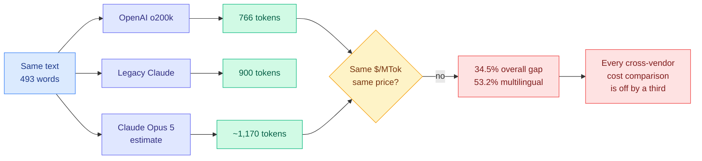
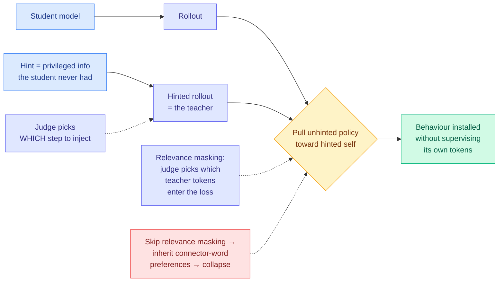

# Media Zone | 2026-08-16

> A quiet Sunday scrape with two loud numbers in it. Prime Intellect published what an agent does when you leave it running for nine days, and Anthropic publicly conceded that its own tokens are about a third more expensive per word than OpenAI's. Both are cost stories, and together they say the same thing from opposite ends: what you pay for AI is decided by things that never appear on a price page.

## Today's signal

- **Dominant story:** Prime Intellect ran 153 autonomous research runs across 18 frontier models, up to 8.7 days each on 8xH200s, and released every log.
- **The number that reframes the leaderboard:** Kimi K3 differs by 44 steps between two harnesses, about the size of the whole gap to Opus 5. The scaffold is a model generation.
- **The number that reframes the invoice:** OpenAI's tokenizer renders the same 493 words in 766 tokens against about 1,170 for Claude Opus 5. A 34.5% gap, 53.2% on multilingual.
- **Pattern, three days running:** same-task cost spreads keep getting published. DHH's Rust rewrite went $23 to $550 across five models yesterday; a Grok-versus-Fable design claim repeats the shape today.
- **Counter-signal:** honest variance reporting. One run in the same setting spreads ~50 steps in 24 hours, so most single-run autonomy claims are noise.
- **Quiet areas:** bookmarks feed returned zero saves for both runs, all eight Reddit subs empty for an eighth day, no new YouTube since 08-12.

> *Note on sourcing: the saved-posts (bookmarks) feed captured **zero new saves** in both the morning and afternoon runs, so this Media Zone is built from the general X scrape and the AI-handle feed rather than curated saves. The dominant theme in the private curation index, harness and loop engineering at roughly twelve saves, is exactly what today's largest item is about, so the reading trajectory is intact even with an empty feed.*

---

## Routing, KV cache, compression, GPU

### The tokenizer is a 34.5% price term nobody quotes

This is the cost item of the day and it is not in any paper. Anthropic's Tibo Sottiaux posted that an OpenAI token and an Anthropic token are different units, that OpenAI's tokenizer is significantly more efficient, and that this matters because you are billed per token both over the API and in usage. He put the gap at roughly 30%.

- **The table, transcribed.** English strategy prose, 138 words: 157 tokens under o200k, 160 legacy Claude, ~208 Opus 5, a 24.5% reduction for OpenAI. Technical systems prose, 110 words: 203 / 212 / ~276, a 26.4% reduction. Multilingual prose, 107 words: 188 / 309 / ~402, a **53.2% reduction**. Numbers and policy data, 138 words: 218 / 219 / ~285, 23.5%. Total across 493 words: **766 / 900 / ~1,170, a 34.5% reduction.**
- **Cost angle, direct.** Two vendors advertising identical dollars per million tokens are charging materially different prices for the same work, and the divergence is worst exactly where a multilingual product lives. Note the Opus 5 column is an estimate, not a measurement, which the table itself flags.
- **Why it lands today specifically.** Artificial Analysis shipped [Optima](../../ai-industry/2026-08-16-optima-cost-per-task-benchmarking.md) the same morning, benchmarking on cost and time per task rather than token price. Per-task measurement absorbs the tokenizer effect silently; nobody publishes the decomposition, so the term stays invisible while being paid.
- **Set it against the research.** Today's [Gambit](../../inference-efficiency/2026-08-16-gambit-thought-level-beam-search.md) cuts token consumption up to 68.5% by pruning weak reasoning traces and re-branching from strong prefixes. A 68.5% saving and a 34.5% tokenizer penalty are the same order of magnitude, so a vendor choice can eat two thirds of the best inference result of the month.

[@thsottiaux](https://x.com/thsottiaux/status/2088856449959276836) · [@ns123abc with the table](https://x.com/ns123abc/status/2088869903369420992) · [Optima coverage](https://the-decoder.com/optima-tackles-ai-benchmarkings-biggest-flaw-by-letting-users-test-models-against-their-own-data/) · [wiki: LLM Routing](../../ai-routing/llm-routing.md)

### Self-distillation without a golden answer, from the unread video pile

No new YouTube has landed since 08-12, but two talks from that batch were never read into the wiki, and both are squarely on the efficiency shelf. Between them they explain how to distil a model with no reference solution and why pre-training size stopped being the axis that pays.

Talk · Applied Compute
<h4>Hinting: continual learning with no reference solution</h4>

Samuel Denton starts from a constraint. Distillation needs a teacher smarter than the student, so if you are self-distilling from one model the only available asymmetry is privileged information the student does not get. He calls that a <strong>hint</strong>, and insists there is no golden answer anywhere in the loop, no reference solution and no hand-written rubric, so the hint encodes a direction rather than a target. He then splits continual learning into two independent axes, how online the trace is and how online the hint is, and gets a 2x2 that maps onto where enterprises actually sit: most have one historical dump of production traces, and the goal is a unified engine where serving and training are the same system. Two experiments carry it, and the second contains a negative result more valuable than either headline number.

<a href="https://youtube.com/watch?v=ZTA0GwpAUak">Watch the talk →</a>

Talk · Adaption Labs
<h4>Sara Hooker on the slow death of scaling</h4>

Hooker argues pre-training size has stopped being the most lucrative axis because the current architecture is saturated, and that the axes which now pay (post-training, agentic compute, test-time compute, data curation) do not require co-located GPU fleets, so the compute-hoarding advantage decays on its own. The structural version is the sharpest idea in the talk: pre-training compute must be co-located and over-provisioned for redundancy, while inference and post-training compute can be distributed and return more per FLOP. The load-bearing technical finding from their AutoScientist system is smaller and more useful than the thesis, that they saw no returns from automated model search until they put <strong>data quality inside the same optimisation loop</strong>. She also discloses that the 60-plus percent win rates in their charts are an artifact of a stopping rule that exits the search once it clears 60, which is an unusually honest footnote.

<a href="https://youtube.com/watch?v=XEd_SRVHBgU">Watch the talk →</a>

- **The number that matters is negative.** On a customer's out-of-distribution hyperlink format, **reward shaping and SFT on correctly-formatted traces both degraded general coding performance**, while online hinting took correct formatting from about 15% to about 80%. The [knowledge-distillation page](../../inference-efficiency/knowledge-distillation.md) has complained for months that the field ships filtering variants and zero head-to-head comparisons. This is a comparison, from production, on one task.
- **The mechanism in the first experiment is stranger than the result.** Qwen 3.5 thinking on SWE-bench was taking up to 80 turns to submit. A behavioural hint ("you are near your 40-turn limit, you often keep exploring and forget to wrap up") moved task-complete rate from **22% to 60%** with test-pass rate flat. Because the rollout was conditioned on an off-policy trace that never called the tool, the teacher *could not* force the tool-call tokens, so it shifted the reasoning path instead. The behaviour was installed without ever supervising the tokens that constitute it.
- **Two tricks carry all the transferable value.** Do not inject the hint at the start: use a judge to pick the step, then distil only on the next step or few. And use **relevance masking**, a judge selecting which teacher tokens enter the loss, because otherwise you inherit the teacher's connector-word preferences and pay in catastrophic degradation. That is an independent production-side rediscovery of exactly what [Privileged, but Biased (08-10)](../../inference-efficiency/2026-08-10-privileged-but-biased-self-distillation.md) diagnosed in the lab.
- **Hooker and Prime Intellect are one finding with opposite valence.** She says automated search beats her own research staff because it sweeps architectures, sizes and hyperparameters at once where humans are too cautious; Prime Intellect says agents are strong at exactly that and weak at originating ideas. Product strength versus research ceiling, same measurement.
- **Cost angle:** hinting is a cheaper route to a behaviour change than SFT or reward shaping and does not regress unrelated capability, which is the hidden cost of the other two. The uncounted expense is the judge, which sits in the loop twice per training step and is priced nowhere.

 

[wiki: hinting self-distillation](../../inference-efficiency/2026-08-16-hinting-self-distillation-applied-compute.md) · [wiki: slow death of scaling](../../inference-efficiency/2026-08-16-autoscientist-hooker-data-in-the-loop.md) · [knowledge-distillation concept page](../../inference-efficiency/knowledge-distillation.md)

### Same task, five models, 24x apart

The third same-task cost measurement in three days, and the pattern is now stable enough to call one.

- **DHH's Rust rewrite benchmark, completed runs only:** **$550 on Fable (45 min), $55 on Grok 4.6 (1.5 h), $43 on GPT Sol, $23 on DeepSeek Pro V4 Max (2.5 h)**. DSV4 Flash and GPT Luna failed to complete. That is 24x on dollars, 3.3x on wall-clock, and a completion-rate axis a price table cannot express at all.
- **The original run is worth the detail.** Fable one-shotted a Rust rewrite of the TerminalTextEffects Python library in 11 million tokens; startup went from 87ms to 2ms, rendering 9.6x faster, zero dependencies, a 3MB single executable. So the $550 bought a real artifact, which is the part a pure cost ranking hides.
- **A weaker echo of the same claim.** A widely-shared post argues Grok 4.6 matched Fable on a design prompt at one tenth the cost and half the time. One prompt, judged by eye, cost figure unsourced. Directionally consistent with DHH, evidentially much weaker.
- **Influence angle.** These are practitioners publishing receipts faster than any benchmark organisation, and Artificial Analysis shipping Optima two days after this wiki predicted a per-task metric suggests the vendors are reading the receipts too.

[@dhh cost table](https://x.com/dhh/status/2088657836586807687) · [@minchoi Grok comparison](https://x.com/minchoi/status/2088829961440227374) · [@MarioNawfal on Gavin Baker](https://x.com/MarioNawfal/status/2088864582127501320)

---

## LLMs, agents, safety

### Nine days inside an agent loop

The largest public autonomous-research experiment to date, and the most useful thing in it is the error bar.

- **The setup.** 153 autonomous runs, 18 frontier models, on the nanoGPT optimizer speedrun: lower the steps needed to hit a target validation loss, changing only the optimizer, schedules, initialization and hyperparameters. Up to 8.7 days per run on 8xH200s. For scale, Anthropic's comparable internal evaluation runs on a CPU node and OpenAI's GPT-5.6 Sol card reports under a day on one H100.
- **The board.** Fable 5 under claude-code at high effort closes **81.7% of the human-record gap** at 2,726 steps. Opus 5 reaches 2,920 (53.6%) in 2.9 days, Kimi K3 2,930 under prime-agent, Opus 4.8 3,018, GPT-5.6 Sol 3,042 under codex at xhigh. Human baseline was 2,990.
- **The harness result hiding in the table.** Kimi K3 appears twice, 2,930 under prime-agent and 2,974 under kimi-code, a **44-step gap from the scaffold alone**, roughly the entire distance between Opus 5 and Kimi K3. Influence angle: if that generalises, every model-versus-model coding leaderboard published this year is confounded.
- **The honesty that makes it useful.** Bakouch states that one run in the same setting has a ~50-step spread after 24 hours. Most published autonomous-research claims are single runs, which puts them inside the noise.
- **The unretracted caveat.** The May experiment, ~10k runs and ~14k H200 hours, found agents strong at optimizer search and method stacking, weak at generating new ideas without human records to climb from, with Opus repeatedly refusing to stay in the loop and Codex never stopping but grinding one seam. Nothing here overturns that.

[@eliebakouch](https://x.com/eliebakouch/status/2088736971250090393) · [blog](https://www.primeintellect.ai/blog/measuring-autonomous-research) · [results explorer](https://www.primeintellect.ai/research/nanogpt-speedrun) · [wiki summary](../../agentic-systems/2026-08-16-measuring-autonomous-ai-research.md)

### The harness ships as a product default

Two items from the overnight tail, both instances of scaffold work becoming a shipped feature rather than a research artifact.

- **Claude Code made auto mode the default permission mode** for Pro, Max and Team. A separate classifier reviews shell commands and actions, and in testing **caught 89% of dangerous commands against 14% for manual approval**. That gap is the argument: a human clicking approve is a worse gate than a small model reading the command.
- **The configuration surface is the interesting part.** `/auto-mode-setup` scans the repository and proposes trusted repos and domains, because the classifier's accuracy depends on knowing your environment. Cost angle: fewer approval interrupts is the whole product, and it is a harness component being sold as one.
- **The Gauntlet Loop write-up keeps circulating**, with Grok 4.6 running one for 48 hours to build a game. Its three rules are the compressed version of the loop-engineering thread: give the agent a bar it cannot argue its way around, let it split the work, never let the builder grade itself.
- **Set against today's research.** [Specification-first convergence](../../agentic-systems/2026-08-16-specification-first-convergence.md) is the same idea with an audit trail: freeze the spec, iterate verification, stop after two consecutive zero-finding passes, $2,430 for a 717k-line refactor. The practitioner and the paper independently landed on "never let the builder grade itself."

[@ClaudeDevs](https://x.com/ClaudeDevs/status/2088332927189049738) · [auto mode docs](https://code.claude.com/docs/en/auto-mode-config) · [@mattshumer\_ gauntlet loop](https://x.com/mattshumer_/status/2088643473402413059) · [guide](https://somethingbig.ai/gauntlet-loop) · [wiki: Agent Harness Engineering](../../agentic-systems/agent-harness-engineering.md)

### An agent-curated feed as a competing answer to this wiki

- **Robert Scoble's aggregator now reads about 30,000 posts a day** across roughly 50,000 people and 9,200 companies in the X AI community, with every headline linking back to the source. He changed how the agent picks headlines and reports better output.
- **Worth naming the contrast.** That is an agent-curated *feed*; this wiki is an agent-curated *knowledge base*. The feed wins on recall and latency, the knowledge base wins on accumulated context, and the failure modes are opposite. Useful to check against for coverage gaps rather than to read.

[@Scobleizer](https://x.com/Scobleizer/status/2088706577079652399) · [alignednews.com/ai](https://alignednews.com/ai)

---

## Industry and business

- **San Mateo County voted unanimously to draft humanoid robot rules** requiring a trained on-site human supervisor at all times, plus a County Automation Impact Fee for worker retraining and annual fees for lithium-ion fire hazmat gear. The on-site clause kills the remote-teleoperation model outright, and San Francisco next door is unaffected, which sets up immediate jurisdiction arbitrage.
- **A stealth robot-hand founder puts current hands at around $50,000 each** (Sharpa's, possibly unimportable under a recent FCC ruling) and argues the unlock is cheaper hands rather than better ones, with a move from tendons to geared electric motors. Single-source, interested party, treat as directional.
- **DHH is wiring an agent into the OS shell**, with the next Omarchy release integrating Voxtype and the default agent so panels, widgets and apps can be created by voice. Notable as an agent surface that is not an editor.
- **xAI shipped another open-source X algorithm update**, adding ranking-weight documentation and an election filter for Brazil, on a stated cadence of regular releases.

[@Scobleizer on San Mateo](https://x.com/Scobleizer/status/2088897375322673653) · [@Scobleizer on robot hands](https://x.com/Scobleizer/status/2088864071429075134) · [@dhh](https://x.com/dhh/status/2088870840716652698) · [x-algorithm repo](https://github.com/xai-org/x-algorithm)

---

*Practitioner ground truth omitted: all eight Reddit subreddits returned zero posts passing filters for an eighth consecutive day, including r/LocalLLaMA, r/CUDA and r/MLScaling. At eight days this reads as a farmer problem rather than genuine silence. No new YouTube material has arrived since 2026-08-12, so there is no video layer today.*
