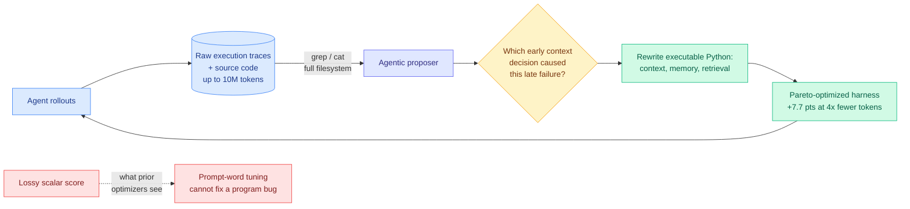

# Media Zone | 2026-08-25

> One saved post today, and it turned out to be the thing the research feed was independently writing about the same morning. The optimization angle is unusually clean: every serious item today is about making the code around a frozen model cheaper, not the model bigger.

## Today's signal

- **The one save is the whole story.** Meta-Harness (Stanford and MIT) claims a **6x performance gap from harness code alone, zero weight updates**, and reports 4x fewer context tokens at +7.7 points.
- **Curation caught up with the literature on the same day.** Today's Task-CoEvolve paper cites that same six-fold gap in its related work, so the saved post and the HuggingFace feed are one conversation arriving twice.
- **Cost optimization is the day's throughline**, and it is at the harness layer rather than the kernel: 4x to 6x token reduction from context management, independently reported by a research group and by OpenAI on 08-19.
- **Counter-signal worth holding.** Microsoft's Thinkingbox reports agents dropping from 65.36% pass@1 to **25.25% pass^20** on stateful business workflows. The harness numbers are ceilings; that one is closer to a floor.
- **Quiet areas, and this is a pipeline fact not a news fact:** the public X scrape returned zero tweets and zero articles today, all eight Reddit subs were empty for a tenth straight day, and there is no new YouTube since 08-14.

> *Sourcing note: the bookmarks feed captured **one** newly-saved post this run and it is carried in full below. The general X scrape returned nothing, so there are no supporting social clusters to build around it today. Nothing has been dropped for length.*

---

## Routing, KV cache, compression, GPU

### Meta-Harness: give the optimizer the logs, not the score

This is the saved item, and the thing worth actually learning from it is a design argument rather than a benchmark.

Automated agent optimizers have converged on a recipe: run the agent, collect a scalar reward, hand that number to a proposer, have it reword the prompt, repeat. Meta-Harness rejects both halves. The proposer does not get a compressed score, it gets **unrestricted filesystem access to the raw execution logs and source code from every past iteration, up to 10 million trace tokens**, and it reads them with `grep` and `cat` the way a person debugging a system would. And it does not edit prompt wording, it **rewrites the executable Python functions** that govern context, memory, and retrieval.

The reason this matters is attribution. A scalar reward tells you a rollout went badly. It cannot tell you that turn 40 failed because turn 6 evicted the wrong file from context. That is a causal chain spread across a long trace, and you can only find it by reading the trace. Meta-Harness calls this step causal failure analysis in code space: isolate the confounded regression, trace the downstream error back to the early context decision that caused it, and rewrite the function responsible. Many harness bugs are simply program bugs, and no amount of rephrasing an instruction fixes a program bug.

**The numbers, and the one to carry.** Discovered context-management policies beat state-of-the-art agentic memory systems by **7.7 points while using 4x fewer context tokens**, converging 10x faster than traditional optimizers. Separately, a single discovered math-retrieval harness lifted solve rates on **200 IMO-level olympiad problems by 4.7 points across five completely held-out frontier models**, zero-shot. The 4x token reduction is the number with the most leverage: it is a cost result, not an accuracy result, and it comes from the layer that is cheapest to change.

**Why it lands now.** OpenAI reported the same shape from the product side on 08-19, where harness-level retained reasoning plus context compaction moved GPT-5.6 Sol's ARC-AGI-3 score from 13.3% to 38.3% **while cutting token consumption sixfold**. A research group and a frontier vendor independently landing on 4x to 6x token savings from harness-layer context management in the same week is the strongest cost signal this thread has produced.

**What to be skeptical about.** There is no cost accounting for the search itself, and that is a real omission here. Giving a proposer filesystem access over 10M trace tokens per proposal is expensive, and "10x faster convergence" counts optimizer *iterations*, which is exactly the wrong unit when the per-iteration token bill just went up. The causal-isolation step is also asserted rather than ablated against a proposer that simply reads the logs without the causal machinery, so it is unclear how much of the gain is the causal reasoning versus just having the raw data at all.

Saved post · the day's only bookmark
<h4>Meta-Harness: optimizing the code around a frozen model</h4>

A Stanford and MIT system that automatically evolves the Python harness governing an agent's context, memory, and retrieval, without touching model weights. Its headline claim is that harness design alone produces up to a 6x performance gap on the same benchmark with the same model. The mechanism is a refusal of the standard optimizer recipe: instead of a lossy scalar reward and prompt rewording, the proposer gets full filesystem access to 10M tokens of raw execution trace and rewrites executable functions. Reported results are a 7.7-point gain over state-of-the-art agentic memory at 4x fewer context tokens, plus zero-shot transfer of a discovered harness across five held-out frontier models. Read it for the attribution argument, which generalizes well beyond this particular system.

<a href="https://x.com/marfinxx/status/2089850130321043799">Read the saved breakdown →</a>

[@marfinxx](https://x.com/marfinxx/status/2089850130321043799) · [agent harness engineering](../../agentic-systems/agent-harness-engineering.md) · [today's digest](../../daily-digest/2026-08/2026-08-25.md)

### The saved theme met the paper feed, and the paper cited it

The reason today's single bookmark is worth this much space is that it stopped being a private reading choice and became a citation.

- **Task-CoEvolve's related work opens by citing the six-fold same-benchmark harness gap**, which is the Meta-Harness result. A HuggingFace paper published today and a post saved a week ago are the same conversation reaching the wiki through two independent channels. Influence angle: the practitioner thread stopped trailing the research and started being cited by it.
- **Task-CoEvolve itself is the cost half.** It cuts harness-optimization evaluations by **80%** by noticing that a validation set gets less informative as the harness improves, then concentrating sampling on the shrinking band of tasks where candidate harnesses still disagree. Meta-Harness makes harness search *better*; this makes it *affordable*.
- **Apodex 1.1 is the same claim at model scale.** A 35B model reaches the frontier performance band on finance, research, math, coding and search by scaling environments and coordination instead of parameters. Cost angle: if that holds, the serving economics move to the harness layer.
- **Prime Agent supplies the open-source reference implementation** and the cleanest one-line statement of the thesis, that a good harness *prevents harness failures from becoming model failures*. ARC-AGI-3 Best@1 from 30% to 95.5%.

[Task-CoEvolve](../../agentic-systems/2026-08-25-task-coevolve-adaptive-validation-selection.md) · [Apodex 1.1](../../agentic-systems/2026-08-25-apodex-1-1-environment-coordination-scaling.md) · [Prime Agent](../../agentic-systems/2026-08-25-prime-agent-self-improving-rlm-harness.md)

### The counter-signal, which is aimed at the metric

Worth reading immediately after the section above, because it is the correction to it.

- **Thinkingbox (Microsoft)** reports the strongest model at 65.36% pass@1 but only **25.25% pass^20** on stateful business workflows. A 40-point gap between "can do it once" and "does it twenty times out of twenty," and the failures terminate *cleanly* after making valid tool calls, which is the hardest kind to detect.
- **Every harness number above is Best@1 or pass@1.** Prime Agent's 95.5% is Best@1. Nobody has published a pass^k curve for a harness-optimized agent, which means the literature is measuring a ceiling while anyone deploying one buys a floor.
- **Two Kurate papers say the same thing from other directions** this week: *On the Fragility of Self-Improving Agents* (variance, task order, underspecification) and *Can Agent Memory Systems Track Evolving State?* (the field optimizes recall when agency needs tracking of change).
- **And the benchmark is saturating.** Prime Agent at 95.5% and NVIDIA's AVO at 100% on ARC-AGI-3 within one week means it can no longer discriminate the thing everyone is now optimizing.

---

## Industry and business

- **Hugging Face is nearing a deal to sell itself**, with annualized revenue up 50% to over $150M in two months. The default host of open weights changing hands is a distribution question, not just a funding one.
- **Semiconductor Week 34 keeps escalating the allocation war:** Micron's $10B research hub, Cerebras CS-4 at 750 PFLOPS from three wafer-scale engines, NVIDIA backing 4.25 GW of initial capacity for OpenAI, and a Marvell warrant to Google tied to up to $120B in custom silicon.
- **NVIDIA flagship chip prices rise about 17%**, potentially adding $5B or more to a single gigawatt datacenter build. Cost angle: this is the pressure that makes every efficiency result above worth more than it was last quarter.
- **Agentic token usage reportedly up 14x on OpenRouter.** The demand side of the same story: harness engineering generates the tokens, which funds the capex, which funds the research trying to make the tokens cheaper.

[The Information](https://www.theinformation.com/briefings/exclusive-hugging-face-annualized-revenue-jumps-50-150-million) · [Semiconductor Newsletter](https://thesemiconductornewsletter.substack.com/p/week-34-2026) · [SemiAnalysis AgentX](https://newsletter.semianalysis.com/p/agentx-inferencexv3-does-cuda-moat)

