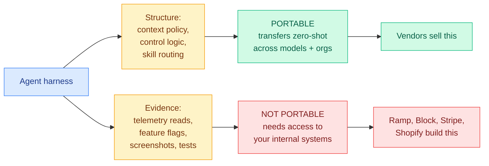

# Media Zone | 2026-08-26

> No new saves and no social layer today, so the practitioner writing carries the day: two independent reports that the scaffold around the model is where the wins and the costs both live.

## Today's signal

- **Saved posts: zero new.** The authenticated bookmark timeline responded and returned its full 60-item history with nothing added since 08-25. The silence on this axis is real, not a capture failure.
- **The X general scrape and the Reddit feed produced nothing today**, both for infrastructure reasons rather than quiet timelines. No YouTube AI/tech pulls landed either. So there is no social or video layer to synthesize, and nothing below is sourced from one.
- **Dominant story anyway: the harness, from the practitioner side.** Ramp writes 75% of its merged pull requests with a coding agent it built itself, and a survey of unrelated production teams reports an 18-point accuracy swing between the best and worst scaffold for one fixed model.
- **The new distinction worth keeping**: harness *structure* travels between models and companies, harness *evidence* does not. That is why four non-AI companies each built their own instead of buying one.
- **Counter-signal**: the same week practitioners are reporting harness wins, Microsoft's own benchmark says single-attempt agent scores overstate reliability by roughly 40 points. Both of today's harness papers reported single-attempt scores.
- **Optimization angle of the day**: cost, but located in the scaffold rather than the model. Every number below moves cost or accuracy with the weights frozen.

## Practitioner ground truth

### Owning the harness: Ramp, and why "buy, don't build" broke

- **Ramp's Inspect now raises 75% of the company's merged PRs**, up from ~60% two months after launch, and passed **one million sessions** in July. Engineers can use anything they like, so that share is revealed preference, not policy. Block has Goose, Stripe has Minions, Shopify has River.
- **The reason they did not just use Claude Code**: local machines cap you at one or two parallel sessions. Inspect runs on remote sandboxes with unlimited concurrency, and they engineered cold-start down to **five seconds or less** with Postgres, Redis, RabbitMQ, Temporal, Chromium and VS Code Server inside.
- **The actual moat is verification, not orchestration.** Inspect closes the loop against systems no vendor can see: it runs tests, reads telemetry, and queries feature flags for backend work, and produces screenshots and live previews for frontend work. Ramp shipped screenshot verification roughly a year before third-party harnesses supported it.
- **Cost angle, and the number that is missing.** A company with a million sessions of telemetry certainly knows what a merged PR costs now versus before Inspect, and published neither. That is the single most valuable figure in the story.
- One organizational oddity worth noting: **all Inspect sessions are public with no opt-outs allowed**, and 150+ people at Ramp have contributed to it.

### Nine rules, and an 18-point swing

- **Ben Lorica surveyed teams shipping agents and found unrelated products converging on the same architecture.** The headline measurement: the same open model showed an **18 percentage point spread between its best and worst harness configuration**, which he calls the finding he would take most seriously when comparing models.
- **The mechanism rule, stated as an instruction**: put hard constraints in software, not prompts. A prompt stays negotiable however firmly worded. Let the model handle ambiguity; put calculations in trusted code, permissions in policy systems, validation in compilers and tests.
- **Autonomy is a cost lever, not a capability lever.** Excess autonomy multiplies paths, errors, operating cost and governance burden. Start flexible, watch which paths repeat reliably, turn those into ordinary code. "A mature agent faces fewer open-ended choices over time, not more."
- **The arithmetic everyone skips**: 95% reliability per step means about 60% success over ten steps, which is why a three-step demo dazzles and a real process collapses. His prescription is to measure recovery separately from first-attempt accuracy.
- **Multi-agent teams should be small, with a protected dissenter**: an orchestrator plus a few specialists, and one critic holding explicit criteria and the *authority* to block or escalate.

**The anchor concept, drawn:** what actually transfers between a vendor harness and an in-house one.

[Why Ramp built Inspect](https://newsletter.pragmaticengineer.com/p/why-ramp-built-inspect) · [Nine practical rules for agents](https://gradientflow.substack.com/p/i-keep-hearing-the-same-advice-about) · [wiki: agent harness engineering](../../agentic-systems/agent-harness-engineering.md)

## Routing, KV cache, compression, GPU

### Chip claims and their denominators

- **OpenAI's Jalapeño is the day's hardware story and the discourse around it is a lesson in reading benchmarks.** SemiAnalysis titled the teardown "better than Nvidia Blackwell," then argued inside the piece that Blackwell is the wrong comparison and Rubin is the real competitor. Cost angle: the design target is tokens per joule, because OpenAI is power limited rather than budget limited.
- **Nvidia's Groq 3 LPX claim is the cleaner cautionary case.** Full production, 3,400 tok/s on Gemma 4 31B, four times Cerebras. It takes **64+ accelerators** to reach that where Cerebras needs one or two, and MoE scaling is unaddressed. The throughput number is real and the comparison is not.
- **The transferable habit**: both stories are ratios whose denominator is the entire argument. A tokens-per-second figure without accelerator count, power draw and workload shape is not a comparison, and today produced two of them on the same day.
- Full treatment of the architecture, including the slice-local memory design and Codex writing the MLA kernels unaided, is in the [Jalapeño summary](../../hardware/2026-08-26-openai-jalapeno-inference-asic.md) and today's [digest](../../daily-digest/2026-08/2026-08-26.md).

[SemiAnalysis on Jalapeño](https://newsletter.semianalysis.com/p/openai-jalapeno-better-than-nvidia) · [The Decoder on Groq 3 LPX](https://the-decoder.com/nvidia-says-its-groq-3-lpx-is-four-times-faster-than-cerebras-but-the-math-is-more-complicated/) · [wiki: compute economics](../../hardware/compute-economics.md)

## Industry and business

- **Hugging Face is nearing a sale**, at more than $150M annualized revenue and up 50% in two months. Influence angle: it is the distribution layer every open-weight release in this wiki assumes, and a change of owner changes that assumption.
- **DeepSeek is raising 50 billion yuan at a 500 billion yuan valuation** on $70.7M of revenue in seven months (ten times its full-year 2025) and a 715 million yuan loss. Its models are also now the standard test load for inference silicon.
- **Gary Marcus went after Anthropic's reported $30 trillion projection**, noting the company has asked candidates whether they are comfortable with the stock going to zero, and that Thomson Reuters is the latest enterprise scaling back Claude usage.
- **Agent spend is becoming its own expense category.** Brex, Adyen and Stripe are all building AI-payment tooling, which is the boring infrastructural confirmation that agent costs are now large enough to need dedicated billing rails.

[Hugging Face revenue](https://www.theinformation.com/briefings/exclusive-hugging-face-annualized-revenue-jumps-50-150-million) · [DeepSeek revenue](https://www.theinformation.com/articles/deepseeks-revenue-reaches-70-million-july-tenfold-jump-2025) · [Marcus on Anthropic](https://garymarcus.substack.com/p/anthropics-30-trillion-fantasy) · [AI payments](https://www.theinformation.com/articles/fintechs-muscle-ai-spending)

