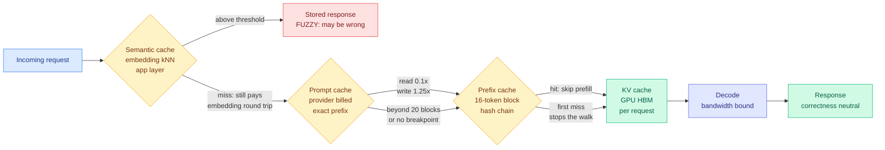

# Media Zone | 2026-08-29

> One save, and it moves the reading trail off the agent loop and onto what the loop costs at the memory layer.

## Today's signal

- Dominant story: the first bookmark in five days, and it is a four-layer teardown of LLM caching.
- Pattern: saved reading pivoted from harness engineering, thirteen items deep, to serving-cost mechanics.
- Cross-source: the same claim that serving cost is a memory problem showed up in a16z's $1.1B hardware fund.
- Counter-signal: none available. The public X timeline captured nothing for the third time in four days.
- Quiet area: no YouTube uploads since 08-26, and all eight tracked subreddits empty for a second day.
- Optimization throughline: cost, and specifically the prefix, not the parameter count.

---

## Routing, KV cache, compression, GPU

### The four caching layers, and which one can lie to you

The saved article is by Avi Chawla, published as a long-form X piece with a public mirror on Daily Dose of Data Science. It is the kind of thing worth reading slowly, because it untangles four mechanisms that share one word and almost nothing else.

**What the work is.** Four things in an LLM serving stack are called caching. They sit at four layers, they are keyed on four different objects, and only one of them can give you a wrong answer.

The **KV cache** is the familiar one: during prefill the model computes a key and a value vector for every prompt token at every layer, and during decode it appends one new pair per generated token. Keeping them turns each decode step from a matrix-matrix multiply over the whole sequence into a matrix-vector one. The price of that win is that decoding becomes **memory-bandwidth bound**, so the GPU spends most of a decode step waiting on memory rather than computing. Concretely, a 70B model at BF16 with a 128K context needs about **40 GB per request**, which is comparable to the entire model at 4-bit weights. It also dies with the request, which is why a 20-turn chat re-prefills turns 1 through 19 on turn 20 at full cost unless something else persists them.

**Prefix caching** is that something else. Same tensors, held server side across requests. vLLM chunks the sequence into fixed 16-token blocks and identifies each block by a hash over its parent block's hash plus its own token IDs, so a hash chain gives prefix matching for free. The scheduler walks the incoming blocks in order and **stops at the first miss**. Two caveats: it saves prefill only, so decode time is unchanged, and on traffic with genuinely unique prompts benchmarks have measured a throughput regression. The RAG-specific problem is worth memorizing: under chain hashing, two requests that retrieve the same documents in a **different order** share nothing at all.

**Prompt caching** is the provider's billed version of the same lookup. Still KV tensors, not text, and it needs an exact prefix match on the fully rendered context. Anthropic and OpenAI charge roughly **1.25x the base input rate to write and 0.1x to read**. Three operational facts do the damage: writes fire only at a breakpoint you placed; on a read the system walks backward through a limited number of blocks and **Anthropic caps that at 20**, so more than 20 blocks of conversation between two calls pushes the last write out of range; and **entries are keyed to a model**, so routing to a cheaper one still prefills the whole accumulated history at cold rates.

**Semantic caching** is a different animal. It stores finished response strings keyed by cosine similarity over an embedding, returning a stored response when similarity clears a threshold. Every request pays an embedding round trip **including every miss**, so the overhead is unconditional. And the threshold has no good setting: raise it and hit rate collapses while you keep paying for embeddings; lower it and hit rate climbs alongside confidently wrong answers. Published defaults span **0.75 to 0.97**. The deeper problem is what embeddings encode: negated sentences sit close together in vector space, and two prompts differing in one operational value score near-identical because the frame dominates.

**Why it matters.** The first three layers are correctness-neutral, so a miss costs money and latency and nothing else. The fourth is fuzzy-match and **will hand you a wrong answer with a 200**. That distinction is the whole article, and it is the row this reader's [KV cache page](../../inference-efficiency/kv-cache.md) did not have across thirty prior entries.

**The cost angle, named.** All four production failure modes the article lists are prefix-shaped rather than capacity-shaped: variable content at the front of the prompt, tool schemas reordered, feature toggles rendered into the prompt, and history summarization. The operative rule is **truncate tool outputs in place instead of summarizing history**, because that keeps the prefix byte-identical. This wiki has now seen that rule arrive three times independently: as a research result in TokenPilot (06-16), which showed context management optimizing token count alone mutates the prefix and forces a full prefill recompute that cancels the saving; as an engineering commitment in DeepSeek's Harness v0.1 (08-14), released the same week DeepSeek raised cache-hit prices roughly six-fold; and now as practitioner advice. Paper, vendor, practitioner.

**The claim to actually act on.** Model-keyed cache entries mean cost-based routing has an unpriced term. On the 140K-token median agentic prefix SemiAnalysis measured by replaying real Claude Code and Codex traces, switching mid-session to a cheaper model plausibly costs more in cold prefill than it saves per token. Nothing in the routing literature this wiki tracks carries that term.

X Article · saved reading, the day's anchor
<h4>KV, Prefix, Prompt and Semantic Caching in LLMs, clearly explained</h4>

A first-principles walk through the four cache layers in an LLM serving stack, written for someone who has to configure them rather than publish about them. It covers where each layer lives, what it is keyed on, and what it costs: GPU memory per request for KV, server-side 16-token block hash chains for prefix, provider billing multipliers of 1.25x to write and 0.1x to read for prompt, and embedding nearest-neighbour over stored responses for semantic. The most useful section is the last one, which lists four production failure modes that are all about prefix stability rather than cache size, including the finding that summarizing conversation history rewrites the prefix and pays full cold-token price on the next call while truncating tool outputs in place does not. It also carries the detail most likely to change a design decision: prompt cache entries are keyed to a model, so routing a live conversation to a cheaper one reprices the whole accumulated history. Read it before your next serving-cost review.

<a href="https://blog.dailydoseofds.com/p/kv-vs-prefix-vs-prompt-vs-semantic">Read the article →</a>

[@_avichawla](https://x.com/_avichawla/status/2093265776266637739) · [Public mirror](https://blog.dailydoseofds.com/p/kv-vs-prefix-vs-prompt-vs-semantic) · [Wiki summary](../../inference-efficiency/2026-08-29-four-cache-layers-kv-prefix-prompt-semantic.md)

---

## Industry and business

- **a16z closed $1.1 billion for an AI hardware fund** naming chips, memory, networking and storage rather than model labs. Cost angle: venture capital pricing the same claim the caching article makes, that the binding constraint sits on the memory path.
- **Anthropic weighed a roughly $7 billion chip deal**, with AI Weekly framing it as Nvidia's largest customers wanting options and the real contest being repeatable inference rather than peak training throughput. Influence angle: a second buyer moving compute procurement off a single vendor changes what everyone downstream can assume about supply.
- **Ken Huang published a production multi-agent architecture guide** whose top-three deployment failures include cascading token explosion, fixed with a hard fan-out cap of five. Cost angle: a rationing policy, and the crudest available one, since it is a constant chosen offline regardless of whether a branch is productive.

[The Information](https://www.theinformation.com/briefings/andreessen-horowitz-raises-1-1-billion-ai-hardware-fund) · [Agentic AI](https://kenhuangus.substack.com/p/multi-agent-design-patterns-architectural)

---

*The general X scrape captured nothing this slot, no YouTube uploads have landed since 08-26, and all eight tracked subreddits returned empty for a second consecutive day, so the clusters that normally sit alongside the saved reading are absent rather than omitted.*
