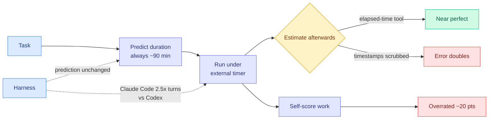

# Media Zone | 2026-08-30

> A near-silent day on social, with one community-published study carrying the whole signal: the agents everyone is now metering cannot tell how long they have been running, and they overrate their own work by twenty points.

## Today's signal

- **Dominant story:** a MATS study on LessWrong finds coding agents predict "about ninety minutes" for almost any task, and Codex is off by 4x to 10x.
- **The mechanism, not the headline:** scrub timestamps from the transcript and the error doubles. The sense of time was never internal.
- **Cross-source:** the same model in Claude Code takes 2.5x more turns than in Codex, which is the harness cost thesis showing up on a third axis.
- **Practitioner counter-signal:** Glassdoor positive AI mentions fell from 81% to 43% since 2019, and the split is by role, not by tool.
- **Quiet area:** everything else. The public X scrape was down for the fourth time in five days, all eight tracked subreddits returned nothing for a third consecutive day, and no new YouTube since 08-26.
- **Capture note, stated precisely:** the bookmarks channel authenticated and read the full 61-item timeline normally. **Zero new saves is a measurement, not a failure.** The Nitter outage is a separate and unrelated break, and the two should not be read as one signal.

## LLMs, agents, safety

### The agent that cannot tell time

The one substantive community item of the day, and it is a good one. Two MATS researchers had Claude Code and Codex predict their own runtime, run the task under an external Docker timer with no artificial cap, then estimate afterwards how long it had taken. The test surface is **AgentTime**, 235 tasks assembled from 18 existing benchmarks, plus 200 tasks from ProgramBench.

LessWrong · MATS study, the day's anchor
<h4>Your Agents Are Not Time Aware</h4>

Ask a coding agent how long a job will take and it says about ninety minutes. Ask it about a completely different job and it says ninety minutes again. The measured compression exponent is 0.19 to 0.24, meaning the prediction barely responds to the real duration, so the error is worst on short tasks and only looks reasonable at the multi-hour scale. Opus 4.8 in Claude Code predicted 99 minutes against an actual 85, while GPT-5.5 in Codex predicted 72 against an actual 17.5. The best part is the ablation rather than the headline: give the agent an elapsed-time tool and retrospection is near perfect, take its timestamps away and the error doubles, which says the temporal sense was never inside the model. It was reading clocks in its own context and using transcript length as a proxy, and length correlates with runtime at r=0.91 while the estimate itself, controlling for length, manages only r=0.4.

<a href="https://www.lesswrong.com/posts/eAbuPXbjakop5rSJx/your-agents-are-not-time-aware">Read the post →</a>

- **The harness finding is the one that matters here.** Same model, same task: Claude Code burns roughly 2.5x more turns than Codex, because Claude Code keeps going until it believes the job is done while Codex tends to stop at a time boundary. The model's prediction is identical across both, so runtime is a property of the loop and the model has no visibility into it.
- **Cost angle, and it is direct.** Every serving-cost number gets quoted in tokens or dollars, but DHH's five-model comparison in August priced one identical task from $550 in 45 minutes down to $23 in 2.5 hours, which is a time-for-money trade. An agent that cannot predict its own runtime cannot participate in that trade, so a time or token ceiling has to be enforced by the harness rather than requested in the prompt.
- **Self-assessment is separately broken and not in a stable direction.** Opus 4.8 and GPT-5.5 overrate their own output by about 20 points same-turn, while Opus 5 underrates by 11 to 15 in a separate turn. One instance had both models scoring themselves near 70% on work that actually scored 7% and 14.5%.
- **The obvious follow-up went unrun.** An elapsed-time tool fixes retrospection. Nobody checked whether telling an agent its own token throughput fixes *prediction*, which is the half that actually matters for control.

[LessWrong post](https://www.lesswrong.com/posts/eAbuPXbjakop5rSJx/your-agents-are-not-time-aware) · [The Decoder writeup](https://the-decoder.com/ai-agents-have-no-sense-of-time-and-are-not-aware-of-it/) · [wiki summary](../../agentic-systems/2026-08-30-agents-not-time-aware.md) · [agent harness engineering](../../agentic-systems/agent-harness-engineering.md)

## Practitioner ground truth

Reddit returned nothing for a third straight day, so the only workforce-level signal today is an aggregate of practitioner reports rather than a thread.

- **Positive AI mentions in Glassdoor reviews fell from 81% to 43% since 2019.** That is a large move on a large sample of people describing their own jobs rather than answering a survey about AI, which makes it harder to dismiss than the usual sentiment poll.
- **The split is by role, not by tool.** Executives rate AI mostly positive; insurance claims workers rate it almost entirely negative. Same technology, opposite verdict, which points at how it is being deployed rather than at what it can do.
- **Fear of job loss is not the top complaint, it is one of several.** Forced adoption, surveillance, and unrealistic productivity expectations carry comparable weight in the reviews. The influence angle is worth naming: the productivity expectations being set on these workers are downstream of exactly the self-reported agent capability numbers the LessWrong study just showed are inflated by about 20 points.

[The Decoder](https://the-decoder.com/ai-sentiment-is-turning-sour-as-employee-reviews-reveal-growing-frustration-across-the-workforce/)

---

*No saved posts today, no reachable Nitter instance, no new Reddit or YouTube. The clusters above are the day's genuine community signal and nothing has been padded to fill the sections that would normally follow. Papers, funding and product news from today are in the [daily digest](../../daily-digest/2026-08/2026-08-30.md) rather than repeated here.*
