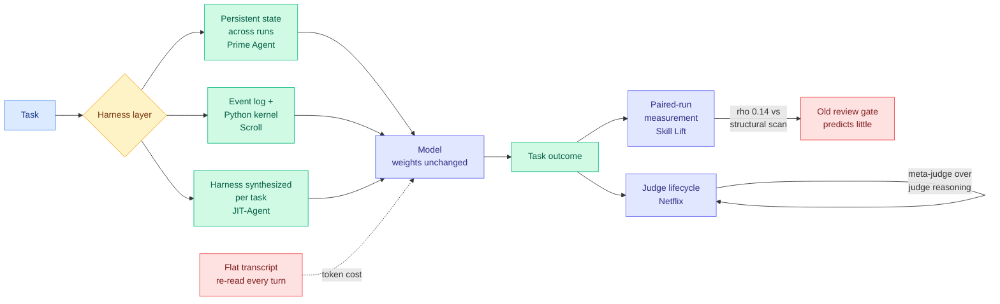

# Media Zone | 2026-08-31

> Another silent day on the live feeds, and one curated newsletter carrying the whole signal: five separate systems released in a week all say that agent capability lives in the scaffold, and the strongest of them moves a benchmark from 30% to 95.5% without touching the model.

## Today's signal

- **Dominant story:** the harness cluster. Prime Agent, Scroll, JIT-Agent, Skill Lift and a Netflix judge-lifecycle writeup, all in one weekly roundup, all arguing that the layer around the model is the object worth engineering.
- **The number that carries it:** Prime Intellect's open-source harness takes ARC-AGI-3 Best@1 from **30% to 95.5%** with the model class held fixed. Influence optimization in its purest form, since nothing about the weights changed.
- **Counter-signal from inside the same cluster:** NVIDIA measured the review gate most enterprises use for shared skills and found it correlates with actual quality at Spearman rho **0.14**. The process everyone runs predicts almost nothing.
- **Cost angle:** two of the five systems (Scroll, Prime Agent) independently replace "re-read the transcript" with "run code over typed state," which is a token-cost move before it is a capability move.
- **Quiet area:** everything live. The public X scrape returned nothing for a fifth consecutive slot, all eight tracked subreddits returned nothing for an eighth consecutive day, and no new YouTube since 08-26.
- **Capture note, stated precisely:** the bookmarks channel authenticated against X's GraphQL `Bookmarks` operation and read the full timeline normally. **Zero new saves is a measurement, not a failure**, and it is separate from the Nitter outage. Today's Media Zone is therefore built from the best available proxy, the curated newsletter layer, and not from saved reading.

---

## LLMs, agents, safety

### The harness cluster: five systems, one claim

The week's roundup is unusually coherent. Five of its six items describe systems built around a model rather than models, and they converge on a single design instinct: **stop making the model re-read its own history, and start giving it typed state it can run code against.** Read against [agent harness engineering](../../agentic-systems/agent-harness-engineering.md), which already holds that harness choice swings cost-per-success 5x to 30x on a fixed model, this is the week the idea got working reference implementations instead of position papers.

Open source · the cluster's anchor
<h4>Prime Agent (Prime Intellect)</h4>

Most harnesses reset everything except the files on disk when a run ends, which caps how much a system can compound over time. Prime Agent persists histories, memories, skills, prompts and subagent specifications across trajectories, so improvements accumulate instead of being rebuilt each time the agent starts. Alongside that it gives the model a persistent IPython session, so instead of re-reading a flat transcript the model filters, aggregates and re-derives its own state as code it writes. Holding the model class fixed, ARC-AGI-3 Best@1 moves from 30% to 95.5%, and it matches or beats native harnesses on long-context coding, GPU kernel generation and autonomous nanoGPT speedruns. The reason to read it rather than a paper about the same idea is that it is a working open-source implementation of the compounding-harness thesis, and the state-hierarchy diagram alone is a usable map of what belongs in the prompt versus in managed storage.

<a href="https://www.linkedin.com/pulse/top-ai-papers-week-dair-ai-0svjc">Read the roundup →</a>

Alibaba · memory
<h4>Scroll: context management as code</h4>

Every memory system asks you to design a schema up front and then rewrite it the moment the agent does something you did not anticipate. Scroll deletes the schema and hands context construction to the model as a programming problem. Each session is backed by an append-only event log plus a sandboxed, persistent Python kernel, so tool outputs, retrieved history and derived state bind to typed variables that survive across model calls rather than being re-serialized into the prompt every turn. Only what the model explicitly prints crosses into the working view, which means nothing gets committed to a compressed form before you know what will matter. When the working view approaches its budget, stale spans are evicted but stay recoverable through an eviction index of compact landmarks tied to exact event-log addresses, so the agent navigates back to a region instead of searching the whole log. It reaches 94.8% on LongMemEval_S, 73.1% on BEAM_10M (5.1 points over the best published memory system), and 86.7% on LOCA_256K. The structural argument is the good one: because context management runs as code, it inherits every future improvement in model coding ability for free.

<a href="https://www.linkedin.com/pulse/top-ai-papers-week-dair-ai-0svjc">Read the roundup →</a>

Harness synthesis
<h4>JIT-Agent: the harness as model output</h4>

Harnesses are hand-built and then frozen, which forces one design to serve deep research, product generation and long-horizon coding equally well. JIT-Agent makes the harness itself the thing the model produces, synthesized per task under a fixed four-module protocol covering memory, planning, action protocol and tool orchestration. It instantiates those modules for the task at hand rather than picking from a menu of presets, patches the harness mid-run when execution signals a problem, and self-evolves by distilling performance signals from a growing archive of prior configurations so recurring task shapes converge on better starting designs. Nothing about the backbone changes, only the scaffolding wrapped around it. With JIT-Agent attached, DeepSeek-V4-Flash surpasses GPT-5.6 on DeepSearchQA by 9.1 points and OdysseyBench by 4.3, and GLM-5.2 gains up to 20.2 points, with the generated harnesses performance-competitive against mature runtimes like OpenCode and Claude Code. The appendix is worth reading on its own for the named designs that emerged (Palimpsest, Trapdoor, Origami, Gearbox), which are legible patterns you can copy by hand without ever running the generator.

<a href="https://www.linkedin.com/pulse/top-ai-papers-week-dair-ai-0svjc">Read the roundup →</a>

NVIDIA · the counter-signal
<h4>Skill Lift: your review gate predicts almost nothing</h4>

Enterprise teams reviewing shared skill libraries almost always gate on a scanner that checks structure, style and security. NVIDIA measured whether passing that gate predicts anything about how a skill actually performs, and across 145 real skills drawn from internal and public catalogs the structural scan score correlates with LLM-judge quality at a Spearman rho of 0.14. Passing the scanner tells you a skill is well formatted and essentially nothing else. The replacement, called Skill Lift, is a paired-run design: run the same task twice under identical model, sandbox, workspace and scorer, once with the skill loaded and once without, and measure the difference in what the agent actually completed. To make results comparable across tools, 947 paired cases from 58 production skills were scored across four harnesses with trajectories normalized into a shared Agent Trajectory Interchange Format, so a skill's lift in Claude Code can be read against its lift in Cursor. The largest gains show up in skill execution, behavior check and skill efficiency, which is a useful hint about what skills are actually for. If you run a skill review process today, this is the design that replaces it with something that measures outcomes.

<a href="https://www.linkedin.com/pulse/top-ai-papers-week-dair-ai-0svjc">Read the roundup →</a>

Netflix · production
<h4>Judges as a lifecycle, not an artifact</h4>

Most teams validate an LLM judge once, ship it, and never look at it again. Netflix runs judges over hundreds of thousands of show-level recommendation explanations per week, served to millions of members on mobile, and this writeup describes what keeping one honest at that volume actually takes. Four phases replace the single artifact: birth defines multiple evaluation criteria and builds curated benchmarks with human labels and rationales, training refines the rubric, deployment puts the judge to work, and monitoring watches for drift and triggers re-tuning behind a review gate. The learning signal is the interesting part. Reasoning-Aligned Rubric Tuning runs a meta-judge over the judge's own reasoning output, so a mismatch between judge and human gets traced back to specific rubric language rather than patched with more prompt text. The same judge then plays two roles, gating quality and driving reflective generation by appending its rationale to the generator prompt so failed explanations get revised instead of dropped. A five-week A/B test over tens of millions of members shifted viewing toward previously unwatched content and increased successful browse-to-play sessions against a no-explanation control, with no quality-related takedowns. This is the rare LLM-judge writeup with production consequences attached.

<a href="https://www.linkedin.com/pulse/top-ai-papers-week-dair-ai-0svjc">Read the roundup →</a>

**Why this cluster matters to you specifically.** Your saved reading has been dominated by loop and harness engineering for a month, and this is the week the theme produced runnable artifacts rather than arguments. Two things to take from it. First, **Scroll and Prime Agent independently reached for the same move**, replacing transcript re-reading with code over typed state, which is a token-cost reduction before it is a capability gain and is directly comparable to the [ALTK-Evolve](../../agentic-systems/2026-08-12-altk-evolve-selective-context-delivery.md) result showing DeepSeek-V3.2 going from 80.4% to 89.3% task completion at 41% of the token cost. Second, **Skill Lift's rho of 0.14 is the most immediately actionable number in the batch**, because it invalidates a process that is currently running inside a lot of companies, and it costs nothing to replace with paired runs.

[DAIR.AI weekly roundup](https://www.linkedin.com/pulse/top-ai-papers-week-dair-ai-0svjc) · [agent harness engineering](../../agentic-systems/agent-harness-engineering.md) · [agent memory](../../agentic-systems/agent-memory.md)

---

## Routing, KV cache, compression, GPU

### The efficiency thread arrived through papers, not through social

There is no social layer to synthesize on routing, KV cache, compression or GPU work today, so this section is short by design rather than padded. Two items are worth carrying here because they change what an efficiency-minded reader should do next week, and both are treated fully in the [08-31 digest](../../daily-digest/2026-08/2026-08-31.md).

- **Compression now has a third cost line nobody prices.** A COLM 2026 paper finds that standard weight pruning degrades the faithfulness of sparse autoencoders fit on the model, so the compressed model you actually serve is the one your interpretability tooling can least describe. Cost angle inverted: this is a cost of compression, not a saving from it. → [summary](../../inference-efficiency/2026-08-31-pruning-meets-interpretability-sae.md)
- **Runtime enforcement got cheap enough to argue about.** LMSM puts a pluggable interpretability-backed monitor inside the vLLM generation loop and retains 98.14% of unmonitored throughput while cutting attack success from 39.20% to 3.32%. At two percent, monitoring stops competing with capacity for GPUs. → [summary](../../responsible-ai/2026-08-31-lmsm-llm-security-modules.md)
- **Kernel agents got memory.** A Kurate leaderboard entry gives a kernel-optimization agent an experience graph over past attempts and measured outcomes, arguing that accumulated structure beats more rollouts. Influence angle: if experience ports across hardware targets, the CUDA moat becomes a decaying cost rather than a fixed one. → [summary](../../hardware/2026-08-31-self-evolving-kernel-optimization-agents.md)

---

## Industry and business

- **SemiAnalysis published a negative result against its own expectation**, finding no CVE-rate change in the Nvidia driver, CUDA, PyTorch, Kubernetes and Docker despite the industry's AI-cyber narrative. Influence angle: a checkable claim beats a press campaign, and they pre-committed to a series anyone can re-check.
- **They also shipped free tooling rather than only an argument.** `pip install clustermax` then `cmax audit security` auto-detects Slurm and Kubernetes clusters, VMs, bare metal and containers and checks versions against known vulnerabilities.
- **Outcome-based pricing became a two-vendor pattern this week.** OpenAI now lets some major customers pay only when the AI completes a task, days after Salesforce began negotiating Agentforce contracts priced on revenue closed or service cost automated. Cost angle: the vendor now eats every failed task, which pushes serving-cost optimization down the stack.
- **Employee sentiment is moving the other way from the product roadmaps.** Glassdoor positive AI mentions fell from 81% to 43% since 2019, split by role rather than by tool, with forced adoption and surveillance ranking alongside job-loss fear.
- **Anthropic's legal exposure stacked again**, with Sony, Warner and other publishers suing over musical compositions months after a $1.5 billion settlement with book authors.

[SemiAnalysis](https://newsletter.semianalysis.com/p/most-neoclouds-suck-at-security) · [The Information](https://www.theinformation.com/briefings/openai-starts-letting-customers-pay-ai-works) · [The Decoder](https://the-decoder.com/ai-sentiment-is-turning-sour-as-employee-reviews-reveal-growing-frustration-across-the-workforce/) · [wiki summary](../../hardware/2026-08-31-semianalysis-neocloud-security.md)

