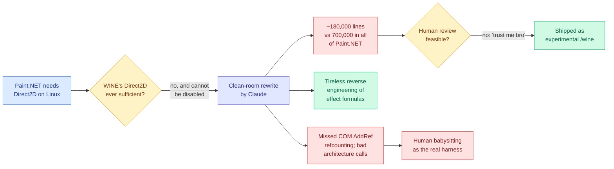

# Media Zone | 2026-09-02

> A thin day by volume and a sharp one by content. The saved-posts feed authenticated and returned nothing new, so today's signal comes from the discourse layer instead, where the single loudest item is a 180,000-line reverse-engineering job that its own author says he cannot review. Optimization angle of the day is influence rather than cost: what changes when the reviewable unit of software becomes larger than any human can read.

## Today's signal

- **Bookmarks: a measured zero, not a broken pipe.** The farmer authenticated, pulled the full 61-item timeline via X's GraphQL Bookmarks operation, and found nothing newer than the last save. Nothing saved, rather than saves unreadable.
- **The general X scrape is broken, separately.** No reachable Nitter instance for a seventh day, so zero curated retweets and zero tweets from 73 tracked handles. Two silences, two causes.
- **Dominant story:** Paint.NET now ships a clean-room Direct2D reimplementation written by Claude, roughly 180,000 lines, explicitly unreviewed.
- **Counter-signal:** Gary Marcus and The Information both landed on reasoning opacity the same day, arguing capability gains are being bought with monitorability.
- **Quiet area:** no practitioner ground truth at all. All eight subreddits returned nothing for a tenth day (Reddit farmer lacks OAuth credentials), so nothing confirms or contradicts today's papers from the field.
- **Running saved-theme tally, unchanged:** Loop / Harness / Graph Engineering **13** (still dominant), Inference / KV cache / GPU kernels **5**.

## LLMs, agents, and the reviewability problem

### The 180,000-line clean room (the day's anchor)

The Paint.NET item is a saved-theme item arriving without being saved. The reader's top curation theme for a month has been loop and harness engineering, which is the question of how much work you can safely hand to an automated loop. This is that question answered at an uncomfortable scale by someone with no stake in the debate.

- **What happened.** Rick Brewster, author of Paint.NET for over twenty years, hit a wall: Direct2D (Microsoft's hardware-accelerated 2D graphics API) will never be complete enough under WINE, and Paint.NET cannot simply switch it off. So Paint.NET now carries an internal, from-scratch, clean-room reverse-engineered reimplementation of Direct2D, used only under WINE via a `/wine` flag, written by Claude.
- **The number that matters, and the admission attached to it.** Roughly **180,000 lines**, against about 700,000 for the rest of Paint.NET accumulated over two decades. Brewster's own framing: "most of this code is, as they say, vibe coded," meaning not thoroughly reviewed, "more trust me bro style. I cannot possibly review 180,000 lines of code."
- **The failure mode he names is the interesting part.** He had to babysit resource management, because for a while Claude simply was not doing the COM equivalent of `AddRef()` on reference-counted objects, which is a whole class of leak. He also reports slapping it down over bad architecture decisions. Against that, he was impressed by genuinely clever and tireless reverse engineering to recover the formulas behind Direct2D's built-in effects library.
- **Influence-optimization angle.** This is not a cost story, it is a leverage story: one maintainer just added a quarter of his project's lifetime output in one push. The cost lands later and elsewhere, as unreviewed code in a shipping graphics path, which is why he gated it behind an experimental flag rather than making it the default. That gating *is* the harness.
- **Where it lands in the wiki.** It is the strongest field datapoint yet for the claim on [agent harness engineering](../../agentic-systems/agent-harness-engineering.md) that the harness wins by owning what is checkable and leaving judgement to the model, which today's [Harness-of-Harness](../../agentic-systems/2026-09-02-harness-of-harness.md) paper states as a design commitment. Brewster had no automated evidential layer, so the only check available was his own attention, and it ran out at 180,000 lines.

[Simon Willison's quote](https://simonwillison.net/2026/Sep/2/rick-brewster/) · [Paint.NET forum thread](https://forums.paint.net/topic/134563-🍷-extremely-experimental-winelinux-support-how-to-get-started/)

### Reasoning opacity as a purchased tradeoff

- **The report.** The Information says OpenAI's forthcoming Astra model gets its coding and computer-use gains from a technique that also makes it **reveal less of its thinking**, and that this has raised concerns inside OpenAI and across the industry about monitoring for the kind of rogue behavior that recently hit OpenAI's own systems and Hugging Face's.
- **The argument against.** Gary Marcus calls it a redline. His case rests on the *Chain of Thought Monitorability* position paper (arXiv 2507.11473), which framed CoT visibility as a real but fragile safety opportunity: imperfect, as Subbarao Kambhampati and others have shown, but one of the few threads available for inspecting the model. Trading a slender thread for a possibly small performance gain is the bet he objects to.
- **Cost-optimization read, stated plainly because nobody else is stating it.** Hidden or compressed reasoning is a **token-cost optimization** before it is a safety problem. Reasoning tokens are billed and they dominate long-horizon agent spend. A technique that gets the benefit of deliberation without emitting it is worth real money, which is exactly why it will be adopted regardless of the monitorability objection.
- **The tension with today's papers.** [Safin-1](../../ai-routing/2026-09-02-safin-1-march-memory-anchor-routing.md) argues safety should live inside the model's native computation as a routed state rather than as external monitoring. If frontier models are simultaneously becoming less externally legible, then state-native enforcement stops being an efficiency preference and becomes the only option left, which is a much stronger claim than Safin-1 makes for itself.

[The Information](https://www.theinformation.com/articles/secret-technique-behind-openais-astra-model-sparks-security-concerns) · [Marcus on AI](https://garymarcus.substack.com/p/red-alert-openai-is-poised-to-cross) · [CoT Monitorability paper](https://arxiv.org/abs/2507.11473)

## Industry and business

- **Anthropic priced down.** Fable 5.1 and Mythos 5.1 land at roughly **25% lower token cost** than Fable 5 on typical workloads, with claimed performance gains. Direct cost optimization, passed to the buyer rather than kept as margin.
- **Google turned metering into a product surface.** Gemini Notebook's overhaul today drops flat daily message quotas for a dynamic five-hour compute meter that prices prompt complexity, context depth and source density, and defers heavy background jobs until capacity frees. That is compute rationing sold as a consumer feature.
- **The Cursor cutoff.** OpenAI is pulling its models from Cursor by November 12 under a change-of-control clause after SpaceX's roughly $60B acquisition of Anysphere. Cursor's counter is a cost-structure claim: OpenAI models were only about 5% of their traffic, with the load already on Grok 4.6 and open-weight models.
- **Infrastructure financed ahead of existence.** SoftBank filed to take SB Energy public on the strength of AI data centers where, in its own small print, "no data center capacity is currently in operation," against **$213.5M** of solar and battery revenue and one planned outside customer, OpenAI. Dell, at the other end of the same trade, booked **$47B** in a quarter, up 58%, and raised its year by **$25B**.

[Anthropic](https://www.anthropic.com/claude-fable-and-mythos-5-1) · [Gemini Notebook limits](https://blog.google/innovation-and-ai/products/gemini-notebook/new-flexible-usage-limits/) · [OpenAI on Cursor](https://openai.com/index/our-decision-on-cursor-following-its-acquisition-by-spacex/) · [SB Energy](https://www.theinformation.com/articles/softbank-rushing-sb-energy-public-markets) · [Dell](https://www.theinformation.com/briefings/dell-raises-sales-forecast-ai-server-demand)

