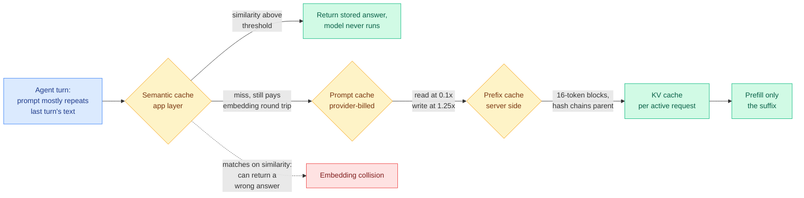

# Media Zone | 2026-09-04

> Two saves, both worth reading, and a video track nobody in the wiki has touched yet. The stronger save is a serving-stack explainer that separates four caches usually collapsed into one word, and it arrives on the same day the digest's papers say the KV cache scorer buys nothing, which makes the two readable together. The other is a repost claiming code has stopped being the skill. Behind them sits an eight-talk conference track on agent payments whose real subject is not money, it is the observation that an agent's capability is now bounded by which paid tools it can reach.

## Today's signal

- **Bookmarks: two genuine new saves, both on standing themes.** The farmer authenticated normally and returned a real number rather than a failure. The inference and KV cache theme goes to **6 saves**, the harness and agent-systems theme to **14**.
- **The general X scrape is broken, separately and for a ninth day.** No reachable Nitter instance, so zero curated reposts and zero tweets from the tracked handles. Two silences, two causes, as on 09-02.
- **Dominant saved item: the four-cache separation**, and it is the second arrival of this same explainer in seven days, which is a signal about the reader's attention rather than about the field.
- **Video: an eight-talk agentic-commerce track from AI Engineer**, uncovered by this wiki until now, whose sharpest claim is Apify's, that agentic payments explode only when token subsidies end.
- **Counter-signal inside that track:** the most honest talk is titled "x402 isn't good (yet)" and names a live double-spend window in the protocol everyone else is building on.
- **Quiet area:** no practitioner ground truth at all. All eight subreddits returned nothing for a twelfth day, so nothing from the field confirms or contradicts today's KV cache result.

## Routing, KV cache, compression, GPU

### The four caches in an LLM serving stack (saved reading)

The saved post is a full technical explainer rather than a pointer, so the tweet body *is* the content, and the value is a separation this wiki has needed: four things that people call "caching" key on four different quantities and have four different failure modes.

**What the piece actually teaches.** Every request re-reads the whole prompt and computes attention state for every token in it, which is **prefill**, and prefill sets both the input bill and the time before the first token appears. In an agent loop most of the prompt is text the model already processed last turn, so four separate layers exist to avoid paying for it again, and they are not interchangeable:

- **The KV cache** holds the key and value tensors for every token at every layer, for **one active request**. It is GPU memory and it dies with the request.
- **Prefix caching** keeps those tensors on the server between requests. vLLM stores them in **16-token blocks**, and each block's identifier is a hash that **chains in the previous block's hash**, so a block only matches if everything before it matched too. The scheduler walks forward, stops at the first miss, and prefills the suffix from there. That chaining is why a single edited token near the top of a prompt invalidates everything after it.
- **Prompt caching** is the same reuse running on a provider's hardware with a price sheet attached. **Anthropic charges 1.25x the base input rate to write an entry and 0.1x to read it.**
- **Semantic caching** works on a different principle entirely. It embeds the incoming prompt, runs a similarity search over stored prompts, and returns a stored answer outright above a threshold, which is why it saves **output** tokens as well as input tokens.

**The load-bearing distinction, and it is a correctness distinction rather than a cost one.** The first three match on **exact tokens**, so they physically cannot change what the model produces. Semantic caching matches on **similarity**, so two prompts whose embeddings land close together can return each other's answers. It is also the only one that pays an embedding round trip on **every** request, including every miss. So the cheapest-looking layer is the only one that can be wrong, and the only one with a floor cost you pay whether it helps or not.

**Cost angle, since it is the reason this is saved reading rather than a curiosity:** the practical takeaway is that you do not need a custom serving stack to get the first layer. The `transformers` library already exposes the cache as an object of KV vectors you can hold onto, so you can prefill a corpus once, keep the returned tensors, and reuse them across queries in about ten lines.

**Two notes worth carrying.** First, this wiki already holds this material as [four cache layers (08-29)](../../inference-efficiency/2026-08-29-four-cache-layers-kv-prefix-prompt-semantic.md), so today is a re-arrival, and the same explainer being saved twice in seven days says more about where the reader's attention sits than about anything new in serving. Second, and this is the reason to read it against today's digest: the explainer's whole frame is that these four layers exist to avoid **re-reading** context, while [Random Attention (09-04)](../../inference-efficiency/2026-09-04-random-attention-kv-eviction.md) attacks a fifth question the explainer does not raise, which is what to **throw away** once the cache is too big, and answers it with "nothing you compute is worth the compute." Layer four saves output tokens, layers one to three save input tokens, and Random Attention saves the scorer. Different budgets, all in the same decode step.

[@_avichawla on the four caches](https://x.com/_avichawla/status/2095445303679988200) · [wiki: four cache layers](../../inference-efficiency/2026-08-29-four-cache-layers-kv-prefix-prompt-semantic.md) · [wiki: kv-cache concept page](../../inference-efficiency/kv-cache.md)

### Routing arriving as a home appliance

- **Nvidia shipped PAIR, a Personal AI Router**, which spreads local inference requests across every device on a home network to cut wait times for parallel agent tasks. Cost angle: it is per-request routing over a heterogeneous device pool where the fleet is already paid for, so the only thing being optimized is queueing.
- The framing is worth noticing because it inverts the usual direction. Routing research assumes a cloud pool of models with different prices; this assumes a fixed pool of devices with different speeds and no marginal token cost at all.
- It also lands the same week the digest's routing Deep Dive introduces a routing key of *when* rather than *which*, and the standing gap on the [routing page](../../ai-routing/llm-routing.md) is still that nothing in production routes over model-harness pairs.

[The Decoder on PAIR](https://the-decoder.com/nvidia-wants-your-home-network-to-work-like-a-mini-data-center-for-local-ai/)

## LLMs, agents, and safety

### "The End of Software Engineering" (saved reading)

Saved repost · paper claim, relayed
<h4>Code becomes throwaway, judgment becomes the job</h4>

The saved post relays a paper whose argument is a capacity claim rather than a capability claim: a human's working memory bounds how much state and how many dependencies they can hold at once, and past that bound they stop being able to write correct code, while an agent has no such ceiling and its capacity grows with compute. The conclusion the reposter draws is that the human stops writing code and becomes what he calls the intent architect, directing agents and auditing results, so code turns into the throwaway artifact and judgment becomes the durable skill. Read it as a framing rather than a finding, because the capture does not include a fetchable version of the paper itself, so what is here is the reposter's summary plus his own agent-building guide attached alongside. The claim is also not new to this wiki, and its most honest datapoint is a field one rather than a paper: Paint.NET now ships roughly 180,000 lines of Claude-written clean-room Direct2D that its author says he cannot possibly review, which is exactly what "auditing the result" turns into once the result is larger than a person.

<a href="https://x.com/AnatoliKopadze/status/2095573992140583363">Read the saved post →</a>

**Where it lands.** The genuinely interesting version of this claim is not the provocation, it is the accounting question underneath: if judgment is the job, what does judgment cost per unit of code? Today's digest has two papers that answer adjacent versions of that. [RealSWE](../../agentic-systems/2026-09-04-realswe-realistic-user-requests.md) measures that of the six information categories a human can supply in a request, **Desired Behavior and Motivation help significantly while Environment Information and Reproduction Steps add tokens and buy nothing**, which is a direct measurement of which human judgment is worth supplying. And [Terminal-Universe](../../agentic-systems/2026-09-04-terminal-universe-trajectories-to-environments.md) turns logged agent trajectories into 37,300 reusable training environments, which is the throwaway-code claim taken literally: **the code was throwaway, the environment it ran in was the asset.** The paper's own numbers are a better argument for the thesis than the thesis is.

### The agent-payments track: capability is now bounded by the wallet (cluster of 8 talks)

An eight-talk AI Engineer track from 2026-09-01, uncovered here until now. The commerce framing undersells it. The reusable claim across all eight is that **an agent's effective capability is a function of which paid tools it can reach**, which makes payment a routing concern rather than a billing report.

- **The bottleneck reframe, from Circle.** Capability work targets reasoning, but the actual stall is a paywall, which forces a human back into the loop to make an account or manage a key. Their side-by-side demo is the cleanest evidence: two identical Claude Code sessions, and the unequipped one is not less intelligent, it is less **reachable**, and it **silently skips gated endpoints**, producing a confident answer built only on free sources. That silent-skip failure is the observability gap nobody in the track names.
- **Why cards cannot work, as arithmetic.** Agents pay tiny amounts at very high frequency, and a 3% fee on a one-cent transaction is incoherent. Circle's Nanopayments moves accounting off-chain against escrowed funds and settles in batches, because gas fees exist to stop spam and therefore cannot be removed, yet they dominate sub-cent payments. Verification lands in a few hundred milliseconds, which is the number that matters because it sits in the request path.
- **Guardrails belong in the wallet, not in the prompt.** The strongest design claim in the batch, repeated independently by Circle, Stripe and Edge & Node: per-transaction human approval cannot scale at one to ten cents, so limits must be per session and per day and **enforced by the wallet**. That holds regardless of what the model decides or what an injected instruction tells it, which is the only guardrail shape here that fails safe by construction.
- **The counter-signal, and it is the most technically honest talk.** Apify's "x402 isn't good (yet)" names three real defects: a **double-spend window between verification and settlement**, so a client can sign a thousand authorizations against the same funds; a status-code collision where x402 mandates HTTP 402 as the first response while MCP mandates 401, which is spawning `x402.example.com` and `mcp.example.com` hostnames as a workaround; and an original `exact` pricing scheme that assumes fixed per-call prices and does not fit metered work. Circle's escrow-then-authorize design happens to close the double-spend window, and neither talk draws the comparison.
- **The sharpest economic prediction in the track, also Apify's:** agentic payments explode when **token subsidies end** and buy-versus-build finally has a price attached. That is the same pressure the digest's Global View reads in Anthropic's investors asking for margin per processed token.
- **PayPal's framework is the most reusable artifact.** Three questions (did the human authorize this, is it allowed right now in this scope, can we prove it later) against a two-by-two of stakes and counterparty. Low stakes plus closed ecosystem, such as Claude Code with OAuth connectors, needs no cryptographic proof because logs and revertibility suffice. High stakes plus open ecosystem is the case **nobody has in production**. Their closing generalization is the line to keep: this applies to any hard-to-reverse agent action, not only payments.
- **Stripe's talk is the consumer-protection one and it works because the demo fails on purpose.** Her agent turns into an aggressive salesman that mocks her for wanting time to think, and the reveal is that she picked a merchant persona whose system prompt says to use every trick to close deals. **In agentic commerce the system prompt is the consumer-protection surface**, and nothing structural stops a merchant choosing the manipulative one.
- **The DUNA talk overclaims and is still worth reading.** Registering agents under a decentralized unincorporated nonprofit association with resolvable JWT identity gives real **attribution and accountability**, which is missing infrastructure. It does not resolve Simon Willison's lethal trifecta, because an agent inside one still holds private data, still reads untrusted content, and still acts. The JWT chain records who is liable after an injection, which is a legal remedy rather than a security control.

### One talk in that track is not about payments at all

- **Google DeepMind's session is the evaluation talk hiding inside a commerce track.** Its diagnosis: most agents are search-bar wrappers that assume the user arrives with a well-formed intent and the right vocabulary, while real users arrive with a vibe. She names the distance between the feeling and the query the **articulation gap**, and argues the agent's job is to close it by proactive elicitation rather than to wait for better keywords.
- **The loop is discovery, research, adaptive response**, where discovery builds a working state from conversation history, personal context and reference images including **soft constraints with confidence scores**, and research chooses the *modality* of the follow-up question before doing comparison work in the background.
- **The reusable part is the auto-rater suite**, particularly **counterfactual sensitivity** and **over-asking detection**. Those are two metrics the agent-benchmark literature does not have, and over-asking in particular is the exact failure a system tuned to surface hidden conflicts would produce.
- This sits directly next to today's [PACE](../../responsible-ai/2026-09-04-pace-hidden-conflicts-user-requests.md), which builds an evaluation where the fact that disqualifies a request does not resemble the request, and next to [RealSWE](../../agentic-systems/2026-09-04-realswe-realistic-user-requests.md), which measures that real requests are 88% bare problem statements. **Three independent arrivals in one day at the same conclusion: the user's stated request is not the specification, and nobody's evaluation accounts for the difference.**

## Industry and business

- **vLLM held Office Hours #57** on v0.28 and the vLLM-Omni project, with live demos of a Qwen Omni voice assistant, diffusion intermediate steps, and paired high-quality and realtime video generation. Worth the recording if you serve multimodal, since Omni is where the serving stack's assumptions about a single text decode loop start to break.
- **Nvidia confirmed the $12.9 billion Hugging Face purchase**, which puts the default distribution point for open weights inside the accelerator vendor. Huang says Nvidia will not use it to steer chip choice, which is a promise rather than a structural constraint.
- **Anthropic's Fable 5.1 shipped** as a faster, more efficient Fable and is the first model carrying Anthropic's text watermark, into a usage-limits row over the 5x and 20x plans applying to session rather than weekly limits. Influence angle: watermarking is the first frontier-model feature whose value accrues to third parties rather than to the buyer.
- **OpenAI's GPT-6 Astra** is rolling out with early users calling it the best computer-use model available, including a usable first-draft video edit produced directly inside Premiere Pro.

[vLLM recordings](https://www.youtube.com/playlist?list=PLbMP1JcGBmSHxp4-lubU5WYmJ9YgAQcf3) · [Nvidia and Hugging Face](https://www.theinformation.com/articles/nvidias-hugging-face-embrace-burnishes-ai-kingmaker-status) · [Claude text watermark](https://www.anthropic.com/news/claude-text-watermark) · [full digest](../../daily-digest/2026-09/2026-09-04.md)

