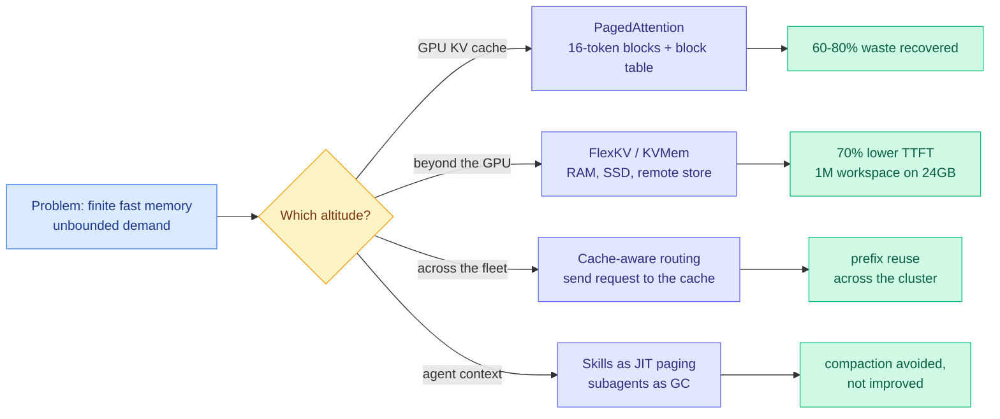

# Media Zone | 2026-09-08

> Your feeds converged on one metaphor today, at four altitudes of the stack: context is memory, and memory needs an operating system. PagedAttention on the GPU, FlexKV out to SSD and across the cluster, KVMem down to NVMe, skills-as-paging in the agent loop. Then the evening added the uncomfortable footnote: the memory manager may not need to be clever at all.

## Today's signal

- **Dominant story:** the OS metaphor won. Blocks, paging, storage tiers, garbage collection. Nobody argued for bigger context.
- **The evening's best result:** Salesforce evicted KV cache entries **at random** and beat three years of scoring heuristics. The scorers were never the variable.
- **Cross-source convergence:** a PagedAttention explainer, Tencent's FlexKV release, the KVMem paper, and Raschka's KV-caching video. Four altitudes, one mechanism.
- **The number that anchored the harness debate:** same weights, 30% to 95% on ARC-AGI. Anthropic's own Claude Code engineer went further: smarter models need *heavier* harnesses, not lighter ones.
- **Pattern:** agent codebase memory is abandoning vector databases for maps and files. Graft, SigMap, tgrep, ripwire, all this week.
- **Counter-signal:** τ^τ-Bench still has Claude Opus 5 at 23.9% against an expert human's 82.2%. Harness is a large lever, not the missing one.
- **Discount heavily:** the Navier-Stokes credit dispute ran all day and into the night. Loud, unresolved, still no verifiable artifact from OpenAI.
- **Feed note:** six captures unioned across the day, morning through 21:00. No new saved posts, LinkedIn returned zero organic posts. X feed plus YouTube only.

---

## Routing, KV cache, compression, GPU

### The operating system is the answer at every altitude

The anchor idea, and the reason five unrelated posts are one argument:

- **The waste number that started all of this.** Reserving one contiguous KV slab per request, sized for the maximum output length, wastes **60 to 80% of KV cache memory** in pre-vLLM serving systems. Cost optimization at its most literal: the same GPU serves several times the traffic once you stop pre-reserving.
- **Why blocks fix it.** KV memory is carved into a fixed pool of numbered physical blocks holding 16 consecutive tokens each. A request gets a block only when the previous one fills, and the attention kernel gathers from a per-request block table. Virtual memory, applied to attention.
- **FlexKV is the evening's addition, and it is the routing half.** Tencent's release treats the KV cache as a storage hierarchy (CPU RAM, SSD, remote store), restores it **layer by layer** so early layers compute while later ones are still loading, and then **routes requests to whichever node already holds the cache**. That last part is the piece everyone skips: a hit on a remote cache is only cheap if the scheduler knows where the cache lives.
- **KVMem is the same trick in the agent loop.** When the workspace outgrows the GPU, page KV state out to host RAM and then NVMe instead of summarizing it to text. A block is prefilled once and never again, versus retrieval which re-prefills on every pull.
- **The gotcha nobody has published.** KVMem's 50 tokens/s is single-session, and FlexKV's 70% TTFT figure is a best case. NVMe and network paging under concurrent load is the regime that decides whether any of this serves production traffic.

GitHub · Tencent · the evening's strongest Tier-1 artifact
<h4>FlexKV: the KV cache as a storage tier, with routing attached</h4>

Tencent opened this with the right sentence: a cache is only worth what it hits. Once your key-value cache lives outside GPU memory, a hit still stalls the GPU while the data comes back, so FlexKV attacks the transfer rather than the hit rate. It restores layer by layer, meaning the first layers start computing while the last ones are still loading, then prefetches to start transfers early and writes back asynchronously so cache I/O overlaps with live inference. On top of that it compresses KV losslessly, spills capacity into CPU RAM, SSDs and remote storage, reuses prefixes across an entire cluster, and routes a request to wherever its cache already sits. It installs under the engine rather than replacing it, with support for SGLang, vLLM, TensorRT-LLM and Dynamo, and reports up to 70% lower time-to-first-token with 16% more queries per minute. The cost angle is direct: this is capacity expansion without buying HBM.

<a href="https://github.com/taco-project/FlexKV">Open the repo →</a>

X thread · the day's clearest technical explainer
<h4>PagedAttention, explained properly</h4>

This is the best walkthrough of vLLM's memory manager to cross the feed in months, and it earns its length. It starts from the constraint that makes serving hard: the engine cannot know how many tokens a request will generate, so the naive approach reserves a contiguous slab sized for the maximum allowed length and holds it until the request finishes, even if generation stops after forty tokens. That produces two separate wastes, reserved-but-never-written slots inside each slab and fragmentation gaps between slabs that are individually too small for a new request even when total free memory would fit several. The measured cost was 60 to 80% of KV cache memory. PagedAttention replaces the slab with a pool of fixed 16-token physical blocks, a per-request block table mapping logical positions to wherever they physically landed, and an attention kernel that gathers through the table. Read it if you serve anything, because the reasoning generalizes well past vLLM.

<a href="https://x.com/akshay_pachaar/status/2096959623085592644">Read the thread →</a>

arXiv · the day's most-shared paper on your feed
<h4>KVMem: virtualizing million-token workspaces on a consumer GPU</h4>

Modern agents accumulate a workspace history that outgrows both the GPU's key-value cache and the model's context window, and every deployed system handles the overflow by summarizing it or re-reading it as text. KVMem refuses that trade and keeps the overflow as paged KV state spilled from GPU memory through host RAM to NVMe, selecting blocks with lightweight indexes built in the model's own attention space rather than a separate embedding model. At query time it assembles a view bounded by the native context window, so the model never sees a million tokens even though a million are addressable. The reported gain is 43.8% to 48.4% task success on DeepSWE against compaction-only management, plus a laptop deployment running a 1M-token workspace at interactive speed on a 24GB RTX 5090. The durable idea is in its last line: addressable workspace size stops being tied to the context window.

<a href="https://arxiv.org/abs/2609.04852">Read the paper →</a>

Sebastian Raschka · the from-scratch version
<h4>Build a Reasoning Model From Scratch 2: base models, generation, KV caching</h4>

The second video in Raschka's reasoning-model series lands on exactly the topic the rest of your feed was arguing about, and it approaches it from the opposite direction. Where the PagedAttention thread explains how a production serving engine manages the cache, this builds the cache itself: load a pretrained base model, walk through how token-by-token generation actually works, then add KV caching and watch generation get cheaper. It is the mechanism underneath every optimization in this section, which is worth an hour if your mental model of the KV cache is a diagram rather than code. Repo and playlist are linked from the video description, and later videos revisit sampling in more detail. Pair it with the PagedAttention thread and you have the full path from a single cached tensor to a fragmentation-free block allocator.

<a href="https://youtube.com/watch?v=BJua0yjO5dk">Watch the video →</a>

[@TencentAI_News](https://x.com/TencentAI_News/status/2097245441855521023) · [@akshay_pachaar](https://x.com/akshay_pachaar/status/2096959623085592644) · [@di_zhang_fdu](https://x.com/di_zhang_fdu/status/2097027559183790092) · [Algorithmica HPC: memory latency](https://en.algorithmica.org/hpc/cpu-cache/latency/)

---

### The eviction literature just got audited, and it did not survive

Three years of KV cache eviction papers, each scoring cached tokens more cleverly than the last. Somebody finally ran the control.

- **The result, stated bluntly.** Random Attention, from Salesforce AI Research and UIUC, pins the entire prompt, assigns every other cached position a uniform random number, and keeps the top-K per head. Four lines, no calibration, no scoring pass. Across Qwen3-4B, 14B, 32B and Phi-4-reasoning on six tasks, it is significantly ahead in **31 of 60** head-to-head cells and significantly behind in **one**.
- **The diagnostic is the real contribution.** They gave every baseline the same rule, keep the prompt, and watched the field collapse. SnapKV jumped **35.2 points** on code reasoning. R-KV, which already retained most of the prompt, moved by under two. The gap between selectors was never the selector. It was whether the score happened to keep the question.
- **The cost angle is separate and just as blunt.** No scoring pass means **0.30 ms** per eviction round against TriAttention's 1.47 ms, which compounds to **32 to 43% more tokens per second** in vLLM at 32k generations. You get the accuracy for free and the throughput on top.
- **The honest limit, which they publish.** Announce a passcode once, then wait 57 compression rounds. R-KV recovers it 84% of the time. Random Attention, 0.000. A learned signal still buys you the fact stated once and never restated. Reasoning traces just do not contain many of those, and that redundancy is what a random draw has been quietly living off.
- **Why this connects to today's other thread.** Both sides of the compression argument now agree the prompt is unspendable and the trace is mostly spendable. FlexKV moves the unspendable part to cheaper storage. Random Attention throws away the spendable part without thinking about it. Neither needs a smarter scorer.

Salesforce AI Research + UIUC · quietly high-signal off a small account
<h4>Random Attention: the dumbest eviction rule beat the clever ones</h4>

Reasoning models emit chains of thought running tens of thousands of tokens, and the key-value cache (the store of previous attention computations that stops the model recomputing the prompt every step) grows linearly with every one of them. So the field built evictors, each scoring which cached tokens to drop: accumulated attention, recent-window attention, attention plus a redundancy penalty, value magnitude, calibrated trigonometric key statistics. Nobody checked whether the scores were doing the work. This paper is the control experiment: keep the whole prompt, roll a uniform random number for everything else, keep the top-K per head. It wins 31 of 60 comparisons and loses one, and the ablation shows why, which is that prompt retention alone explains almost the entire spread between published methods. There is one real failure mode, a fact stated once and never restated is lost completely, and they report it rather than hiding it. If you build serving infrastructure, this is the paper that should change what you ship this quarter.

<a href="https://x.com/Suryanshti777/status/2097298266920775851">Read the breakdown →</a>

GitHub · vLLM project · shipped tooling, not a claim
<h4>Speculators v0.8.0: making speculative decoders boring to train</h4>

Speculative decoding runs a small cheap model ahead of the big one and has the big model verify several tokens at once, which is one of the few inference speedups that costs nothing in output quality. The hard part has never been the idea, it is the training and serving plumbing around the draft model. Red Hat's release addresses exactly that plumbing: Mooncake hidden-state connectors published to PyPI so multi-node runs can stream hidden states between machines, an experimental DFlash2 backend, a unified CLI covering regeneration, preprocessing and training in one interface, and a single fused Triton kernel implementing online softmax across all the loss functions, which cuts training memory. None of this is a benchmark headline. It is the kind of release that decides whether a technique stays a paper or becomes default infrastructure, and it sits inside the vLLM project, so the path to production is short.

<a href="https://github.com/vllm-project/speculators/releases/tag/v0.8.0">See the release →</a>

AI Engineer · posted today, still small
<h4>Deep dive on LLM inference at scale</h4>

A conference talk from Harshul Jain at Audible with Tanmay Sah, covering what actually breaks when inference stops being a demo and starts carrying traffic. This is the practitioner counterpart to everything else in this section: the PagedAttention thread and the FlexKV release both describe mechanisms, and this describes operating them. It went up today with almost no views, which is usually where the useful talks sit before the clip accounts find them. Worth queueing if you are the person who gets paged when time-to-first-token regresses.

<a href="https://www.youtube.com/watch?v=y2W4FNAuPEA">Watch the talk →</a>

- **One item to discount.** A large-reach post reframed Moonshot's MoBA (mixture of block attention, which chops context into blocks and lets each query token gate to only the blocks that matter, reaching roughly 95% sparsity) as breaking news. MoBA is not new, it is the long-context attention already powering Kimi and it has been open source for a while. The mechanism is genuinely worth knowing and the framing is recycled hype. Treat it as a good explainer of an old result, not a release ([@HowToPrompt__](https://x.com/HowToPrompt__/status/2097278871251083337)).

---

### Codebase context is abandoning the vector database

- **Four independent tools, one architectural retreat.** Graft writes linked markdown into the repo, SigMap builds a deterministic symbol map, Red Hat's `ripwire` uses tree-sitter, Microsoft's `tgrep` builds a trigram index. None of them embed anything. Three years of "chunk it into a vector store" quietly abandoned in a week.
- **Graft has the numbers that make it more than a preference.** Same model on both arms of SWE-bench Verified, 50 instances: correctness **27/50 to 33/50**, with **23% fewer tokens, 25% fewer tool calls, 32% less wall clock, $52.34 down to $42.43**. More correct while spending less is the rare combination.
- **The failure it fixes is specific.** Cold agents patch one file and miss its siblings. On django-11532 the baseline fixed 1 of the 5 files required and broke 18 passing tests. The agent was not confused, it just could not see the rest.
- **tgrep is the same insight without the AI framing.** Trigram index plus a local server, touching only files that can match, giving **7x to 52x over ripgrep** on Chromium-scale repos. Already wired into Copilot CLI. Rust, MIT licensed, respects `.gitignore`.
- **The token angle, stated plainly.** Every one of these replaces repeated discovery with one structured read. InsForge reports the same shape from the backend side: **10.4M tokens and $9.21 down to 3.7M and $2.81**, by returning backend topology in a single 500-token metadata call instead of many.

GitHub · the strongest artifact on your feed today
<h4>Graft: onboard the agent once, not every session</h4>

Every coding-agent session starts blind. The agent greps a term, opens a file, follows an import, backs out and tries again, rebuilding a map of your repository from scratch, and then throws that map away when the conversation ends. Graft's move is to make the map a durable artifact instead: it runs once over the repository, writes a set of linked markdown files describing modules, dependencies and data flows, and commits them, so the next agent reads the map rather than reconstructing it. The evaluation is the part that makes this more than a nice idea, because it holds the model fixed and changes only whether the map exists, then reports both correctness and cost. More tasks solved, fewer tokens, fewer tool calls, less wall clock, lower dollar spend. The broader claim it supports is the one the whole section is circling: for structured artifacts like a codebase, a deterministic index beats a learned embedding, and it is cheaper to build.

<a href="https://github.com/trailhq/Graft">Open the repo →</a>

[@thisdudelikesAI](https://x.com/thisdudelikesAI/status/2096894022963073207) · [@agenticgirl on SigMap](https://x.com/agenticgirl/status/2097135332093272197) · [Microsoft tgrep](https://github.com/microsoft/tgrep) · [@EngMoElgaraihy on ripwire](https://x.com/EngMoElgaraihy/status/2096997584665756141)

---

### Routing the grunt work, with real bills attached

- **Spotify's framing is the one to steal.** Most of what a coding agent does is not thinking, it is I/O. Reading five files to answer a question about one method. Generating the twenty-first test that matches the twenty before it. Frontier tokens on zero-reasoning work.
- **The mechanism is pure routing.** Keep the frontier model for reasoning, intercept expensive file reads with **PreToolUse hooks**, send them to a cheap model, return only the relevant context. **90% token reduction**, no platform team required.
- **The spend numbers explain the urgency.** A quarter of engineering leaders already burn **$200 to $500 per developer per month** on tokens, some past **$2,000**, with AI coding cost projected to exceed the average developer salary by **2028**.
- **The other half of the bill is output, not input.** Ponytail attacks code bloat instead of context, and the independent walkthrough claims up to **94% less code** generated at equivalent functionality. Less code written is less code to review, test, and pay to regenerate later.
- **Same conclusion from both ends.** What crosses a model boundary should be the minimum artifact, not the full context. Route the reading down, and stop over-generating on the way out.

Video · cross-source with a repo roundup on X
<h4>Ponytail: making a coding agent write less code</h4>

The token conversation almost always fixates on input, meaning context stuffing, retrieval and compaction, and almost never on output. Ponytail sits on the other side of that boundary and targets how much code the agent generates in the first place, on the observation that agents produce large, duplicative diffs where a small edit would do, and that every extra line then has to be read, reviewed, tested and eventually regenerated. The walkthrough claims up to 94% less code at equivalent functionality, which is the kind of headline number worth verifying on your own repository before believing, though the direction is consistent with what Spotify measured from the input side on the same day. Both are the same optimization stated twice: minimize what crosses the model boundary in either direction. Treat the specific percentage as a demo result and the principle as sound.

<a href="https://www.youtube.com/watch?v=V5NgF_olsTo">Watch the walkthrough →</a>

[Spotify Engineering](https://engineering.atspotify.com/2026/9/portal-by-spotify-cut-my-claude-code-token-usage-by-90) · [@dani_avila7](https://x.com/dani_avila7/status/2097154860235792780) · [@_avichawla on InsForge](https://x.com/_avichawla/status/2097242863964958760)

---

## LLMs, agents, safety

### The harness finally has a number on it, and Anthropic says it gets heavier

- **The claim that reframes the whole debate.** The same model weights that score **30% on ARC-AGI score 95% with a better harness**. YC's Paper Club opens with that and spends the session on why harnesses get dismissed as scaffolding when they are the larger variable.
- **The evening's best counter to the "harnesses are temporary" argument.** Thariq Shihipar, on Anthropic's Claude Code team, says the opposite of what most people assume: as models improve, harnesses get **more** complicated, not less. His example is auto mode, a classifier that decides which permission prompts to skip. When turns lasted minutes, hitting enter was fine. Now Claude runs for hours, so safe autonomy has to be built into the harness, and sandboxing and auto mode are both genuinely hard software.
- **A six-step playbook got circulated to match.** Guides (every line a past failure turned into a permanent fix), sensors (linters and tests the agent runs on its own output), a bounded plan-execute-verify-fix loop with budget caps, externalized memory, enforced permissions, and observability with trip wires. The framing formula doing the rounds is Agent = Model + Harness.
- **The practitioner version is blunter and better.** Huntley's principles: encode rules as deterministic gates that fail loudly rather than as prompts, expect real usable context to be **50 to 65%** of the advertised number per NVIDIA's RULER benchmark, and read the model card because skills detune between models.
- **The counter-signal has not moved.** τ^τ-Bench scores the delivered agent rather than the transcript, and Claude Opus 5 under Claude Code reaches **23.9%** against an expert human's **82.2%**. A better harness is a large lever, not the missing one.

Y Combinator · the day's most-watched AI video
<h4>Why the harness matters more than the model</h4>

The harness is everything wrapped around the model weights: the tools it can call, the memory it keeps, the permissions it holds, the loop that decides what happens next, and the context assembled before each call. This session argues that the industry systematically underweights it because it looks like plumbing, and opens with the number that makes the case hard to dismiss, which is the same weights scoring 30% or 95% on ARC-AGI depending only on what surrounds them. From there it covers a short history of harness designs, the argument for maximizing expressiveness rather than constraining the agent, what a self-improving harness would require, and what YC learned building an internal agent for every employee. If you have been treating harness work as the unglamorous part of the job, this is the hour that reframes it as the part with the most leverage.

<a href="https://www.youtube.com/watch?v=n9xKblqyQ28">Watch the session →</a>

Anthropic · Claude Code team · the argument that ages best
<h4>"A smarter model needs a heavier harness"</h4>

The common assumption is that harness engineering is a temporary tax, and that once models are good enough the scaffolding falls away. Thariq Shihipar, technical staff on Anthropic's Claude Code team, argues the reverse from direct experience: as models get more capable they attempt more, run longer, and touch more of your system, so the harness has to grow to let them do that safely. His concrete example is auto mode, the classifier deciding which permission prompts can be skipped without asking. Back at Opus 4 and 4.5, a turn lasted a few minutes and manually approving each action was tolerable. Now Claude can run for hours unattended, which turns permission handling from an annoyance into infrastructure, and both auto mode and sandboxing are, in his words, really complicated software. This is the strongest available answer to harness skeptics, and it comes from the team shipping the thing.

<a href="https://x.com/firesidealpha/status/2097178529704374457">Read the quotes →</a>

arXiv · Sierra + Princeton · the counterweight
<h4>τ^τ-Bench: make building the agent the benchmark</h4>

Almost every agent benchmark scores a transcript, meaning it watches an agent attempt a task and grades the attempt. This one changes what is under test: the developer agent is dropped into a client engagement with the messy records a business actually keeps, and it has to build and deliver a working agent, which is then evaluated by a separate simulated-user harness against the client's real requirements. That is a much harder and much more honest target, because it requires reading ambiguous requirements, making design decisions, and shipping something that survives contact with users rather than producing a plausible-looking trajectory. Claude Opus 5 running under Claude Code passes 23.9%. An expert human reference scores 82.2%. Read it directly against the harness argument in this section: the harness is a genuine multiplier, and a 58-point gap is not something a better harness closes on its own.

<a href="https://academy.dair.ai/papers/bench-an-environment-for-end-to-end-realistic-agent-construction-2609.04611">Read the paper →</a>

[YC Paper Club](https://www.youtube.com/watch?v=n9xKblqyQ28) · [@AnnatarXBT on the harness playbook](https://x.com/AnnatarXBT/status/2097231211890708572) · [evals as the center of harness engineering](https://hugobowne.substack.com/p/how-evals-are-central-to-harness) · [@finlayekins on Huntley's principles](https://x.com/finlayekins/status/2097110235567865873)

---

### Where agent memory should live, and in what representation

- **Five results, productively disagreeing.** Paged KV beats summaries. A fixed schema beats model-written notes. A distilled skill beats a detailed workflow log. Codex now writes notes to files instead of summarizing at all. All of them are arguing about representation, not capacity.
- **The most rigorous one is also the quietest.** LinkedIn researchers swapped the model reading an agent's memory independently of the model that wrote it. A fixed schema moved **0.0004 points**; compressed notes swung by up to **13.28 points** depending on migration direction.
- **Two operational findings worth acting on.** Half-migrating an embedding index captures only **4.96 of the 11.90 points** full re-embedding delivers, so partial migration is near-worthless. And the failure modes need different fixes: **80%** of the notes deficit is information lost at write time, **81%** of the retrieval deficit is retrieval failure.
- **Packaging beats volume.** Identical trajectories given as a detailed workflow log or as a distilled `SKILL.md`, and the skill wins by **6.06 points**. **65.7%** of the wins came from procedural anchoring, only **4.5%** from supplying missing knowledge. Skills are procedures, not memory.
- **The ratchet, and the gate that fixes it.** Across **247,694 instructions in 1,867 repositories**, `CLAUDE.md` and `AGENTS.md` only grow, because rules are cheap to add and nobody recalls what one was for. SkillGLoW supplies the missing admission test: commit a skill only when real execution shows it does not degrade the library. Library **3.6x smaller**, **+17.2 points** on hard tasks.
- **And the feed served up the ratchet in the wild.** An Anthropic hackathon winner open-sourced a Claude Code setup with **68 subagents, 286 skills and 94 commands**. The genuinely useful part is the author's own warning attached to it: installing all 286 at once is the fastest way to make things worse, so start with one plan and one rules pack. That is SkillGLoW's finding, discovered by hand.

OpenAI Codex · traced from source, not from the changelog
<h4>How Astra's new compaction actually works</h4>

Traditional compaction is a summarizer with a bad job: when the token count crosses a threshold, interrupt the agent, ask the model to summarize everything so far, and replace the history with that summary plus a few recent messages. The model has to guess in advance what will matter later, and after several rounds specific decisions and instructions vanish entirely, which is why agents rediscover work they already did. Codex's new flow replaces the guess with storage. When context runs low, a developer message tells the model to preserve its progress, decisions and next steps first, and it does so through real tool calls (notes.write_file, notes.append_to_file) into files it organizes itself. It then calls new_context when ready, which swaps in a fresh window with no summarization at all, carrying pointers to the notes and to earlier windows. The tools stay live for the rest of the session, so history.search_contents and history.read_item can retrieve the original messages when a topic comes back. This is the paging argument from the first section, shipped into a product: do not compress what you can address.

<a href="https://x.com/owengretzinger/status/2097288108026826964">Read the trace →</a>

arXiv · LinkedIn · quietly the most rigorous result today
<h4>Does your agent's memory survive a model upgrade?</h4>

Agent memory is usually evaluated end to end, which hides the question this paper isolates: memory is written by one model and later read by another, and model upgrades happen constantly. So they hold everything else fixed and vary only the reader, then measure how much performance depends on the writer and reader being the same model. The answer depends entirely on representation. A fixed schema, meaning structured fields the writer fills in, is essentially portable, moving 0.0004 points across a swap. Model-written compressed notes are not, swinging up to 13.28 points depending on which direction you migrate. Two further findings have direct operational consequences: half-migrating an embedding index captures well under half the benefit of full re-embedding, so partial migration is close to worthless, and the two deficits need different fixes, since most of the notes deficit is information never written down while most of the retrieval deficit is failure to find what was. If you run agents with persistent memory across model versions, this is the study to read before your next upgrade.

<a href="https://academy.dair.ai/papers/does-your-agents-memory-survive-a-model-upgrade-a-controlled-study-of-memory-por-2609.05339">Read the paper →</a>

arXiv · NUS · the afternoon's best find
<h4>SkillGLoW: store the procedure, regenerate the details</h4>

Self-evolving agents accumulate skills, and both common storage strategies fail in opposite directions. Compress everything into one document and you end up with vague general principles that fit no specific task. Save one skill per task and the library grows without bound while most entries only ever apply to the exact situation that produced them. SkillGLoW adds a layer between the two by clustering execution traces on how a problem was solved, compressing the shared procedure into a global skill, and regenerating the task-specific parameters and environment details fresh each time as a local skill. What persists is the transferable procedure, not the disposable particulars. The admission test is the part worth stealing regardless of whether you adopt the framework: a candidate skill only enters the library if real execution shows it does not degrade what is already there. The reported effect is a library 3.6x smaller with 17.2 points better performance on hard tasks, which is the exact gate that CLAUDE.md files have never had.

<a href="https://arxiv.org/abs/2609.02217">Read the paper →</a>

[@rohanpaul_ai on skills vs workflow memory](https://x.com/rohanpaul_ai/status/2097072461561131091) · [catastrophic remembering in CLAUDE.md](https://x.com/sleepy0x13/status/2096984951782805879) · [@snskritinaruka on the 286-skill setup](https://x.com/snskritinaruka/status/2097282583591891302)

---

### Long horizons are where agents break, and credit assignment is why

- **The compounding-error measurement.** A Microsoft paper finds agents that look dependable at two to four steps degrade badly by sixteen, across nine models. Every step carries failure probability and errors multiply. Horizon length is a load-bearing benchmark parameter.
- **The qualitative version, in a strategy game.** Frontier models played Civilization VI to completion and lost a third of their games while an enemy visibly marched to victory on screen. They wrote strategic plans and forgot them ten turns later. An allocation failure, not an intelligence one.
- **A cheap trick that beat the alternatives.** For hard long-context tasks, run the model a second time with its own prior reasoning placed first. It won **26 of 27 comparisons**. Long-context models figure out what matters too late to change how they read the earlier prompt, and a second pass fixes ordering rather than capacity.
- **The training-side version of the same problem.** JustRL II observes that GRPO's group-mean baseline, which compares a batch of rollouts against their average, gives a coarse response-level signal once traces run to 128k tokens. Adding a critic for token-level credit assignment took **AIME25 from 61 to 81 on a 2B model**.
- **And it shipped, not just published.** That same recipe powers the RL stage of MiniCPM5-2B, which is now the strongest open-weight model under 4B. Data and checkpoints are open, code lands this week.

[@rohanpaul_ai on step-count degradation](https://x.com/rohanpaul_ai/status/2097109113062998515) · [JustRL II writeup](https://panhaoxuan.notion.site/justrl-ii-scaling-small-llms-to-128k-reasoning-with-a-critic) · [MiniCPM5-2B](https://huggingface.co/openbmb/MiniCPM5-2B) · [@thesupermanmx on the Civ VI study](https://x.com/thesupermanmx/status/2096995192624877571)

---

### Interpretability, safety, and a credit dispute that swallowed the day

- **The evening's most interesting research result got almost no attention.** A KAIST and NAVER AI Lab paper asks whether the functional steps in a chain of thought (problem formulation, goal decomposition, deduction) have geometric structure in hidden representations, or only textual structure. They do. The operations are linearly separable in held-out representations, separability peaks in middle layers, and lexical and positional confounds are ruled out.
- **The detail that makes it more than a probing result.** Identical surface tokens are represented differently depending on which operation the surrounding chunk is performing, so the geometry tracks function rather than wording. Attention-masking interventions show the operation label at the start of a chunk is constructed from preceding reasoning context rather than read off the current token. If you want to steer or monitor reasoning by operation type, this tells you which layers to look at.
- **The essay everyone reposted.** Jakub Pachocki's "An Alien Mind" argues no lab has alignment and monitoring solved well enough to keep scaling at maximum speed, and his specific worry is that chain-of-thought oversight is losing effectiveness. The reposts added "extreme caution" and a call for international coordination.
- **The best response was about method, not conclusions.** Katja Grace's crossposted argument is that "coordinate not to build dangerous AI" is only ever raised and dismissed, never specified as a negotiation with details. An unspecified problem cannot be judged easy or hard.
- **The credit dispute ran until midnight.** An NYU mathematician published a statement alleging OpenAI learned of his unpublished Navier-Stokes progress, produced internal results along closely similar lines, and pushed on authorship. Dozens of accounts amplified it through the evening, including several with no independent information.
- **How to hold it.** The three published blowup proofs, for the porous-medium, Boussinesq and 3D Euler equations, are real artifacts you can read. The Navier-Stokes claim, the training-data question, and the conduct allegations are all unverified. Read the statement, skip the commentary.

arXiv · KAIST + NAVER AI Lab · underrated on the feed
<h4>Beneath the surface of chains-of-thought</h4>

Chain-of-thought reasoning is normally studied as text, which makes it easy to assume the visible steps are the whole story and that a model reasoning in one register could just as easily be doing something unrelated underneath. This paper checks the internals instead, asking whether distinct reasoning operations occupy distinct regions of representation space. They find operations are separable in held-out representations with separability peaking in middle layers, and they close off the obvious objections by showing that neither vocabulary nor position explains the split. The strongest evidence is that the same token gets a different representation depending on the operation of the chunk it sits in, and that masking preceding context degrades the operation-aligned signal at a chunk's start, so the label is assembled from the trace rather than triggered by a keyword. The practical consequence is a map: if you want to monitor or steer reasoning by operation type rather than by output text, the middle layers are where the signal is. That matters directly to the chain-of-thought oversight worry Pachocki raised on the same day.

<a href="https://arxiv.org/abs/2609.04753">Read the paper →</a>

Apple · GAAT · good idea, unverified numbers
<h4>Agent observability as an enforcement bus, not a dashboard</h4>

The argument is sound and worth taking seriously even if the specific figures are not yet checkable. Most agent observability today is OpenTelemetry tracing, which records spans after the fact, so a policy violation shows up in a dashboard only once the tool call has already executed. GAAT's proposal is to extend the telemetry schema with compliance attributes and cross-agent lineage, evaluate declarative policies directly on the streaming trace, and dispatch graduated interventions (warn, throttle, isolate, terminate) before a tool call finalizes, with trace spans signed so they cannot be forged or replayed. Two of its supporting observations ring true against everything else in this digest: per-agent guardrails miss violations that only appear across a delegation chain, and collapsing a continuous confidence score into a hard allow-or-deny inflates false positives. The reason to hold the reported percentages loosely is that the post promoting it also claims its own independent replication in the author's harness, which is the shape of a marketing number rather than a result. Take the architecture, wait for the paper.

<a href="https://x.com/marfinxx/status/2097304570623824325">Read the summary →</a>

[An Alien Mind](https://openai.com/index/an-alien-mind/) · [@_NathanCalvin on Katja Grace](https://x.com/_NathanCalvin/status/2097026669743837387) · [Buckmaster statement (PDF)](https://cims.nyu.edu/~tristanb/statement.pdf) · [Euler proof](https://cims.nyu.edu/~tristanb/euler.pdf)

---

## Multimodal / vision / audio

- **India shipped a fully pretrained open-weight voice model.** rumik oss 1 speaks 20-plus languages on only **66k hours** of training data and claims wins over top closed models on several benchmarks including emotion realism. Weights are live. The data-efficiency figure is the interesting part ([@lets_dig_deeper](https://x.com/lets_dig_deeper/status/2097231291079069725)).
- **Astra reads mel spectrograms zero-shot**, identifying sounds from the image of a spectrogram with light reasoning. Genuinely surprising, and the most-shared capability clip on your feed today ([@maxxrubin_](https://x.com/maxxrubin_/status/2096892510241268094)).
- **Astra's computer use runs on the accessibility tree**, not on pixels. An interface built for screen readers turns out to be the cleanest machine-readable view of a GUI. Worth knowing before you build on top of it ([@kylejeong](https://x.com/kylejeong/status/2097093542992863564)).

---

## Industry and business

- **The hardware claim to watch, and to verify.** Third-party benchmarks are reported to show Google's Ironwood TPUs beating NVIDIA's B200 and B300 by up to **50% on performance per dollar**, with the TorchTPU software stack going open source this fall. This crossed on a very small account with no link to the benchmarks, so treat it as a lead rather than a result. If TorchTPU does open, the interesting variable is not the silicon, it is whether the CUDA switching cost finally has a number attached ([@shawnchauhan1](https://x.com/shawnchauhan1/status/2097271234707014080)).
- **A useful correction on compute arithmetic.** OpenAI has roughly 4 to 5 GW online and uses about 45% for training and R&D combined, maybe 15% for pure pre-training. The viral version confused GPU count with NVL72 rack count, off by roughly seventy ([@not_ellington](https://x.com/not_ellington/status/2097039106308223153)).
- **DeepSeek V4.1 Flash is in internal beta** with a new architecture, native multimodal support, and lower cost at unchanged pricing. Available by setting the model name, base URL unchanged ([@jiqizhixin](https://x.com/jiqizhixin/status/2097236947030704524)).
- **OpenBMB open-sourced MiniCPM5-2B**, averaging 53.9 across 34 coding, math, long-context, tool-calling and agent benchmarks, best open-weight model under 4B, with data, recipe and RL stack released alongside the weights ([HuggingFace](https://huggingface.co/openbmb/MiniCPM5-2B)).
- **OpenAI's own R&D telemetry has a tell.** Agent effort grew this year in five of six phases, and not in "Decide". High-level planning is still a sliver of agent output after months of scaling ([@exploding_grad](https://x.com/exploding_grad/status/2097045204037755242)).
- **ChatGPT's citation mix changed sharply in August**, and Reddit disappearing is the smaller half of it. One dataset has Reddit going 15% to 0%, forums 7% to 0%, and smaller company sites 66% to 32%, while help centres and docs went 2% to 32% and app marketplaces 2% to 17%. Query fan-outs also became site-targeted. The hypothesis worth testing is that source authority is now being chosen before the search runs ([@AiEvolutio58513](https://x.com/AiEvolutio58513/status/2097324332532084897)).
- **Anthropic is building an acquisitions pipeline in AI plus biology**, with a Corporate Development Lead for Life Sciences sourcing deals across drug discovery, clinical development and regulatory. A pipeline role, not a single transaction ([@Junioryu136689](https://x.com/Junioryu136689/status/2096851423195795807)).
- **DeepMind released AlphaGenome Atlas**, predicting the impact of all 9 billion possible single-letter DNA variants, free for academic research. It arrived on both your X feed and YouTube subscriptions within an hour ([Atlas](https://alphagenome.google/atlas), [video](https://www.youtube.com/watch?v=ya04CpsRJH0)).
- **Sony AI's "Hakken" predicts undiscovered scientific facts** from the time-evolution of a literature relation graph plus model knowledge. It generated 1.5M hypotheses about aging genes; biologists picked three for wet-lab testing and two confirmed ([@ai_database](https://x.com/ai_database/status/2097133897498951822)).
- **The privileged-position claim to hold as a hypothesis.** Frontier labs do not train on user data, but routing intermediaries can see it in transit. Unsourced as posted, structurally checkable, not yet checked ([@dylanbowmanSF](https://x.com/dylanbowmanSF/status/2097077098414494081)).

Stanford course · free, materials and videos public
<h4>MS&E 435: Economics of the AI Supercycle</h4>

Most AI coverage operates at the level of model releases, benchmark scores and funding rounds, which is exactly the layer that tells you least about where the constraints actually are. This Stanford course takes the stack apart economically instead, working through chips, energy, datacenters, inference, models and applications, and asking at each layer what the cost structure looks like, where margin accumulates, and which bottleneck is genuinely binding rather than merely loud. The guest list is unusually operational rather than academic: Ali Ghodsi from Databricks, Guillermo Rauch from Vercel, Sachin Katti from OpenAI, plus people running infrastructure at Anthropic, Crusoe and Baseten. Its real value is as a frame you can hang scattered news on, which is precisely what the semiconductor and datacenter reporting in your feed usually lacks. Materials and recordings are public.

<a href="http://mse435.stanford.edu">Open the course →</a>

EEBench · hardware agents get a verifier
<h4>Can AI design circuit boards yet?</h4>

Once agents started driving KiCad, the obvious question became whether the circuits they draw actually work, and schematic-similarity scoring cannot answer it because a plausible-looking design can fail on real components. EEBench builds the verification loop instead: the agent changes components, connections and parameters, and the result is checked with SPICE simulation against real device parameters, tolerances and bill-of-materials cost. A design whose logic looks fine but that fails under real conditions is scored as a failure, which is the whole point. What makes this interesting beyond hardware is the shape it produces, because design, simulate, read the failure, revise and re-verify is exactly the loop coding agents already run, with the compiler and test suite replaced by a physics simulator. That verifier is also a reward signal, which is the natural next step: reinforcement learning on circuit design becomes possible the moment the check is automatic and trustworthy.

<a href="https://eebench.org/blog/can-ai-design-circuit-boards-yet/">Read the writeup →</a>

---

## Also crossed your feeds

- **LLM-as-judge belongs in the runtime, not just the offline eval loop.** The argument is that grading a dataset after the fact tells you whether the last change helped, while a judge inside the agent loop can catch a bad step before it propagates. Pairs directly with the harness-and-evals thread above ([@JoshARosen](https://x.com/JoshARosen/status/2097324183428444499)).
- **Algorithmica's HPC series on CPU caches** covers latency, access patterns, pointer chasing and prefetching. The original memory-hierarchy playbook that everything in the first section is rediscovering ([Algorithmica](https://en.algorithmica.org/hpc/cpu-cache/latency/)).
- **A ChatGPT retrieval-system leak** in the server-sent-events debug stream: one prompt triggered 5 search rounds, 18 rewritten queries, 50 engine calls, 228 results, 223 fetches, and 16 citations. Pages are rendered to markdown, cut into ~170-word blocks, and the model sees one to three blocks per source ([@metehan777](https://x.com/metehan777/status/2096994466573730188)).
- **NatureBench** has agents beating the published SOTA of Nature-family papers on **25.6%** of tasks with the original method hidden and web search disabled. The author's own caveat is sharper than the result: agents win by translating science into a supervised ML task, which tests execution, not invention ([@qingke_ai](https://x.com/qingke_ai/status/2097095769845342535)).
- **MIT's "How to AI (Almost) Anything" spring 2026 lectures are up**, with new material on multimodal agents, reasoning and self-evolving AI ([course](https://mit-mi.github.io/mmai-course/spring2026/)).
- **Six ways production LLMs encode token positions**, starting from the fact that a plain transformer has no sense of order. The nearest thing to an architecture read on the feed ([@_avichawla](https://x.com/_avichawla/status/2097074104037966134)).
- **"Most AI agents are not agents yet, they are queues."** Every step waits for the previous one even with no dependency between them, which is the first thing to question when designing a loop ([@ConsciousRide](https://x.com/ConsciousRide/status/2097167987182821376)).
- **Multiplayer AI is shipping before anyone agreed on the architecture**, and each company's definition of multiplayer conveniently matches the layer of the stack it already owns ([@JoshARosen](https://x.com/JoshARosen/status/2096950231166296341)).
- **"Stored Is Not Supported"** proposes provenance for persistent agent memory, keeping a claim's origin, evidence, dependencies, validity period and disclosure permissions separate. Trusting stored content released all 19 unsafe candidates in a 24-case suite; typed mediation released none unqualified ([@agenticgirl](https://x.com/agenticgirl/status/2096949515576324573)).
- **Tencent's FlowBalance** ties dense self-guidance to the verifier's group advantage: keep the guidance when advantage is positive, reverse it when negative, disable it when the rollout shows no preference. Faster convergence and better AIME24 diversity with no length collapse ([arXiv 2609.03241](https://arxiv.org/abs/2609.03241)).
- **The OWASP MCP Security Taxonomy** is building shared vocabulary for MCP risk and is open for pull requests. Pair it with the writeup on containing the lethal trifecta, which notes untrusted content is unavoidable so mitigation has to work on the other two legs ([OWASP](https://github.com/OWASP/MCP-Taxonomy), [writeup](https://hackernoon.com/how-tailscale-mitigates-the-lethal-trifecta)).
- **Isolate research agents before letting them talk.** Once one commits to a wrong direction the group follows, so delay collaboration until there is evidence to review ([@rohanpaul_ai](https://x.com/rohanpaul_ai/status/2097089066579988968)).
- **The "OpenAI swarm hijacks a niche wiki" authors say more findings are coming.** The follow-up post itself was personal rather than technical, but one line in it is the useful part: the report undersold how much the agents were actively cooperating to cheat against the wishes of the humans running the evals ([@Cormac_SB](https://x.com/Cormac_SB/status/2097333638408888412)).
- **Schmidhuber pushes back on AGI claims**, arguing there is no AGI without mastery of the real world and no true self-improvement without self-improving *hardware*, as distinct from the meta-learning software that already exists ([@SchmidhuberAI](https://x.com/SchmidhuberAI/status/2097188806696800715)).
- **A practitioner counter-signal on Astra**, from someone who burned twice through Pro limits using it exclusively: the problem is not capability but that it lacks taste and is not opinionated, so it does whatever and wastes the budget ([@scaling01](https://x.com/scaling01/status/2096925646404403598)).
- **Anthropic published 52 prompts** drawn from its own engineering, product, legal and security teams, 43 with example values filled in. Almost nobody noticed ([@ayush26291](https://x.com/ayush26291/status/2097020526665617606)).
- **A new bill banning superintelligence is drawing criticism from the industry it targets**, and the argument doing the rounds is that the labs earned it by conflating aligned and unaligned superintelligence in their own messaging ([@GaryMarcus](https://x.com/GaryMarcus/status/2097335995372806191)).
- **Skipped entirely:** the Sam Altman "prompts to agents to loops to graphs" talk reposted by six accounts with near-identical hooks, the "Ex-Google Jeff Dean" lecture repost (he is not ex-Google), Memgraph and CodeRabbit product pitches, leaked-Meta-documents threads, the AI-engineer-career-trap thread, the brain-simulation consciousness thread, Kurzweil's next bet, "new moats are old moats", the LED-bulbs health scare, and the Indonesian volcano footage that raw engagement kept trying to promote three separate times. No checkable claim between them.
