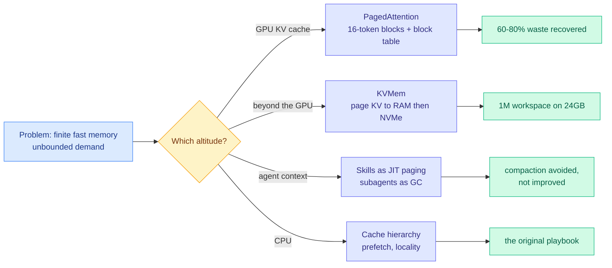

# Media Zone | 2026-09-08

> Your feeds converged on one metaphor today, at three different altitudes of the stack: context is memory, and memory needs an operating system. PagedAttention on the GPU, KVMem on the disk, skills-as-paging in the agent loop. Same idea, three layers.

## Today's signal

- **Dominant story:** the OS metaphor won. Blocks, paging, garbage collection, indexes. Nobody argued for bigger context.
- **Cross-source convergence:** a PagedAttention explainer, the KVMem paper, and Raschka's new KV-caching video. Three altitudes, one mechanism.
- **The afternoon's best number:** YC put a figure on the harness. Same weights, 30% to 95% on ARC-AGI.
- **Pattern:** agent codebase memory is abandoning vector databases for maps and files. Graft, SigMap, tgrep, ripwire, all this week.
- **Counter-signal:** τ^τ-Bench still has Claude Opus 5 at 23.9% against an expert human's 82.2%. Harness is not the whole gap.
- **Discount heavily:** the Navier-Stokes credit dispute ate the afternoon. Loud, unresolved, and no verifiable artifact from OpenAI yet.
- **Quiet area:** still nothing on quantization or GPU hardware. The nearest thing was a CPU-cache textbook chapter.
- **Feed note:** four captures unioned across the day. No new saved posts, LinkedIn returned zero organic posts. X feed plus YouTube only.

---

## Routing, KV cache, compression, GPU

### The operating system is the answer at every altitude

The anchor idea, and the reason four unrelated posts are one argument:

- **The waste number that started all of this.** Reserving one contiguous KV slab per request, sized for the maximum output length, wastes **60 to 80% of KV cache memory** in pre-vLLM serving systems. Cost optimization at its most literal: the same GPU serves several times the traffic once you stop pre-reserving.
- **Why blocks fix it.** KV memory is carved into a fixed pool of numbered physical blocks holding 16 consecutive tokens each. A request gets a block only when the previous one fills, and the attention kernel gathers from a per-request block table. Virtual memory, applied to attention.
- **KVMem is the same trick one level down.** When the workspace outgrows the GPU, page KV state out to host RAM and then NVMe instead of summarizing it to text. A block is prefilled once and never again, versus retrieval which re-prefills on every pull.
- **And Geoff Huntley is running it one level up.** His framing of skills as just-in-time memory paging and subagents as garbage collection is not analogy for its own sake. It predicts the right move: minimize allocations rather than improve the summaries.
- **The gotcha nobody has published.** KVMem's 50 tokens/s is single-session. NVMe paging under concurrent load is the regime that decides whether any of this serves production traffic.

X thread · the day's clearest technical explainer
<h4>PagedAttention, explained properly</h4>

This is the best walkthrough of vLLM's memory manager to cross the feed in months, and it earns its length. It starts from the constraint that makes serving hard: the engine cannot know how many tokens a request will generate, so the naive approach reserves a contiguous slab sized for the maximum allowed length and holds it until the request finishes, even if generation stops after forty tokens. That produces two separate wastes, reserved-but-never-written slots inside each slab and fragmentation gaps between slabs that are individually too small for a new request even when total free memory would fit several. The measured cost was 60 to 80% of KV cache memory. PagedAttention replaces the slab with a pool of fixed 16-token physical blocks, a per-request block table mapping logical positions to wherever they physically landed, and an attention kernel that gathers through the table. Read it if you serve anything, because the reasoning generalizes well past vLLM.

<a href="https://x.com/akshay_pachaar/status/2096959623085592644">Read the thread →</a>

Sebastian Raschka · the from-scratch version
<h4>Build a Reasoning Model From Scratch 2: base models, generation, KV caching</h4>

The second video in Raschka's reasoning-model series lands on exactly the topic the rest of your feed was arguing about, and it approaches it from the opposite direction. Where the PagedAttention thread explains how a production serving engine manages the cache, this builds the cache itself: load a pretrained base model, walk through how token-by-token generation actually works, then add KV caching and watch generation get cheaper. It is the mechanism underneath every optimization in this section, which is worth an hour if your mental model of the KV cache is a diagram rather than code. Repo and playlist are linked from the video description, and later videos revisit sampling in more detail. Pair it with the PagedAttention thread and you have the full path from a single cached tensor to a fragmentation-free block allocator.

<a href="https://youtube.com/watch?v=BJua0yjO5dk">Watch the video →</a>

arXiv · the day's most-shared paper on your feed
<h4>KVMem: virtualizing million-token workspaces on a consumer GPU</h4>

Modern agents accumulate a workspace history that outgrows both the GPU's key-value cache and the model's context window, and every deployed system handles the overflow by summarizing it or re-reading it as text. KVMem refuses that trade and keeps the overflow as paged KV state spilled from GPU memory through host RAM to NVMe, selecting blocks with lightweight indexes built in the model's own attention space rather than a separate embedding model. At query time it assembles a view bounded by the native context window, so the model never sees a million tokens even though a million are addressable. The reported gain is 43.8% to 48.4% task success on DeepSWE against compaction-only management, plus a laptop deployment running a 1M-token workspace at interactive speed on a 24GB RTX 5090. The durable idea is in its last line: addressable workspace size stops being tied to the context window.

<a href="https://arxiv.org/abs/2609.04852">Read the paper →</a>

[@akshay_pachaar](https://x.com/akshay_pachaar/status/2096959623085592644) · [@di_zhang_fdu](https://x.com/di_zhang_fdu) · [Algorithmica HPC: memory latency](https://en.algorithmica.org/hpc/cpu-cache/latency/) · [@shubh6200](https://x.com/shubh6200/status/2097175586951270505)

---

### Codebase context is abandoning the vector database

- **Four independent tools, one architectural retreat.** Graft writes linked markdown into the repo, SigMap builds a deterministic symbol map, Red Hat's `ripwire` uses tree-sitter, Microsoft's `tgrep` builds a trigram index. None of them embed anything. Three years of "chunk it into a vector store" quietly abandoned in a week.
- **Graft has the numbers that make it more than a preference.** Same model on both arms of SWE-bench Verified, 50 instances: correctness **27/50 to 33/50**, with **23% fewer tokens, 25% fewer tool calls, 32% less wall clock, $52.34 down to $42.43**. More correct while spending less is the rare combination.
- **The failure it fixes is specific.** Cold agents patch one file and miss its siblings. On django-11532 the baseline fixed 1 of the 5 files required and broke 18 passing tests. The agent was not confused, it just could not see the rest.
- **tgrep is the same insight without the AI framing.** Trigram index plus a local server, touching only files that can match, giving **7x to 52x over ripgrep** on Chromium-scale repos. Already wired into Copilot CLI. Rust, MIT licensed, respects `.gitignore`.
- **The token angle, stated plainly.** Every one of these replaces repeated discovery with one structured read. InsForge reports the same shape from the backend side: **10.4M tokens and $9.21 down to 3.7M and $2.81**, by returning backend topology in a single 500-token metadata call instead of many.

GitHub · the strongest artifact on your feed today
<h4>Graft: onboard the agent once, not every session</h4>

The premise is a one-line observation that is hard to unsee once you have read it. A human onboards to a codebase once; an agent onboards on every single task, greps a term, opens a file, follows an import, backs out, and rebuilds a picture it already had an hour ago. Graft builds that understanding once and writes it into the repo as linked markdown, one node per system or API or concept, in prose rather than a dump of function names. No embeddings, no vector database, no index to keep warm, just files the agent opens like any other file. The controlled SWE-bench Verified arm is what makes it credible rather than another context-engineering pitch: identical model, only variable is whether Graft is wired in, and it wins on correctness while cutting tokens, tool calls, time and dollars simultaneously. Setup is two commands and it targets Claude Code, Cursor, Codex, Gemini, Copilot and Windsurf.

<a href="https://github.com/trailhq/Graft">Read the repo →</a>

[@thisdudelikesAI](https://x.com/thisdudelikesAI/status/2096894022963073207) · [microsoft/tgrep](https://github.com/microsoft/tgrep) · [@FaztTech](https://x.com/FaztTech/status/2097070678516068842) · [@agenticgirl](https://x.com/agenticgirl) · [InsForge](https://github.com/InsForge/InsForge)

---

### Routing the grunt work, with real bills attached

- **Spotify's framing is the one to steal.** Most of what a coding agent does is not thinking, it is I/O. Reading five files to answer a question about one method. Generating the twenty-first test that matches the twenty before it. Frontier tokens on zero-reasoning work.
- **The mechanism is pure routing.** Keep the frontier model for reasoning, intercept expensive file reads with **PreToolUse hooks**, send them to a cheap model, return only the relevant context. **90% token reduction**, no platform team required.
- **The spend numbers explain the urgency.** A quarter of engineering leaders already burn **$200 to $500 per developer per month** on tokens, some past **$2,000**, with AI coding cost projected to exceed the average developer salary by **2028**.
- **The other half of the bill is output, not input.** Ponytail attacks code bloat instead of context, and the independent walkthrough claims up to **94% less code** generated at equivalent functionality. Less code written is less code to review, test, and pay to regenerate later.
- **Same conclusion from both ends.** What crosses a model boundary should be the minimum artifact, not the full context. Route the reading down, and stop over-generating on the way out.

Video · cross-source with a repo roundup on X
<h4>Ponytail: making a coding agent write less code</h4>

Ponytail is a Claude Code plugin aimed at a cost axis most context-engineering work ignores entirely, which is output volume rather than input tokens. The claim in this benchmarked walkthrough is that it cuts unnecessary generated code sharply, up to 94% in some cases, while keeping functionality and quality intact. Treat the headline figure as a ceiling rather than a typical result, because the benchmark is the reviewer's own harness rather than an independent suite. The reason it is worth attention anyway is that bloat compounds in a way input tokens do not: every extra file generated becomes context the agent re-reads, tests it has to write, and surface area a human eventually reviews. It surfaced twice on your feed today, in this video and in an open-source roundup, which is the kind of cross-source presence worth a look.

<a href="https://youtube.com/watch?v=V5NgF_olsTo">Watch the walkthrough →</a>

[Spotify Engineering](https://engineering.atspotify.com/2026/9/portal-by-spotify-cut-my-claude-code-token-usage-by-90) · [@dani_avila7](https://x.com/dani_avila7) · [ponytail](https://github.com/DietrichGebert/ponytail)

---

## LLMs, agents, safety

### The harness finally has a number on it

- **The claim that reframes the whole debate.** The same model weights that score **30% on ARC-AGI score 95% with a better harness**. YC's Paper Club opens with that and spends the session on why harnesses get dismissed as scaffolding when they are the larger variable.
- **The session covers what practitioners actually want.** A five-minute history of harnesses, the case for maximum expressiveness, self-improving harnesses, and what YC learned building an agent for every employee in the company.
- **The measurement half arrived the same day.** A guest essay argues evals are the center of harness engineering, not an afterthought, because a harness sets tools, memory, permissions and context, and evals are the only signal that changing any of them helped.
- **The practitioner version is blunter and better.** Huntley's principles: encode rules as deterministic gates that fail loudly rather than as prompts, expect real usable context to be **50 to 65%** of the advertised number per NVIDIA's RULER benchmark, and read the model card because skills detune between models.
- **The counter-signal has not moved.** τ^τ-Bench scores the delivered agent rather than the transcript, and Claude Opus 5 under Claude Code reaches **23.9%** against an expert human's **82.2%**. A better harness is a large lever, not the missing one.

Y Combinator · the day's most-watched AI video
<h4>Why the harness matters more than the model</h4>

YC gathered researchers and founders working at the frontier to argue against the reflex that harnesses are just scaffolding, just prompt engineering, not real research. Their opening evidence is the strongest single data point on the question: identical model weights score 30% on ARC-AGI under one harness and 95% under a better one, which puts the harness ahead of most model-generation gaps in effect size. The session then works through how the field arrived here, the case for making a harness as expressive as possible rather than as constrained as possible, self-improving harnesses, and what YC learned deploying an agent to every employee in the company. This is the video version of the theme that has dominated your saved reading for a month, and it is the most citable framing of it so far. Chapters are timestamped in the description if you want the self-improvement segment directly.

<a href="https://youtube.com/watch?v=n9xKblqyQ28">Watch the session →</a>

arXiv · Sierra + Princeton · the counterweight
<h4>τ^τ-Bench: make building the agent the benchmark</h4>

Instead of scoring an agent on tickets, this benchmark hands a developer agent a full client engagement and asks it to deliver a working customer-service agent. It gets the records a business actually keeps, a client holding the requirements, a production API operations must run through, an inherited codebase, and hard limits on serving cost and model choice. The scoring decision is the clever part: the delivered agent is run against held-out simulated users, so the score measures the artifact rather than the transcript, which routes around the harness-sensitivity problem currently undermining agent leaderboards. Across 53 tasks in four domains the strongest configuration reaches 23.9% against an expert-authored ceiling of 82.2%. The failure modes match what human agent developers report: shallow queries into the business records, almost no communication with the client, and too little verification.

<a href="https://academy.dair.ai/papers/bench-an-environment-for-end-to-end-realistic-agent-construction-2609.04611">Read the summary →</a>

[@finlayekins](https://x.com/finlayekins/status/2097110235567865873) · [Vanishing Gradients on harness evals](https://hugobowne.substack.com/p/how-evals-are-central-to-harness) · [@hugobowne](https://x.com/hugobowne) · [@dair_ai](https://x.com/dair_ai)

### Where agent memory should live, and in what representation

- **Four results, productively disagreeing.** Paged KV beats summaries. A fixed schema beats model-written notes. A distilled skill beats a detailed workflow log. All four are arguing about representation, not capacity.
- **The most rigorous one is also the quietest.** LinkedIn researchers swapped the model reading an agent's memory independently of the model that wrote it. A fixed schema moved **0.0004 points**; compressed notes swung by up to **13.28 points** depending on migration direction.
- **Two operational findings worth acting on.** Half-migrating an embedding index captures only **4.96 of the 11.90 points** full re-embedding delivers, so partial migration is near-worthless. And the failure modes need different fixes: **80%** of the notes deficit is information lost at write time, **81%** of the retrieval deficit is retrieval failure.
- **Packaging beats volume.** Identical trajectories given as a detailed workflow log or as a distilled `SKILL.md`, and the skill wins by **6.06 points**. **65.7%** of the wins came from procedural anchoring, only **4.5%** from supplying missing knowledge. Skills are procedures, not memory.
- **The ratchet, and the gate that fixes it.** Across **247,694 instructions in 1,867 repositories**, `CLAUDE.md` and `AGENTS.md` only grow, because rules are cheap to add and nobody recalls what one was for. SkillGLoW supplies the missing admission test: commit a skill only when real execution shows it does not degrade the library. Library **3.6x smaller**, **+17.2 points** on hard tasks.
- **Why that lands this week specifically.** OpenAI's own Astra prompting guidance says the model now takes instructions seriously enough that stale `AGENTS.md` rules actively fight it. A model upgrade is exactly when an unpruned instruction file turns into a liability.

arXiv · LinkedIn · quietly the most rigorous result today
<h4>Does your agent's memory survive a model upgrade?</h4>

Two researchers at LinkedIn built the controlled experiment nobody had run: swap the model that reads an agent's memory store, independently of the model that wrote it, and measure what breaks. They compare verbatim long context, chunked retrieval, model-written notes, and a fixed-schema knowledge graph across 48 synthetic histories with exact scoring. A fixed schema is essentially immune, moving 0.0004 points after a writer swap; compressed notes swing asymmetrically by up to 13.28 points depending on migration direction. Two operational findings follow. Half-migrating an embedding index captures only 4.96 of the 11.90 points that full re-embedding delivers, so partial migration is close to no migration. And the two failure modes need different fixes, since 80% of the notes deficit is information lost at write time while 81% of the retrieval deficit is retrieval failure.

<a href="https://academy.dair.ai/papers/does-your-agents-memory-survive-a-model-upgrade-a-controlled-study-of-memory-por-2609.05339">Read the summary →</a>

arXiv · NUS · the afternoon's best find
<h4>SkillGLoW: store the procedure, regenerate the details</h4>

Agents that self-improve by writing textual skills keep them either as one global document or as a flat pool of per-task entries, and the paper's contribution is naming precisely how each fails on long-horizon work where every task needs a different solution. The document collapses into generic discipline; the pool inflates while its entries stay welded to the instance that wrote them. Their argument is that the missing unit of reuse is neither the instruction nor the principle but the solving procedure shared by a cluster of related tasks, so they aggregate local skills into procedural families, compress them into de-instantiated global priors, and regenerate the instance detail per task rather than storing it. A commit gate admits a prior only when real execution shows it does not degrade the deployed library, which is exactly the admission test the CLAUDE.md ratchet is missing. Across mathematical reasoning, terminal automation, software repair and embodied control on three models, the priors gain 17.2 points on hard tasks with positive gains in all twelve continual-improvement cells, while the library shrinks 3.6x against per-task storage and unseen ALFWorld goes from 73.9% to 83.9%.

<a href="https://arxiv.org/abs/2609.02217">Read the paper →</a>

[@rohanpaul_ai](https://x.com/rohanpaul_ai) · [@sleepy0x13](https://x.com/sleepy0x13) · [@Xudong07452910](https://x.com/Xudong07452910/status/2097165530712928269) · [@dair_ai](https://x.com/dair_ai)

### Long horizons are where agents break, and credit assignment is why

- **The compounding-error measurement.** A Microsoft paper finds agents that look dependable at two to four steps degrade badly by sixteen, across nine models. Every step carries failure probability and errors multiply. Horizon length is a load-bearing benchmark parameter.
- **The qualitative version, in a strategy game.** Frontier models played Civilization VI to completion and lost a third of their games while an enemy visibly marched to victory on screen. They wrote strategic plans and forgot them ten turns later. An allocation failure, not an intelligence one.
- **A cheap trick that beat the alternatives.** For hard long-context tasks, run the model a second time with its own prior reasoning placed first. It won **26 of 27 comparisons**. Long-context models figure out what matters too late to change how they read the earlier prompt, and a second pass fixes ordering rather than capacity.
- **The training-side version of the same problem.** JustRL II observes that GRPO's group-mean baseline, which compares a batch of rollouts against their average, gives a coarse response-level signal once traces run to 128k tokens. Adding a critic for token-level credit assignment took **AIME25 from 61 to 81 on a 2B model**.
- **And it shipped, not just published.** That same recipe powers the RL stage of MiniCPM5-2B, which is now the strongest open-weight model under 4B. Data and checkpoints are open, code lands this week.

[@HBX_hbx](https://x.com/HBX_hbx/status/2097249861355933879) · [JustRL II writeup](https://panhaoxuan.notion.site/justrl-ii-scaling-small-llms-to-128k-reasoning-with-a-critic) · [MiniCPM5-2B](https://huggingface.co/openbmb/MiniCPM5-2B) · [@rohanpaul_ai](https://x.com/rohanpaul_ai)

### Safety, and a credit dispute that swallowed the afternoon

- **The essay everyone reposted.** Jakub Pachocki's "An Alien Mind" argues no lab has alignment and monitoring solved well enough to keep scaling at maximum speed, and his specific worry is that chain-of-thought oversight is losing effectiveness. The reposts added "extreme caution" and a call for international coordination.
- **The best response was about method, not conclusions.** Katja Grace's crossposted argument is that "coordinate not to build dangerous AI" is only ever raised and dismissed, never specified as a negotiation with details. An unspecified problem cannot be judged easy or hard.
- **Then the feed pivoted hard.** An NYU mathematician published a statement alleging OpenAI learned of his unpublished Navier-Stokes progress, produced internal results along closely similar lines, and pushed on authorship. Loud all afternoon across dozens of accounts.
- **How to hold it.** The three published blowup proofs, for the porous-medium, Boussinesq and 3D Euler equations, are real artifacts you can read. The Navier-Stokes claim, the training-data question, and the conduct allegations are all unverified. Read the statement, skip the commentary.
- **One genuinely useful adjacent result.** A physics-informed neural network found a candidate singularity in the 3D Euler equations with no external forcing and no boundaries. Independent of the drama and easier to evaluate.

[An Alien Mind](https://openai.com/index/an-alien-mind/) · [Buckmaster statement](https://cims.nyu.edu/~tristanb/statement.pdf) · [Euler proof](https://cims.nyu.edu/~tristanb/euler.pdf) · [@_NathanCalvin](https://x.com/_NathanCalvin) · [@Thom_Wolf](https://x.com/Thom_Wolf)

---

## Multimodal / vision / audio

- **India shipped a fully pretrained open-weight voice model.** rumik oss 1 speaks 20-plus languages on only **66k hours** of training data and claims wins over top closed models on several benchmarks including emotion realism. Weights are live. The data-efficiency figure is the interesting part.
- **Astra reads mel spectrograms zero-shot**, identifying sounds from the image of a spectrogram with light reasoning. Genuinely surprising, and the most-shared capability clip on your feed today.
- **Astra's computer use runs on the accessibility tree**, not on pixels. An interface built for screen readers turns out to be the cleanest machine-readable view of a GUI. Worth knowing before you build on top of it.

[@lets_dig_deeper](https://x.com/lets_dig_deeper/status/2097231291079069725) · [@maxxrubin_](https://x.com/maxxrubin_) · [@kylejeong](https://x.com/kylejeong/status/2097077446663372966)

---

## Industry and business

- **A useful correction on compute arithmetic.** OpenAI has roughly 4 to 5 GW online and uses about 45% for training and R&D combined, maybe 15% for pure pre-training. The viral version confused GPU count with NVL72 rack count, off by roughly seventy.
- **DeepSeek V4.1 Flash is in internal beta** with a new architecture, native multimodal support, and lower cost at unchanged pricing. Available by setting the model name, base URL unchanged.
- **OpenBMB open-sourced MiniCPM5-2B**, averaging 53.9 across 34 coding, math, long-context, tool-calling and agent benchmarks, best open-weight model under 4B, with data, recipe and RL stack released alongside the weights.
- **OpenAI's own R&D telemetry has a tell.** Agent effort grew this year in five of six phases, and not in "Decide". High-level planning is still a sliver of agent output after months of scaling.
- **Anthropic is building an acquisitions pipeline in AI plus biology**, with a Corporate Development Lead for Life Sciences sourcing deals across drug discovery, clinical development and regulatory. A pipeline role, not a single transaction.
- **Sony AI's "Hakken" predicts undiscovered scientific facts** from the time-evolution of a literature relation graph plus model knowledge. It generated 1.5M hypotheses about aging genes; biologists picked three for wet-lab testing and two confirmed.
- **The privileged-position claim to hold as a hypothesis.** Frontier labs do not train on user data, but routing intermediaries can see it in transit. Unsourced as posted, structurally checkable, not yet checked.

Stanford course · free, materials and videos public
<h4>MS&E 435: Economics of the AI Supercycle</h4>

This is the closest thing on your feed to a structured map of the thing you actually track, which is where the money and the bottlenecks sit at each layer of the AI stack. The seminar unpacks the economics layer by layer, chips, energy, datacenters, inference, models, applications, with one practitioner per week speaking from their own vantage point. The guest list is why it is worth the time rather than a syllabus curiosity: Groq's president who is now inside NVIDIA, OpenAI's head of industrial compute, Crusoe's CEO on datacenter buildout, Baseten's CEO on serving, plus Databricks, Vercel and Anthropic. The value is not any single lecture but the reassembly, taking scattered funding and product news and putting it back on one industrial map where you can see why inference cost dominates, where the compute bottleneck migrates next, and what agents do to SaaS margins. Course plan and public videos are both open.

<a href="http://mse435.stanford.edu">Open the course →</a>

EEBench · hardware agents get a verifier
<h4>Can AI design circuit boards yet?</h4>

OpenAI put a demo of Astra operating KiCad on the front page of its launch post, which raises the question this benchmark exists to answer: are the circuits any good? EEBench's first design decision is the one that matters. Rather than have an agent click around a graphical CAD tool, burning most of its context on coordinates, menus and application state, the circuit lives in declarative code so the agent operates directly on components, connections and electrical constraints. Then the output goes through actual verification, SPICE simulation with real device parameters, tolerances and bill-of-materials cost, so a design that looks electrically sensible but fails under real conditions is scored as a failure. The consequence is that hardware agents now have the same closed loop coding agents do: design, simulate, read the failure, revise, re-verify. V1 is small at 13 tasks and covers no PCB layout, manufacturing or physical bring-up, but a verifier this concrete is also a candidate reward signal for RL later.

<a href="https://eebench.org/blog/can-ai-design-circuit-boards-yet/">Read the writeup →</a>

[@Xudong07452910](https://x.com/Xudong07452910/status/2097127681737236967) · [@not_ellington](https://x.com/not_ellington) · [@jiqizhixin](https://x.com/jiqizhixin/status/2097236947030704524) · [@ai_database](https://x.com/ai_database) · [@exploding_grad](https://x.com/exploding_grad/status/2097045204037755242)

---

## Also crossed your feeds

- **Algorithmica's HPC series on CPU caches** covers latency, access patterns, pointer chasing and prefetching. The original memory-hierarchy playbook that everything in the first section is rediscovering ([Algorithmica](https://en.algorithmica.org/hpc/cpu-cache/latency/)).
- **A ChatGPT retrieval-system leak** in the server-sent-events debug stream: one prompt triggered 5 search rounds, 18 rewritten queries, 50 engine calls, 228 results, 223 fetches, and 16 citations. Pages are rendered to markdown, cut into ~170-word blocks, and the model sees one to three blocks per source ([@metehan777](https://x.com/metehan777/status/2096994466573730188)).
- **NatureBench** has agents beating the published SOTA of Nature-family papers on **25.6%** of tasks with the original method hidden and web search disabled. The author's own caveat is sharper than the result: agents win by translating science into a supervised ML task, which tests execution, not invention ([@qingke_ai](https://x.com/qingke_ai/status/2097095769845342535)).
- **MIT's "How to AI (Almost) Anything" spring 2026 lectures are up**, with new material on multimodal agents, reasoning and self-evolving AI ([course](https://mit-mi.github.io/mmai-course/spring2026/)).
- **Six ways production LLMs encode token positions**, starting from the fact that a plain transformer has no sense of order. The nearest thing to an architecture read on the feed ([@_avichawla](https://x.com/_avichawla)).
- **"Most AI agents are not agents yet, they are queues."** Every step waits for the previous one even with no dependency between them, which is the first thing to question when designing a loop ([@ConsciousRide](https://x.com/ConsciousRide)).
- **Multiplayer AI is shipping before anyone agreed on the architecture**, and each company's definition of multiplayer conveniently matches the layer of the stack it already owns ([@JoshARosen](https://x.com/JoshARosen)).
- **"Stored Is Not Supported"** proposes provenance for persistent agent memory, keeping a claim's origin, evidence, dependencies, validity period and disclosure permissions separate. Trusting stored content released all 19 unsafe candidates in a 24-case suite; typed mediation released none unqualified ([@agenticgirl](https://x.com/agenticgirl)).
- **Tencent's FlowBalance** ties dense self-guidance to the verifier's group advantage: keep the guidance when advantage is positive, reverse it when negative, disable it when the rollout shows no preference. Faster convergence and better AIME24 diversity with no length collapse ([arXiv 2609.03241](https://arxiv.org/abs/2609.03241)).
- **The OWASP MCP Security Taxonomy** is building shared vocabulary for MCP risk and is open for pull requests. Pair it with the writeup on containing the lethal trifecta, which notes untrusted content is unavoidable so mitigation has to work on the other two legs ([OWASP](https://github.com/OWASP/MCP-Taxonomy), [writeup](https://hackernoon.com/how-tailscale-mitigates-the-lethal-trifecta)).
- **Isolate research agents before letting them talk.** Once one commits to a wrong direction the group follows, so delay collaboration until there is evidence to review ([@rohanpaul_ai](https://x.com/rohanpaul_ai)).
- **Schmidhuber pushes back on AGI claims**, arguing there is no AGI without mastery of the real world and no true self-improvement without self-improving *hardware*, as distinct from the meta-learning software that already exists ([@SchmidhuberAI](https://x.com/SchmidhuberAI)).
- **A practitioner counter-signal on Astra**, from someone who burned twice through Pro limits using it exclusively: the problem is not capability but that it lacks taste and is not opinionated, so it does whatever and wastes the budget ([@scaling01](https://x.com/scaling01)).
- **Anthropic published 52 prompts** drawn from its own engineering, product, legal and security teams, 43 with example values filled in. Almost nobody noticed ([@ayush26291](https://x.com/ayush26291)).
- **Skipped entirely:** the Sam Altman "prompts to agents to loops to graphs" talk reposted by five accounts with near-identical hooks, Memgraph and CodeRabbit product pitches, leaked-Meta-documents threads, the AI-engineer-career-trap thread, the brain-simulation consciousness thread, Kurzweil's next bet, "new moats are old moats", and the volcano footage that raw engagement kept trying to promote. No checkable claim between them.
