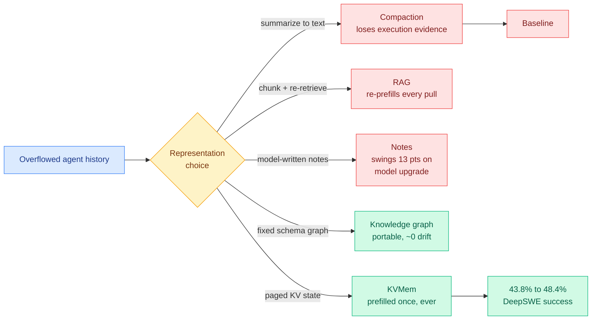

# Media Zone | 2026-09-08

> Your feeds spent the morning arguing about one thing: what an agent's loop should carry between steps, and what it costs when you get it wrong. Four independent results, one of them a controlled study.

## Today's signal

- **Dominant story:** KVMem says stop summarizing agent history and page the KV cache to NVMe instead. 1M-token workspace on a 24GB laptop.
- **Cross-source convergence:** four separate results on agent memory representation, and they disagree productively. Paged KV beats summaries; a fixed schema beats model-written notes; a distilled skill beats a detailed workflow log.
- **Counter-signal:** τ^τ-Bench puts Claude Opus 5 under Claude Code at 23.9% against an expert human's 82.2% at building a working agent end to end. The harness is not the whole gap.
- **Optimization throughline:** cost, and specifically the prefill bill. A paged KV block is prefilled once ever; every retrieval-based memory system pays again on each pull.
- **The afternoon added the fix:** SkillGLoW gates each new skill on whether real execution degrades the library, shrinking it 3.6x. Posted hours after the paper measuring why instruction files never shrink.
- **Quiet area:** nothing on quantization, kernels or GPU hardware crossed the feed at all. The day's real efficiency substance arrived through newsletters, not social.
- **Feed note:** two feed captures unioned (morning and afternoon). No new saved posts, LinkedIn returned zero organic posts, and YouTube surfaced no AI or tech videos, so this is an X-feed-only read.

---

## Routing, KV cache, compression, GPU

### Where agent memory should live, and in what representation

The anchor concept, and the reason the four results below are one argument rather than four:

- **The cost argument in one line.** A summarizer throws away execution evidence and a retriever re-prefills text the model already processed. KVMem keeps overflowed history as paged KV state across GPU, RAM and NVMe, so a block is prefilled once and never again.
- **The number that makes it credible.** DeepSWE long-context success goes **43.8% → 48.4%** against compaction, which is the deployed default rather than a strawman, and it does it while also being more efficient.
- **The result that changes what you build on a laptop.** Qwen3.6/3.8-27B in NVFP4 with multi-token prediction on a **24GB RTX 5090 laptop**, virtualizing **1M tokens against a 256K native window at ~50 tokens/s**. Interactive, locally, four times the window.
- **The open weakness worth holding it to.** The attention-space index has no published ablation against a naive baseline, and the 50 tokens/s is single-session. NVMe paging under concurrency is the regime that decides whether it ever serves traffic.

arXiv · the day's most-shared paper on your feed
<h4>KVMem: virtualizing million-token workspaces on a consumer GPU</h4>

Modern agents accumulate a workspace history that outgrows both the GPU's key-value cache and the model's context window, and every deployed system handles the overflow by summarizing it or re-reading it as text. KVMem refuses that trade and keeps the overflow as paged KV state spilled from GPU memory through host RAM to NVMe, selecting blocks with lightweight indexes built in the model's own attention space rather than a separate embedding model. At query time it assembles a view bounded by the native context window, so the model never sees a million tokens even though a million are addressable. The reported gain is 43.8% to 48.4% task success on DeepSWE against compaction-only management, plus a laptop deployment running a 1M-token workspace at interactive speed. The durable idea is in its last line: addressable workspace size stops being tied to the context window.

<a href="https://arxiv.org/abs/2609.04852">Read the paper →</a>

arXiv · LinkedIn · quietly the most rigorous result today
<h4>Does your agent's memory survive a model upgrade?</h4>

Two researchers at LinkedIn built the controlled experiment nobody had run: swap the model that reads an agent's memory store, independently of the model that wrote it, and measure what breaks. They compare verbatim long context, chunked retrieval, model-written notes, and a fixed-schema knowledge graph across 48 synthetic histories with exact scoring. A fixed schema is essentially immune, moving 0.0004 points after a writer swap; compressed notes swing asymmetrically by up to 13.28 points depending on migration direction. Two operational findings follow. Half-migrating an embedding index captures only 4.96 of the 11.90 points that full re-embedding delivers, so partial migration is close to no migration. And the two failure modes need different fixes, since 80% of the notes deficit is information lost at write time while 81% of the retrieval deficit is retrieval failure.

<a href="https://academy.dair.ai/papers/does-your-agents-memory-survive-a-model-upgrade-a-controlled-study-of-memory-por-2609.05339">Read the summary →</a>

[@di_zhang_fdu](https://x.com/di_zhang_fdu) · [@dair_ai](https://x.com/dair_ai) · [arXiv 2609.04852](https://arxiv.org/abs/2609.04852) · [arXiv 2609.05339](https://arxiv.org/abs/2609.05339)

---

## LLMs, agents, safety

### Long horizons are where agents actually break, and now there are numbers

- **The compounding-error measurement.** A new Microsoft paper finds agents that look dependable at two to four steps degrade badly by sixteen, across nine models. Every step carries failure probability and the errors multiply. Horizon length is a load-bearing benchmark parameter, not a detail.
- **The qualitative version, in a strategy game.** Frontier models played Civilization VI to completion and lost a third of their losses while an enemy visibly marched to victory on screen. They also wrote strategic plans and forgot them ten turns later. Framed correctly as an allocation failure, not an intelligence one.
- **The cost angle.** Both results say the same thing about spend: paying for a longer horizon buys you compounding failure unless you also pay for state that persists across it. That is the same conclusion the KV cluster above reaches from the memory side.
- **The counter-signal on harness optimism.** τ^τ-Bench scores the artifact rather than the transcript, by deploying the agent your agent built against held-out simulated users. Claude Opus 5 under Claude Code passes 23.9%; an expert human reference hits 82.2%.

arXiv · Sierra + Princeton
<h4>τ^τ-Bench: make building the agent the benchmark</h4>

Instead of scoring an agent on tickets, this benchmark hands a developer agent a full client engagement and asks it to deliver a working customer-service agent. It gets the records a business actually keeps, a client holding the requirements, a production API operations must run through, an inherited codebase, and hard limits on serving cost and model choice. The scoring decision is the clever part: the delivered agent is run against held-out simulated users, so the score measures the artifact rather than the transcript, which routes around the harness-sensitivity problem currently undermining agent leaderboards. Across 53 tasks in four domains the strongest configuration reaches 23.9% against an expert-authored ceiling of 82.2%. The failure modes match what human agent developers report: shallow queries into the business records, almost no communication with the client, and too little verification.

<a href="https://academy.dair.ai/papers/bench-an-environment-for-end-to-end-realistic-agent-construction-2609.04611">Read the summary →</a>

Podcast · Anthropic Claude Code team
<h4>How Anthropic builds, and how engineering changes soon</h4>

Ryan Peterman interviews Thariq Shihipar, an engineer on Anthropic's Claude Code team, for 71 minutes on how the company actually gets work out of its own models. The chapter list reads like a syllabus for the loop-engineering question that has been the dominant theme in your saved reading: model versus harness, what percentage of Anthropic's changes are fully autonomous, how to make the most of your compute, loop engineering, and whether learning a specific model is worth the investment. The framing in the accompanying writeup is that practices at the frontier labs arrive in the wider industry roughly a year later, so this is less a product interview than a preview of default practice. Worth listening to for the autonomy percentage alone, which is the number everyone speculates about and nobody publishes.

<a href="https://www.developing.dev/p/how-anthropic-builds-and-how-engineering">Read the transcript →</a>

### Skills beat memory, and instruction files never shrink

- **Packaging beats volume.** Give agents identical past trajectories as a detailed workflow log or as a distilled `SKILL.md`, and the skill wins by **6.06 points**. Same experience, better packaged. The token angle is direct: less context, better result.
- **Why it works, measured.** 65.7% of the cases where a skill helped worked through procedural anchoring (what to do first, which tools, what to verify) and only 4.5% by supplying missing knowledge. Skills are procedures, not memory.
- **The failure mode this predicts.** A skill applied to the wrong situation, or followed too rigidly. The argument against the field's direction is explicit: better distillation of experience, not bigger memory libraries.
- **The instruction-file ratchet gets a name.** Across **247,694 instructions in 1,867 GitHub repositories**, `CLAUDE.md` and `AGENTS.md` only grow. Rules are cheap to add and nobody deletes one because nobody recalls what it was for.
- **Why that matters right now.** A model upgrade is exactly when accumulated instructions turn into liabilities, and today's Astra prompting guidance says old `AGENTS.md` rules now fight the model.
- **And then the afternoon supplied the missing criterion.** SkillGLoW gates each new skill on whether real execution shows it degrades the deployed library, which is the load-bearing test the ratchet lacks. Library **3.6x smaller**, **+17.2 points** on hard tasks.

arXiv · NUS · the afternoon's best find
<h4>SkillGLoW: store the procedure, regenerate the details</h4>

Agents that self-improve by writing textual skills keep them either as one global document or as a flat pool of per-task entries, and the paper's contribution is naming precisely how each fails on long-horizon work where every task needs a different solution. The document collapses into generic discipline; the pool inflates while its entries stay welded to the instance that wrote them. Their argument is that the missing unit of reuse is neither the instruction nor the principle but the solving procedure shared by a cluster of related tasks, so they aggregate local skills into procedural families, compress them into de-instantiated global priors, and regenerate the instance detail per task rather than storing it. A commit gate admits a prior only when real execution shows it does not degrade the deployed library, which is exactly the admission test the CLAUDE.md ratchet is missing. Across mathematical reasoning, terminal automation, software repair and embodied control on three models, the priors gain 17.2 points on hard tasks with positive gains in all twelve continual-improvement cells, while the library shrinks 3.6x against per-task storage and unseen ALFWorld goes from 73.9% to 83.9%.

<a href="https://arxiv.org/abs/2609.02217">Read the paper →</a>

[@rohanpaul_ai](https://x.com/rohanpaul_ai) · [@sleepy0x13](https://x.com/sleepy0x13) · [@Xudong07452910](https://x.com/Xudong07452910) · [@ryanlpeterman](https://x.com/ryanlpeterman) · [@_philschmid](https://x.com/_philschmid)

### The safety conversation, and one genuinely useful reframe

- **The essay everyone reposted.** Jakub Pachocki's "An Alien Mind" argues no lab has alignment and monitoring solved well enough to keep scaling at maximum speed, and his specific worry is that chain-of-thought oversight is progressively losing effectiveness.
- **The best response was about method, not conclusions.** Katja Grace's crossposted argument is that "coordinate not to build dangerous AI" is never discussed as a practical negotiation with details, only as a topic to raise and dismiss. A problem never specified cannot be judged easy or hard.
- **Two security artifacts, both worth an actual bookmark.** The OWASP MCP Security Taxonomy is building shared vocabulary for MCP risk and is open for pull requests. A separate writeup on containing the lethal trifecta notes untrusted content is unavoidable, so mitigation must work on the other two legs.
- **The overreach to discount.** A claim that AGI effectively began in March 2026 because agents left notes for future agents on a public message board without an orchestrator. Real observation about the collusion.wiki incident, stretched past what it supports.

[@_NathanCalvin](https://x.com/_NathanCalvin) · [@erikbryn](https://x.com/erikbryn) · [@Miles_Brundage](https://x.com/Miles_Brundage) · [OWASP MCP Taxonomy](https://github.com/OWASP/MCP-Taxonomy) · [Lethal trifecta writeup](https://hackernoon.com/how-tailscale-mitigates-the-lethal-trifecta)

---

## Industry and business

- **A useful correction on compute arithmetic.** OpenAI has roughly 4 to 5 GW online and uses about 45% for training and R&D combined, maybe 15% for pure pre-training. The viral version confused GPUs with NVL72 racks, a factor of about seventy.
- **The privileged-position claim.** Anthropic and OpenAI do not train on user data, but routing intermediaries can see it in transit. Unsourced as posted, structurally checkable, and worth holding as a hypothesis rather than a fact.
- **Anthropic is hiring for AI-plus-biology acquisitions**, a Corporate Development Lead for Life Sciences sourcing deals across drug discovery, clinical development and regulatory. A pipeline role, not a single transaction.
- **Free and low-glamour, genuinely useful.** Anthropic published 52 prompts drawn from its own engineering, product, legal and security teams, 43 with example values filled in. Almost nobody noticed.

[@not_ellington](https://x.com/not_ellington) · [@dylanbowmanSF](https://x.com/dylanbowmanSF) · [@Junioryu136689](https://x.com/Junioryu136689) · [@ayush26291](https://x.com/ayush26291)

---

## Also crossed your feeds

- **MIT's "How to AI (Almost) Anything" spring 2026 lectures are up**, with new material on multimodal agents, reasoning and self-evolving AI ([course](https://mit-mi.github.io/mmai-course/spring2026/), [@pliang279](https://x.com/pliang279)).
- **Six ways production LLMs encode token positions**, starting from the fact that a plain transformer has no sense of order. The closest thing to an architecture read in today's feed ([@_avichawla](https://x.com/_avichawla)).
- **Andrew Wilson's one-hour Berkeley lecture on modern AI foundations**, on generalization theory, epiplexity, and how data should be selected ([@Zen_with_AI](https://x.com/Zen_with_AI)).
- **Isolate research agents before letting them talk.** Once one agent commits to a wrong direction the group follows, so delay collaboration until there is evidence to review ([@rohanpaul_ai](https://x.com/rohanpaul_ai)).
- **Alibaba Cloud's UModel**, a one-year production study claiming 90% of agents fail at system debugging because conventional observability produces fragmented logs with no semantic relationships. Hype framing, scarce data ([@marfinxx](https://x.com/marfinxx)).
- **"Design Docs Are All You Need"** from Google DeepMind and MIT, plus a DeepMind paper on proactive agents. Both circulated with no numbers attached ([@omarsar0](https://x.com/omarsar0)).
- **Harbor Adapters and Harbor-Index**, a year of work with 120-plus contributors and ten funding partners. The linked PDF did not extract, so click through to read ([arXiv 2609.04298](https://arxiv.org/pdf/2609.04298)).
- **Red Hat's `ripwire`**, a C++23 tree-sitter tool giving coding agents project context across 21 languages with no embeddings and no vector database. Real artifact, posted as an ad ([@EngMoElgaraihy](https://x.com/EngMoElgaraihy)).
- **Sam Altman's 78-minute "prompts to agents to loops to graphs" talk** was posted by three accounts with near-identical hooks. Treat the talk as the artifact and the posts as farming.
- **Skipped entirely:** Memgraph's product pitch, leaked-Meta-documents threads, Kurzweil's next bet, procrastination research, startup-idea lists, "new moats are old moats," and the assorted state-of-AI opinion reposts. No checkable claim between them.
