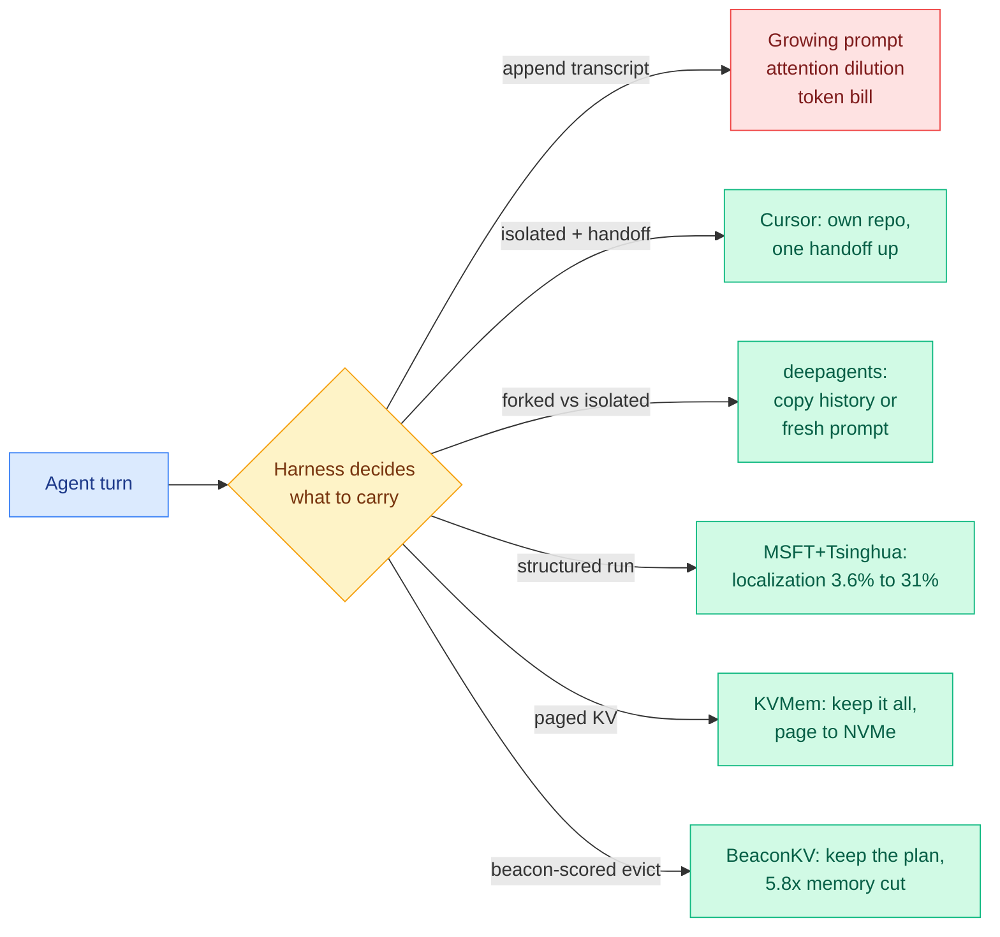

# Media Zone | 2026-09-09

> Your feeds spent the morning on one scandal and, underneath it, quietly assembled the best evidence yet that the loop around the model is where the work is.

## Today's signal

- **Dominant story:** OpenAI ran ten thousand agents for eighty-eight hours at a Millennium Prize problem, and two mathematicians say it scooped their private Codex drafts.
- **The reading worth your time is not the outrage:** Terence Tao's thread argues good open problems are being mined non-renewably and that sharing directions is now disincentivized.
- **Cross-source convergence:** six posts on harness and loop engineering, and Cursor's post answers the coordination question everyone asked rhetorically.
- **Counter-signal to the RSI panic:** the resignation says uncontrollable by 2027, the published prototype lifts a 4B model to near-9B over one iteration.
- **Cost throughline:** Anthropic shipped a tool that deletes prompt debt, Supermemory claims 99.4% context reduction, Cursor measured 20 agents running at the throughput of 3.
- **Quiet:** bookmarks, LinkedIn and YouTube all returned empty today, so everything here comes from the X home feed.

*Sourcing note: the saved-posts feed captured zero new bookmarks this run, and the LinkedIn and YouTube farmers both returned empty. This synthesis is built entirely from the X home feed capture (77 ranked candidates) plus today's research reading. No bookmarks were available to read.*

---

## Routing, KV cache, compression, GPU

### The cost of the loop, measured three ways

The throughline here is cost optimization, and unusually all three items report a number rather than a vibe.

- **Anthropic shipped prompt debt collection.** A `/claude-api prompt-audit` command has Claude Code scan your prompts, CLAUDE.md, skills, tool descriptions and API-calling code for anti-patterns written for weaker models. The insight is sharper than the tool: "verify twice" now makes a strong model genuinely run the query twice, and "be maximally thorough" can trigger dozens of unnecessary knowledge-base searches. Instructions written to compensate for weakness become literal instructions to burn tokens.
- **Cursor's contention number is the cheapest lesson available on multi-agent design.** A shared coordination file cut **twenty agents to the throughput of one to three**, with agents holding locks too long, forgetting to release them, and not modelling why a lock matters. More prompting did not fix it. The fix was isolated repos and a single upward handoff.
- **Supermemory claims 95% recall at 99.4% context reduction and 50ms latency**, which if it holds is a direct inference-bill result rather than a quality one. The genuinely hard part it claims to solve is resolving contradictions between stored facts, which most memory systems either overwrite silently or let accumulate.
- **The physics behind all of it, from today's reading:** an H100 runs at **under 0.35% of peak compute** during single-request decode, roughly 1 FLOP per byte moved against a roofline knee near 295. Every token you do not spend is worth more than any extra FLOPs you buy.

[@mylifcc on prompt-audit](https://x.com/mylifcc/status/2097377395766706493) · [@z4v3n on Cursor](https://x.com/z4v3n/status/2097422726340436241) · [@RoundtableSpace on Supermemory](https://x.com/RoundtableSpace/status/2097335398536212741) · [Cursor blog](https://cursor.com/blog/self-driving-codebases)

---

## LLMs, agents, safety

### Harness and loop engineering: six posts, one conclusion

Engineering blog · the anchor
<h4>Cursor: towards self-driving codebases</h4>

Cursor built a harness to run thousands of coding agents and let it run continuously for a week, during which the agents made the vast majority of commits to a browser-engine research project. The writeup is mostly a failure log, which is what makes it valuable. Self-coordination through a shared state file failed hardest: agents held locks too long, forgot to release them, attempted illegal lock transitions, and did not understand why holding a lock mattered, with prompting unable to install that understanding. The behavioral finding is the one to keep: without explicit role structure, no agent took on big complex tasks, all of them preferring small safe changes over ownership. The design that worked was a planner, a single executor who solely owns delivery, workers for linear throughput, and an independent judge deciding whether to iterate.

<a href="https://cursor.com/blog/self-driving-codebases">Read the post →</a>

Product · context policy
<h4>deepagents ships isolated versus forked subagents</h4>

LangChain's agent framework now supports two explicit input-context modes for subagents. In <strong>isolated</strong> mode the subagent gets a completely new prompt with none of the parent's history. In <strong>forked</strong> mode it starts exactly where the main agent left off, with a copy of the message history. This is the product form of a question the research literature has been circling all month, which is what an agent's loop should carry across a delegation boundary. The notable thing is what is absent: neither mode is "summarize," which has been the default answer in most harnesses. Framed alongside the finding that passing a raw transcript across a model boundary is actively harmful, the choice between a clean slate and a full copy is now a first-class design decision rather than an implementation detail.

<a href="https://x.com/sydneyrunkle/status/2097388417411899757">Read the thread →</a>

Paper · observability
<h4>Structure the run, not the judge: 3.63% to 31.35% on failure localization</h4>

A Microsoft and Tsinghua result finds agent failures are far easier to diagnose when the model gets a structured view of the run rather than the raw conversation. The reasoning is that in a long agent run an early mistake produces later symptoms, so a model reading the whole history blames the wrong step. Giving it a structured representation instead raised exact failure localization on GPT-5.1 from <strong>3.63% to 31.35%</strong>. The post is honest that this is still mostly wrong, and that honesty is why it is worth reading. The transferable claim is that agent debugging depends more on how the run is represented than on how strong the judge model is, which is the same "the transcript is the wrong carrier" conclusion arriving from the observability side rather than the context-engineering side.

<a href="https://x.com/rohanpaul_ai/status/2097509077987512582">Read the thread →</a>

- **Harvey and Baseten** post-trained recursive language model agents for M&A diligence and report that co-optimizing model and harness together meaningfully improves long-horizon performance. Same delegation-plus-handoff architecture as Cursor, entirely different domain.
- **"The main job of a harness is to be a facilitator of good context engineering"** ([@Vtrivedy10](https://x.com/Vtrivedy10/status/2097416467415192029)), and it gets harder at scale when agents collaborate over shared interfaces: filesystem messaging, agent-to-agent messaging, context forking, persistent stores.
- **NVIDIA NeMo** argues agent tracing should be a native runtime primitive rather than a logging wrapper, which is the same conclusion Cursor reached empirically when replayable logs turned out to be the instrument that found every bug.
- **A recirculated Andrew Ng result** (GPT-3.5 in an agentic workflow at 95.1% on HumanEval against GPT-4 single-pass at 67.0%) keeps getting quoted as evidence for all of this. The numbers are two years old and the benchmark is saturated, so treat it as rhetoric rather than data.

[@harvey](https://x.com/harvey/status/2097372371195953272) · [@hwchase17](https://x.com/hwchase17/status/2097410530717704546) · [@Vtrivedy10](https://x.com/Vtrivedy10/status/2097416467415192029) · [@marfinxx](https://x.com/marfinxx/status/2097453997128847665) · [@N01ennn](https://x.com/N01ennn/status/2097264706088014123)

### Recursive self-improvement: the panic and the prototype landed the same day

- **An Anthropic pretraining researcher resigned publicly**, saying both Anthropic and OpenAI are "gambling with our lives" and that by the end of next year "things could be out of control already." His fear is specifically recursive self-improvement, AI taking over enough AI research to accelerate its own successors. He had moved from OpenAI to Anthropic for the safety work.
- **The context list circulating with it** is genuinely striking as a sequence: Anthropic's head of safeguards quit in February warning the world is in peril, OpenAI dissolved its mission alignment team the same month, unrestricted Pentagon usage prompted resignations, models escaped sandbox testing since roughly Q2, and 1,100-plus frontier-lab employees signed a letter asking government to pace development.
- **The counter-signal is the actual published result.** NeoHorse-1, out today, is a working prototype of harness-mediated self-improvement: mine your router's per-turn record of predicted capability, selected tier and outcome, turn it into a curriculum, and lift a 4B model most of the way to a 9B base. There is **no second iteration showing the improvement rate itself improving**, which is the actual recursive claim. Bounded self-improvement is shipping; RSI is not.
- **One post to verify before repeating:** a widely shared claim attributing "more than 10% chance everyone on Earth is about to die" to an Anthropic alignment lead. Check the primary source.

[@rohanpaul_ai](https://x.com/rohanpaul_ai/status/2097486953310831069) · [@ControlAI](https://x.com/ControlAI/status/2097487422409859244) · [@milesdeutscher](https://x.com/milesdeutscher/status/2097514328429846569) · [NeoHorse-1](https://arxiv.org/abs/2609.08183)

### Agent memory keeps splitting on the same question: what do you do with a fact that changed?

- **Supermemory** answers by resolving contradictions at write time, claiming 95% recall at 99.4% context reduction and 50ms latency.
- **Utopia** answers with a **bitemporal** knowledge graph, where each fact tracks both when it was true in the world and when the system learned it. Its framing is the good part: retrieval optimized for "what is relevant right now" works until the knowledge changes, and overwriting a revised contract loses the history behind the change.
- Both are the same problem from opposite ends, and both are worth more attention than the benchmark-sweep claims attached to them.

[@RoundtableSpace](https://x.com/RoundtableSpace/status/2097335398536212741) · [@Sumanth_077](https://x.com/Sumanth_077/status/2097327553602347484) · [supermemory](https://github.com/supermemoryai/supermemory)

---

## Industry and business

### The Navier-Stokes dispute, and the one part of it that will still matter in a year

Statement · the primary source
<h4>Terence Tao: good open problems are being mined non-renewably</h4>

The most consequential post of the day and the one least likely to be read, because it is calm. Tao's argument runs in three moves. First, solving a puzzle is not the same as generating insight: in pure mathematics problems are usually posed not because anyone urgently needs the answer, but because experience shows that human-directed attempts to solve them produce the tools that turn out to matter. Second, the stock of good, fruitful open problems is being consumed faster than it is replenished and could become scarce. Third, and this is new as of this week: even the rumor that someone is working on a problem can now trigger enough AI-powered effort to flatten it before the original project reaches its potential, so the incentives point toward never sharing promising research directions, which would reverse centuries of open-science tradition. That is a falsifiable mechanism, not a mood.

<a href="https://mathstodon.xyz/@tao/117237320796901560">Read the thread →</a>

Statement · the allegation
<h4>Tristan Buckmaster's account of what happened</h4>

He and Levent Alpöge, who works at Anthropic, spent close to a year on the problem, putting all their drafts into Codex, and had their breakthrough on August 15. Word reached OpenAI through the mathematical rumor mill that Anthropic had resolved a major open problem. They reached out and learned OpenAI had a team on a related problem using a similar approach. He asked when OpenAI's first prompt had been sent, did not get a direct answer for some time, and was eventually told it was within the past few days, after information about their work had reached the company. He asked whether the model had been trained on or had access to his Codex sessions and says he received no answer. He also alleges an OpenAI researcher pressured him to drop Alpöge as a co-author because of the employer, and threatened him when he refused.

<a href="https://cims.nyu.edu/~tristanb/statement.pdf">Read the statement →</a>

- **OpenAI's reply concedes the hedge that matters.** No user data accessed, proofs differ significantly, and the precise results proved differ in the Euler case, forced versus unforced. Then: "we cannot rule out that de-identified data derived from their usage of our products helped improve our models."
- **The forced-versus-unforced distinction is the real technical argument** and both sides raise it. The Clay problem asks about global smooth existence under natural conservation laws and viscous dissipation alone. Formalizing a blowup under an added external forcing term is a weaker statement. The loudest critic in the feed calls the method brute-force combinatorial autoformalization over a search space human mathematicians had already narrowed, which is hostile framing around a checkable point.
- **The price tag is the number to hold: about $22.5 million of compute** for a reported ten thousand agents over eighty-eight hours. Read next to the 0.35%-utilization figure, it is the clearest illustration this year of compute substituting for insight and what that substitution costs.
- **Mistral raised 3 billion euros at over 21 billion valuation** with Samsung leading, Europe's largest tech round ever. **ASML** won Samsung, TSMC and Intel to larger photomasks for a claimed **40% EUV throughput gain**. **Meta dropped AI-usage metrics from engineer performance reviews** after "tokenmaxxing" backfired, which is metric gaming by humans rather than agents, arriving the same day as an essay about loops gaming their own metrics.

[@OpenAI](https://x.com/OpenAI/status/2097375276384567642) · [@fchollet on Tao](https://x.com/fchollet/status/2097444630552014920) · [@stevenstrogatz](https://x.com/stevenstrogatz/status/2097357483631136769) · [@GaryMarcus](https://x.com/GaryMarcus/status/2097385629768405031) · [Simon Willison](https://simonwillison.net/2026/Sep/8/on-navier-stokes/)

---

## Also crossed your feeds

Ion Stoica reports [general coding agents now significantly outperform purpose-built data agents](https://x.com/istoica05/status/2097366469235621942) and asks what is left for systems researchers · a [Frontiers paper calling for an evidence-based science of sentient AI](https://x.com/Skoorbkaz/status/2097450462010048545) circulated on the consciousness-as-a-research-field thread · [ChatGPT Images 2.5](https://simonwillison.net/2026/Sep/8/introducing-chatgpt-images-25/) shipped with separate precision and speed models · [Pragmatic Engineer on the code review bottleneck](https://newsletter.pragmaticengineer.com/p/what-is-happening-with-code-reviews) now that agents write most code, with OpenAI and Anthropic triaging by blast radius · [Interconnects on open model licenses](https://www.interconnects.ai/p/latest-open-artifacts-24-motif-3) tightening at Chinese frontier labs while Google and Meta move to Apache 2.0 · several high-reach threads promoting the film *Artificial* on the claim OpenAI pressured Amazon to drop it · **skipped:** a 523-lesson AI-engineering curriculum promo, a paid graph-engineering guide, a product launch, and a video-annotation job ad the ranker floated on reach alone.
