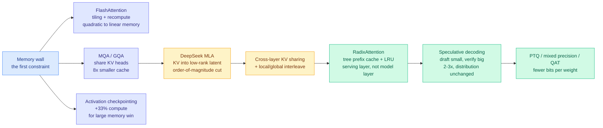
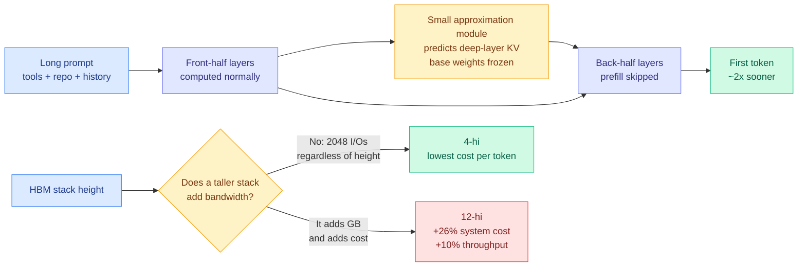

# Media Zone | 2026-09-14

> The US day's conversation went geopolitical, but the two things worth keeping were both quiet: a one-page map of the entire inference-cost stack, and a ByteDance paper that ran the self-improvement experiment everyone is arguing about and watched it fail 21 times out of 24.

## Today's signal

- **Dominant story**: an MLSys interview-prep note compresses the whole 2023-2026 inference cost curve into one readable map. Best learning artifact of the day.
- **Pattern**: the harness thesis hit four independent sources in one day. A LangChain guide, an AWS conference talk, an Anthropic talk, a Stanford and MIT paper.
- **Counter-signal**: ByteDance Seed's Aspire ran agent self-evolution without benchmarks. Only 3 of 24 runs beat the starting model.
- **New since this morning**: China's Foreign Ministry answered the slowdown call directly. The pacing argument is now a state-level event, not a lab argument.
- **Quiet area**: zero bookmarks captured, LinkedIn returned authors with no bodies, Reddit still empty for the month.
- **Optimization throughline**: everything real today is subtraction or reallocation. Cut KV heads, skip prefill layers, move tokens from execution to advice.

> **Note on sourcing.** The bookmark feed captured **zero newly-saved posts** across both runs today, and the farmer logged that explicitly rather than failing silently, so this is a genuine quiet day rather than an auth failure. The X signal below is the union of four home-feed captures spanning the full US day, morning through US afternoon, deduped by post. LinkedIn returned four posts with author and topic but no body text. The general public scrape of curated retweets and AI-handle timelines returned nothing, as it has since 08-30.

---

## Routing, KV cache, compression, GPU

### The whole inference-cost stack, mapped in one page

This is the item to actually read today. Gauri Gupta wrote up her MLSys interview prep for several frontier labs, and the result is not a study guide. It is a map of why serving a model got cheaper every year since 2023, organized by which layer of the stack each trick attacks.

Notes · the day's best read
<h4>KV cache, speculative decoding, ZeRO and DualPipe in one map</h4>

The structure is what makes it good. Memory first, because the memory wall is the first constraint on both training and serving: FlashAttention avoids ever writing the full N by N attention matrix to GPU memory by tiling and recomputing, GQA shares one key-value head across a group of query heads, activation checkpointing trades about 33% extra compute for a large memory saving. Then inference, which is the densest part: the line from GQA to DeepSeek's MLA, which compresses the KV cache into a low-rank latent space and cuts it by an order of magnitude, to cross-layer sharing and Gemini-style local and global attention interleaving, is presented as the actual technical spine of falling inference cost. The serving-layer section is the one that separates people who know models from people who have deployed them: rolling hash plus tree-structured prefix cache plus LRU eviction, which is RadixAttention, so a shared system prompt is computed once across many requests. Training closes it with a clean parallelism decision tree, from ZeRO's three sharding stages through the pipeline-bubble formula to DualPipe in DeepSeek-V3 and Llama 3. The writeup even flags its own error, noting bf16 has fp32's dynamic range and strictly does not need loss scaling, which is an fp16 problem.

<a href="https://x.com/shao__meng/status/2099281275370754227">Read the thread →</a>

- **Cost angle, and it is the whole point**: every entry on the map is a different answer to "which resource am I actually short of." The map tells you which lever moves memory, which moves bandwidth, and which only moves FLOPs.
- **Confirmed twice on the same feed**: Avi Chawla posted a standalone GQA explainer hours later with the concrete number, which is that Llama 3 70B shares one KV head across eight query heads, so that part of the cache is 8x smaller and reads 8x less data during decoding ([@_avichawla](https://x.com/_avichawla/status/2099422666998636733)). His caveat matters more than the number: this is an architecture property, not a serving flag, so you cannot switch it on for an arbitrary multi-head model.
- **A third KV explainer circulated in Chinese** the same day, chaining attention to prefill to KV cache to prefix caching before touching MLA ([@frxiaobei](https://x.com/frxiaobei/status/2099139549184381416)). Three independent KV-cache primers on one feed in one day is a real signal about where practitioner attention sits.
- **The resource list is worth more than the notes**: Stanford CS336, CS229S, Lilian Weng's inference-optimization post, the JAX scaling book, and mlsysbook.ai.

[@shao__meng](https://x.com/shao__meng/status/2099281275370754227) · [@_avichawla on GQA](https://x.com/_avichawla/status/2099422666998636733) · [@frxiaobei](https://x.com/frxiaobei/status/2099139549184381416) · [CS336](https://cs336.stanford.edu/) · [How to Scale Your Model](https://jax-ml.github.io/scaling-book/) · [wiki: KV cache](../../inference-efficiency/kv-cache.md)

### The prefill bill, attacked from the checkpoint and from the silicon

Still the strongest pair of artifacts today, and they sit at opposite ends of the same stack.

X thread · unverified but mechanically interesting
<h4>Halving Qwen3-8B prefill with a bolt-on KV predictor</h4>

Prefill is the phase where a model pushes your entire prompt through every layer before it can emit one token, and on a local machine it is usually the worst part of the experience. DeepSeek V4.1 Flash solved it architecturally by splitting the model into a 20-layer causal encoder and a 20-layer decoder, feeding the decoder shared KV states projected from the encoder's final state instead of running the long prompt through all the back layers. The assumption was that you buy this with a pretraining run. This experiment leaves Qwen3-8B's weights completely untouched and trains one small external module to predict what the back-half layers' KV states would have been, then skips computing them. Reported result is prefill time down close to half with consistent output, which if it replicates means a model's prefill cost is not fixed at training time and every deployed open-weight checkpoint has an unclaimed upgrade sitting in it. Evidence is one unverified post with no paper and no repo, so read the mechanism and discount the number.

<a href="https://x.com/wei_wang/status/2098962121715302542">Read the thread →</a>

Essay · hardware
<h4>Short HBM stacks win, and the arithmetic is not close</h4>

SemiAnalysis makes an argument that inverts how this wiki has modeled the memory shortage all quarter. An HBM4 memory cube exposes 2,048 data I/Os no matter how many dies are stacked in it, and a single die can drive at most 512 of them, so four dies is the shortest stack that harvests full bandwidth. Price, meanwhile, tracks gigabytes. Since inference decode is bandwidth-bound and pretraining's share of total compute has collapsed, the workload mix has tilted decisively toward the axis where short stacks win. Their model on a Rubin Ultra NVL576 serving Kimi K3: 12-hi costs 26.3% more system-wide and buys 10% more throughput, 8-hi costs 12.1% more and buys 8%. Both premiums exceed both gains. Nvidia already cut Rubin Ultra to 192GB per GPU from 288GB, and frontier-lab hardware teams are reportedly pushing for 4-hi in their own ASIC programs.

<a href="https://newsletter.semianalysis.com/p/long-live-the-short-king-why-4-hi">Read the essay →</a>

- **The number buried in the SemiAnalysis piece is the one worth stealing**: a production run on Kimi K3 with the KV budget cut 36-44% tracked full-memory throughput invisibly until concurrency hit about 70, then lost roughly 30% at once when cache occupancy saturated, with ten times the reads to DRAM. That is the first published failure curve for KV offload, and it is a cliff, not a slope.
- **The two connect**: Rubin Ultra's capacity cut was forced partly by HBM wafer scarcity, and the architectures cutting KV demand arrived in the same fortnight. The shortage is being attacked from both ends by parties who are not coordinating.

[@wei_wang](https://x.com/wei_wang/status/2098962121715302542) · [SemiAnalysis](https://newsletter.semianalysis.com/p/long-live-the-short-king-why-4-hi) · [wiki: KV retrofit](../../inference-efficiency/2026-09-14-external-kv-approximation-retrofit-prefill.md) · [wiki: 4-hi HBM](../../hardware/2026-09-14-semianalysis-4hi-hbm-bandwidth-over-capacity.md)

### Kernels you prove instead of test

GPU MODE · Ben Koska
<h4>Proving Kernels Correct Instead of Testing Them</h4>

GPU kernel correctness is normally established by running the kernel against a reference implementation on a pile of shapes and hoping the shapes you skipped do not matter. That is a sampling argument, and it fails exactly where fused attention and quantized matmul kernels tend to fail, which is at tile boundaries, ragged tails, and the numerically awkward corners. This talk makes the case for formal verification of the kernel instead: state what the kernel is supposed to compute, then discharge a proof that the implementation matches, so correctness holds over all inputs rather than the sampled ones. The relevance to this wiki is direct. Every efficiency technique on the map above is a kernel-level rewrite of something previously correct by construction, and the cost of a silently wrong fused kernel scales with how many production tokens flow through it. GPU MODE posted the talk twice today under two titles, so it is one artifact, not two.

<a href="https://youtube.com/watch?v=7XsSd9mqay4">Watch the talk →</a>

### Recursion inside the model, not inside the lab

- **Recurrent Looped Transformer (RLT)**, from Princeton's Yifan Zhang, adds a running internal state that is handed from each token's computation to the next ([@0xLogicrw](https://x.com/0xLogicrw/status/2099416322971144664)). A normal transformer reads the past only through attention and the KV cache. RLT also passes the previous token's finished internal state forward directly, which the paper calls infinite time depth because the chain has no fixed length bound.
- **The distinction from Ouro and Astra matters**: those loop the same token through the same layers several times, like rechecking one answer before submitting. RLT passes a baton between different tokens instead. Per-token layer count is unchanged, which is the part with a cost implication, since depth grows with sequence length rather than with FLOPs per token.
- **Cross-source, which is why it is here at all**: DAIR.AI's Elvis Saravia flagged the same report independently, framing it as looped transformers extending the loop across tokens ([@omarsar0](https://x.com/omarsar0/status/2099331328353218880)). Two unrelated curators on one technical report in a day is the conviction signal, not the view count.
- **Same author, same day, different artifact**: Zhang also released **FlashREINFORCE**, a critic-free, single-rollout, asynchronous RL recipe for agentic language models, with code up ([@yifanzhang_](https://x.com/yifanzhang_/status/2099356057558790476), [repo](https://github.com/yifanzhang-pro/FlashREINFORCE)). Dropping the critic network and the multi-rollout requirement is a straight memory and compute cut on the most expensive part of an agentic RL loop.

[@0xLogicrw on RLT](https://x.com/0xLogicrw/status/2099416322971144664) · [@omarsar0](https://x.com/omarsar0/status/2099331328353218880) · [FlashREINFORCE repo](https://github.com/yifanzhang-pro/FlashREINFORCE)

### Where the compute actually is

- **Ulanqab, Inner Mongolia, is the largest datacenter buildout on earth and almost nobody has written about it** ([@RnaudBertrand](https://x.com/RnaudBertrand/status/2099319829589295197)). A prefecture of 1.5 million people consumes close to 1% of China's electricity, growing double digits annually, which works out to roughly 105,000 kWh per household, about ten times the US average.
- **The scale number is the one to check**: xAI's Colossus in Memphis is roughly 5,000 to 6,000 racks at 200,000 chips. Ulanqab is reportedly building over 5 million racks, sourced to Science and Technology Daily, the Chinese Ministry of Science and Technology's own newspaper. That is a thousand-fold ratio, which is large enough that it deserves independent verification rather than a retweet.
- **Why this belongs in a routing and efficiency feed**: siting is an optimization problem. Cold grassland plateau, cheap stranded power, and half a trillion yuan of committed investment is the physical layer under every inference-cost argument above.

[@RnaudBertrand](https://x.com/RnaudBertrand/status/2099319829589295197) · [full essay](https://arnaudbertrand.substack.com/p/the-most-important-ai-story-in-the)

---

## LLMs, agents, safety

### The harness thesis, now confirmed from four independent directions

This was a one-source story this morning. By the US afternoon it had four, including two conference talks and an academic paper, which moves it from "a good blog post" to a pattern.

Guide · the one to actually read
<h4>Middleware as the harness primitive</h4>

Sydney Runkle's LangChain guide gives the cleanest definition anyone has published: <code>agent = model + harness</code>, where the harness is whatever gets the right context to the model at every step. Not the loop, the tools and the memory as three concerns, but the single job all three serve. Its architectural claim is that the extension point should be middleware, small composable units hooking the loop before and after each model call, before and after each tool call, at startup and teardown. Two assertions carry real weight and both are about where logic must not live: policy enforcement must be deterministic middleware because a prompt cannot guarantee it fires, and model swapping by task complexity is runtime control rather than an instruction, which quietly makes routing a harness hook. It also inverts the usual case for giving agents shell and filesystem access, framing it as token efficiency rather than capability, since one command often replaces several thousand tokens of reasoning and retrieval.

<a href="https://langchain.com/blog/how-to-build-a-custom-agent-harness">Read the guide →</a>

AI Engineer · Mike Chambers, AWS
<h4>Harness Engineering: building the production cage for domain agents</h4>

Chambers opens with the dictionary: a harness is a set of straps and fastenings used to control an animal, and swapping animal for model leaves the definition intact. His working definition is subtraction, which is the cleanest one on the feed today. Take an agent, remove the model, and everything left over is the harness. He then splits the field in two, separating agents we use, meaning coding assistants and general chat products, from agents we build for a specific domain, and argues the engineering problems are not the same problem. The framing lands differently coming from a cloud provider's developer advocate than from a framework vendor, because the constraint he is designing around is what you are willing to let a powerful model touch inside someone else's production account. Same architectural conclusion as the LangChain guide, arrived at from the deployment side rather than the framework side.

<a href="https://youtube.com/watch?v=gxVZ_1tuuq4">Watch the talk →</a>

AI Engineer · Anthropic
<h4>Tokens Should Have Jobs</h4>

This is the token-optimization result of the day and it has a real number attached. Given the same fixed budget of roughly 600,000 tokens, an agent that did nothing but execute scored 76 on a bench of financial analysis tasks. An agent that spent part of that identical budget asking a second agent for advice scored 89. Same tokens, different jobs, thirteen points. Katelyn Lesse leads platform engineering at Anthropic and Angela Jiang leads platform product, and the assumption they are attacking is the one buried in most agent cost models, which is that tokens spent on anything other than doing the task are overhead. The result says the allocation of the budget across roles matters more than the size of the budget, which is a harness design decision rather than a model capability. Read alongside the LangChain guide's argument that shell access is token efficiency, and the shape of the emerging discipline is visible: the harness is where the token budget gets spent, so the harness is where it gets optimized.

<a href="https://youtube.com/watch?v=PXj0p_mW9nI">Watch the talk →</a>

- **The academic version landed the same day**: a Stanford and MIT paper on model harnesses arguing performance depends not just on the model but on the surrounding scaffold ([@rohanpaul_ai](https://x.com/rohanpaul_ai/status/2099245642573123987)). Four sources, two of them not selling a framework, is the threshold where this stops being a marketing frame.
- **The market version, and still the most-shared of the set** ([@gregisenberg](https://x.com/gregisenberg/status/2099202686377742576)). A harness runs the model in a loop, gives it hands, manages memory so hour three knows about hour one, and enforces what it may touch. Influence angle: a wrapper sells software, a harness sells finished work, and the harness is model-independent because "a wrapper was one model doing everything and a harness is a router."
- **The same argument in Chinese, from the YC-watching side** ([@AYi_AInotes](https://x.com/AYi_AInotes/status/2099107617264066755)): every YC software team is building domain-specific harnesses because wrapper products die on each new model release, and pricing power lives in the layer that encapsulates the industry's dirtiest business logic.
- **One concrete mechanism, unverified**: an engineer described **TRACK**, a routing graph that records outcomes per edge rather than per node, strengthens edges whose work ended well, atrophies edges that keep failing, and rewires continuously ([@0xCodio](https://x.com/0xCodio/status/2099459215903412439)). Reported result is 12 edges dying and 5 new favorites emerging in a month. It is bandit-style routing applied to agent handoffs, which is the routing-as-policy pattern this wiki has tracked since Conductor and CaRE, now appearing as production plumbing.
- **The gap all of them still miss**: none of the harness optimizations research has actually found maps onto a named middleware slot, and byte-stable prefix construction, the cheapest one, cannot have a slot at all because it is a property of how the prompt is built rather than of anything the loop does.

[LangChain guide](https://langchain.com/blog/how-to-build-a-custom-agent-harness) · [@gregisenberg](https://x.com/gregisenberg/status/2099202686377742576) · [@AYi_AInotes](https://x.com/AYi_AInotes/status/2099107617264066755) · [@0xCodio](https://x.com/0xCodio/status/2099459215903412439) · [wiki](../../agentic-systems/2026-09-14-langchain-custom-agent-harness-middleware.md)

### Recursive self-improvement: the roadmap, the hype, and the experiment that says no

The single most useful development on the feed today is that the RSI argument acquired a control group.

Paper · the falsification
<h4>Aspire: take away the benchmark and the reward, and self-evolution mostly fails</h4>

ByteDance Seed and collaborators built the experiment the recursive-self-improvement discourse has been missing. Instead of giving an agent a benchmark to climb, they give it only a vague goal, something like "improve mathematical reasoning" or "get better at scientific research," and let it decide entirely for itself what to learn, what data to find, how to train, and how to verify that it improved. The real evaluation is hidden: 520 held-out questions across six capability classes, which the agent never sees. The results are blunt. Across 24 weight-level self-evolution runs, only 3 ended up better than the model they started from. Averaged by model and goal, 1 of 12 groups genuinely improved. Harness self-modification went the same way: the agent could produce working new versions of its own scaffold, but the best automatic result still lost to the hand-designed Qwen-Agent. The most telling failure is the diagnostic one. Given science, logic, and even writing goals, the agent kept selecting mathematical training data, because it confused what it knows how to optimize with what it actually needed. The bottleneck has moved from "can it train itself" to "can it tell what it is missing."

<a href="https://arxiv.org/abs/2608.31111">Read the paper →</a>

- **Set that against yesterday's roadmap paper**, "The Last AI Built by Humans" from Shanghai Jiao Tong, Tsinghua, ByteDance, Xiaohongshu, ModelBest and Shanghai AI Lab, which surveys 491 works and defines five autonomy levels, ending at a system that can modify the search method, the evaluator, and the research strategy that generate its own next improvement ([arxiv](https://arxiv.org/abs/2609.11873)). Its own conclusion is that genuine recursion is not here. Aspire supplies the measurement that backs it.
- **The feed mostly read the roadmap backwards.** Five of six posts framed it as proof recursion has arrived, three explicitly as China's answer to the Silicon Valley slowdown call, a timing coincidence the paper never claims. Page and author counts drift between 33, 68 and 75 across posts. The accurate reads were [@rohanpaul_ai](https://x.com/rohanpaul_ai/status/2099246355785056273), [@0xLogicrw](https://x.com/0xLogicrw/status/2099337734687166790) and [@Gorden_Sun](https://x.com/Gorden_Sun/status/2099447356580348144), all of whom kept the "not yet" intact.
- **The sharpest one-line version came in Turkish** ([@TanayAyitmaz](https://x.com/TanayAyitmaz/status/2099179557203128808)): a trillion-parameter model updating its own weights, middleware and harness is currently a myth, and what is actually happening is sophisticated hyperparameter search and data refinement run by small agents, where even a simple LoRA run dies on a wrong batch size.
- **Why the hype matters as a media signal**: DeepMind's chief strategy officer said out loud that the entire infrastructure spend is priced on an expected self-improvement curve going hyperexponential ([@rohanpaul_ai](https://x.com/rohanpaul_ai/status/2099141924120883216)). Aspire's 3-of-24 is therefore not an academic footnote. It is a number pointed directly at the investment thesis.

[Aspire paper](https://arxiv.org/abs/2608.31111) · [RSI roadmap](https://arxiv.org/abs/2609.11873) · [@Xudong07452910](https://x.com/Xudong07452910/status/2099342299679670549) · [@TanayAyitmaz](https://x.com/TanayAyitmaz/status/2099179557203128808) · [wiki](../../agentic-systems/2026-09-13-last-ai-built-by-humans-rsi.md)

### Pacing the frontier stopped being a lab argument and became a state one

This is the part of the feed that changed most since this morning, and it is now mostly noise with a few load-bearing items.

- **China answered officially.** Foreign Ministry spokesperson Guo Jiakun, asked directly about Dario Amodei's proposal: "Fearmongering, confrontation and vicious competition will only disrupt the process of global AI governance which serves no one's interest" ([@choblin29](https://x.com/choblin29/status/2099440859146264754)). The earlier and sharper line came from state-run Global Times, which called the proposal a Cold War playbook aimed at curbing Chinese AI development and excluding China from governance ([@choblin29](https://x.com/choblin29/status/2099361927910793549)).
- **The most revealing Chinese document is the one nobody framed as a response.** China's Ministry of State Security published six AI risks: generated text and images, "intelligent troll armies," American models industrialising hacking, staff pasting sensitive files into foreign chatbots, unnamed export controls, algorithmic black boxes, and AI deciding wars. No extinction, no doom, no slowdown, and innovation named as the first driving force with safety as the floor ([@lukOlejnik](https://x.com/lukOlejnik/status/2099395912216805430)).
- **Altman restated the position in the abstract** and it got 1.4 million views: two failure modes to avoid, losing control of the future to AI, and concentration of power such that one person, company, or country imposes its worldview ([@sama](https://x.com/sama/status/2099352016988614852)). Note the second one is a direct answer to the critique that the pacing call is regulatory capture.
- **Microsoft moved unilaterally instead of joining the argument.** Mustafa Suleyman published a Code of Conduct for governing MAI models as they approach the frontier, on the premise that AI must remain subordinate and in service of people ([@mustafasuleyman](https://x.com/mustafasuleyman/status/2099488602418028917), [document](https://microsoft.ai/news/mai-code-of-conduct/)).
- **Europe published a plan rather than an opinion.** A Transformative AI Strategy for Europe, convened by Monika Schnitzer and Daniel Privitera with a senior council including Bengio, Vestager, Aghion, Madry and Acemoglu ([@privitera_](https://x.com/privitera_/status/2099398013613375793), [site](https://transformative-ai.eu)). Its premise is blunter than the safety debate: even if AI goes well, the wealth and strategic leverage concentrate outside Europe by default. Concrete objectives include a member-state supply-chain security alliance and securing Europe's share of global compute.
- **The best operational take came from security, not policy** ([@George_Kurtz](https://x.com/George_Kurtz/status/2099263605900255575)). The frontier will move at whatever speed it moves, so the work is to make it move securely. Four claims worth keeping: the unit of threat is now an autonomous campaign rather than a hacker, sophistication is dead as an attribution signal because AI gives every actor elite execution, runtime is the control point because governance documents do not stop an agent in motion, and every agent is a privileged identity needing short-lived credentials and a kill switch.
- **Counter-pressure, flagged as debate not signal**: David Sacks told the labs to go ahead and pace themselves since they are the frontier, LeCun reopened the GPT-2 staged-release episode to argue the 2019 caution was wrong in hindsight ([@sleepy0x13](https://x.com/sleepy0x13/status/2099425544198660278)), and a large cluster of accounts ran the regulatory-capture reading at high volume with essentially zero verification.

[@sama](https://x.com/sama/status/2099352016988614852) · [@choblin29](https://x.com/choblin29/status/2099440859146264754) · [@lukOlejnik](https://x.com/lukOlejnik/status/2099395912216805430) · [@George_Kurtz](https://x.com/George_Kurtz/status/2099263605900255575) · [EU strategy](https://transformative-ai.eu) · [MAI code of conduct](https://microsoft.ai/news/mai-code-of-conduct/) · [wiki](../../ai-industry/2026-09-13-pacing-the-frontier.md)

### What is actually missing from these systems

MLST · Edward Hughes
<h4>What building an AI scientist actually requires beyond intelligence</h4>

Edward Hughes, chief scientist and co-founder of Inherent and formerly of DeepMind, argues that creativity is not optimisation, and that the capability missing from current systems is choosing which questions are worth asking. His AlphaGo example is the sharpest compression of the argument: Move 37 was innovative, but creativity needs a second step, which is recognising the value of what you just did, and in 1997 that recognition came from the human commentators rather than the system. He also makes an argument about open weights that cuts against the usual framing, which is that being able to photocopy a model's weights removes a constraint that historically helped produce human creativity, and that the emerging job is constraint engineering. Read this next to Aspire above and the two converge on the same diagnosis from different directions: the hard part is not the optimisation, it is knowing what to optimise.

<a href="https://youtube.com/watch?v=P4bYjTJvD28">Watch the conversation →</a>

- **Terence Tao on the same gap from the mathematical side** ([@rohanpaul_ai](https://x.com/rohanpaul_ai/status/2099252419318481177)). The mathematics behind LLMs is genuinely simple, mostly linear algebra and a little calculus. What we cannot do is predict which tasks a model will succeed at. His diagnosis is that pure noise is well understood, perfectly structured data is well understood, and natural text sits in the middle regime where the mathematics does not yet exist.
- **The Royal Society's world-models special issue** carries the same theme into biology and philosophy, with Sakana's David Ha co-authoring the lead article ([@SakanaAILabs](https://x.com/SakanaAILabs/status/2098924630002000056), [issue](https://royalsocietypublishing.org/rsta/issue/384/2320)). Threads worth noting: doing is not understanding and more compute may not close that gap, and models trained to predict their own internal states develop more organised, less redundant representations.
- **Sakana also shipped something concrete**: PC-ALM, a local-learning alternative to backpropagation that trains 1000-layer networks without end-to-end backward passes ([via @hardmaru](https://x.com/hardmaru/status/2099470099136606525)). Cost angle if it holds up: backprop's activation-memory bill is the reason for activation checkpointing in the map at the top of this page, and local learning attacks that bill at the root rather than trading compute for it.
- **Raschka shipped part 3 of his reasoning-model-from-scratch series**, on implementing the verifier used for both math evaluation and RL with verifiable rewards ([video](https://youtube.com/watch?v=JQJ_8_jSAoY)). The verifier is the component Aspire found agents cannot yet build for themselves, which makes the timing accidental and useful.

---

## Industry and business

- **The most consequential industry item today is a law firm buying GPUs.** Latham & Watkins, the second-largest US firm at $8.3B in 2025 revenue, is standing up its own Nvidia racks and will spend potentially hundreds of millions on in-house legal AI built by fine-tuning Nvidia's open-weight Nemotron 3, with about 100 of its 900 technical staff on the project ([@bearlyai](https://x.com/bearlyai/status/2099185686868005265), [@ayushtweetshere](https://x.com/ayushtweetshere/status/2099380823229403308)). Two reasons given by the CIO, and both are the reasons this wiki has been tracking: client information too sensitive for any cloud vendor, and wanting flexibility against frontier-lab consumption costs. This is Nadella's model-independent learning loop actually happening, in the industry with the most to lose from data egress.
- **Anthropic signed a six-year, $13.7B compute deal with Rum Group**, on top of at least 14.8 GW committed and as much as $517B over the next decade ([The Information](https://www.theinformation.com/articles/anthropic-strikes-13-7-billion-compute-deal-trump-linked-rum-group)).
- **Nvidia's customer concentration keeps tightening**: three customers were 44% of first-half sales, up from two at 36% last year, against zero above the 10% threshold as recently as fiscal 2023 ([The Information](https://www.theinformation.com/articles/nvidias-growing-dependence-big-customers)).
- **Alibaba open-sourced OpenSandbox**, an isolated execution environment giving each agent its own sandbox for code, browsing and full desktop control, running locally on Docker and scaling on Kubernetes, past 15k stars ([@0xJokker](https://x.com/0xJokker/status/2099197468307030202)). This is the "enforce what it may touch" leg of the harness definition shipping as infrastructure.
- **CrowdStrike and NVIDIA introduced SafeMind**, described as an agentic, continuously improving model and harness protection system for defenders ([@George_Kurtz](https://x.com/George_Kurtz/status/2099263605900255575)). Note that a security vendor is now using "harness" as a product-surface noun.
- **OpenAI put GPT-Live-1 in the API**, voice agents that listen while they speak, explicitly advertised as working with the models and harness you choose ([video](https://youtube.com/watch?v=OSaP6bJoU44)).
- **DeepSeek attributed a significant share of recent post-training gains to automated environment construction**, which is the RL-environment pipeline rather than the model ([@adithya_s_k](https://x.com/adithya_s_k/status/2099455714481918276)). Aspire says agents cannot yet design those environments for themselves, so DeepSeek automating the construction is the human-designed version of the same bottleneck.
- **Google published 145 pages on researchers using Gemini for science** ([@RaziaAliani](https://x.com/RaziaAliani/status/2099055944072044613)). The detail worth keeping: the model was used as an adversarial reviewer and caught a serious flaw in a cryptography proof that had already passed human review. Humans still chose the problems and checked every proof.
- **Oracle began sending same-day termination emails**, circulated widely enough to become the day's most-shared piece of labour-market evidence ([@Amanda_Goodall](https://x.com/Amanda_Goodall/status/2099502242458186228)).
- **Unconfirmed and flagged as such**: a claim that AMD acquired Taalas, which burns model weights directly into silicon at speeds on the order of 10,000 tokens per second from a PCIe card ([@HealthRanger](https://x.com/HealthRanger/status/2099198449967300718)). Nothing in today's semiconductor sources corroborates it. If true it is the logical endpoint of the bandwidth-over-capacity argument above.
- **LinkedIn returned four posts with author and topic but no body text**, so the only readable signal was Ethan Mollick emphasizing GPT-6 and one post on fractals in latent space. Not enough to cluster.

[wiki: Anthropic compute deal](../../ai-industry/2026-09-14-anthropic-rum-group-compute-deal.md) · [wiki: Nadella learning loop](../../ai-industry/2026-09-14-nadella-learning-loop-moat.md)

---

## Video

The subscription feed was genuinely good today, which is unusual. The AI Engineer conference dropped three talks and GPU MODE posted a kernel-verification lecture. The two strongest are carded above in their topic clusters.

  

- **Loophole, adversarial agents to stress test your morality** ([Brendan Rappazzo, Morgan Stanley](https://youtube.com/watch?v=hOWU0KPUp1k)). You write a moral code, and agents attack it looking for actions that satisfy the letter and violate the intent. His example: an insurer does not train its risk model on your DNA, it trains on artifacts derived from your DNA. Open source, and framed as his own work rather than his employer's.
- **Building ambitious software** ([Jonathan Kelley, Dioxus Labs](https://youtube.com/watch?v=H7vFrcNWXzs)). The Dioxus team maxed out their coding-agent subscriptions and produced tens of thousands of lines of Rust covering features they had wanted for years. Almost none cleared the merge bar, and it is still sitting in draft. He calls the failure mode becoming a slop cannon, which is the most useful phrase from the day's video feed.
- **Sebastian Raschka, reasoning model from scratch part 3** ([video](https://youtube.com/watch?v=JQJ_8_jSAoY)), implementing the verifier reused for both math evaluation and RLVR training.
- **CMU 11-785 Lecture 6 and Lab 3** are up, and OpenAI posted three short product clips. The "AI news" leak channels covered Opus 5.2 rumours and DeepMind RSI leaks, which is the hype version of the Aspire story above. Skip them.

---

## Also crossed your feeds

MIT CSAIL shared a beginner-friendly LLM course covering foundations through deployment ([@MIT_CSAIL](https://x.com/MIT_CSAIL/status/2099166276195156233)) · seven free GitHub repos that replace paid AI tools, led by Ollama and Dify ([@ayush26291](https://x.com/ayush26291/status/2099345366005244288)) · Claude Code now has 118 commands and most people use about ten, with /branch, /rewind and /diff the ones usually skipped ([@claudeskills101](https://x.com/claudeskills101/status/2099151132824367463)) · a preregistered ETH Zürich study finding computer-science knowledge predicts vibe-coding success twice as strongly as writing skill, with heavy self-reported LLM users performing worse ([@IntuitMachine](https://x.com/IntuitMachine/status/2099268716521226718)) · MIT's 40-page education report and its term "cognitive surrender" ([@VaibhavSisinty](https://x.com/VaibhavSisinty/status/2099208244514476061)) · an open-versus-frontier comparison with per-task costs and routing advice, carrying a warning that essentially all open-model scores are vendor self-reported ([@hackernoon](https://x.com/hackernoon/status/2097742136972361741)) · a list of independent AI-safety evaluation organisations worth knowing ([@m_ccuri](https://x.com/m_ccuri/status/2099155392437621218)) · GeoSR, on why adding 3D geometry tokens does not mean a vision-language model actually uses them ([@shumpeiMaxwell](https://x.com/shumpeiMaxwell/status/2099301498509492359)) · a DeepMind safety researcher leaving for METR over risk concerns ([@0x0SojalSec](https://x.com/0x0SojalSec/status/2099297206788592017)) · DAIR.AI's papers of the week, led by Google's Procedural Graphs and Microsoft's teacher-free 4B coding agent FrogNano ([@omarsar0](https://x.com/omarsar0/status/2099176998748737909)) · Cornell researchers on a power side-channel attack against the Qi wireless-charging standard that leaks browsing activity without a microphone or network ([@thesupermanmx](https://x.com/thesupermanmx/status/2099491266887299155)) · Google Cloud shipped BM25 indexing on AlloyDB for hybrid search ([video](https://youtube.com/watch?v=-JxQb-kjFHk)) · an unverifiable "leaked OpenAI Slack" post that resolves into a product pitch ([@starmexxx](https://x.com/starmexxx/status/2099225699450069297), skip) · NVIDIA Inception promo, McKinsey research link, a repackaged Hinton lecture, several dozen near-identical reposts of the China slowdown response, a Kia ad and a token-gateway promo (all skip).
