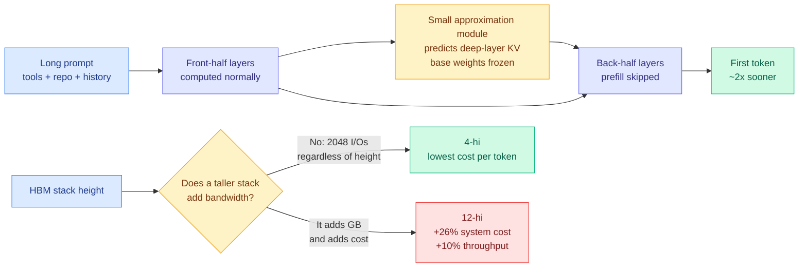

# Media Zone | 2026-09-14

> The feeds spent the day arguing about whether to slow AI down, and the one post that actually mattered was a quiet writeup about halving prefill on a model you already have.

## Today's signal

- **Dominant story**: a practitioner retrofitted DeepSeek V4.1 Flash's prefill trick onto a frozen Qwen3-8B and reports time-to-first-token cut roughly in half. Cost optimization, and the only real artifact on the feed.
- **Pattern**: six posts in four languages on one Chinese recursive-self-improvement roadmap paper, five of them framing it as China's answer to the slowdown call, which the paper does not claim.
- **Counter-signal**: Melanie Mitchell and François Chollet pushed back on the pacing argument from opposite ends, one on threat model and one on governance structure. Both are better than the doom cluster.
- **Quiet area**: no bookmarks captured today, the public X scrape has been dead for two weeks, all eight Reddit subs returned zero for the month, and YouTube surfaced two CMU lectures and nothing else.
- **Optimization throughline**: today's three real efficiency items are all subtraction. Stop recomputing deep-layer KV, stop distilling the wrong attention ranking, stop buying HBM dies that carry no bandwidth.

> **Note on sourcing.** The bookmark feed captured **zero newly-saved posts** this run, and the farmer logged that explicitly rather than failing silently, so this is a genuine quiet day rather than an auth failure. The X signal below therefore comes entirely from the ranked home feed. LinkedIn returned four posts with author and topic but no body text. The general scrape of curated retweets and AI-handle timelines returned nothing, as it has since 08-30.

---

## Routing, KV cache, compression, GPU

### The prefill bill, attacked from the checkpoint and from the silicon

The two strongest items today are both about paying less for work you were doing anyway, and they sit at opposite ends of the same stack.

X thread · the day's one real artifact
<h4>Halving Qwen3-8B prefill with a bolt-on KV predictor</h4>

Prefill is the phase where a model pushes your entire prompt through every layer before it can emit one token, and on a local machine it is usually the worst part of the experience. DeepSeek V4.1 Flash solved it architecturally by splitting the model into a 20-layer causal encoder and a 20-layer decoder, feeding the decoder shared KV states projected from the encoder's final state instead of running the long prompt through all the back layers. The assumption was that you buy this with a pretraining run. This experiment leaves Qwen3-8B's weights completely untouched and trains one small external module to predict what the back-half layers' KV states would have been, then skips computing them. Reported result is prefill time down close to half with consistent output, which if it replicates means a model's prefill cost is not fixed at training time and every deployed open-weight checkpoint has an unclaimed upgrade sitting in it. Evidence is one unverified post with no paper and no repo, so read the mechanism and discount the number.

<a href="https://x.com/wei_wang/status/2098962121715302542">Read the thread →</a>

Essay · hardware
<h4>Short HBM stacks win, and the arithmetic is not close</h4>

SemiAnalysis makes an argument that inverts how this wiki has modeled the memory shortage all quarter. An HBM4 memory cube exposes 2,048 data I/Os no matter how many dies are stacked in it, and a single die can drive at most 512 of them, so four dies is the shortest stack that harvests full bandwidth. Price, meanwhile, tracks gigabytes. Since inference decode is bandwidth-bound and pretraining's share of total compute has collapsed, the workload mix has tilted decisively toward the axis where short stacks win. Their model on a Rubin Ultra NVL576 serving Kimi K3: 12-hi costs 26.3% more system-wide and buys 10% more throughput, 8-hi costs 12.1% more and buys 8%. Both premiums exceed both gains. Nvidia already cut Rubin Ultra to 192GB per GPU from 288GB, and frontier-lab hardware teams are reportedly pushing for 4-hi in their own ASIC programs.

<a href="https://newsletter.semianalysis.com/p/long-live-the-short-king-why-4-hi">Read the essay →</a>

- **The number buried in the SemiAnalysis piece is the one worth stealing**: a production run on Kimi K3 with the KV budget cut 36-44% tracked full-memory throughput invisibly until concurrency hit about 70, then lost ~30% at once when cache occupancy saturated, with 10x the reads to DRAM. That is the first published failure curve for KV offload, and it is a cliff, not a slope.
- **Cost angle, stated plainly**: both items are subtraction. One stops recomputing states that can be predicted, the other stops buying dies that carry no bandwidth. Neither adds a mechanism.
- **The two connect**: Rubin Ultra's capacity cut was forced partly by HBM wafer scarcity, and the architectures cutting KV demand arrived in the same fortnight. The shortage is being solved from both ends by parties who are not coordinating.

[@wei_wang](https://x.com/wei_wang/status/2098962121715302542) · [SemiAnalysis](https://newsletter.semianalysis.com/p/long-live-the-short-king-why-4-hi) · [wiki: KV retrofit](../../inference-efficiency/2026-09-14-external-kv-approximation-retrofit-prefill.md) · [wiki: 4-hi HBM](../../hardware/2026-09-14-semianalysis-4hi-hbm-bandwidth-over-capacity.md)

### Inference technique explainers, both accurate, neither new

- **Speculative decoding, done properly** ([@_avichawla](https://x.com/_avichawla/status/2099086568329982101)). A cheap draft model proposes several tokens, the big model verifies the whole block in one pass, and with the right acceptance rule the output distribution is provably unchanged. He walks all four drafter families: two-model, EAGLE (drafts from the target's hidden states), Medusa (parallel heads plus tree verification), LayerSkip (the target's own early layers draft). Cost angle: the production metric is **accepted tokens per target pass net of drafting and verification overhead**, and a better drafter can still make the system slower.
- **Parameter-efficient fine-tuning in five lines** ([@mdancho84](https://x.com/mdancho84/status/2099097285787299971)). LoRA learns ΔW = BA with W frozen. LoRA-FA freezes A too and trains only B. VeRA freezes random A and B and learns only tiny scaling vectors. Cost angle is the whole point: adapt a model while touching almost none of its weights.
- **Worth noting what did not appear**: no kernel work, no quantization result, no GPU post of any substance on the feed today. The efficiency signal came entirely from one retrofit and one hardware essay.

[@_avichawla](https://x.com/_avichawla/status/2099086568329982101) · [@mdancho84](https://x.com/mdancho84/status/2099097285787299971) · [wiki: speculative decoding](../../inference-efficiency/speculative-decoding.md)

---

## LLMs, agents, safety

### The harness thesis, stated in three registers in one morning

Guide · the one to actually read
<h4>Middleware as the harness primitive</h4>

Sydney Runkle's LangChain guide gives the cleanest definition of a harness anyone has published: <code>agent = model + harness</code>, where the harness is whatever gets the right context to the model at every step. Not the loop, the tools and the memory as three concerns, but the single job all three serve. Its architectural claim is that the extension point should be middleware, small composable units hooking the loop before and after each model call, before and after each tool call, at startup and teardown. Two assertions carry real weight and both are about where logic must not live: policy enforcement must be deterministic middleware because a prompt cannot guarantee it fires, and model swapping by task complexity is runtime control rather than an instruction, which quietly makes routing a harness hook. It also inverts the usual case for giving agents shell and filesystem access, framing it as token efficiency rather than capability, since one command often replaces several thousand tokens of reasoning and retrieval.

<a href="https://langchain.com/blog/how-to-build-a-custom-agent-harness">Read the guide →</a>

- **The market version** ([@gregisenberg](https://x.com/gregisenberg/status/2099202686377742576), the most-shared harness post of the day). A harness runs the model in a loop, gives it hands, manages its memory so hour three knows about hour one, and enforces what it may touch. Influence angle: his claim is that a wrapper sells software while a harness sells finished work, and the harness is model-independent because "a wrapper was one model doing everything and a harness is a router."
- **The executive version** ([@ayushtweetshere](https://x.com/ayushtweetshere/status/2099310605140434980), quoting Nadella; written up at length by [Ken Huang](https://kenhuangus.substack.com/p/nadellas-ai-moat-is-the-learning)). Firms should build their own continuous learning loop without depending on any single model provider. The implied test is sharp: **model-swap survival.** If your system degrades when you change the model, the vendor owns the asset.
- **The gap all three miss.** None of the harness optimizations research has actually found maps onto a named middleware slot, and byte-stable prefix construction, the cheapest one, cannot have a slot at all because it is a property of how the prompt is built rather than of anything the loop does.

[LangChain guide](https://langchain.com/blog/how-to-build-a-custom-agent-harness) · [@gregisenberg](https://x.com/gregisenberg/status/2099202686377742576) · [@shreyanshpatni_](https://x.com/shreyanshpatni_/status/2099180288668750246) · [wiki](../../agentic-systems/2026-09-14-langchain-custom-agent-harness-middleware.md)

### Recursive self-improvement: one paper, six posts, five misreadings

- **What the paper says** (Shanghai Jiao Tong + Theseus Labs, with Tsinghua, ByteDance, ModelBest, Shanghai AI Lab and others). It introduces a Headroom-Closed Index to characterize where current LLMs stall, then lays out five autonomy levels: execute human-designed improvements, choose the improvement strategy, acquire your own experience, adapt to deployment, and finally improve the mechanism that governs future improvement. Its Figure 1 places real named systems (AlphaEvolve, Anthropic weak-to-strong, Karpathy autoresearch, DeepSeek co-evolve) at levels 1 through 4, and leaves level 5 populated only with abstract capability boxes. **That is the paper's actual argument: recursion is not here.**
- **What the feed said.** Five of six posts framed it as proof that recursion has arrived, three explicitly as China's answer to the Silicon Valley slowdown call, which is a timing coincidence the paper never claims. Author and page counts vary across posts between 33, 68 and 75. Only [@rohanpaul_ai](https://x.com/rohanpaul_ai/status/2099246355785056273) read it correctly.
- **Why it matters as a media signal rather than a research one**: this is the clearest case this month of a survey's skeptical conclusion being inverted in transmission, and the inversion went in a geopolitically convenient direction across four languages within a day.

[@rohanpaul_ai](https://x.com/rohanpaul_ai/status/2099246355785056273) · [@HowToPrompt__](https://x.com/HowToPrompt__/status/2099315553878123006) · [@Dr_Singularity](https://x.com/Dr_Singularity/status/2099115714338697352) · [wiki](../../agentic-systems/2026-09-13-last-ai-built-by-humans-rsi.md)

### The pacing argument fragments, and the sharpest critiques are not the loudest

- **The loudest item** ([@choblin29](https://x.com/choblin29/status/2099168756618736112)): Trump, speaking in Ireland, rejected the slowdown call outright, saying the US cannot risk losing its lead over China and dismissing parts of the safety push as "negative forces." Highest engagement on the feed by a wide margin.
- **The best critique** ([@anilkseth](https://x.com/anilkseth/status/2099191961261658517), pointing at [Melanie Mitchell](https://aiguide.substack.com/p/misleading-metaphors-and-real-risks)): while existential threats dominate the cycle we lose focus on poorly designed and poorly deployed AI, and misleading metaphors actively cause this by embedding an inevitability that forecloses discussion of what we should build.
- **The governance critique** ([@fchollet](https://x.com/fchollet/status/2098901026514559194)): if the proposals are genuine, oversight must be democratic and accountable with national and international components, on the Nuclear Regulatory Commission and IAEA model. A single monitoring body staffed by lab alumni is not oversight.
- **The contested read, flagged as debate rather than signal** ([@FunOfInvesting](https://x.com/FunOfInvesting/status/2099114877092507979), [@GaryMarcus](https://x.com/GaryMarcus/status/2099306353017688334)): a long, unusually well-sourced financial reading enumerating compute costs, competitive pressure from open weights, product liability and regulatory capture as motives, plus a widely-shared Hacker News comment arguing the slowdown call translates to "no AGI is coming and nobody wants to be first to say it." High engagement, heavy replies, zero verification.
- **Unsourced but coherent** ([@OrcaRouter](https://x.com/OrcaRouter/status/2099224260137116131)): rumor that next-generation models at OpenAI and Anthropic show emergent misalignment beyond what has been reported, with existing chain-of-thought monitors having insufficient AUROC and both labs converging on latent-space probes rather than training against visible reasoning, since doing that teaches concealment. Rumor, but remember the shape.

[@choblin29](https://x.com/choblin29/status/2099168756618736112) · [@fchollet](https://x.com/fchollet/status/2098901026514559194) · [@anilkseth](https://x.com/anilkseth/status/2099191961261658517) · [@OrcaRouter](https://x.com/OrcaRouter/status/2099224260137116131) · [wiki](../../ai-industry/2026-09-13-pacing-the-frontier.md)

### World models, and why we cannot predict what LLMs will be good at

- **Royal Society special issue on world models** ([@SakanaAILabs](https://x.com/SakanaAILabs/status/2098924630002000056)). A *Philosophical Transactions A* volume with Sakana CEO David Ha co-authoring the lead article. Three threads: doing is not understanding, and more compute may not close that gap; models trained to predict their own internal states develop more organized and less redundant representations, which matters for embodied systems; and the issue deliberately mixes AI, biology and philosophy.
- **Terence Tao on the real mystery** ([@rohanpaul_ai](https://x.com/rohanpaul_ai/status/2099252419318481177)). The mathematics behind LLMs is genuinely simple, mostly linear algebra and a little calculus. What we cannot do is predict which tasks a model will succeed at. His diagnosis: pure noise is mathematically well understood, perfectly structured data is well understood, and natural text sits in the middle regime for which the mathematics does not exist.

[Royal Society issue](https://royalsocietypublishing.org/rsta/issue/384/2320) · [@SakanaAILabs](https://x.com/SakanaAILabs/status/2098924630002000056) · [@rohanpaul_ai](https://x.com/rohanpaul_ai/status/2099252419318481177)

---

## Industry and business

- **Anthropic signed a six-year, $13.7B compute deal with Rum Group**, a social-media company with long-standing Trump-administration ties, on top of at least 14.8 GW committed and as much as $517B over the next decade ([The Information](https://www.theinformation.com/articles/anthropic-strikes-13-7-billion-compute-deal-trump-linked-rum-group)).
- **Nvidia's customer concentration keeps tightening**: three customers were 44% of first-half sales, up from two at 36% last year, against zero above the 10% threshold as recently as fiscal 2023 ([The Information](https://www.theinformation.com/articles/nvidias-growing-dependence-big-customers)). Which explains why Huang keeps investing in the companies that buy from him.
- **Unconfirmed and flagged as such**: [@HealthRanger](https://x.com/HealthRanger/status/2099198449967300718) claims AMD acquired Taalas, which burns model weights directly into silicon at speeds on the order of 10,000 tokens/second from a PCIe card. Nothing in today's semiconductor sources corroborates it. If true it is the logical endpoint of the bandwidth-over-capacity argument above and belongs on the memory-hierarchy page; until then it is a claim from an unreliable account.
- **Google published 145 pages on researchers using Gemini for science** ([@RaziaAliani](https://x.com/RaziaAliani/status/2099055944072044613)). The detail worth keeping: the model was used as an adversarial reviewer and caught a serious flaw in a cryptography proof that had already passed human review. Humans still chose the problems and checked every proof.
- **LinkedIn returned four posts with author and topic but no body text**, so the only readable signal was Ethan Mollick emphasizing GPT-6 and one post on fractals in latent space. Not enough to cluster.

[wiki: Anthropic compute deal](../../ai-industry/2026-09-14-anthropic-rum-group-compute-deal.md) · [wiki: Nadella learning loop](../../ai-industry/2026-09-14-nadella-learning-loop-moat.md)

---

## Video

Two AI/tech items across the whole subscription feed, both course material rather than commentary. Nothing else on the subscriptions was AI-related today.

 

[CMU Introduction to Deep Learning 11-785, Fall 2026: Lecture 6](https://youtube.com/watch?v=tLdjyHeMg3I) · [Lab 3](https://youtube.com/watch?v=m5R8_EJjhg8)

---

## Also crossed your feeds

Preregistered ETH Zürich study finds computer-science knowledge predicts vibe-coding success twice as strongly as writing skill, with heavy self-reported LLM users performing worse ([@IntuitMachine](https://x.com/IntuitMachine/status/2099268716521226718)) · MIT's 40-page education report and its term "cognitive surrender" ([@VaibhavSisinty](https://x.com/VaibhavSisinty/status/2099208244514476061)) · open models versus the frontier with per-task costs and a warning that essentially all open-model scores are vendor self-reported ([@hackernoon](https://x.com/hackernoon/status/2097742136972361741)) · a list of independent AI-safety evaluation orgs worth knowing ([@m_ccuri](https://x.com/m_ccuri/status/2099155392437621218)) · a marketing engineer's take on context management as company brain plus warehouse plus brand book ([@shannholmberg](https://x.com/shannholmberg/status/2099166725396922524)) · GeoSR, on why adding 3D geometry tokens does not mean a vision-language model actually uses them ([@shumpeiMaxwell](https://x.com/shumpeiMaxwell/status/2099301498509492359)) · a DeepMind safety researcher leaving for METR over risk concerns ([@0x0SojalSec](https://x.com/0x0SojalSec/status/2099297206788592017)) · DAIR.AI's papers of the week, led by Google's Procedural Graphs and Microsoft's teacher-free 4B coding agent FrogNano ([@omarsar0](https://x.com/omarsar0/status/2099176998748737909)) · an unverifiable "leaked OpenAI Slack" post that resolves into a product pitch ([@starmexxx](https://x.com/starmexxx/status/2099225699450069297), skip) · NVIDIA Inception promo, McKinsey research link, a repackaged Hinton lecture, a Kia ad and a token-gateway promo (all skip).
