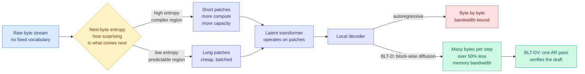

# Media Zone | 2026-09-15

> The feeds spent the day on one essay by a kernel engineer who thinks agents will replace him in a year, while the saved reading quietly landed on three papers this wiki already holds.

## Today's signal

- **Dominant story**: a DeepSeek kernel engineer's essay on AI writing better CUDA than he can, shared across six accounts in two languages.
- **Pattern**: the saved posts and the research feed converged. All three bookmarks point at papers already ingested here, one of them twenty days ago.
- **Cross-source**: the kernel essay, today's Dream-RSI paper and the wiki's five-paper agentic-kernel cluster are one story told from three positions.
- **Counter-signal**: a contested thread argues the AI safety nonprofit layer is funded by an investor whose Anthropic stake appreciates when Anthropic grows.
- **Optimization throughline**: cost, but asked as allocation. Where to put the token, the tensor, the search, and now the engineer.
- **Quiet area**: no video signal at all today, and the practitioner subreddits returned nothing for the fifteenth straight day.

---

## Routing, KV cache, compression, GPU

### The saved reading: byte-level models, and why the tokenizer became a cost decision

This is the week's Tier 1 save and it is worth the full walkthrough, because the underlying idea is one of the cleaner compression arguments in the field and the post selling it gets the framing badly wrong.

**What it is.** Meta's **Byte Latent Transformer (BLT)** removes the tokenizer. Every language model you use today first chops text into tokens from a fixed vocabulary, a step that has known costs: sensitivity to input noise, poor handling of multilingual text, weak character-level understanding, and fragility on structured input like code and numbers. A byte-level model sidesteps all of it by operating on raw bytes, the lowest-level representation text has.

**The problem that killed byte-level models before.** Bytes are far more numerous than tokens, so a naive byte model pays enormously more compute per unit of text. That is why the field standardized on tokenization in the first place and stayed there for seven years.

**The core idea, and it is genuinely elegant.** BLT encodes bytes into **dynamically sized patches**, and the patches rather than the bytes are the unit of computation. The segmentation is driven by **entropy of the next byte**: where the text is hard to predict, patches are short, so more compute and model capacity land there. Where the text is predictable, patches are long and cheap. **You are no longer allocating compute by a vocabulary someone froze in advance, you are allocating it by how much information is actually present.** That is the same shape as every good efficiency result on this wiki: the resource was not scarce, it was misallocated.

**What the evidence says.** The paper ran the first FLOP-controlled scaling study of byte-level models, up to 8B parameters and 4T training bytes, and BLT matches tokenizer-based performance at scale while improving inference efficiency and robustness. Follow-on work extends it: **BLT-D** replaces autoregressive byte-by-byte decoding in the local decoder with block-wise discrete diffusion, generating multiple bytes per step and cutting inference memory bandwidth by over 50%. **BLT-DV** uses diffusion to draft a block of bytes, then verifies the draft with a single autoregressive forward pass, which is speculative decoding with a diffusion drafter.

**Why it is for you.** The cost angle is memory bandwidth, not FLOPs, which is the constraint that binds during decode. And the patching idea generalizes past bytes: entropy-conditioned compute allocation is the same principle behind sparse attention selectors and KV eviction policies, just applied at the input layer instead of the cache.

**The caveat, and it is not small.** The post presents this as "Meta just published a paper that might end the current LLM era." BLT is not new, and the framing is the same compression damage this account has produced before. The pointer is high-value. Treat the urgency as zero, and note that every frontier model shipped since BLT still tokenizes, which is itself the most informative fact about how much it changed.

Saved post · compression anchor
<h4>Byte Latent Transformer: allocate compute by entropy, not by vocabulary</h4>

Meta's BLT drops the tokenizer and works directly on raw bytes, grouping them into patches whose size is set by how unpredictable the next byte is. Complex regions get short patches and more attention; predictable regions get long ones and cost less. A FLOP-controlled scaling study to 8B parameters and 4T bytes shows it matches tokenizer-based models while improving inference efficiency and robustness to noisy, multilingual and structured input. Follow-on variants swap byte-by-byte decoding for block-wise diffusion, cutting inference memory bandwidth by more than half. Read it for the allocation principle rather than the revolution the post promises, since the paper predates every frontier model that still tokenizes.

<a href="https://x.com/HowToPrompt__/status/2099537110332231770">Read the saved post →</a>

### The kernel engineer, and the research cluster that predicted him

- **The day's most-shared item, and it is primary source for once.** Shengyu Liu, whose code is in DeepSeek V4.1's main attention kernel, says AI now reads CUDA, PTX and SASS directly and profiles stalls per instruction. His estimate: six to twelve months until agent-written kernels beat his own. Cost angle: the scarce input in kernel optimization is expert attention, and he is describing its price collapsing.
- **Two screenshots carry the original text**, which no English summary translated fully. The section headed "What about me then?" concludes he will not be unemployed but will have to change professions, keeping the rice bowl and losing the work he loved. The closing section contains a censorship aside about what he can safely write, inside an essay about who owns intelligence.
- **The wiki's [gpu-kernels page](../../hardware/gpu-kernels.md) had five results and no witness with the opposite incentive.** AccelOpt took Trainium utilization from 49% to 61% at 26x lower cost than Claude Sonnet 4, JAXBench showed curated docs moved Gemini 3 Flash from 5.8% to 37.3% correctness, and MaxKernel matched expert hand-tuned baselines on 50 TPU tasks. All three were built by people trying to prove agents can write kernels. Liu is the first source with a reason to say otherwise.
- **Today's [Dream-RSI](../../agentic-systems/2026-09-15-dream-rsi-replay-simulator-exploration.md) lands one level above all of them**, evaluating on GPU kernel engineering but optimizing the search strategy rather than the kernel, by replaying a finished discovery tree as a free simulator. Influence angle: whoever owns the search policy owns every kernel found downstream.
- **The open falsifier is specific.** Every accelerator result in the wiki is on TPU or Trainium, the platforms where hand-tuned expertise is scarcest. Nobody has shown an agent beating a named expert CUDA baseline at the SASS level on NVIDIA.

X thread · the day's most-shared
<h4>"Leave my talent behind in yesterday and become an agent's driver"</h4>

A DeepSeek kernel engineer describes, in detail, why he is personally accelerating the technology that makes his own craft obsolete. A year ago AI helped him read docs and find bugs; now it reasons at the assembly level where the last stretch of kernel performance lives, and he gives it six to twelve months to surpass him. The second half turns distributional: he argues the endpoint is either frontier AI as cheap infrastructure or a handful of companies owning it, and calls the lock-out a dead loop where you need the strongest model to earn the resources that buy access to the strongest model. He stays at DeepSeek to open-source enough to pull the world away from the second outcome. It is the sharpest statement of AI inequality published from inside a frontier lab this year, and the person writing it works on the kernel.

<a href="https://x.com/MaxForAI/status/2099663479095652441">Read the thread →</a>

[@AndrewCurran_](https://x.com/AndrewCurran_/status/2099620264019705956) · [@hsu_steve](https://x.com/hsu_steve/status/2099604249193713983) · [@CrazyShyyt](https://x.com/CrazyShyyt/status/2099694549891469539) · [@ns123abc](https://x.com/ns123abc/status/2099651304033222958) · [wiki: the essay](../../hardware/2026-09-15-deepseek-kernel-engineer-rsi-essay.md)

### Attention, architecture and the cost of a token

- **Tencent's SAS got its social wave a day after this wiki ingested it.** Sparse attention picks a subset of past context to attend to; every trainable version trained its selector to imitate dense attention, and SAS argues that target is wrong under a fixed budget and injects continuous scores into the softmax so the real loss trains it. Gains are biggest where the budget is tightest. ([SAS summary](../../inference-efficiency/2026-09-14-sas-attention-sparsification-end-to-end.md))
- **A Princeton proposal, RLT, feeds each token's final hidden state into the next token's input**, adding a recurrent channel alongside attention and the KV cache so intermediate state travels without being written as text. Unrolled across 100 tokens it passes through 4,800 decoder blocks while reusing the same parameters. ([repo](https://github.com/yifanzhang-pro/recurrent-looped-tranformer))
- **The honest caveat in that post is why it is worth reading.** Decoder updates must run in token order, so even a fully available prompt cannot be processed in parallel, and a fixed block count per token does not guarantee speed. Cost angle inverted: this buys depth and spends latency.
- **Negative Self-Distillation removes both the teacher and the labels**, improving reasoning by learning to avoid self-constructed reasoning flaws, with up to 7.5% average gains across seven benchmarks at 1.7B, 4B and 8B. Every teacher-based distillation result prices in teacher inference; this one does not have that line. ([paper](https://arxiv.org/abs/2609.11699))

[@CrazyShyyt on SAS](https://x.com/CrazyShyyt/status/2099534344922788245) · [@code_hiyouga on RLT](https://x.com/code_hiyouga/status/2099530489971495147) · [@weizhepei on NSD](https://x.com/weizhepei/status/2099518570300387811)

---

## LLMs, agents, safety

### The saved reading: harnesses, and the paper that put a number on the scaffold

**What it is.** A Stanford and MIT paper on **model harnesses**, meaning the system code wrapped around a model: what gets stored, what gets retrieved, what the model is shown, and how the workflow runs. The finding that made it travel is blunt. **Holding the underlying model fixed and changing only the harness produces up to a 6x performance gap on the same benchmark.**

**The problem it solves.** The entire industry conversation is "which model is best." If the scaffold moves the score six-fold, that question is badly posed and every model comparison run on an unstated harness is uninterpretable.

**The core idea.** **Meta-Harness** is an outer loop that optimizes harness code automatically. The design choice that matters is what the optimizing agent is allowed to see. Most optimization loops give the proposer a score and a short summary of past attempts. Meta-Harness gives it filesystem-level access to prior code, raw execution logs and traces, on the reasoning that a scalar can tell you a rollout was bad but cannot tell you that turn 40 failed because turn 6 evicted the wrong file. **Attribution requires the log to exist and be readable.**

**What it bought.** On online text classification, 7.7 points over a strong state-of-the-art context-management baseline **while using 4x fewer context tokens**. On retrieval-augmented math, 4.7 points averaged across five held-out models on 200 IMO-level problems, zero-shot. On agentic coding, discovered harnesses beat hand-engineered baselines on TerminalBench-2.

**Why it is for you.** The 4x-fewer-tokens half is the real result and the accuracy gain is almost a bonus. This is cost optimization at the layer you control without touching weights. And the held-out-model transfer says a discovered harness is a portable artifact with standalone value rather than per-model tuning residue, which is what makes harness-as-product coherent.

**Provenance.** This wiki ingested Meta-Harness on 08-25 and the paper's arXiv identifier is from March. The save is confirming the feed rather than extending it, for the second time this month. That is a good sign about the machine feed and a reason to read your saves for depth rather than for novelty. Unaccounted in the paper: the search cost, since 10M trace tokens per proposal is expensive and "10x faster convergence" counts iterations, which is the wrong unit when the per-iteration bill went up.

Saved post · your most-saved theme
<h4>Meta-Harness: the scaffold is worth 6x, so optimize the scaffold</h4>

Stanford and MIT show that with the underlying model held constant, swapping the surrounding system code produces up to a six-fold gap on the same benchmark, which makes "which model is best" the wrong question for a real deployment. Meta-Harness is an outer loop that rewrites harness code automatically, and its key design choice is giving the optimizing agent unrestricted access to prior code, logs and execution traces rather than a scalar reward, because only a readable trace can link a late failure back to the early context decision that caused it. It discovered context policies beating state-of-the-art agentic memory by 7.7 points at four times fewer context tokens, and a single discovered math-retrieval harness added 4.7 points across five held-out frontier models zero-shot. The transfer result is the load-bearing one: a discovered harness is a portable artifact, not per-model tuning residue. The unreported number is the search cost.

<a href="https://x.com/rohanpaul_ai/status/2098986025397977287">Read the saved post →</a>

Saved post · the week's frame
<h4>The Last AI Built by Humans: a bar that nothing currently clears</h4>

A 75-page, 33-author survey from Shanghai Jiao Tong, Tsinghua, ByteDance and Shanghai AI Lab maps recursive self-improvement onto five levels of autonomy, from executing human-designed improvements up to a system that redesigns the process by which it improves. Its genuinely useful contribution is a falsifiability criterion the field has been accumulating results without: a one-time performance gain is not recursive self-improvement, because the mechanism produced in one round must be retained into the next and must produce a stronger successor under comparable budget with independent evaluation. It also introduces a Headroom-Closed Index arguing current models are not at their own frontier, which is the precondition for self-improvement having material to work with. Applied to this wiki's whole inventory, nothing clears level three. Read the taxonomy and ignore the apocalyptic framing the post wraps it in.

<a href="https://x.com/HowToPrompt__/status/2099315553878123006">Read the saved post →</a>

**On the third save specifically.** This wiki ingested that survey on 09-13 as [The Last AI Built by Humans](../../agentic-systems/2026-09-13-last-ai-built-by-humans-rsi.md), and its timing turned out to be excellent: HuggingFace published three recursive-self-improvement papers today, and having the rubric two days early is what let them be graded rather than just described. Dream-RSI aims at the top level by optimizing its own search strategy but shows one loop closing rather than a retained mechanism. RSIAgent freezes a memory and stops. Atria Dawn says outright that humans still decide what is worth pursuing. **Three papers, one bar, nothing over it.** The post's framing that human engineers are entirely out of the loop is the opposite of what the survey concludes.

### The harness becomes company infrastructure

- **Y Combinator open-sourced QM**, the multi-agent harness it runs internally across accounting, legal, events and engineering. MIT licensed, self-hostable, with per-person and per-room scoped memory, credentials, permissions and sandboxes, and the model swappable between Pi, OpenCode, Codex and Claude Code without rebuilding workflows.
- **It confirms a prediction this wiki made on 08-26**: harness structure is portable and harness evidence is not, so vendors sell optimizable structure while companies build their own verification. QM ships permissions and sandboxes and deliberately does not ship domain verification, because an external harness cannot see your systems.
- **MCP standardized lazy skill loading** the same week, with servers advertising skills and metadata and the SKILL.md body fetched only on demand. That is the research finding on selective context delivery turned into transport. Cost angle: the token bill for agent skills is now a protocol-level decision. ([repo](https://github.com/modelcontextprotocol/ext-skills))
- **Nadella's framing gives it the executive vocabulary**: a company-owned "hill-climbing machine" of private evals, RL environments, traces and rewards that stay in the tenant, with **model-swap survival** as the diagnostic for whether you own anything. That is this wiki's portability test restated as a business metric. ([Ken Huang](https://kenhuangus.substack.com/p/nadellas-ai-moat-is-the-learning))

[@stretchcloud on QM](https://x.com/stretchcloud/status/2099476507454509254) · [@dani_avila7 on MCP skills](https://x.com/dani_avila7/status/2099499103013306539) · [wiki: harness engineering](../../agentic-systems/agent-harness-engineering.md)

### Pacing the frontier, day three

- **Kapoor and Narayanan published 13,000 words rejecting both camps**, arguing marginal investment in AI control beats marginal investment in alignment, and that organizational governance rather than better technology is the actual lever. They also update in public, conceding they under-weighted risks arising during development rather than deployment. ([thread](https://x.com/sayashk/status/2099632561396056214))
- **The contested thread of the day** argues the safety nonprofit layer around Anthropic, from media fellowships to evaluation orgs, ultimately depends on an investor whose roughly $7B Anthropic stake appreciates as Anthropic grows. High replies relative to likes, so read it as a live dispute rather than a finding. It is a conflict-of-interest argument, not an evidentiary one, and it bears directly on Amodei's proposal that embedded third-party evaluators are the fix.
- **A Google DeepMind AGI safety researcher announced his resignation** inside the same week, which is why it is circulating without further detail.
- **An ex-OpenAI researcher's regulation essay** carries one useful number: a claim that OpenAI recently ran roughly 10,000 concurrent agents on a single task. If accurate that is a scale marker for the agent-swarm argument Amodei built his timeline on. ([thread](https://x.com/oleg_murk/status/2099529971798487213))

[@GaryMarcus](https://x.com/GaryMarcus/status/2099656197901353016) · [@Miles_Brundage](https://x.com/Miles_Brundage/status/2099588090649854059) · [wiki: the pacing debate](../../ai-industry/2026-09-15-pacing-the-frontier-debate.md)

---

## Industry and business

- **Agent memory circulated as a five-layer architecture**: working, episodic, semantic, procedural, and forgetting. The forgetting layer is the interesting one because it is the only one that deletes, and deletion is the half this wiki's [agent memory page](../../agentic-systems/agent-memory.md) has consistently found unsolved. Quoted figures (1,800 tokens per query against 26,000) are secondhand.
- **A routing arbitrage claim with no paper attached**: 84% of production work to a cheap open-weight model and 16% to the flagship, costing $256 against $4,318. Recorded as a hypothesis. If a real paper carries those numbers it is the largest production routing saving in the wiki.
- **Ten agent-skill repos with 3.49M combined downloads** shipped by framework vendors including Vercel and Supabase, which is the distribution precondition that makes the MCP skills extension matter.
- **AlphaXiv's OpenResearch topped GitHub trending on Friday**, turning a coding agent into a research agent that reviews literature, forms hypotheses and runs experiments. The same closed loop today's Dream-RSI and Atria Dawn papers formalize, shipped as a repo. ([repo](https://github.com/alphaXiv/OpenResearch))
- **A textbook worth the click**: *Foundations of Large Language Models*, 277 pages, free with an account, and it covers inference acceleration and system-level scaling, which is exactly the chapter most books omit. ([book](https://www.chapterpal.com/ebook/14fa0543-fd93-4638-bd2a-bf43c72f7b92/foundations-of-large-language-models))

[@choopyplug1 on agent memory](https://x.com/choopyplug1/status/2099528592531001825) · [@slash1sol on routing](https://x.com/slash1sol/status/2099546400534983101) · [@burkov on the textbook](https://x.com/burkov/status/2099473488285417830)

---

## Also crossed your feeds

An Artificial Analysis comparison of search APIs from ten providers on the same agent, where the no-search baseline averaged 23.0s per task and the fastest provider finished in 17.2s. A headless browser rebuilt in Rust at 70MB against Chrome's 300MB, running existing Puppeteer and Playwright scripts unchanged. A multi-agent permission pattern from OpenAI's agent team where eight agents research and draft but only one may commit, which is the blast-radius principle compressed well. A small-language-model monetization thesis arguing you license fine-tuned 0.5B-to-12B models the way you sell SaaS. An AI engineering roadmap graphic. A Marvin Minsky society-of-mind framing of multi-agent systems. The Amanda Askell pile-on. LinkedIn returned four posts, all personal announcements and learning-resource lists with no research substance, and no AI or tech video landed in the subscription feed today.
