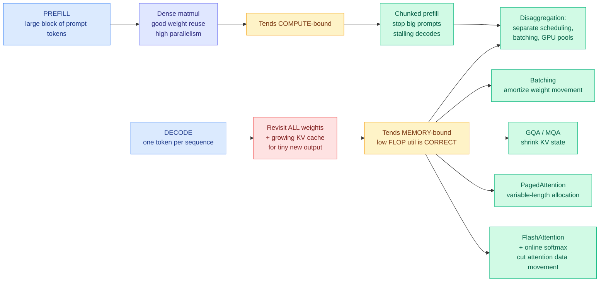

# Media Zone | 2026-09-16

> The feed spent the day on one launch about not generating text, and the genuinely useful reading sat one layer down, in three explanations of where inference time actually goes.

## Today's signal

- **Dominant story:** a decision-only model launched out of two years of stealth, amplified by ten accounts in four languages, with exactly one independent cost report behind it.
- **Pattern:** two labs made the same move on one morning, replacing sequential token generation with a single parallel shot, in routing and in search.
- **The saves point at fundamentals:** a twelve-technique KV cache taxonomy and Karpathy on graphs as the layer that survives after prompts and agents.
- **Counter-signal:** a theory researcher burned four weeks and ten billion agent tokens on an open problem, failed, and said so publicly.
- **Quietly the best technical read:** a CUDA worklog that derives online softmax rather than citing it, which is the identity tiled attention is built on.
- **Optimization throughline:** everything today is cost, and specifically the cost of *deciding* rather than the cost of computing.

---

## Routing, KV cache, compression, GPU

### Saved reading: the KV cache, taxonomized

X Article · saved reading
<h4>KV Cache Engineering for LLM Serving</h4>

Saved today. The article promises the thing this area has been missing, which is not another technique but a map: why the KV cache grows in the first place, the twelve distinct ways models and serving engines shrink it, what each one actually saves, and the trade-offs that decide which fits your workload. The KV cache is the stored key and value tensors from previous tokens, kept so attention does not recompute the whole history on every step, and its size scales with sequence length times batch size times layers times heads, which is why it becomes the binding constraint on long-context serving rather than the weights. The taxonomy framing matters because the twelve techniques are not alternatives; they sit at different layers (architecture, quantization, eviction, offload, sharing) and compose or conflict in ways no single paper covers. The article body could not be fetched from the save, so this is the pointer rather than a summary, and it is worth the click.

<a href="https://x.com/_avichawla/status/2096491130489872479">Read the article →</a>

**Where the wiki already stands on this, so the read lands in context.** The [KV cache page](../../inference-efficiency/kv-cache.md) currently holds the twelve-technique space as a scattered set: [KV-concatenation-aware fine-tuning (09-10)](../../inference-efficiency/2026-09-10-kv-concat-aware-finetuning-selective-recompute.md) on whether to recompute or reuse, [external KV approximation (09-14)](../../inference-efficiency/2026-09-14-external-kv-approximation-retrofit-prefill.md) on predicting cache entries instead of computing them, [prefix stability (09-13)](../../inference-efficiency/2026-09-13-prefix-stable-kv-caching-claude-md.md) on why one changed byte at token N invalidates everything after it, and [SAS (09-14)](../../inference-efficiency/2026-09-14-sas-attention-sparsification-end-to-end.md) on selecting which blocks to attend to under a fixed budget. A single article that ranks all twelve by what they actually save is the connective tissue the page does not have.

### Where inference time goes, explained three ways in one morning

- **A running model changes character halfway through the request, and most of serving engineering follows from that.** [@agenticgirl](https://x.com/agenticgirl/status/2099859581887451164) lays it out cleanly: prefill gets a large block of prompt tokens at once, so the work becomes efficient matrix multiplication with good weight reuse and enough parallelism to approach compute-bound. Decode then advances each sequence by one token, revisiting all the weights and a growing cache to produce very little new work, so at modest batch sizes memory traffic beats arithmetic. **A GPU showing low FLOP utilization during decode is doing exactly what the workload allows.**
- **Everything you know about inference engineering is a consequence of that transition.** Same post, and it is the useful compression: batching amortizes weight movement, grouped-query and multi-query attention shrink the KV state decode must carry, PagedAttention fixes allocation for variable-length caches, FlashAttention attacks attention data movement, chunked prefill exists so a big prompt does not stall ongoing decodes, and disaggregation lets the two phases use different scheduling and different GPU pools entirely.
- **Online softmax, derived rather than asserted.** A CUDA worklog ([@athletic_coder](https://x.com/athletic_coder/status/2099857027661189565)) shows that when a running maximum changes from m1 to m2, multiplying the running denominator by e^(m1 minus m2) corrects every already-accumulated term at once. One multiplication repairs the whole history, which fuses two passes into one and drops global traffic from 16MN to 12MN bytes. **The same identity, applied across lanes instead of across time, is exactly what lets partial softmax statistics from different blocks be merged, which is why tiled attention works at all.**
- **Cost angle, named plainly:** the naive kernel's arithmetic intensity is computed at roughly 0.25 FLOPs per byte before a line of code is written. That single number says no instruction-level cleverness will help and every win must come from moving less data, which is the same reasoning that governs the whole decode side above.

[@agenticgirl](https://x.com/agenticgirl/status/2099859581887451164) · [@athletic_coder](https://x.com/athletic_coder/status/2099857027661189565) · [the worklog](https://heyyanshuman.com/posts/making_softmax_fast) · [wiki summary](../../hardware/2026-09-16-softmax-kernel-worklog-online-softmax.md)

### The decision layer gets priced at zero, twice, by two different labs

- **Jev is a model that makes decisions and never writes a sentence.** From an InstructGPT and RLHF co-author after two years in stealth. Predefined option set in, structured decision plus probabilities out, computed in parallel rather than token by token. Claimed 40-400x cheaper, **$0.042 per million input tokens with output tokens free**, which follows from emitting almost no output tokens.
- **The only evidence not supplied by the vendor:** a developer ran roughly **5,000 requests for about $2** across classification, model routing, intent and steering, and was previously paying for DeepSeek Flash and GPT-5.6 Luna as low-latency classifiers on the same work. That is a real before-and-after from someone already buying the thing being replaced.
- **Google Research made the same structural move in a different domain the same morning.** Retrieve-for-Train replaces heavy autoregressive inference with a lightweight diffusion model to produce expert-level search slates, framed explicitly as a cost reduction. **Two labs, one day, both taking a decision that was being produced by generating tokens sequentially and producing it in one parallel shot.**
- **Counter-signal within hours, and it partly deflates the launch.** A developer open-sourced Qwen-2.5-1B-RLCD claiming 5x faster on-device JSON inference, arguing that **any LLM can already batch-infer every key of a JSON simultaneously and emit probabilities over candidate categories with no new training**. If that holds, the decision-only form factor is a serving-time restructuring available on open weights, and the proprietary advantage is the training method alone.
- **Cost angle and the reason it belongs in this section rather than in industry news:** a router has to cost less than the decision it makes or it eats its own saving, which is the constraint the whole routing literature is built around. A near-free decision primitive changes that question from "is estimating worth paying for" to "how good is a near-free estimate."

[@CompleteSkeptic](https://x.com/CompleteSkeptic/status/2099664857742770519) · [@MichaelLee04](https://x.com/MichaelLee04/status/2100003037150683593) · [@harshagundal](https://x.com/harshagundal/status/2100044305536889015) · [@GoogleResearch](https://x.com/GoogleResearch/status/2099951761985601580) · [wiki summary](../../ai-routing/2026-09-16-jev-decision-only-model.md)

### Memory hardware, surfaced but not fetched

- **A full HBM system architecture breakdown** from [@siliconcodesign](https://x.com/siliconcodesign/status/2099843631012303273): DRAM operating principle, the difference between DRAM and logic processes, base die versus core die features, and where SK Hynix, Samsung and Micron actually differentiate. The article body could not be fetched, so this is a pointer.
- **Why it matters this week specifically.** The wiki's [memory hierarchy page](../../hardware/memory-hierarchy.md) is sitting on an unresolved capacity-versus-bandwidth argument from the 4-hi HBM analysis, where frontier-lab hardware teams are reportedly pushing for fewer stacked dies from HBM4 onward on a cost-per-token basis. A breakdown of base-die and core-die features is exactly the layer that argument turns on.

---

## LLMs, agents, safety

### Saved reading: prompts were always a temporary interface

Talk summary · saved reading
<h4>Karpathy: LLMs to prompts to agents to graphs</h4>

Saved today, summarizing an hour-long Karpathy talk as a progression where each stage is a stepping stone to the next and the graph is the endgame. The argument, as relayed: prompting was always a temporary interface because a prompt is a request made once into a context that resets, whereas a graph is a persistent state machine. What the graph buys is three specific things, and they are worth separating. It isolates errors, so a failure in one node does not corrupt the whole run. It preserves context across steps rather than relying on one growing window. And it lets parallel agent workflows run without resetting, which is the part a chat interface structurally cannot do. The post itself is heavy engagement bait, with bootcamp price comparisons and a plea not to scroll past, so the right move is to watch the talk and ignore the framing. The substance connects directly to this wiki's harness thread, where the recurring finding is that structure transfers across models while evidence does not.

<a href="https://x.com/0xnicc0/status/2099776813635375430">See the post →</a>

**The wiki's position on this, so the talk lands in context.** The [agent harness engineering page](../../agentic-systems/agent-harness-engineering.md) has been accumulating exactly this claim from the research side: harnesses transfer across base models, a harness search can beat a vendor's own native harness, and harness efficiency has a cost curve separate from the model. The graph framing is the practitioner vocabulary for the same object. What Karpathy adds that the research literature does not is the error-isolation argument, which is a reliability claim rather than a performance one and is the part nobody has measured.

### Agent memory had its densest day in weeks, and the sharpest line was a negative result

- **"Human testers got faster with practice, while agents generally slowed down as their memory notes grew."** [@ManlingLi_](https://x.com/ManlingLi_/status/2100057430516539742) flags this against a definition of continual learning as the process by which an apprentice develops expertise on the job. Her reading: accumulating skills can just burden an agent with its own memory, and the missing piece is multi-scale abstraction, compressing experience to the right level per task rather than merely keeping it.
- **MEMENTO, an MIT-licensed memory layer from an Anthropic engineer, whose one real design position is non-destructive conflict handling.** A new fact that contradicts an old one does not overwrite it; both stay, timestamped. The argument is that every system on the market silently overwrites, so yours has been quietly wrong for months and you cannot tell because the old version is gone.
- **Google's WikiSkill compiles execution history into validated skills, with a deliberate asymmetry.** Run tasks, preserve raw traces, consolidate recurring failures and successful strategies into a wiki, propose one atomic skill update, validate, keep or roll back. **Skills roll back. The wiki never does.** That is the separation between evidence and policy stated as an implementation rule.
- **Anthropic's five-layer memory playbook recirculated with a 90% token-cost headline attached by the poster, not the document.** The quoted figures (Mem0 at 1,800 tokens per query instead of 26,000, Snowflake gaining 20% accuracy and 39% fewer tool calls from one ontology layer) are secondhand and unverified.
- **Put against [today's research](../../agentic-systems/2026-09-16-continual-learning-composition-long-horizon.md), the picture is uncomfortable.** Composing three preservation anchors with merged LoRA lifts retention across 100 sequential tasks from 1.2% to 34.9%. Accumulate into weights and it degrades. Accumulate into notes and it slows you down. Nobody has a third option.

[@ManlingLi_](https://x.com/ManlingLi_/status/2100057430516539742) · [@0xWast3](https://x.com/0xWast3/status/2099851294684922336) · [@beamnxw](https://x.com/beamnxw/status/2099920164397699464) · [@adiix_official](https://x.com/adiix_official/status/2099883923543130281) · [agent memory page](../../agentic-systems/agent-memory.md)

### Long-horizon agents, and the most honest post of the day

- **Argus ran 1,548 wall-clock hours across 27 research campaigns with one human intervention every 40.7 hours**, at a 95.1% to 98.7% duty cycle, and reportedly solved a 20-year-old math problem. Microsoft and Shanghai Jiao Tong, open-sourced. The design separates a core that owns permissions, evidence submission and human boundaries from verticals that define what counts as valid evidence in math, GPU work or materials.
- **The figure is more informative than the numbers.** A Manager with authority over tasks, verticals and stage transitions drives a Planner, Engineer and Reviewer over a shared workspace holding a knowledge wiki, an event and decision log, and code artifacts, with backlog, budget, daemon and memory persisting across bounded missions. Evidence cards report SWE-Bench Pro 78 against 59 direct, SOL-ExecBench rank 6 with seven top-3 finishes across 101 kernels, and the authors explicitly label the row **breadth evidence rather than a normalized leaderboard**, which is unusually honest.
- **Four weeks, ten billion tokens, an open problem from the 1960s, no result.** Dimitris Papailiopoulos pointed agents at the capacity of the deletion channel and they did not resolve it. He posted it anyway. **This is the most credible account of agent-assisted research anyone shared today precisely because it is a failure**, and it is the counterweight to every campaign-portfolio result above.
- **His two follow-ups carry the actual signal.** Three weeks of agents collaborating on one problem suggests to him that **communicating agents add a dimension of capability rather than simply more tokens**, which is the first version of that claim from someone with no incentive to make it. And he is stepping away from agent-assisted theory work for a while because it has been emotionally taxing.

[@jiqizhixin](https://x.com/jiqizhixin/status/2100046513405636707) · [Argus paper](https://arxiv.org/abs/2608.05144) · [Argus code](https://github.com/lbx154/Argus) · [@DimitrisPapail](https://x.com/DimitrisPapail/status/2099957917164163334)

### Enterprise agent models, and a curriculum that invents itself

- **Salesforce Koa: your agent config files are the training data.** Built by post-training open-weight Nemotron-3-Super-120B with GRPO, a reinforcement-learning method that compares a group of sampled responses against each other instead of training a separate value model. Trained on public and synthetic data with **no customer data**. The distinctive piece is a simulation-to-reward pipeline that expands **Agent Script** workflow specifications, Salesforce's declarative language for defining Agentforce agents, into persona-conditioned multi-turn tasks with rewards grounded in successful tool use.
- **Koa's own abstract is admirably plain about its ceiling:** it improves over its open-weight base with the clearest gains on multi-turn tool use, and surpasses a strong proprietary baseline **while remaining below the strongest frontier models**. The thesis is that specification-driven RL is a practical path to specializing open weights for enterprise agentic work, not that it closes the frontier gap.
- **SOAR, a teacher that invents stepping stones it cannot solve itself.** When training problems have a 0% success rate there is no reward signal and learning stalls. SOAR splits the model into Teacher and Student: the Teacher generates easier synthetic problems and is rewarded when the Student improves on the impossible test. **The claim worth tracking, if a paper appears, is that the structure of the practice problems matters more than the correctness of their answers.** No link was attached, so treat it as a description.

[@omarsar0](https://x.com/omarsar0/status/2100080746056777899) · [Koa paper](https://arxiv.org/abs/2609.15066) · [@CrazyShyyt](https://x.com/CrazyShyyt/status/2100121703720558965)

### On video: the reasoning-model build, and voice agents from people who ship them

Video · the day's most-watched AI upload
<h4>Sebastian Raschka: building the verifier for RLVR</h4>

Part three of Raschka's from-scratch reasoning-model series, and it lands on the component most treatments skip. RLVR means reinforcement learning with verifiable rewards, where instead of training a reward model to guess what a human would prefer, you check the answer against something that can actually be checked, like a unit test or a math solution. The verifier is therefore the entire reward signal, and its design decides what the model learns to optimize: too loose and the model games it, too strict and gradient signal disappears. This episode builds one and uses it for both evaluation and RL, which is the right framing because the same artifact does both jobs and most tutorials conflate them. Worth it for anyone whose RLVR understanding stops at the acronym.

<a href="https://youtube.com/watch?v=JQJ_8_jSAoY">Watch →</a>

Video · practitioner
<h4>Five voice-agent failure modes you hit in week one</h4>

Venky B from Plivo, in the AI Engineer conference series, on what actually breaks when a voice agent meets real users rather than a demo script. This is timely rather than evergreen: Google shipped Gemini 3.8 Live today at roughly a fifth of the nearest frontier competitor's voice-hour cost, and Apple shipped a Gemini-backed Siri, so a lot of teams are about to build their first voice agent this quarter. The conference track alongside it covers a linguistic map for voice agents from ServiceNow and realtime agents with frontier models from EliseAI. Failure-mode talks from people running production traffic are the cheapest way to skip a month of discovery.

<a href="https://youtube.com/watch?v=vblnYHzBgS4">Watch →</a>

  

- **HuggingFace published a flow-matching primer** ([@ariG23498](https://youtube.com/watch?v=hXQZ6lyRCsI)), which is the generative technique underneath most current video and audio models including today's StepAudio 3 Music release, where a flow-matching diffusion transformer predicts continuous VAE latents.
- **Stanford Online put out three agent lectures in one day**, including Azalia Mirhoseini and Aakanksha Chowdhery on why agents matter now, and one on how coding agents are changing software development. The second is the academic companion to the OpenAI software-factory account in today's digest.
- **Machine Learning Street Talk argues speech recognition is not a solved problem**, which is a useful contrarian note in a week when two frontier voice models shipped and the narrative is that the category is finished.

---

## Industry and business

- **Google's Gemini 3.8 Live takes the top speech-to-speech position at roughly 80% below the nearest frontier competitor's cost**, and Apple's rebuilt Siri ships on Gemini, part on-device and part through Private Cloud Compute, but not in the EU. Two shipped products in one day both pointing at voice as the next price war.
- **Enterprises are now buying on data-retention policy rather than benchmark rank.** Nvidia, Palantir and Booz Allen pulled back from Claude Fable over 30-day log retention, with Palantir and Booz Allen expanding OpenAI's Astra under zero-data-retention terms. Contract language is outranking capability.
- **Developers are proxying Claude Code onto cheaper non-Anthropic models** including GPT-5.6 Sol, with one account shut down fifteen minutes after the first request. The harness carries the value and the model is a supplier, and buyers worked that out without needing a paper.
- **Perplexity claims two engineers plus hundreds of persistent agents replaced DynamoDB over two months**, projecting up to $100M in annual savings. Unverified and framed entirely as a cloud-vendor bill rather than headcount.
- **Google agreed to pay $10M for bankrupt Spirit Airlines' internal emails and Teams messages** for product development and AI. Flight attendants objected, a judge delayed approval, and the question of what counts as valuable company data is now a bankruptcy-court matter.
- **The safety conversation fragmented into four incompatible proposals in one day:** Musk wants labs to peer-review each other's models, Zuckerberg says safety is a competitive necessity and collective slowdowns are not, Cohere's CEO calls the slowdown "a cartel by another name," and Microsoft AI published a model code of conduct that drew immediate backlash from model-welfare researchers. **Every proposal routes around the same unanswered question of who is trusted to evaluate whom.**

[Gemini 3.8 Live](https://the-decoder.com/google-launches-gemini-3-8-live-to-take-on-openais-gpt-live-1-at-a-fraction-of-the-cost/) · [Data trust](https://the-decoder.com/ai-labs-have-a-data-trust-problem-that-their-policies-havent-solved/) · [@AravSrinivas](https://x.com/AravSrinivas/status/2099957318935028173) · [Spirit data sale](https://gradientflow.substack.com/p/what-counts-as-valuable-company-data) · [today's digest](../../daily-digest/2026-09/2026-09-16.md)

---

## Also crossed your feeds

Schmidhuber arguing current models are not creative because nobody implemented his 2008 compression-progress theory of curiosity, and it was the day's single highest-scoring post by reach-normalized engagement. *Foundations of Large Language Models*, a free 277-page textbook whose inference-acceleration and system-scaling chapters are the parts most books omit, resurfacing for the second day from a different account. A widely-shared "The End of Prompt Engineering" thread whose declarative-constraints-over-prompts argument is sound and whose evidence is the poster's own unverifiable 41-day uptime claim. A Sora diffusion-transformer walkthrough by hand. Anthropic IPO speculation from a finance account. Two identical reposts of a Sam Altman Stanford talk. A CMU deep-learning lecture six. Google Cloud plugins for Claude Code. Reddit contributed nothing today across all eight tracked subreddits, and the LinkedIn feed returned no organic posts.
