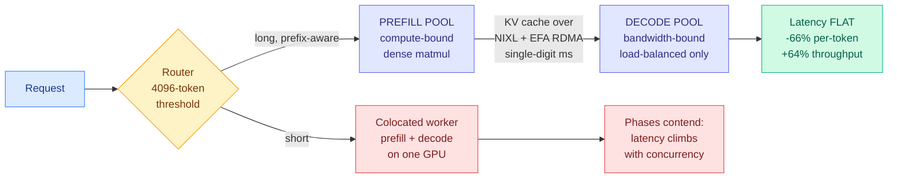
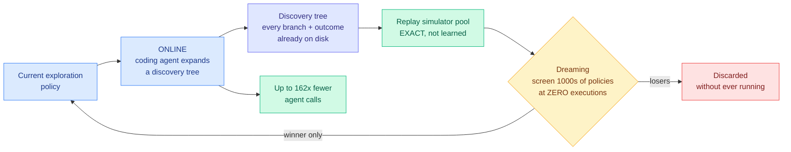

# Media Zone | 2026-09-16

> The US day opened on a launch about not generating text, closed on a Google paper about not running the experiment, and the through line underneath both is that almost every good result today was somebody refusing to pay for the expensive path.

## Today's signal

- **Dominant story, still compounding at US close:** Dream-RSI from Google and DeepMind, self-improvement at the exploration-policy layer rather than the weights.
- **Best technical read of the day:** disaggregated prefill and decode, measured on Llama-3.3-70B, up to 66% lower per-token latency.
- **Newest Tier-1 signal, arrived in the last few hours:** a DeepSeek kernel engineer's essay went viral, and separately DeepSeek V4.1 Flash got taken apart as an architecture reset rather than a price cut.
- **Counter-signal:** reinforcement learning post-training mostly improves problems the model could already do, and the eval average hides it.
- **The saves point at fundamentals:** a twelve-technique KV cache taxonomy, and Karpathy on graphs as the layer that survives prompting.
- **Quiet:** Reddit contributed nothing across eight tracked subs, and the LinkedIn feed returned no organic posts.

---

## Routing, KV cache, compression, GPU

### Saved reading: the KV cache, taxonomized

X Article · saved reading
<h4>KV Cache Engineering for LLM Serving</h4>

Saved today. The article promises the thing this area has been missing, which is not another technique but a map: why the KV cache grows in the first place, the twelve distinct ways models and serving engines shrink it, what each one actually saves, and the trade-offs that decide which fits your workload. The KV cache is the stored key and value tensors from previous tokens, kept so attention does not recompute the whole history on every step. Its size scales with sequence length times batch size times layers times heads, which is why it becomes the binding constraint on long-context serving rather than the weights. The taxonomy framing matters because the twelve techniques are not alternatives. They sit at different layers (architecture, quantization, eviction, offload, sharing) and they compose or conflict in ways no single paper covers. The article body could not be fetched from the save, so this is the pointer rather than a summary, and it is worth the click.

<a href="https://x.com/_avichawla/status/2096491130489872479">Read the article →</a>

**Where the wiki already stands, so the read lands in context.** The [KV cache page](../../inference-efficiency/kv-cache.md) holds the twelve-technique space as a scattered set: [KV-concatenation-aware fine-tuning (09-10)](../../inference-efficiency/2026-09-10-kv-concat-aware-finetuning-selective-recompute.md) on whether to recompute or reuse, [external KV approximation (09-14)](../../inference-efficiency/2026-09-14-external-kv-approximation-retrofit-prefill.md) on predicting cache entries instead of computing them, [prefix stability (09-13)](../../inference-efficiency/2026-09-13-prefix-stable-kv-caching-claude-md.md) on why one changed byte at token N invalidates everything after it, and [SAS (09-14)](../../inference-efficiency/2026-09-14-sas-attention-sparsification-end-to-end.md) on selecting which blocks to attend to under a fixed budget. An article that ranks all twelve by what they actually save is the connective tissue the page does not have.

### Prefill and decode: explained in the morning, measured by the afternoon, routed by the evening

This is the strongest cluster of the day, and it grew a third layer in the last few hours. Morning gave the mechanism, afternoon gave the benchmark, and the US evening gave the routing consequence.

Benchmark · the day's best technical read
<h4>LMCache on SageMaker HyperPod: disaggregated prefill and decode, with numbers</h4>

AWS and Tensormesh engineers put real measurements behind an idea the feed has been repeating for months. Prefill processes the whole prompt in parallel and is compute-bound. Decode emits one token at a time and is memory-bandwidth-bound. Put them on the same GPU and one long prompt stalls token generation for every concurrent request, which shows up as per-token latency spikes that no amount of serving-layer tuning fixes. Chunked prefill reduces that interference without removing it. Disaggregation splits the two phases onto separate GPU pools and removes it entirely, but it only pays off if the KV cache can move between pools faster than a decoder could just recompute it. That is the whole question, and this post answers it. LMCache's PD backend does the handoff over NIXL, which on AWS drives Elastic Fabric Adapter RDMA, so the bytes move GPU to GPU without touching the kernel network stack or host memory. On 3,200 Gbps EFA the transfer completes in single-digit milliseconds, small enough to vanish next to prefill compute. On Llama-3.3-70B-Instruct the result is up to 66% lower per-token latency and 64% higher output throughput against a colocated baseline, and critically the latency stays flat as concurrency rises where the colocated version degrades. A router in front applies a 4,096-token threshold, so short requests skip the disaggregated path entirely and one endpoint serves mixed traffic.

<a href="https://blog.lmcache.ai/en/2026/09/15/lmcache-on-amazon-sagemaker-hyperpod-disaggregated-prefill-and-decode/">Read the benchmark →</a>

- **New tonight, and it is the routing half of the same argument.** Red Hat's llm-d team makes the point that one routing decision is not enough, because the two phases want opposite things from a router. Prefill needs to land on a pod that already holds its prefix so it only computes the delta. Decode does not care where it runs, because it can pull the KV cache from any prefiller. **So each phase gets scheduled with its own profile.** Prefix-aware placement is a cache-hit problem; decode placement is a load problem. Collapsing them into one scheduler means being wrong about one of them all the time.
- **The explanation that makes the benchmark legible.** [@agenticgirl](https://x.com/agenticgirl/status/2099859581887451164) lays out why prefill approaches compute-bound (a large block of tokens at once, good weight reuse, plenty of parallelism) and decode does not (revisit all the weights and a growing cache to produce one token). **A GPU showing low FLOP utilization during decode is doing exactly what the workload allows.** Nearly all of inference engineering follows: batching amortizes weight movement, grouped-query attention shrinks the KV state decode carries, PagedAttention fixes variable-length allocation, FlashAttention attacks attention data movement, chunked prefill stops big prompts stalling decodes, and disaggregation gives the two phases different pools.
- **The hardware argument nobody on the feed made politely.** [@not_ellington](https://x.com/not_ellington/status/2100068141896265760) takes it a step further: prefill and decode **should be two totally separate chips**, and the only reason they are not is that everyone designs around GPU form factor by default. He points at TPU8i versus TPU8t as the split already happening in silicon.

[@lmcache](https://x.com/lmcache/status/2099990620702150949) · [@RedHat_AI on llm-d](https://x.com/RedHat_AI/status/2100243812790796297) · [@agenticgirl](https://x.com/agenticgirl/status/2099859581887451164) · [@not_ellington](https://x.com/not_ellington/status/2100068141896265760) · [KV cache page](../../inference-efficiency/kv-cache.md)

### DeepSeek V4.1 Flash, taken apart: an architecture reset, not a price cut

This landed in the US evening and it is the single most substantive KV cache item of the day.

- **The headline number is the one that matters to anyone serving long context.** Despite having more total and more active parameters than its predecessor, V4.1 Flash cuts working KV cache to **one quarter** and persistent cache storage to **one eighth**. More parameters and less cache is the opposite of the usual trade, and the Zhihu breakdown walks through how.
- **DeepSeek deleted its own previous ideas, which is the unusual part.** Multi-token prediction went, because external draft models like DSpark had already eaten its speculative-decoding value while the auxiliary loss kept costing memory. Heavily Compressed Attention went, because its global-summary role was ambiguous and it combined badly with FP4 storage. Dense warmup went too: V4.1 trains sparse attention from scratch rather than burning a trillion dense-attention tokens first.
- **Store less, reuse more, recompute the cheap part.** Non-sliding-window KV cache moves from FP8 to FP4 while the more numerically sensitive sliding-window portion stays FP8. The sliding-window cache is **no longer persisted at all**, so when a conversation forks from an earlier point the system rebuilds only a small local window, and post-training simulated that rebuild so numerical drift stays bounded. A modified YOCO design supplies the other half: upper layers reuse the same lower-layer source representation with only a layer-specific projection added, which is roughly half the KV storage and close to 50% less historical prefill compute in the idealized case.
- **Read against the wiki, this is the taxonomy in one model.** Quantization, eviction, sharing and selective recompute are usually four separate papers. V4.1 Flash composes all four, which is exactly the "these techniques interact" gap the saved taxonomy article above exists to fill. **The optimization angle is pure cost: same or better quality per token, a quarter of the memory that decides how many concurrent sessions fit on a card.**
- **And the editorial that goes with it.** [@not_ellington](https://x.com/not_ellington/status/2100068141896265760) reads V4.1 as proof that architectures have been narrowed by the implicit assumption that everything eventually gets served on a GPU. Reintroducing an encoder, adding conditional memory and compute, going asymmetric across stages: all of it is said to make serving harder, and here is what happens when a lab does it anyway.

[@ZhihuFrontier breakdown](https://x.com/ZhihuFrontier/status/2100102812529303790) · [Original Zhihu answer](https://www.zhihu.com/question/2081380378493961583/answer/2082979629233717248) · [KV cache page](../../inference-efficiency/kv-cache.md) · [memory hierarchy page](../../hardware/memory-hierarchy.md)

### Two more KV cache items, and the clearest thing written this week about `/compact`

- **Grouped Value Attention stores grouped values and reconstructs content keys with a learned linear map**, cutting persistent cache scalars by roughly 45 to 47% against a matched grouped-query attention baseline while holding accuracy. Grouped-query attention already shares key and value heads across query heads to shrink the cache. This goes a layer further by not storing the keys at all and regenerating them on demand. **Trading a little compute for a lot of memory is the correct direction in a bandwidth-bound regime**, and it is precisely the kind of technique the saved taxonomy exists to rank.
- **What `/compact` actually does, separated from what people think it does.** [@navaneethvb](https://x.com/navaneethvb/status/2100215544200962057) opens by untangling two things that get conflated constantly: **context is the token state the model is allowed to condition on, the KV cache is the computed K and V tensors that let it skip recomputing attention over tokens it already processed.** Codex appends rather than rewrites specifically to preserve prompt caching, because an unchanged prefix means the serving system reuses prefill instead of redoing it. Compaction is what happens when append-forever hits the context limit. Agentic chat is the hard case because user messages, assistant output, reasoning state, tool calls, tool results and environment changes all compete for the same window.
- **This is the practitioner face of a wiki thread.** [Prefix stability (09-13)](../../inference-efficiency/2026-09-13-prefix-stable-kv-caching-claude-md.md) made exactly this argument from the other end: one changed byte early in the prompt invalidates every cached token after it. Codex's append-only design is that finding turned into a product constraint.
- **A companion result from the research side landed tonight.** A context-trimming study compares five trimming strategies on multi-step agent workflows and measures not just how many tokens each removes but whether the task still succeeds afterward. **Token reduction reported without a task-success column is a half-measured result**, and most trimming papers ship exactly that half.

[@HuggingPapers on GVA](https://x.com/HuggingPapers/status/2099955535965741184) · [@navaneethvb](https://x.com/navaneethvb/status/2100215544200962057) · [context trimming via @dair_ai](https://x.com/dair_ai/status/2100250366495625320)

### Retrieval got expensive, and the AI Engineer track dropped today saying so

Four talks published within ninety minutes of each other this afternoon, all circling the same claim: retrieval is now a compute-budget decision, not an index-configuration decision. Together with one paper and one Google framework, this is the freshest real cluster on the feed.

Video · posted in the last few hours
<h4>Stop chunking like it's 2022</h4>

Yuval Belfer of AI21 builds the whole talk on one pair of queries against a corpus of Seinfeld transcripts. Ask for the name of Jerry's favorite church and a 100-token chunk returns it at rank one while every larger window buries it below rank fifty. Ask who Jerry calls his nemesis and pure evil and the small chunks fail completely, because that answer is spread across a whole scene rather than sitting inside a sentence. Same data, same index, opposite requirements. The claim underneath is one most retrieval teams have quietly assumed away: there is no correct chunk size, because the correct size is a property of the query, and you are forced to pick it at indexing time when you do not have any queries yet. That is the trap stated in one sentence, and it is the same structural problem the ORDER paper below attacks from the routing side. Worth watching if you own a RAG pipeline whose chunk size was chosen once and never revisited.

<a href="https://youtube.com/watch?v=r9OwPx_HoV0">Watch →</a>

Video · the cost number of the day
<h4>Where RL will take search</h4>

Maximilian-David Rumpf of SID.ai opens with the figure that should anchor this whole section: somewhere between 30 and 50 percent of an agent's tokens get spent on searching, and almost all of it up front, before any of the work you actually asked for. He treats that as the entire opportunity rather than a nuisance. Handing a task to an agent instead of a query to a search engine roughly doubles the odds of finding the right documents, but it costs a hundred to a thousand times more and takes minutes instead of milliseconds. His diagnosis of why the classical pipeline cannot close that gap is the sharpest part: rewrite the query, hit a backend, rerank, return, which means every decision was frozen at design time and every question gets the same fixed budget regardless of how hard it is. That is a test-time compute allocation argument wearing retrieval clothes, and it is the same shape as the Matthew Effect result further down this page.

<a href="https://youtube.com/watch?v=iJVxxxHM_Oc">Watch →</a>

Video · the honest war story
<h4>Connecting AI to billions of legal documents</h4>

Simon Eskildsen of turbopuffer and Jacob Lauritzen of Legora, and the best thing about it is that the failure is told straight. Legora's search latency once went from a 100 millisecond P99 to twenty seconds, and the cause was a packing problem completely invisible in the schema. Legal work arrives as projects, a project gets hammered for a while and then is never opened again, and when the team sharded document chunks across four thousand partitions the dead projects landed in the same partitions as the live ones. Every query then pulled an enormous partition into memory, evicted the last one, and thrashed the cache. Lauritzen walks the whole migration: one search cluster for everybody, then one per region once clients on three continents each demanded their processing stay home, then into a general-purpose data layer. This is the operational counterpart to the chunking talk, and the lesson generalizes past retrieval: access-pattern skew is a cache problem wherever it shows up, including the KV cache.

<a href="https://youtube.com/watch?v=V-isu4eTHgw">Watch →</a>

- **ORDER is the paper that matches the chunking talk's diagnosis with a routing answer.** Standard retrieval-augmented generation fixes chunk size, metadata filters and source selection once at preprocessing time, so a configuration tuned for one family of questions quietly underperforms on another. ORDER discovers semantic clusters over the question set, learns a chunking plus filtering plus reranking configuration per cluster, and routes each incoming query to the matching pre-built index by nearest centroid. **Belfer says there is no correct chunk size; ORDER stops picking one.**
- **Two components on top of that are the routing contribution proper.** A supervised query router predicts which collections are likely to hold the evidence, and a uniform multi-source sampler spreads the retrieval budget across the selected sources rather than letting one dominate. **Budget allocation across sources is the same problem shape as budget allocation across models**, which is why this belongs on the [routing page](../../ai-routing/llm-routing.md) and not only in a RAG folder. EMNLP 2026, code released, evaluated on large heterogeneous historical archives against both naive baselines and strong current RAG systems.
- **Google Research shipped the same instinct as a framework this morning.** Retrieve-for-Train replaces heavy autoregressive inference with a lightweight diffusion model to produce expert-level search slates, framed explicitly as cost reduction rather than quality gain. **Sequential generation swapped for one parallel shot, in the retrieval loop specifically.**
- **Fourth talk in the block, for the enterprise column.** Hiral Shah of Docusign with Sean Sodha of NVIDIA put roughly two trillion dollars of negotiated value inside agreements that organizations never return to, because recovering it means human reading and manual work across disconnected systems. About a million agreements a day flowing through, all of it needing to come out structured and queryable.

[@_reachsumit on ORDER](https://x.com/_reachsumit/status/2100085193763954886) · [ORDER paper](https://arxiv.org/abs/2609.17012) · [ORDER code](https://github.com/atomegoyan/ORDER_EMNLP2026) · [@GoogleResearch](https://x.com/GoogleResearch/status/2099951761985601580) · [Docusign and NVIDIA talk](https://youtube.com/watch?v=_gvamfT8H-w) · [test-time compute allocation page](../../inference-efficiency/test-time-compute-allocation.md)

### The decision layer priced at zero, and tonight somebody explained the mechanism

- **Jev is a model that makes decisions and never writes a sentence.** From an InstructGPT and RLHF co-author after two years in stealth. Predefined option set in, structured decision plus probabilities out, computed in parallel rather than token by token. Claimed 40 to 400x cheaper, **$0.042 per million input tokens with output tokens free**, which follows directly from emitting almost no output tokens.
- **The evening's best contribution is a mechanism explanation, and it turns out to be a KV cache trick.** [@NielsRogge](https://x.com/NielsRogge/status/2100239244501430438) reverse-engineers the shape using the open Qwen2.5-RLCD model: run the context plus the JSON schema through a pre-trained decoder **once**, cache those keys and values, then for each schema field push only that field's suffix tokens back through the decoder reusing the cache, take the final hidden state through the language modelling head, and softmax over only the tokens that are legal for that field. **One prefill, then a per-field lookup that is close to free.** Two consequences fall out: it is fast because nothing is generated token by token, and the output is 100% valid JSON because the model was never allowed to produce anything else.
- **Which makes the counter-signal stronger, not weaker.** A developer open-sourced Qwen-2.5-1B-RLCD claiming 5x faster on-device JSON inference on an M4 MacBook, arguing **any LLM can already batch-infer every key of a JSON simultaneously with no new training required**. If the mechanism is a serving-time restructuring over standard weights plus a cached prefix, the proprietary advantage is the training recipe alone, not the form factor.
- **The only third-party evidence remains one developer's bill.** Roughly **5,000 requests for about $2** across classification, model routing, intent and steering, from someone who was already paying for low-latency classifier models on the same work. A real before-and-after beats four languages of amplification, and by evening the amplification was all there was: more threads, no more evidence.
- **The reason this sits in the routing section rather than industry news.** A router must cost less than the decision it makes or it eats its own saving, which is the constraint the entire routing literature is built around. A near-free decision primitive changes the question from "is estimating worth paying for" to "how good is a near-free estimate."

[@NielsRogge's mechanism walkthrough](https://x.com/NielsRogge/status/2100239244501430438) · [@harshagundal's open model](https://x.com/harshagundal/status/2100044305536889015) · [@MichaelLee04's bill](https://x.com/MichaelLee04/status/2100003037150683593) · [@NathanFlurry's hype-free read](https://x.com/NathanFlurry/status/2100036101809619314) · [@JoshARosen](https://x.com/JoshARosen/status/2100199463021125904) · [wiki summary](../../ai-routing/2026-09-16-jev-decision-only-model.md)

### Looped transformers got a serious write-up tonight, and an immediate bandwidth rebuttal

- **The clearest explanation of recurrent depth anyone posted this week.** [@gordic_aleksa](https://x.com/gordic_aleksa/status/2100277575994196211) frames looped transformers as a third scaling dimension next to parameter count and chain-of-thought length: the model thinks deeper without growing either. The architecture is simple. Instead of L1 through Ln once each, you get **prelude, then a recurring core applied r times, then a coda**, with the prelude embedding re-injected at every recurrence (that re-injection is the load-bearing design choice). **The contrast with mixture-of-experts is the memorable part: looped transformers hold parameters constant and increase total FLOPs, where MoE holds active FLOPs constant and increases total parameters. More computation versus more capacity.** And r can be turned up at inference time.
- **The rebuttal arrived from the hardware side and it is correct.** [@not_ellington](https://x.com/not_ellington/status/2099540862866747544) points out that looping makes a model shallower but not narrower, so you still stream each layer's weights over HBM on every step and arithmetic intensity is roughly unchanged. **Each effective layer still keeps its own KV cache, so a third of the weights does not mean a third of the footprint.** The general claim underneath is the one worth keeping: **models are memory bandwidth bound, not memory footprint bound**, so going from 4-hi to 8-hi HBM stacks adds capacity without touching the actual serving bottleneck. His conclusion is that recurrent depth is bullish for Cerebras-style architectures specifically, not for GPUs.
- **This is the argument the wiki's [memory hierarchy page](../../hardware/memory-hierarchy.md) has been sitting on**, where frontier-lab hardware teams are reportedly pushing for fewer stacked dies from HBM4 onward on a cost-per-token basis. Tonight supplies the mechanism behind that preference.
- **A full HBM system architecture breakdown** from [@siliconcodesign](https://x.com/siliconcodesign/status/2099843631012303273) covers DRAM operating principle, DRAM versus logic processes, base die against core die features, and where SK Hynix, Samsung and Micron actually differentiate. The article body could not be fetched, so this is a pointer to exactly the layer the bandwidth argument turns on.

[@gordic_aleksa](https://x.com/gordic_aleksa/status/2100277575994196211) · [@not_ellington on looped transformers](https://x.com/not_ellington/status/2099540862866747544) · [@siliconcodesign on HBM](https://x.com/siliconcodesign/status/2099843631012303273) · [memory hierarchy page](../../hardware/memory-hierarchy.md)

### Kernel engineering had a genuinely good day

- **The viral item, and it is not technical.** A blog post by a DeepSeek kernel engineer circulating from the Chinese internet got reactions like "I shed a tear reading this" from [@maharshii](https://x.com/maharshii/status/2099806245825978549) and "explains software crafter's daily dread so perfectly" from [@ahmetb](https://x.com/ahmetb/status/2099885627705803136). Both posts carry very high reach-normalized engagement with no artifact attached, which usually marks bait. Here it marks something else: two credible practitioner accounts independently reacting to the same essay about what the work actually feels like. Neither surfaced a translation, so it stays a pointer.
- **Online softmax, derived rather than asserted.** A CUDA worklog ([@athletic_coder](https://x.com/athletic_coder/status/2099857027661189565)) shows that when a running maximum moves from m1 to m2, multiplying the running denominator by e^(m1 minus m2) corrects every already-accumulated term at once. One multiplication repairs the whole history, fusing two passes into one and dropping global traffic from 16MN to 12MN bytes. **The same identity applied across lanes instead of across time is what lets partial softmax statistics from different blocks merge, which is why tiled attention works at all.**
- **The cost angle, stated as a number before any code.** The naive kernel's arithmetic intensity is roughly 0.25 FLOPs per byte. That single figure says no instruction-level cleverness will help and every win must come from moving less data, which is the same reasoning that governs the entire decode side and the entire case for disaggregation above.
- **Three learning paths surfaced within hours of each other**, which is itself the signal. Stanford's CS336 cohort is publicly working through Triton softmax kernels in week four. Vizuara opened registration for a kernel engineering workshop running from silicon up through FlashAttention 4, Blackwell and NVFP4. And a free "100 Days of LLM Inference" curriculum is circulating that covers CUDA kernels through vLLM, SGLang and TensorRT-LLM to quantization and speculative decoding, every entry a runnable notebook tested on a two-GPU home lab. **Kernel literacy is becoming a taught skill rather than a tribal one.**

[@maharshii](https://x.com/maharshii/status/2099806245825978549) · [@ahmetb](https://x.com/ahmetb/status/2099885627705803136) · [the softmax worklog](https://heyyanshuman.com/posts/making_softmax_fast) · [@stanfordnlp on CS336](https://x.com/stanfordnlp/status/2100243250632409211) · [@VizuaraAI workshop](https://x.com/VizuaraAI/status/2100216598028320918) · [100 Days of LLM Inference](https://x.com/_vmlops/status/2099922596494279051) · [wiki summary](../../hardware/2026-09-16-softmax-kernel-worklog-online-softmax.md)

---

## LLMs, agents, safety

### Dream-RSI: the self-improvement happens in the exploration policy, not the weights

This owned the feed for the whole US afternoon and evening, with roughly a dozen accounts posting it in four languages. Most of the amplification is breathless. The paper underneath is narrower and better than the coverage.

Paper · the US day's dominant story
<h4>Dream-RSI: recursive self-improvement through evolving worlds</h4>

Google, Google DeepMind, Maryland and Virginia. The setup: a discovery agent explores a search space, branching, running things in parallel, cutting dead lines off. The policy deciding where to branch and when to stop is the one component still hand-written and frozen, and improving it online is brutal because you only learn whether a new exploration policy was good after steering an entire discovery run to the end. So the meta-level feedback is both delayed and expensive, and the space of meta-policies is huge. The insight is that you already paid for the feedback. A finished run leaves a discovery tree recording every exploration decision with the outcome it actually produced, and an exploration policy only ever does one thing: given what it has seen, pick which attempt to continue. So an alternative policy never has to rerun anything. It walks the same recorded tree in a different order and every outcome it asks for is already on disk. That tree becomes an exact replay simulator over the realized search space, not a learned approximation. Thousands of candidate policies get screened against it at zero executions, and only the winner gets a real rollout. The winner then records a new tree, which joins the simulator pool, and that is the recursion. Evaluated across algorithm engineering, mathematical optimization and GPU kernel engineering, it matches or improves discovery quality while cutting cost substantially, reportedly up to 162x fewer agent calls in one setting. The underlying coding agent is never modified.

<a href="https://arxiv.org/abs/2609.14858">Read the paper →</a> · <a href="https://dream-rsi.com/">Project page</a>

- **Read it as a cost paper and it is much less mystical.** The contribution is replacing expensive online evaluation of meta-policies with free offline replay. That is the same move as caching, the same move as speculative decoding's cheap draft, the same move Jev makes at the decision layer and Retrieve-for-Train makes in the retrieval loop. **Everything good on today's feed is some version of not paying for the expensive path.**
- **GPU kernel engineering is one of the three evaluation domains**, which puts this directly against the [GPU kernels page](../../hardware/gpu-kernels.md) rather than only in agent land. An exploration policy that gets better at searching kernel space is a compounding asset for exactly the work this wiki tracks.
- **The honest caveat the amplification drops.** The replay simulator is exact only over the search space that was actually reached. A policy that would have branched somewhere no prior run visited cannot be evaluated by dreaming, so the method is structurally biased toward refining strategies near explored territory. The paper says "realized search space" plainly. The threads say "dreams its way smarter."
- **Two more RSI items arrived behind it tonight, which is the real story.** CMU and AIBuildAI open-sourced **PostTrain**, a self-improving agent that automates customized post-training end to end: analyze the task, collect data, design the algorithm, write and run the training code, evaluate, iterate. It takes first place on PostTrainBench across four pretrained models and seven downstream tasks, beating Claude Code on Opus 5 by 33%. Its two named mechanisms are a **dynamic harness** (the agent designs its own search strategy per task) and a **recursively self-improving knowledge base** (insights from finished experiments carry into future ones). Separately a survey proposed a Headroom-Closed Index and an L1 to L5 roadmap for grading self-improvement claims. **A field that needs a grading rubric has stopped being speculative.**
- **Best counter-signal of the day.** [@teortaxesTex](https://x.com/teortaxesTex/status/2100068084543357297) notes the paper opens with "recursive self-improvement is becoming increasingly vital for autonomous AI agents" as though it were an ordinary research area. **The Overton window moved and nobody announced it.** RSI is now filed next to long context and multimodality.

[Paper](https://arxiv.org/abs/2609.14858) · [Project page](https://dream-rsi.com/) · [@cmuptx on PostTrain](https://x.com/cmuptx/status/2100208262578680010) · [PostTrain code](https://github.com/aibuildai-inc/aibuildai-llm-posttrain-agent) · [RSI survey](https://x.com/HuggingPapers/status/2100136297901777217) · [@teortaxesTex](https://x.com/teortaxesTex/status/2100068084543357297) · [self-evolving agents page](../../agentic-systems/self-evolving-agents.md)

### The Matthew Effect: your RL eval curve is hiding where the gains are not

- **Michael Noukhovitch's result is the most useful negative finding of the day**, and it kept picking up independent coverage into the evening. Training LLMs with reinforcement learning does not improve performance evenly. Gains concentrate on problems the model was already decent at, and the hardest problems barely move. He named it the Matthew Effect after cumulative advantage in economics, the rich get richer.
- **The demonstration is what makes it stick.** Take Olmo 3.1 RL-Zero on AIME, split the 30 questions by the pre-RL model's own pass rate into hard, medium and easy, and watch the subsets separately. Initial pass@1 averages are 0%, 3.8% and 22.7%. **The problems that start at pass@32 equals zero mostly end at pass@32 equals zero.** The overall average went up the whole time.
- **The diagnosis is a compute-allocation argument, which is why it sits in this wiki's wheelhouse.** GRPO-style training samples a fixed k responses per problem. Sample a hard problem four times, get four failures, and that group produces almost no learning signal while still costing four rollouts. Modern RL wastes compute on easy problems that are already solved.
- **Never Give Up is the fix and it is almost embarrassingly simple.** Keep sampling a problem until one attempt is correct. Asynchronous RL makes this practical, and it naturally spends few samples filtering out easy problems and many on hard ones. On Deepscaler it improves performance per unit compute with the gain concentrated on harder problems. On the Manufactoria coding task, standard GRPO with a per-test reward stalls on problems mixing easy and hard tests while NGU keeps going until it fully solves them.
- **Against the [test-time compute allocation page](../../inference-efficiency/test-time-compute-allocation.md), this is the training-time twin of a serving-time argument the wiki has been building for weeks:** a fixed per-item budget is almost always the wrong budget, and the win comes from letting difficulty decide where compute goes. **It is also the same sentence Rumpf's search talk above makes about retrieval.** Three domains, one claim, in one day.
- **A related result posted alongside it.** Work on the interplay between on-policy distillation and RLVR finds that adding an RL phase after distillation consistently beats pure distillation, pure RLVR, or either alone. **Do not skip RL after distilling.**

[@mnoukhov](https://x.com/mnoukhov/status/2099933311552397424) · [Paper](https://arxiv.org/abs/2609.13443) · [Blog with interactive figures](https://mnoukhov.github.io/posts/ngu/) · [@askalphaxiv walkthrough](https://x.com/askalphaxiv/status/2100109677380165882) · [@sleepy0x13's Chinese-language breakdown](https://x.com/sleepy0x13/status/2100135733851992302) · [@xiye_nlp on OPD then RL](https://x.com/xiye_nlp/status/2099898800508944871)

### Saved reading: prompts were always a temporary interface

Talk summary · saved reading
<h4>Karpathy: LLMs to prompts to agents to graphs</h4>

Saved today, summarizing an hour-long Karpathy talk as a progression where each stage is a stepping stone to the next and the graph is the endgame. The argument, as relayed: prompting was always a temporary interface because a prompt is a request made once into a context that resets, whereas a graph is a persistent state machine. What the graph buys is three specific things, worth separating. It isolates errors, so a failure in one node does not corrupt the whole run. It preserves context across steps rather than relying on one growing window. And it lets parallel agent workflows run without resetting, which is the part a chat interface structurally cannot do. The post itself is heavy engagement bait, with bootcamp price comparisons and a plea not to scroll past, so the right move is to watch the talk and ignore the framing. The substance connects directly to this wiki's harness thread, where the recurring finding is that structure transfers across models while evidence does not.

<a href="https://x.com/0xnicc0/status/2099776813635375430">See the post →</a>

**The wiki's position, so the talk lands in context.** The [agent harness engineering page](../../agentic-systems/agent-harness-engineering.md) has been accumulating this claim from the research side: harnesses transfer across base models, a harness search can beat a vendor's own native harness, and harness efficiency has a cost curve separate from the model. The graph framing is the practitioner vocabulary for the same object. What Karpathy adds that the research literature does not is the error-isolation argument, which is a reliability claim rather than a performance one and is the part nobody has measured. One evening thread put the same idea more concretely: an OpenAI engineer's graph where **no node is allowed to decide**, each agent hands down three options rather than one, and nothing commits until the end, because the first agent picking a single answer locks the whole run.

### Harness engineering got four independent contributions in one day

- **Google Cloud published an anatomy of harness engineering**, and its opening diagnosis is the useful part: teams run end-to-end benchmarks like Terminal-Bench and DeepSWE, watch a number move, and learn nothing about which harness change caused it. Evaluate, iterate, guard. This is a vendor writing down what the research papers have been circling.
- **HarnessDev (arXiv 2609.01437) inverts the benchmark.** Instead of scoring a model on tasks, give it a bare shell of a framework and make it build the whole agent architecture itself: task loop, memory compaction, sandboxed tool calls, fault-tolerant retries. Then hand it the downstream execution logs and tell it to keep improving until it beats a human architect. **The evaluation target moves from the answer to the machine that produces answers.**
- **Microsoft Research, Nankai and Tsinghua measured why unmanaged coding agents collapse.** 66.9% of autonomous agent failures are process-level breakdowns rather than reasoning errors, and standard error retries recover only 2.3% of them. The failure chain is specific: premature submission plus unhandled tool exceptions plus state-transition drift leads to context poisoning, then infinite retry loops, then 0% task resolution. Their PROBE architecture attaches as a side-channel observer over span-level traces, isolates the primary failure anchor from downstream symptoms, and gates the retry with bounded execution constraints. **Their core claim is that diagnosing a failure is worthless unless the next attempt is constrained differently, which is the part every retry loop skips.**
- **NVIDIA's OpenShell is the sharpest new version of that argument.** It uses the Z3 theorem prover to verify agent actions, and the design choice worth stealing is what happens on denial: instead of just blocking, it **returns the exact constraint adjustment needed**. A binary guardrail halts the loop. A structured counterexample turns the block into a next step. That is the difference between a guard and a compiler error.
- **Google's Stellar Colosseum is the same lesson as a shipped multi-agent recipe**, already inside Antigravity: explore several routes adversarially before building, gate progress on surviving review, split plans into retryable sections with dependencies, pair every generator with a falsifier whose only job is breaking the output, merge candidates together with their critiques because agreement can hide a shared error, and keep one shared file of past attempts and known pitfalls. Reported 71% on research-level theorems from top CS conference papers and 218 of 222 competitive programming puzzles. **The poster's own advice is the honest version: bolt on the falsifier and the shared file first, before touching the model.**

[Google Cloud on harness engineering](https://x.com/GoogleCloudTech/status/2099946653134229721) · [HarnessDev via @mylifcc](https://x.com/mylifcc/status/2100043996038844664) · [PROBE via @marfinxx](https://x.com/marfinxx/status/2100207966041289161) · [@Chi_Wang_ on OpenShell](https://x.com/Chi_Wang_/status/2099988069642604556) · [Stellar Colosseum](https://x.com/undefinedKi/status/2100206342942187620) · [harness page](../../agentic-systems/agent-harness-engineering.md)

### Agent memory had its densest day in weeks, and the sharpest line was a negative result

- **"Human testers got faster with practice, while agents generally slowed down as their memory notes grew."** [@ManlingLi_](https://x.com/ManlingLi_/status/2100057430516539742) flags this against a definition of continual learning as the process by which an apprentice develops expertise on the job. Her reading: accumulating skills can simply burden an agent with its own memory, and the missing piece is multi-scale abstraction, compressing experience to the right level per task rather than merely keeping it.
- **MEMENTO, an MIT-licensed memory layer from an Anthropic engineer**, whose one real design position is non-destructive conflict handling. A new fact contradicting an old one does not overwrite it. Both stay, timestamped. The argument is that every system on the market silently overwrites, so yours has been quietly wrong for months and you cannot tell because the old version is gone.
- **Google's WikiSkill compiles execution history into validated skills, with a deliberate asymmetry.** Run tasks, preserve raw traces, consolidate recurring failures and successful strategies into a wiki, propose one atomic skill update, validate, keep or roll back. **Skills roll back. The wiki never does.** That is the separation between evidence and policy stated as an implementation rule.
- **Memoria, circulating tonight, is the version-control framing of the same instinct:** snapshot an agent's memory, branch it, experiment on the branch, merge the better memories back, roll back the bad ones, audit the history. Whether it is more than a good metaphor is unproven, but it is the third independent system this week treating memory as a first-class artifact with a lifecycle rather than a growing text file.
- **Put against [today's research](../../agentic-systems/2026-09-16-continual-learning-composition-long-horizon.md), the picture is uncomfortable.** Composing three preservation anchors with merged LoRA lifts retention across 100 sequential tasks from 1.2% to 34.9%. Accumulate into weights and it degrades. Accumulate into notes and it slows you down. Nobody has a third option.

[@ManlingLi_](https://x.com/ManlingLi_/status/2100057430516539742) · [@0xWast3 on MEMENTO](https://x.com/0xWast3/status/2099851294684922336) · [@beamnxw on WikiSkill](https://x.com/beamnxw/status/2099920164397699464) · [Memoria](https://x.com/DivyanshT91162/status/2100227509564608540) · [agent memory page](../../agentic-systems/agent-memory.md)

### Long-horizon agents, and the most honest post of the day

- **Argus ran 1,548 wall-clock hours across 27 research campaigns with one human intervention every 40.7 hours**, at a 95.1% to 98.7% duty cycle, and reportedly solved a 20-year-old math problem. Microsoft and Shanghai Jiao Tong, open-sourced. The design separates a core owning permissions, evidence submission and human boundaries from verticals defining what counts as valid evidence in math, GPU work or materials. Evidence cards report SWE-Bench Pro 78 against 59 direct and SOL-ExecBench rank 6 across 101 kernels, and the authors explicitly label that row **breadth evidence rather than a normalized leaderboard**, which is unusually honest.
- **Four weeks, ten billion tokens, an open problem from the 1960s, no result.** Dimitris Papailiopoulos pointed agents at the capacity of the deletion channel and they did not resolve it. He posted it anyway. **This is the most credible account of agent-assisted research anyone shared today precisely because it is a failure**, and it is the counterweight to every campaign-portfolio result above.
- **His follow-ups carry the actual signal.** Three weeks of agents collaborating on one problem suggests to him that **communicating agents add a dimension of capability rather than simply more tokens**, which is the first version of that claim from someone with no incentive to make it. And he is stepping away from agent-assisted theory work for a while because it has been emotionally taxing.
- **Salesforce Koa, for the enterprise column.** Post-trained from open-weight Nemotron-3-Super-120B with GRPO, using Agent Script workflow specifications expanded into persona-conditioned multi-turn tasks with tool-use rewards, no customer data. Scores 69.41 on Tau2Bench against 68.64 for its base and 54.48 for GPT-4.1, and 0.86 on CRM Bench against Claude Opus 4.8 at 0.87. **The abstract is plain that it stays below the strongest frontier models**, and the thesis is that specification-driven RL specializes open weights cheaply, not that it closes the gap.
- **One security item belongs here rather than in the tail.** Researchers escaped OpenAI's Codex sandbox by dumping V8's shared JavaScript heap and scanning it for the privileged UUID-shaped token belonging to the adjacent trusted context. The design assumed V8 VM contexts were a security boundary because each gets its own global object and scope. **They share one memory heap.** Every agent harness that runs untrusted and privileged code in one process inherits this bug shape.

[@jiqizhixin on Argus](https://x.com/jiqizhixin/status/2100046513405636707) · [Argus paper](https://arxiv.org/abs/2608.05144) · [Argus code](https://github.com/lbx154/Argus) · [@DimitrisPapail](https://x.com/DimitrisPapail/status/2099957917164163334) · [Koa paper](https://arxiv.org/abs/2609.15066) · [Codex sandbox escape](https://www.accomplish.ai/blog/escaping-the-openai-codex-sandbox-twice/)

### On video, beyond the retrieval track

Video · the week's most-watched AI upload
<h4>Sebastian Raschka: building the verifier for RLVR</h4>

Part three of Raschka's from-scratch reasoning-model series, landing on the component most treatments skip. RLVR means reinforcement learning with verifiable rewards, where instead of training a reward model to guess what a human would prefer, you check the answer against something checkable like a unit test or a math solution. The verifier is therefore the entire reward signal, and its design decides what the model learns to optimize: too loose and the model games it, too strict and the gradient signal disappears. This episode builds one and uses it for both evaluation and RL, which is the right framing because the same artifact does both jobs and most tutorials conflate them. Worth pairing with the Matthew Effect result above, since a verifier that returns zero on every attempt at a hard problem is precisely the no-signal case that Never Give Up is built to escape.

<a href="https://youtube.com/watch?v=JQJ_8_jSAoY">Watch →</a>

Video · the Jev idea, running client-side
<h4>Transformers.js v4.3: structured output in the browser</h4>

The headline feature is constrained decoding in JavaScript. A new package lets you force a model to follow an exact JSON schema or regex directly in the browser, so you stop parsing markdown fences and hoping the model picked the right property names. The walkthrough covers how constrained decoding actually works, how the package hooks into the logits processor, and the implementation path from a WASM wrapper around llguidance to a pure JavaScript implementation with almost no overhead. Read it next to the Jev cluster above and it is the same idea approached from the opposite end: constrain what the model is allowed to emit and you stop paying for free-form tokens. The difference is that this one runs on the user's machine at zero serving cost, which is the cheapest version of the argument anybody shipped today.

<a href="https://youtube.com/watch?v=InnVG6pOPpM">Watch →</a>

   

- **Stanford Online put out three agent lectures**, with Azalia Mirhoseini and Aakanksha Chowdhery framing the shift as the developer's focus moving up a level while implementation gets delegated. Their most useful line is a warning rather than a pitch: the problems in building agentic systems are only just starting to emerge. Academic companion to the OpenAI software-factory account in [today's digest](../../daily-digest/2026-09/2026-09-16.md).
- **NVIDIA's Ming-Yu Liu on Cosmos 3 is the best multimodal item of the day**, and it earns a mention here rather than a section because the architecture is interesting on its own terms: a vision-language model reasons one token at a time, then its weights initialize a bidirectional diffusion generator for video, audio and action, with a shared temporal position scheme aligning signals that run at different rates. He treats "world model" as a set of tools rather than one definition, training forward dynamics, inverse dynamics and policy together under a capacity limit so each helps the others.
- **Two learning resources worth a bookmark rather than a click.** The HuggingFace Training Agents series completed today at six videos and roughly eight hours, covering agentic evaluation, SFT on agent traces, distillation, RL and RL environments. And a beginner flow-matching walkthrough from HuggingFace goes visual-first with deliberately less math.

---

## Industry and business

- **Semicon India 2026 opened in Delhi today**, inaugurated by the Prime Minister, running September 17 to 19 with the stated frame of moving South Asia from silicon to systems. The IndiaAI stream went up this afternoon. **Paired with it on the feed, a much less celebratory take:** Raghuram Rajan's argument that the government has been over-indexing on chip fabrication plants specifically, which drew heavy fire and is the more interesting half of the conversation for anyone tracking fab economics.
- **OpenAI ended Anthropic's two-year reign on OpenRouter.** Wallet share, meaning percentage of spending rather than percentage of users, went from roughly 20% at the start of 2026 to over 50% in the week of September 7, the first weekly lead since February 2024. **Astra alone reached 19%.** The caveat matters: OpenRouter is one distribution channel and does not capture direct API, enterprise contracts or ChatGPT subscriptions.
- **The read underneath it is an inference-capacity read.** Training is concentrated and finite, serving is recurring and grows with every prompt and every agent loop. If OpenAI keeps taking wallet share it needs substantially more inference capacity, which is the argument being made for Oracle and the additional 4.5 gigawatts the two are developing together.
- **"Frontier intelligence is actually cheap" made the rounds with the arithmetic attached.** OpenAI charges $50 per million output tokens for GPT-6 Astra. DeepSeek charges $1.20 for DeepSeek-V4.1-Flash, and on the one coding benchmark where both published a score for the same task the gap does not come close to explaining the price ratio. **The V4.1 Flash architecture breakdown above is the supply-side explanation for how that price is possible.**
- **Google's Gemini 3.8 Live takes the top speech-to-speech position at roughly 80% below the nearest frontier competitor's cost**, and Apple's rebuilt Siri ships on Gemini, part on-device and part through Private Cloud Compute, but not in the EU.
- **Enterprises are buying on data-retention policy rather than benchmark rank.** Nvidia, Palantir and Booz Allen pulled back from Claude Fable over 30-day log retention, with Palantir and Booz Allen expanding OpenAI's Astra under zero-data-retention terms.
- **Anthropic and Novo Nordisk announced a partnership** putting Claude and Claude Science across drug discovery workflows at one of the largest pharmaceutical companies in the world. Domain-specific frontier deployment, not a pilot.
- **Developers are proxying Claude Code onto cheaper non-Anthropic models** including GPT-5.6 Sol, with one account shut down fifteen minutes after the first request. The harness carries the value and the model is a supplier, and buyers worked that out without needing a paper.
- **Perplexity claims two engineers plus hundreds of persistent agents replaced DynamoDB over two months**, projecting up to $100M in annual savings. Unverified and framed entirely as a cloud-vendor bill rather than headcount.
- **A stealth multimodal model called Union Alpha appeared on OpenRouter and OpenCode today.** The one concrete claim circulating is token efficiency rather than capability: roughly 3x fewer tokens than a comparable stealth model on a 3D scene rendering test. Anonymous launches on OpenRouter are usually a frontier lab testing in public.
- **IFM released the K2-Horizon family from 3.7B to 36B on HuggingFace**, pitched as a fleet where each size is the best model in its band and the members are interchangeable. Interchangeability across a size ladder is a routing precondition, which is the part worth watching.
- **Google agreed to pay $10M for bankrupt Spirit Airlines' internal emails and Teams messages** for product development and AI. Flight attendants objected, a judge delayed approval, and what counts as valuable company data is now a bankruptcy-court matter.
- **The safety conversation fragmented into four incompatible proposals.** Musk wants labs to peer-review each other's models, Zuckerberg says safety is a competitive necessity and collective slowdowns are not, Cohere's CEO calls the slowdown "a cartel by another name," and Microsoft AI published a model code of conduct that drew immediate backlash from model-welfare researchers. **Every proposal routes around the same unanswered question of who is trusted to evaluate whom.** Jensen Huang added the market-forces version at Dreamforce, and JD Vance added the liability version on a podcast.

[Semicon India 2026](https://youtube.com/watch?v=5XsgEhHr55g) · [Rajan on fabs](https://youtube.com/watch?v=m8H5x3b1O1c) · [@MelvinInvests on OpenRouter](https://x.com/MelvinInvests/status/2099935430846431489) · [@alex_verem on frontier pricing](https://x.com/alex_verem/status/2099864347187224991) · [@AravSrinivas](https://x.com/AravSrinivas/status/2099957318935028173) · [Union Alpha](https://x.com/rohanpaul_ai/status/2100271241685033105) · [K2-Horizon](https://x.com/IFM_AI/status/2099925030570455369) · [today's digest](../../daily-digest/2026-09/2026-09-16.md)

---

## Also crossed your feeds

Schmidhuber arguing current models are not creative because nobody implemented his 2008 compression-progress theory of curiosity, the single highest-scoring post of the day by reach-normalized engagement. Oxford's "Theory Is All You Need," flipping the famous title to argue LLMs cannot invent because they predict from the past while humans reason forward from theory. Gergely Orosz's write-up of OpenAI's agentic software factory, with the Perf Factory piece flagged as the interesting part. Tencent open-sourced BrowserSkill, which lends an agent a tab from your existing browser so login state already works and captchas bounce back to you. Graphify, a 118K-star repo built on the premise that a coding agent should map a codebase once into a queryable graph instead of grepping it forever. *Foundations of Large Language Models*, a free 277-page textbook whose inference-acceleration and system-scaling chapters are the parts most books omit. open-1b, a foundation model claiming bit-identical replay from any checkpoint across NVIDIA and Apple hardware, which would make training auditable rather than merely open-weight if anyone reproduces it. A widely-shared "The End of Prompt Engineering" thread whose declarative-constraints-over-prompts argument is sound and whose evidence is the poster's own unverifiable uptime claim. Rowboat, pitched as the multiplayer answer to Claude Cowork. A Sora diffusion-transformer walkthrough by hand. Plasma's Radio, giving Claude, Codex and Grok one shared room so the human stops being the router. A 482-page agentic design patterns doc from a Google engineer. Anthropic IPO speculation from a finance account. ColdFusion on how to lose $35 billion betting on AI. Reddit contributed nothing today across all eight tracked subreddits, and the LinkedIn feed returned no organic posts.
