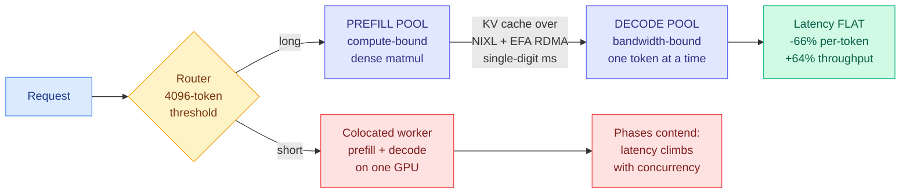
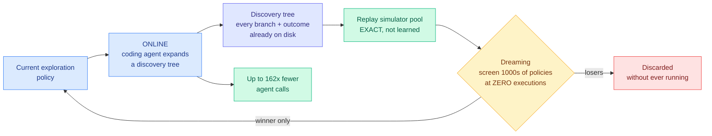

# Media Zone | 2026-09-16

> The US day started on a launch about not generating text and ended on a Google paper about not running the experiment, and in between the best thing on the feed was a benchmark proving that splitting prefill from decode actually pays.

## Today's signal

- **Dominant story, and it arrived in the last three hours:** Google and DeepMind's Dream-RSI, self-improvement at the exploration-policy layer, not the weights.
- **Best technical read of the day:** disaggregated prefill and decode, measured on Llama-3.3-70B, up to 66% lower per-token latency.
- **Pattern running through everything:** four separate results today are about refusing to pay for the expensive path.
- **Counter-signal:** RL post-training mostly improves problems the model could already do, and the eval average hides it.
- **The saves point at fundamentals:** a twelve-technique KV cache taxonomy and Karpathy on graphs as the layer that survives.
- **Quiet:** Reddit contributed nothing across eight tracked subs, and LinkedIn returned no organic posts.

---

## Routing, KV cache, compression, GPU

### Saved reading: the KV cache, taxonomized

X Article · saved reading
<h4>KV Cache Engineering for LLM Serving</h4>

Saved today. The article promises the thing this area has been missing, which is not another technique but a map: why the KV cache grows in the first place, the twelve distinct ways models and serving engines shrink it, what each one actually saves, and the trade-offs that decide which fits your workload. The KV cache is the stored key and value tensors from previous tokens, kept so attention does not recompute the whole history on every step, and its size scales with sequence length times batch size times layers times heads, which is why it becomes the binding constraint on long-context serving rather than the weights. The taxonomy framing matters because the twelve techniques are not alternatives; they sit at different layers (architecture, quantization, eviction, offload, sharing) and compose or conflict in ways no single paper covers. The article body could not be fetched from the save, so this is the pointer rather than a summary, and it is worth the click.

<a href="https://x.com/_avichawla/status/2096491130489872479">Read the article →</a>

**Where the wiki already stands on this, so the read lands in context.** The [KV cache page](../../inference-efficiency/kv-cache.md) holds the twelve-technique space as a scattered set: [KV-concatenation-aware fine-tuning (09-10)](../../inference-efficiency/2026-09-10-kv-concat-aware-finetuning-selective-recompute.md) on whether to recompute or reuse, [external KV approximation (09-14)](../../inference-efficiency/2026-09-14-external-kv-approximation-retrofit-prefill.md) on predicting cache entries instead of computing them, [prefix stability (09-13)](../../inference-efficiency/2026-09-13-prefix-stable-kv-caching-claude-md.md) on why one changed byte at token N invalidates everything after it, and [SAS (09-14)](../../inference-efficiency/2026-09-14-sas-attention-sparsification-end-to-end.md) on selecting which blocks to attend to under a fixed budget. An article that ranks all twelve by what they actually save is the connective tissue the page does not have.

### Prefill and decode, explained in the morning and measured by the afternoon

The morning feed carried three good explanations of why a running model changes character halfway through a request. The afternoon carried the benchmark that turns that explanation into a deployment decision. Taken together this is the strongest cluster of the day.

Benchmark · the day's best Tier-1 read
<h4>LMCache on SageMaker HyperPod: disaggregated prefill and decode, with numbers</h4>

AWS and Tensormesh engineers put real measurements behind an idea the feed has been repeating for months. Prefill processes the whole prompt in parallel and is compute-bound. Decode emits one token at a time and is memory-bandwidth-bound. Put them on the same GPU and one long prompt stalls token generation for every concurrent request, which shows up as per-token latency spikes that no amount of serving-layer tuning fixes. Chunked prefill reduces that interference without removing it. Disaggregation splits the two phases onto separate GPU pools and removes it entirely, but it only pays off if the KV cache can move between pools faster than a decoder could just recompute it. That is the whole question, and this post answers it. LMCache's PD backend does the handoff over NIXL, which on AWS drives Elastic Fabric Adapter RDMA, so the bytes move GPU to GPU without touching the kernel network stack or host memory. On 3,200 Gbps EFA the transfer completes in single-digit milliseconds, small enough to vanish next to prefill compute. On Llama-3.3-70B-Instruct the result is up to 66% lower per-token latency and 64% higher output throughput against a colocated baseline, and critically the latency stays flat as concurrency rises where the colocated version degrades. A router in front applies a 4,096-token threshold, so short requests skip the disaggregated path entirely and one endpoint serves mixed traffic.

<a href="https://blog.lmcache.ai/en/2026/09/15/lmcache-on-amazon-sagemaker-hyperpod-disaggregated-prefill-and-decode/">Read the benchmark →</a>

- **The explanation that makes the benchmark legible.** [@agenticgirl](https://x.com/agenticgirl/status/2099859581887451164) lays out why prefill approaches compute-bound (a large block of tokens at once, good weight reuse, plenty of parallelism) and decode does not (revisit all the weights and a growing cache to produce one token). **A GPU showing low FLOP utilization during decode is doing exactly what the workload allows.** Nearly all of inference engineering follows: batching amortizes weight movement, grouped-query attention shrinks the KV state decode carries, PagedAttention fixes variable-length allocation, FlashAttention attacks attention data movement, chunked prefill stops big prompts stalling decodes, and disaggregation gives the two phases different pools.
- **Online softmax, derived rather than asserted.** A CUDA worklog ([@athletic_coder](https://x.com/athletic_coder/status/2099857027661189565)) shows that when a running maximum moves from m1 to m2, multiplying the running denominator by e^(m1 minus m2) corrects every already-accumulated term at once. One multiplication repairs the whole history, fusing two passes into one and dropping global traffic from 16MN to 12MN bytes. **The same identity applied across lanes instead of across time is what lets partial softmax statistics from different blocks merge, which is why tiled attention works at all.**
- **Cost angle, stated as a number before any code.** The naive kernel's arithmetic intensity is roughly 0.25 FLOPs per byte. That one figure says no instruction-level cleverness will help and every win must come from moving less data, which is the same reasoning that governs the entire decode side and the entire case for disaggregation.
- **The hardware argument nobody on the feed made politely.** [@not_ellington](https://x.com/not_ellington/status/2100068141896265760) takes it a step further: prefill and decode **should be two totally separate chips**, and the only reason they are not is that everyone designs around GPU form factor by default. He is already seeing the split in TPU8i versus TPU8t.

[@lmcache](https://x.com/lmcache/status/2099990620702150949) · [@agenticgirl](https://x.com/agenticgirl/status/2099859581887451164) · [@athletic_coder](https://x.com/athletic_coder/status/2099857027661189565) · [the worklog](https://heyyanshuman.com/posts/making_softmax_fast) · [wiki summary](../../hardware/2026-09-16-softmax-kernel-worklog-online-softmax.md)

### Two new KV cache items that landed after the morning build

- **Grouped Value Attention stores grouped values and reconstructs content keys with a learned linear map**, cutting persistent cache scalars by roughly 45 to 47% against a matched grouped-query attention baseline while holding accuracy. Grouped-query attention already shares key and value heads across query heads to shrink the cache; this goes a layer further by not storing the keys at all and regenerating them on demand. **Trading a little compute for a lot of memory is the correct direction given the arithmetic-intensity numbers above**, and it is the kind of technique the saved taxonomy exists to rank.
- **The clearest thing written this week about what `/compact` actually does.** [@navaneethvb](https://x.com/navaneethvb/status/2100215544200962057) opens by separating two things people constantly conflate: **context is the token state the model conditions on, the KV cache is the computed K and V tensors that let it skip recomputing attention over tokens it already processed.** Codex appends rather than rewrites specifically to preserve prompt caching, because an unchanged prefix means the serving system reuses prefill instead of redoing it. Compaction is what happens when append-forever hits the context limit. Agentic chat is the hard case because user messages, assistant output, reasoning state, tool calls, tool results and environment changes all compete for the same window.
- **This is the practitioner face of a wiki thread.** [Prefix stability (09-13)](../../inference-efficiency/2026-09-13-prefix-stable-kv-caching-claude-md.md) made exactly this argument from the other end: one changed byte early in the prompt invalidates every cached token after it. Codex's append-only design is that finding turned into a product constraint.

[@HuggingPapers on GVA](https://x.com/HuggingPapers/status/2099955535965741184) · [@navaneethvb](https://x.com/navaneethvb/status/2100215544200962057) · [KV cache page](../../inference-efficiency/kv-cache.md)

### Routing got a real paper, under all the launch noise

- **ORDER conditions both indexing and retrieval on the incoming query**, which is a sharper claim than it sounds. Standard retrieval-augmented generation fixes chunk size, metadata filters and source selection once at preprocessing time, so a configuration tuned for one family of questions quietly underperforms on another. ORDER discovers semantic clusters over the question set, learns a chunking plus filtering plus reranking configuration per cluster, and routes each query to the matching pre-built index by nearest centroid.
- **Two components on top of that are the routing contribution proper.** A supervised query router predicts which collections are likely to hold the evidence, and a uniform multi-source sampler spreads the retrieval budget across the selected sources rather than letting one dominate. **Budget allocation across sources is the same problem shape as budget allocation across models**, which is why this belongs on the [routing page](../../ai-routing/llm-routing.md) and not just in a RAG folder.
- **Evaluated on large heterogeneous historical archives**, beating both naive baselines and strong current RAG systems in expert-domain settings. EMNLP 2026, code released.

[@_reachsumit](https://x.com/_reachsumit/status/2100085193763954886) · [Paper](https://arxiv.org/abs/2609.17012) · [Code](https://github.com/atomegoyan/ORDER_EMNLP2026)

### The decision layer priced at zero, and it kept amplifying all day

- **Jev is a model that makes decisions and never writes a sentence.** From an InstructGPT and RLHF co-author after two years in stealth. Predefined option set in, structured decision plus probabilities out, computed in parallel rather than token by token. Claimed 40 to 400x cheaper, **$0.042 per million input tokens with output tokens free**, which follows from emitting almost no output tokens.
- **The only evidence not supplied by the vendor.** A developer ran roughly **5,000 requests for about $2** across classification, model routing, intent and steering, and was previously paying for DeepSeek Flash and GPT-5.6 Luna as low-latency classifiers on the same work. A real before-and-after from someone already buying the thing being replaced.
- **Google Research made the same structural move in a different domain the same morning.** Retrieve-for-Train replaces heavy autoregressive inference with a lightweight diffusion model to produce expert-level search slates, framed explicitly as cost reduction. **Two labs, one day, both taking a decision produced by generating tokens sequentially and producing it in one parallel shot.**
- **Counter-signal within hours.** A developer open-sourced Qwen-2.5-1B-RLCD claiming 5x faster on-device JSON inference, arguing **any LLM can already batch-infer every key of a JSON simultaneously and emit probabilities over candidate categories with no new training**. If that holds, the decision-only form factor is a serving-time restructuring available on open weights and the proprietary advantage is the training method alone.
- **By evening the launch had been amplified in four languages by accounts with no independent evidence**, which is the tell. The thread count grew, the evidence base did not. **The reason it still belongs in this section rather than in industry news:** a router must cost less than the decision it makes or it eats its own saving, which is the constraint the entire routing literature is built around. A near-free decision primitive changes the question from "is estimating worth paying for" to "how good is a near-free estimate."

[@CompleteSkeptic](https://x.com/CompleteSkeptic/status/2099925682726002904) · [@MichaelLee04](https://x.com/MichaelLee04/status/2100003037150683593) · [@harshagundal](https://x.com/harshagundal/status/2100044305536889015) · [@GoogleResearch](https://x.com/GoogleResearch/status/2099951761985601580) · [@NathanFlurry's hype-free read](https://x.com/NathanFlurry/status/2100036101809619314) · [wiki summary](../../ai-routing/2026-09-16-jev-decision-only-model.md)

### Memory, bandwidth, and one model that reruns bit-identically

- **The sharpest hardware correction on the feed.** [@not_ellington](https://x.com/not_ellington/status/2099540862866747544) on why looped transformers are not the memory win people assume. Looping makes a model shallower but not narrower, so you still stream each layer's weights over HBM on every step. Arithmetic intensity is roughly unchanged, and **each effective layer still keeps its own KV cache, so a third of the weights does not mean a third of the footprint.** The underlying point matters more than the example: **models are memory bandwidth bound, not memory footprint bound**, so stacking from 4-hi to 8-hi HBM adds capacity without touching the actual serving bottleneck.
- **This is the argument the wiki's [memory hierarchy page](../../hardware/memory-hierarchy.md) has been sitting on**, where frontier-lab hardware teams are reportedly pushing for fewer stacked dies from HBM4 onward on a cost-per-token basis. Today's version supplies the mechanism behind that preference.
- **A full HBM system architecture breakdown** from [@siliconcodesign](https://x.com/siliconcodesign/status/2099843631012303273) covers DRAM operating principle, DRAM versus logic processes, base die against core die features, and where SK Hynix, Samsung and Micron actually differentiate. The article body could not be fetched, so this is a pointer to exactly the layer the bandwidth argument turns on.
- **open-1b claims something no other released model does: bit-identical replay.** Take any checkpoint, rerun it with their custom kernels, get the same bits on both NVIDIA and Apple hardware. **Determinism across vendors is a kernel and compiler achievement, not a modelling one**, and if it holds it makes training auditable rather than merely open-weight. Worth watching whether anyone reproduces it.

[@not_ellington on looped transformers](https://x.com/not_ellington/status/2099540862866747544) · [@not_ellington on GPU lock-in](https://x.com/not_ellington/status/2100068141896265760) · [@siliconcodesign](https://x.com/siliconcodesign/status/2099843631012303273) · [@harrygrieve](https://x.com/harrygrieve/status/2099888587655299381)

---

## LLMs, agents, safety

### Dream-RSI: the self-improvement happens in the exploration policy, not the weights

This took over the feed in the last three hours of the US afternoon, with roughly a dozen accounts posting it in four languages. Most of the amplification is breathless. The paper underneath is narrower and better than the coverage.

Paper · the US day's dominant story
<h4>Dream-RSI: recursive self-improvement through evolving worlds</h4>

Google, Google DeepMind, Maryland and Virginia. The setup: a discovery agent explores a search space, branching, running things in parallel, cutting dead lines off. The policy deciding where to branch and when to stop is the one component still hand-written and frozen, and improving it online is brutal because you only learn whether a new exploration policy was good after steering an entire discovery run to the end. So the meta-level feedback is both delayed and expensive, and the space of meta-policies is huge. The insight is that you already paid for the feedback. A finished run leaves a discovery tree recording every exploration decision with the outcome it actually produced, and an exploration policy only ever does one thing: given what it has seen, pick which attempt to continue. So an alternative policy never has to rerun anything. It walks the same recorded tree in a different order and every outcome it asks for is already on disk. That tree becomes an exact replay simulator over the realized search space, not a learned approximation. Thousands of candidate policies get screened against it at zero executions, and only the winner gets a real rollout. The winner then records a new tree, which joins the simulator pool, and that is the recursion. Evaluated across algorithm engineering, mathematical optimization and GPU kernel engineering, it matches or improves discovery quality while cutting cost substantially, reportedly up to 162x fewer agent calls in one setting. The underlying coding agent is never modified.

<a href="https://arxiv.org/abs/2609.14858">Read the paper →</a> · <a href="https://dream-rsi.com/">Project page</a>

- **Read it as a cost paper and it is much less mystical.** The contribution is replacing expensive online evaluation of meta-policies with free offline replay. That is the same move as caching, the same move as speculative decoding's cheap draft, the same move Jev is making at the decision layer. **Everything on today's feed is some version of not paying for the expensive path.**
- **GPU kernel engineering is one of the three evaluation domains**, which puts this directly against the [GPU kernels page](../../hardware/gpu-kernels.md) rather than only in agent land. An exploration policy that gets better at searching kernel space is a compounding asset for exactly the work this wiki tracks.
- **The honest caveat the amplification drops.** The replay simulator is exact only over the search space that was actually reached. A policy that would have branched somewhere no prior run visited cannot be evaluated by dreaming, so the method is structurally biased toward refining strategies near explored territory. The paper says "realized search space" plainly; the threads say "dreams its way smarter."
- **Best counter-signal of the day.** [@teortaxesTex](https://x.com/teortaxesTex/status/2100068084543357297) notes the paper opens with "recursive self-improvement is becoming increasingly vital for autonomous AI agents" as though it were an ordinary research area. **The Overton window moved and nobody announced it.** RSI is now filed next to long context and multimodality.

[Paper](https://arxiv.org/abs/2609.14858) · [Project page](https://dream-rsi.com/) · [@Dr_Singularity](https://x.com/Dr_Singularity/status/2100204780010222076) · [@mark_k](https://x.com/mark_k/status/2100185621356507425) · [@teortaxesTex](https://x.com/teortaxesTex/status/2100068084543357297) · [@Gorden_Sun](https://x.com/Gorden_Sun/status/2100147543007203661) · [self-evolving agents page](../../agentic-systems/self-evolving-agents.md)

### The Matthew Effect: your RL eval curve is hiding where the gains are not

- **Michael Noukhovitch's result is the most useful negative finding of the day.** Training LLMs with reinforcement learning does not improve performance evenly. Gains concentrate on problems the model was already decent at, and the hardest problems barely move. He named it the Matthew Effect after cumulative advantage in economics, the rich get richer.
- **The demonstration is what makes it stick.** Take Olmo 3.1 RL-Zero on AIME, split the 30 questions by the pre-RL model's own pass rate into hard, medium and easy, and watch the subsets separately. Initial pass@1 averages are 0%, 3.8% and 22.7%. **The problems that start at pass@32 equals zero mostly end at pass@32 equals zero.** The overall average went up the whole time.
- **His diagnosis is a compute-allocation argument, which is why it sits in this wiki's wheelhouse.** GRPO-style training samples a fixed k responses per problem. Sample a hard problem four times, get four failures, and that group produces almost no learning signal while still costing four rollouts. Modern RL wastes compute on easy problems that are already solved.
- **Never Give Up is the fix and it is almost embarrassingly simple.** Keep sampling a problem until one attempt is correct. Asynchronous RL makes this practical, and it naturally spends few samples filtering out easy problems and many on hard ones. On Deepscaler it improves performance per unit compute, with the gain concentrated on harder problems. On the Manufactoria coding task, standard GRPO with a per-test reward stalls on problems that mix easy and hard tests while NGU keeps solving harder tests until it fully solves them.
- **Against the [test-time compute allocation page](../../inference-efficiency/test-time-compute-allocation.md), this is the training-time twin of a serving-time argument the wiki has been building for weeks:** a fixed per-item budget is almost always the wrong budget, and the win comes from letting difficulty decide where compute goes.

[@mnoukhov](https://x.com/mnoukhov/status/2099933311552397424) · [Paper](https://arxiv.org/abs/2609.13443) · [Blog with interactive figures](https://mnoukhov.github.io/posts/ngu/) · [@sleepy0x13's Chinese-language breakdown](https://x.com/sleepy0x13/status/2100135733851992302)

### Saved reading: prompts were always a temporary interface

Talk summary · saved reading
<h4>Karpathy: LLMs to prompts to agents to graphs</h4>

Saved today, summarizing an hour-long Karpathy talk as a progression where each stage is a stepping stone to the next and the graph is the endgame. The argument, as relayed: prompting was always a temporary interface because a prompt is a request made once into a context that resets, whereas a graph is a persistent state machine. What the graph buys is three specific things, worth separating. It isolates errors, so a failure in one node does not corrupt the whole run. It preserves context across steps rather than relying on one growing window. And it lets parallel agent workflows run without resetting, which is the part a chat interface structurally cannot do. The post itself is heavy engagement bait, with bootcamp price comparisons and a plea not to scroll past, so the right move is to watch the talk and ignore the framing. The substance connects directly to this wiki's harness thread, where the recurring finding is that structure transfers across models while evidence does not.

<a href="https://x.com/0xnicc0/status/2099776813635375430">See the post →</a>

**The wiki's position, so the talk lands in context.** The [agent harness engineering page](../../agentic-systems/agent-harness-engineering.md) has been accumulating this claim from the research side: harnesses transfer across base models, a harness search can beat a vendor's own native harness, and harness efficiency has a cost curve separate from the model. The graph framing is the practitioner vocabulary for the same object. What Karpathy adds that the research literature does not is the error-isolation argument, which is a reliability claim rather than a performance one and is the part nobody has measured.

### Harness engineering got three independent contributions in one day

- **Google Cloud published an anatomy of harness engineering**, and its opening diagnosis is the useful part: teams run end-to-end benchmarks like Terminal-Bench and DeepSWE, watch a number move, and learn nothing about which harness change caused it. Evaluate, iterate, guard. This is a vendor writing down what the research papers have been circling.
- **HarnessDev (arXiv 2609.01437) inverts the benchmark.** Instead of scoring a model on tasks, give it a bare shell of a framework and make it build the whole agent architecture itself: task loop, memory compaction, sandboxed tool calls, fault-tolerant retries. Then hand it the downstream execution logs and tell it to keep improving until it beats a human architect. **The evaluation target moves from the answer to the machine that produces answers.**
- **Microsoft Research, Nankai and Tsinghua measured why unmanaged coding agents collapse.** 66.9% of autonomous agent failures are process-level breakdowns rather than reasoning errors, and standard error retries recover only 2.3% of them. The failure chain is specific: premature submission plus unhandled tool exceptions plus state-transition drift leads to context poisoning, then infinite retry loops, then 0% task resolution. Their PROBE architecture attaches as a side-channel observer over span-level traces, isolates the primary failure anchor from downstream symptoms, and gates the retry with bounded execution constraints. **Their core claim is that diagnosing a failure is worthless unless the next attempt is constrained differently, which is the part every retry loop skips.**
- **Google's Stellar Colosseum is the same lesson as a shipped multi-agent recipe**, already inside Antigravity: explore several routes adversarially before building, gate progress on surviving review, split plans into retryable sections with dependencies, pair every generator with a falsifier whose only job is breaking the output, merge candidates together with their critiques because agreement can hide a shared error, and keep one shared file of past attempts and known pitfalls. Reported 71% on research-level theorems from top CS conference papers and 218 of 222 competitive programming puzzles. **The poster's own advice is the honest version: bolt on the falsifier and the shared file first, before touching the model.**

[Google Cloud on harness engineering](https://x.com/GoogleCloudTech/status/2099946653134229721) · [HarnessDev via @mylifcc](https://x.com/mylifcc/status/2100043996038844664) · [PROBE via @marfinxx](https://x.com/marfinxx/status/2100207966041289161) · [Stellar Colosseum](https://x.com/undefinedKi/status/2100206342942187620) · [harness page](../../agentic-systems/agent-harness-engineering.md)

### Agent memory had its densest day in weeks, and the sharpest line was a negative result

- **"Human testers got faster with practice, while agents generally slowed down as their memory notes grew."** [@ManlingLi_](https://x.com/ManlingLi_/status/2100057430516539742) flags this against a definition of continual learning as the process by which an apprentice develops expertise on the job. Her reading: accumulating skills can simply burden an agent with its own memory, and the missing piece is multi-scale abstraction, compressing experience to the right level per task rather than merely keeping it.
- **MEMENTO, an MIT-licensed memory layer from an Anthropic engineer**, whose one real design position is non-destructive conflict handling. A new fact contradicting an old one does not overwrite it; both stay, timestamped. The argument is that every system on the market silently overwrites, so yours has been quietly wrong for months and you cannot tell because the old version is gone.
- **Google's WikiSkill compiles execution history into validated skills, with a deliberate asymmetry.** Run tasks, preserve raw traces, consolidate recurring failures and successful strategies into a wiki, propose one atomic skill update, validate, keep or roll back. **Skills roll back. The wiki never does.** That is the separation between evidence and policy stated as an implementation rule.
- **Put against [today's research](../../agentic-systems/2026-09-16-continual-learning-composition-long-horizon.md), the picture is uncomfortable.** Composing three preservation anchors with merged LoRA lifts retention across 100 sequential tasks from 1.2% to 34.9%. Accumulate into weights and it degrades. Accumulate into notes and it slows you down. Nobody has a third option.

[@ManlingLi_](https://x.com/ManlingLi_/status/2100057430516539742) · [@0xWast3](https://x.com/0xWast3/status/2099851294684922336) · [@beamnxw](https://x.com/beamnxw/status/2099920164397699464) · [agent memory page](../../agentic-systems/agent-memory.md)

### Long-horizon agents, and the most honest post of the day

- **Argus ran 1,548 wall-clock hours across 27 research campaigns with one human intervention every 40.7 hours**, at a 95.1% to 98.7% duty cycle, and reportedly solved a 20-year-old math problem. Microsoft and Shanghai Jiao Tong, open-sourced. The design separates a core owning permissions, evidence submission and human boundaries from verticals defining what counts as valid evidence in math, GPU work or materials. Evidence cards report SWE-Bench Pro 78 against 59 direct and SOL-ExecBench rank 6 across 101 kernels, and the authors explicitly label that row **breadth evidence rather than a normalized leaderboard**, which is unusually honest.
- **Four weeks, ten billion tokens, an open problem from the 1960s, no result.** Dimitris Papailiopoulos pointed agents at the capacity of the deletion channel and they did not resolve it. He posted it anyway. **This is the most credible account of agent-assisted research anyone shared today precisely because it is a failure**, and it is the counterweight to every campaign-portfolio result above.
- **His follow-ups carry the actual signal.** Three weeks of agents collaborating on one problem suggests to him that **communicating agents add a dimension of capability rather than simply more tokens**, which is the first version of that claim from someone with no incentive to make it. And he is stepping away from agent-assisted theory work for a while because it has been emotionally taxing.
- **Salesforce Koa, for the enterprise column.** Post-trained from open-weight Nemotron-3-Super-120B with GRPO, using Agent Script workflow specifications expanded into persona-conditioned multi-turn tasks with tool-use rewards, no customer data. Scores 69.41 on Tau2Bench against 68.64 for its base and 54.48 for GPT-4.1, and 0.86 on CRM Bench against Claude Opus 4.8 at 0.87. **The abstract is plain that it stays below the strongest frontier models**, and the thesis is that specification-driven RL specializes open weights cheaply, not that it closes the gap.

[@jiqizhixin](https://x.com/jiqizhixin/status/2100046513405636707) · [Argus paper](https://arxiv.org/abs/2608.05144) · [Argus code](https://github.com/lbx154/Argus) · [@DimitrisPapail](https://x.com/DimitrisPapail/status/2099957917164163334) · [Koa paper](https://arxiv.org/abs/2609.15066)

### On video: the agentic-search track landed today, and it is the retrieval-cost conversation

Video · posted in the last few hours
<h4>The unreasonable effectiveness of BM25 for agentic search</h4>

Jo Kristian Bergum at the AI Engineer conference, and the title is the argument. BM25 is a keyword ranking function from the 1990s that scores documents by term frequency weighted against how rare each term is across the corpus, with no embeddings and no neural network anywhere. The industry spent three years assuming vector search had made it obsolete. The case being made here is that when the thing issuing the query is an agent rather than a human, the calculus flips: an agent can reformulate, issue many cheap queries in a loop, and read the results, which plays to exactly what a fast lexical index is good at. Vector search costs an embedding forward pass per query plus an index that has to be rebuilt when the model changes. Bergum has spent years on Vespa's retrieval internals, so this is not contrarianism for its own sake. The cost angle is direct and it pairs naturally with the ORDER paper above, which routes queries to different retrieval configurations rather than assuming one is universally better.

<a href="https://youtube.com/watch?v=fZH97QHHYjY">Watch →</a>

Video · the day's most-watched AI upload
<h4>Sebastian Raschka: building the verifier for RLVR</h4>

Part three of Raschka's from-scratch reasoning-model series, landing on the component most treatments skip. RLVR means reinforcement learning with verifiable rewards, where instead of training a reward model to guess what a human would prefer, you check the answer against something checkable like a unit test or a math solution. The verifier is therefore the entire reward signal, and its design decides what the model learns to optimize: too loose and the model games it, too strict and the gradient signal disappears. This episode builds one and uses it for both evaluation and RL, which is the right framing because the same artifact does both jobs and most tutorials conflate them. Worth pairing with the Matthew Effect result above, since a verifier that returns zero on every attempt at a hard problem is precisely the no-signal case that Never Give Up is built to escape.

<a href="https://youtube.com/watch?v=JQJ_8_jSAoY">Watch →</a>

   

- **The rest of the AI Engineer agentic-search block dropped within the same hour:** Will Bryk of Exa on building a search engine whose user is an agent, Liad Yosef on MCP Apps and rebuilding the web so agents can act on it rather than scrape it, and Benjamin Clavié of Mixedbread arguing that knowledge work needs agents designed as knowledge agents rather than chat wrappers pointed at a vector store.
- **Transformers.js v4.3 ships structured output in the browser**, which is the same shape as the Jev pitch from the opposite direction: constrain the generation to a schema and you stop paying for free-form tokens, except here it runs client-side at zero serving cost.
- **Stanford Online put out three agent lectures**, including Azalia Mirhoseini and Aakanksha Chowdhery on why agents matter now and one on how coding agents are changing software development, the academic companion to the OpenAI software-factory account in [today's digest](../../daily-digest/2026-09/2026-09-16.md).
- **Two courses worth a bookmark rather than a click.** The HuggingFace Training Agents series completed today at six videos and about eight hours, covering agentic evaluation, SFT on agent traces, distillation, RL and RL environments. And Vizuara opened registration for a kernel engineering cohort that runs from silicon up through FlashAttention 4, Blackwell, NVFP4 and AI-written kernels, the third part of their GPU trilogy. Also circulating: a free "100 Days of LLM Inference" curriculum covering CUDA kernels through vLLM, SGLang and TensorRT-LLM to quantization and speculative decoding, every entry a runnable notebook tested on a two-GPU home lab.

---

## Industry and business

- **OpenAI ended Anthropic's two-year reign on OpenRouter.** Wallet share, meaning percentage of spending rather than percentage of users, went from roughly 20% at the start of 2026 to over 50% in the week of September 7, the first weekly lead since February 2024. **Astra alone reached 19%.** The caveat matters: OpenRouter is one distribution channel and does not capture direct API, enterprise contracts or ChatGPT subscriptions.
- **The read underneath it is an inference-capacity read.** Training is concentrated and finite, serving is recurring and grows with every prompt and every agent loop. If OpenAI keeps taking wallet share it needs substantially more inference capacity, which is the argument being made for Oracle and the additional 4.5 gigawatts the two are developing together.
- **"Frontier intelligence is actually cheap" made the rounds with the arithmetic attached.** OpenAI charges $50 per million output tokens for GPT-6 Astra. DeepSeek charges $1.20 for DeepSeek-V4.1-Flash, and on the one coding benchmark where both published a score for the same task the gap does not come close to explaining the price ratio.
- **Google's Gemini 3.8 Live takes the top speech-to-speech position at roughly 80% below the nearest frontier competitor's cost**, and Apple's rebuilt Siri ships on Gemini, part on-device and part through Private Cloud Compute, but not in the EU.
- **Enterprises are buying on data-retention policy rather than benchmark rank.** Nvidia, Palantir and Booz Allen pulled back from Claude Fable over 30-day log retention, with Palantir and Booz Allen expanding OpenAI's Astra under zero-data-retention terms.
- **Developers are proxying Claude Code onto cheaper non-Anthropic models** including GPT-5.6 Sol, with one account shut down fifteen minutes after the first request. The harness carries the value and the model is a supplier, and buyers worked that out without needing a paper.
- **Perplexity claims two engineers plus hundreds of persistent agents replaced DynamoDB over two months**, projecting up to $100M in annual savings. Unverified and framed entirely as a cloud-vendor bill rather than headcount.
- **Google agreed to pay $10M for bankrupt Spirit Airlines' internal emails and Teams messages** for product development and AI. Flight attendants objected, a judge delayed approval, and what counts as valuable company data is now a bankruptcy-court matter.
- **The safety conversation fragmented into four incompatible proposals.** Musk wants labs to peer-review each other's models, Zuckerberg says safety is a competitive necessity and collective slowdowns are not, Cohere's CEO calls the slowdown "a cartel by another name," and Microsoft AI published a model code of conduct that drew immediate backlash from model-welfare researchers. **Every proposal routes around the same unanswered question of who is trusted to evaluate whom.** Jensen Huang added the market-forces version at Dreamforce, and JD Vance added the liability version on a podcast.

[@MelvinInvests on OpenRouter](https://x.com/MelvinInvests/status/2099935430846431489) · [@alex_verem on frontier pricing](https://x.com/alex_verem/status/2099864347187224991) · [Gemini 3.8 Live](https://the-decoder.com/google-launches-gemini-3-8-live-to-take-on-openais-gpt-live-1-at-a-fraction-of-the-cost/) · [Data trust](https://the-decoder.com/ai-labs-have-a-data-trust-problem-that-their-policies-havent-solved/) · [@AravSrinivas](https://x.com/AravSrinivas/status/2099957318935028173) · [today's digest](../../daily-digest/2026-09/2026-09-16.md)

---

## Also crossed your feeds

Tencent open-sourced BrowserSkill, which lends an agent a tab from your existing browser so login state already works and captchas bounce back to you. Schmidhuber arguing current models are not creative because nobody implemented his 2008 compression-progress theory of curiosity, the single highest-scoring post of the day by reach-normalized engagement. Gergely Orosz's write-up of OpenAI's agentic software factory, with the Perf Factory piece flagged as the interesting part. Graphify, a 118K-star repo built on the premise that a coding agent should map a codebase once into a queryable graph instead of grepping it forever. *Foundations of Large Language Models*, a free 277-page textbook whose inference-acceleration and system-scaling chapters are the parts most books omit. A widely-shared "The End of Prompt Engineering" thread whose declarative-constraints-over-prompts argument is sound and whose evidence is the poster's own unverifiable uptime claim. Rowboat, pitched as the multiplayer answer to Claude Cowork. A Sora diffusion-transformer walkthrough by hand. Anthropic IPO speculation from a finance account. ColdFusion on how to lose $35 billion betting on AI. Reddit contributed nothing today across all eight tracked subreddits, and the LinkedIn feed returned no organic posts.
