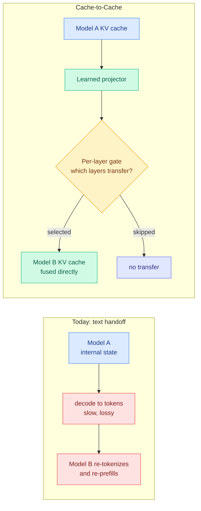
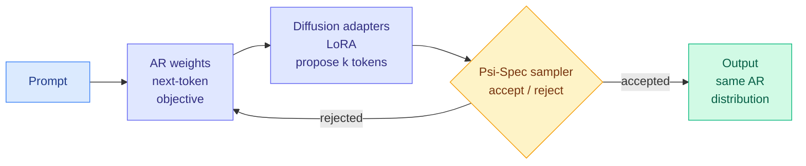

# Media Zone | 2026-09-18

> The feeds spent the day on one question with two answers: when an agent has to make a small decision, who makes it, and what should it cost.

## Today's signal

- **Dominant story: Jev goes from launch hype to practitioner measurement.** Eleven posts, third-party benchmarks, a real counter-argument, and an open reimplementation inside 48 hours.
- **Pattern: the cheap-decision layer and the cheap-memory layer converged.** Ternary weights at 5.9 GB, a KV cache at 890 bytes per token, and a classifier at a fraction of a cent are the same bet made at three altitudes.
- **Counter-signal: @theo's objection to per-tool-call compaction is technically substantive**, and the viral screenshot supporting the plugin turns out to be partly explained by something else entirely.
- **Your saved post is the day's sharpest idea:** Cache-to-Cache, where two models communicate by fusing KV caches instead of writing sentences.
- **Quiet area: nothing about training.** The entire day across X, YouTube and the research feed is inference, serving and scaffolding.
- **LinkedIn returned nothing today**, so the social read here is X and YouTube only.

---

## Routing, KV cache, compression, GPU

### Saved reading: Cache-to-Cache, or what happens when models stop writing to each other

This is the post you bookmarked last night, and it is the most interesting mechanism in the day's feed, so it gets the full treatment.

Here is the problem it attacks. When two LLM agents cooperate today, the first one takes everything it has computed, which lives as a rich high-dimensional internal state, and **squeezes it through a vocabulary built for humans** by decoding it one token at a time. The second model then reads that English back in, re-tokenizes it, and re-prefills its own context from scratch. Three costs get paid for one handoff. Sequential decoding is the slowest thing a model does because it is bound by memory bandwidth rather than arithmetic. Re-prefilling on the far side is bound by compute. And in between, a lot of what the first model knew simply does not survive the trip into words.

**Cache-to-Cache deletes all three.** A learned neural projector maps the source model's KV cache, the stored attention keys and values holding everything it has computed about the context, **directly into the target model's cache**. No text is ever generated. The reported numbers: accuracy up to **14.2% above the individual models**, over **5% above text-based agent communication**, and a **2.5x overall speedup**.

The design detail worth understanding is the **learnable gate**, because it is where the authors admit the hard part. You cannot simply dump every layer's cache across, since two independently trained models' layers are not in correspondence with each other, and early layers in particular encode surface form that is specific to one model's tokenizer and training. So the gate learns, per layer, which ones actually benefit from the transfer. That turns the method from "share the cache" into "share the parts of the cache that transfer", which is a much more honest claim.

**Why this should matter to you specifically.** Every KV cache result in your wiki treats the cache as an expense: compress it, evict it, quantize it, push it to a cheaper memory tier, share it across layers. This is the first one that treats the cache as **an asset with content worth transmitting**. And there is an unnoticed connection sitting right there. Your wiki already records four separate results showing that adjacent layers inside one model have KV states similar enough to substitute for each other. C2C's per-layer gate is, in effect, measuring the same thing **across two different models**. Nobody has asked how much cache structure two independently trained models share, and this makes the question cheap to answer.

**The thing to be uneasy about.** Text handoff between agents is currently the only point in a multi-agent system a human can read. C2C replaces it with a tensor, and the framing in both posts treats "bypassing human language" as the achievement rather than the tradeoff.

Reported as ICLR 2026 from Tsinghua and Infinigence with code open-sourced, but neither post carries an arXiv link and the 14.2% has no named benchmark, so treat the numbers as unverified.

Saved post · the day's anchor idea
<h4>Cache-to-Cache: LLMs communicating without words</h4>

Two cooperating models currently talk by decoding their internal state into English and re-reading it, which is slow on both ends and loses information in between. C2C projects one model's KV cache straight into the other's, using a learned gate to pick which layers are worth transferring at all. Reported at 2.5x faster with better accuracy than text handoff, and open-sourced. It is the first result in your wiki where the KV cache is treated as something worth sending rather than something to shrink. Worth tracking for what it does to multi-agent auditability, since it removes the only readable channel between agents.

<a href="https://x.com/thesupermannx/status/2100636553576124595">Read the saved post →</a>

[@thesupermannx](https://x.com/thesupermannx/status/2100636553576124595) · [@AYi_AInotes](https://x.com/AYi_AInotes/status/2100925284539076924) · [wiki summary](../../inference-efficiency/2026-09-18-c2c-cache-to-cache-communication.md)

### Jev, two days later: the numbers stop being the vendor's

**Cost optimization**, and the clearest example of it in months.

- **The reframing is the point.** Your routing page has always said a router must cost less than the decision it makes or it eats its own saving. If a decision primitive really is two orders of magnitude cheaper than an LLM call, that constraint stops binding, and "is estimation worth paying for" becomes "how good is a near-free estimate."
- **The strongest independent report is the least flashy.** A developer benchmarked it against judges already running in production and got 35 of 36 correct classifying sales-call transcripts into one of 32 call types. He also named the shape where it works, which nobody else did: **picking a label from a fixed list you defined, when the evidence is in the input.** That is a narrower claim than the vendor's and more useful.
- **A browser-agent benchmark reported 100% of tasks solved at roughly 112x lower model cost** than a frontier model doing computer use with code execution, and 245x lower than screenshot-based computer use. Solving 100% means the benchmark saturated, so only the cost ratio is informative.
- **The routing taxonomy in the practitioner posts is ahead of the literature.** Re-ranking, tool pruning during compaction, model routing, query routing across SQL/vector/graph stores, **cache admission** and **cache TTL prediction**. The last two are real routing decisions nobody has written a paper about, and they are the safest place to start because a wrong answer costs a cache miss rather than a wrong output.
- **The one that matters structurally:** an open API reproducing the behaviour on **Qwen3.6-35B-A3B with SGLang's radix cache**, 64 tasks in under a second. If an open model plus prefill reuse gets you there, this is a serving pattern rather than a proprietary model.

### The compaction argument, and why the screenshot is misleading

**Contested. Read both sides before adopting.**

- The viral demo was a Claude Code plugin replacing compaction with per-tool-call scoring, with a screenshot showing a session drop from **904.7k tokens (90% of a 1M window) to 86.5k in about a second**. It was the day's most-shared post by a wide margin.
- **Reading the two screenshots carefully undercuts it.** In the "after" image, **217.3k tokens of MCP tools moved to deferred**, which is a different mechanism entirely and not something the scorer did. The reduction is real but the attribution in the viral version is not.
- **@theo's objection is the substantive one.** Compaction is not a filter, its role is to clean up history so the agent stays focused, and it should run sparingly rather than constantly. More sharply: **a per-tool-call scorer never sees the thread context that tells you what matters**, whereas a summarizer reads the whole conversation first.
- Today's research lands closer to @theo. The harness ablation in the digest found context management's value comes almost entirely from **preventing overflow failures**, not from aggressive filtering, and that making elided content recoverable earns nothing.

[@drewdil benchmark](https://x.com/drewdil/status/2100684145286684872) · [@0xidanlevin WebMCP](https://x.com/0xidanlevin/status/2100937437325205568) · [@nutlope fraud pipeline](https://x.com/nutlope/status/2100614659690713543) · [@ekzhang1 open API](https://x.com/ekzhang1/status/2100651678110515383) · [@amitiitbhu use cases](https://x.com/amitiitbhu/status/2100839449576030414) · [@altryne screenshot](https://x.com/altryne/status/2100739055923425589) · [@theo rebuttal](https://x.com/theo/status/2100762304862384257)

### Uno: a lossless speedup with no draft model to train or serve

**Cost optimization**, and the highest-ranked post in your entire feed today.

- **The trade everyone accepts, refused.** Autoregressive models write one token at a time, and that sequential dependency is the hard floor on generation latency. Diffusion language models emit many tokens at once but pay in quality. Uno keeps a normal autoregressive model trained with ordinary next-token prediction and adds **lightweight diffusion weights** learned in a short distillation phase.
- **The diffusion path only proposes.** A family of samplers called **Ψ-Spec** accepts the proposed tokens in a way that **provably reproduces the autoregressive model's own distribution**, so the output is not degraded. That is the word "lossless" doing real work rather than marketing.
- **Unlike speculative decoding, there is no separate draft model** to train, tune or keep resident. That removes the serving complexity that has kept speculative decoding out of a lot of stacks.
- **Higher throughput than leading speculative-decoding methods at every batch size tested**, with up to **3x over the base model** including at the largest batch the device supports. The tweet quotes a more conservative 2.2x against diffusion baselines.
- **The adoption cost is the real story:** the released checkpoint is a **LoRA adapter over an existing 7B base**, Apache 2.0. If you already serve the base model, this is an adapter load, not a migration.

Paper + weights · top-ranked post on your feed
<h4>Uno: autoregressive quality at diffusion speed</h4>

Generating one token at a time is the hard floor on LLM latency, and the usual escapes either need a second draft model (speculative decoding) or give up output quality (diffusion LLMs). Uno splits the parameters instead: normal autoregressive weights trained the normal way, plus small diffusion weights distilled in afterwards that propose several tokens at once. A sampler family called Ψ-Spec then accepts those proposals in a way that provably reproduces the base model's own distribution, so nothing is traded away. It beats leading speculative-decoding methods at every batch size tested and reaches up to 3x over the base model. The checkpoint ships as an Apache-2.0 LoRA adapter over an existing 7B base, so trying it on a model you already serve costs an adapter load.

<a href="https://arxiv.org/abs/2609.04010">Read the paper →</a> · <a href="https://huggingface.co/IFM/K2-Horizon-7B-Uno">Weights →</a>

[@IFM_AI](https://x.com/IFM_AI/status/2100618934915592640) · [paper](https://arxiv.org/abs/2609.04010) · [weights](https://huggingface.co/IFM/K2-Horizon-7B-Uno)

### Ternary weights, and a compression ratio that has stopped improving

**Cost optimization** at the weight level, and the generational detail is more interesting than the headline.

- PrismML's **Bonsai 2 27B** compresses Qwen3.8 27B to ternary weights, meaning every weight is one of -1, 0 or +1 rather than a 16-bit float. Claimed **98.2% of FP16 benchmark performance at 5.95 GB against roughly 54 GB**, Apache 2.0, with vision, tool use and 262k context retained.
- **55 tokens per second in a browser via WebGPU on an M5 Max**, and demonstrated driving a coding agent and computer use on a single RTX 5090. The deployment envelope is the claim, not the benchmark number.
- **The generational read is the useful part.** Against the first Bonsai 27B two months ago the size barely moved while retention climbed from about 95% to 98.2%. **The compression ratio is saturating and the quality retention is still improving**, which says the remaining headroom is in the recipe, not the bit budget.
- Vendor self-report from three team accounts within minutes. "98.2% of benchmarks" is an average that can hide a bad tail, and math and code are where quantization damage usually concentrates, so verify those first.

### Claude writing CUDA kernels that beat NVIDIA's own library

- A structural-biology group reports **Claude-written CUDA kernels beating NVIDIA's cuEquivariance by 2.7 to 2.9x on triangle attention and 1.7 to 3.2x on triangle multiplication**, across 30+ models including AlphaFold3, Boltz-2 and OpenFold3, in four weeks.
- **The detail that makes it notable: two engineers supervised it and neither had prior kernel engineering experience.** Triangle operations are the cubic bottleneck in Pairformer-based structure prediction, so this is the expensive part of the pipeline, not a toy.
- **Influence angle.** This lands the same day Anthropic published metrics claiming Claude leads 26% of its own AI R&D. One is a self-report, the other is an outside group beating a vendor's hand-tuned library. The second is better evidence than the first.

[@BoWang87](https://x.com/BoWang87/status/2100731226013454422) · [@pashakho Bonsai 2](https://x.com/pashakho/status/2100691009394888738) · [@HamidMaei](https://x.com/HamidMaei/status/2100692863415894357)

---

## LLMs, agents, safety

### Harness engineering arrives in the research feed, the conference circuit and your feed on the same day

This is your most-saved theme by a wide margin, and today it showed up in four places at once.

- **Two papers in the digest** ablate harness components across 176 settings and search for them automatically, agreeing that context management is load-bearing, at about a third off API cost.
- **Berkeley posted the question directly**: does a model need its native harness? Seven models evaluated across the Claude Code, Codex and Pi harnesses. That is the cross-harness transfer experiment nobody had run.
- **The AI Engineer conference talk** "Total Recall: Agent Memory and Harness Engineering" (Oracle) is fresh and barely watched, which usually means the good version before the takes arrive.
- **Google published a five-stage agentic engineering pipeline**: specification, harness, trajectory, verification, meta-debug. Its closing line is your wiki's thesis in plainer words: stop asking which model to use, start asking what system to build around it.

### Recursive self-improvement, measured two ways

- **Google DeepMind's Dream-RSI** preserves an agent's execution history, turns it into a replay world it can re-simulate cheaply, tries alternative strategies there, rewrites its policy and redeploys. **Up to 162x fewer agent calls, 50x lower discovery budgets, 2.09x better GPU kernel performance, weights untouched.**
- **The counterintuitive finding: raw accumulated history beat summarized guidance.** That cuts directly against the instinct to compress an agent's past into lessons, and it is the second result today pointing away from aggressive summarization.
- **Anthropic's numbers**, for contrast: Claude leads 26% of its AI R&D (under 1% in February), ~30,000 agents running at any time, over a billion agent decisions reviewed in August, 0.002% blocked online, ~100,000 transcripts flagged weekly with about 50 escalated to humans. **The scoring comes from Claude itself**, which The Decoder flagged and most amplifiers did not.
- **A taxonomy worth keeping** (The Turing Post): a loop is recursive only to the extent more of the loop becomes editable. Improving the model, then improving how it searches, then deciding what experience it needs next.

### Looped transformers finally get a fair comparison

- **SMELT** (Tsinghua and ByteDance Seed) addresses the question nobody had answered cleanly: is the gain from looping, or just from spending more FLOPs? The recipe loops the middle 50% of layers twice, narrows the hidden dimension, raises expert count to hold total parameters constant, and scales looped residuals by half, **with a smaller attention head size at a higher GQA ratio specifically so the KV cache stays nearly unchanged across the extra layer executions.**
- **That KV-cache control is what makes it a fair test**, and it is the part a casual reader skips. Per-token FLOPs, non-embedding parameters and cache size are all matched.
- Result: at 10^21 FLOPs, SMELT reaches the same loss with **14.7% less compute**, and leads the baseline on all six DCLM Core axes at 1.6B scale.
- Separately, a CMU and Oxford paper argues a model can think longer by **refining its hidden state instead of emitting more tokens**, training each update on a small denoising task to keep long loops stable. **If that holds, test-time compute stops being synonymous with token count.**

[@berkeley_ai harness transfer](https://x.com/berkeley_ai/status/2100811898250055855) · [@jiqizhixin SMELT](https://x.com/jiqizhixin/status/2100754679642599480) · [@rohanpaul_ai looped flows](https://x.com/rohanpaul_ai/status/2100747487682449894) · [@Skoorbkaz Dream-RSI](https://x.com/Skoorbkaz/status/2100719809671434307) · [@vartekxx Google pipeline](https://x.com/vartekxx/status/2100692905954259089)

---

## Industry and business

- **Hacktron AI used Claude to hack OpenAI** and took 72 hours. An image-decoder heap overflow chained to remote code execution, then an SSO flaw, reaching employee ChatGPT and Codex accounts and a harmless demonstration pull request in OpenAI's internal monorepo. The most-discussed security item of the day and it is genuinely a big deal.
- **Sakana AI launched its Frontier Intelligence Group** on the explicit premise that the Transformer is not the end state, naming three targets against biological intelligence: **data efficiency, energy efficiency, generalization.** The energy framing as a research goal rather than a serving optimization is the notable part.
- **OpenAI's Astra for Law** gets 54% of legal research questions fully correct by its own test, and only the largest firms get the version where chats stay private. The feed's reaction focused on the 54%.
- **Palantir's CEO made the open-weights argument in cost terms**: discounted tokens are discounted to buy access to your proprietary knowledge, not to grow the market. Self-interested, and not wrong.
- **Bolt Forge put four open models in one picker** inside a product with 11M+ builders, and GLM 5.3 Flash has taken 54% of prompts. **Distribution, not capability, was the open-model bottleneck**, and this is the cleanest evidence for it.

### Also crossed your feeds

Stripe published the setup behind AI agents merging 1,300+ pull requests a week, where an engineer types a request in Slack and an agent spins up its own machine in about ten seconds · a Tsinghua paper arguing RL raises pass@1 while narrowing pass@k, so RL may be sharpening rather than expanding capability · 42 Royal Society Fellows including two Fields medallists signed an open letter on existential risk · Gary Marcus on why liability and regulation are not substitutes · a claimed "optical generative model" running on light with no GPU, promotional framing and no paper link, flagged not endorsed · air-gap exfiltration via CPU heat resurfaced as an agent-swarm argument (the underlying BitWhisper result is real and from 2015) · NVIDIA on shared memory for research agents when several coding agents work the same repository · AI Engineer talks on Homa replacing TCP for AI clusters and on chunking strategies being stuck in 2022 · ColdFusion on how to lose $35 billion betting on AI.

[@HacktronAI](https://x.com/HacktronAI/status/2100795824812777893) · [@SakanaAILabs](https://x.com/SakanaAILabs/status/2100780326737858715) · [@rohanpaul_ai on Bolt Forge](https://x.com/rohanpaul_ai/status/2100666274334536156) · [@undefinedKi on Stripe](https://x.com/undefinedKi/status/2100921473321816538)

