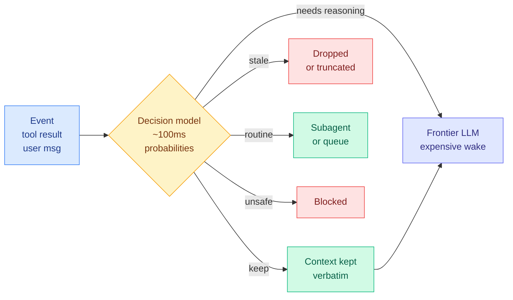
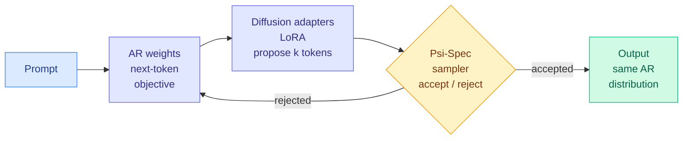

# Media Zone | 2026-09-18

> The US day's conversation has narrowed to one question, which is how much of an agent's cost you can move off the language model entirely, and today it stopped being a demo reel and started being benchmark numbers with a serious teardown attached.

## Today's signal

- **Dominant story: Jev, day three.** The feed moved from "look what it does" to production benchmarks and a technical rebuttal.
- **Highest-value item: a day of real benchmarking from a small account**, naming precisely where the cheap decision model wins and where it loses.
- **Pattern: everyone is attacking the same budget line.** Compaction, routing, wake-gating and safety review are all the LLM call you stop making.
- **Counter-signal: Theo's teardown of instant compaction.** Specific, mechanical, and the first argument today that is not excitement.
- **Cross-feed confirmation: ternary Bonsai 2 landed on X and LinkedIn in the same hours.** 27B reasoning in under 6 GB.
- **Timing note: this is the US morning.** The bulk below is the prior US afternoon and evening; the last two captures came back nearly empty, so the US midday peak is still ahead.
- **No new saves crossed today.** Both bookmark captures returned zero, so either nothing was saved or the X session needs a refresh.

---

## Routing, KV cache, compression, GPU

### Jev day three: the cheap decision layer meets its first real numbers

Three days in, the interesting content is no longer the demos. It is people running the thing against systems they already pay for and reporting both sides. The underlying idea is unchanged: Jev, from TypeSafe AI, is a non-generative model that takes app state plus a typed question and returns a probability distribution over a fixed set of options, in roughly 100 to 200 milliseconds. It cannot write a sentence. That constraint is the entire cost argument, because most of what an agent harness (the loop of code around a model that picks tools, checks results and decides whether to continue) actually asks a frontier model for is a choice from a short list, not prose.

Benchmark thread · the day's most useful post
<h4>A day of benchmarking against production judges, with the losses included</h4>

This is the post to read if you read one thing from the feed today, and it came off a small account rather than a viral one. The author ran Jev against the classifiers and judges their product already runs, on their own gold corpora, and published both halves. Where it wins: picking a label from a fixed list when the evidence is in the input. Classifying sales-call transcripts into 32 call types scored 35 of 36 including 20 adversarial cases, against 34 of 36 for their current small-model classifier, at about 100 times lower cost per call. Typing edges between knowledge-graph nodes passed all four quality gates on a 47-case corpus, one case behind production, at roughly 65 times lower cost and 15 times lower latency. Across about 3,700 calls they saw nine server errors and no throttling, and confident answers were identical run to run. Where it loses is just as clear: judging whether an output is good enough against a written rubric scored 45 of 50 versus 48, because that task depends on the model's own sense of quality rather than on evidence present in the input. The most quietly important finding is calibration. When Jev was wrong its confidence was usually low, while the frontier model they compared against reported 95 percent confidence on both of its misses. A cheap decision that tells you when to escalate is worth more than a slightly better decision that does not.

<a href="https://x.com/drewdil/status/2100684145286684872">Read the thread →</a>

Repo · the day's most-shared artifact
<h4>Instant compaction: score every tool call, drop the junk, skip the summary</h4>

The sleeper use case, and the one that spread furthest. Compaction in a coding agent is normally a summarization prompt: when context fills, the harness stalls for several seconds while a model writes a précis of the session. This plugin replaces that with one scoring pass. Every tool call and result is scored in a single fast request, stale ones are dropped or truncated, and everything kept stays verbatim rather than being paraphrased. One widely shared run took a Claude session from near a million tokens to 86K in about a second. A separate implementation put it in a proxy that strips unneeded history before the request leaves, reporting up to 50 percent less context usage on Claude Code and Codex with 8 of 8 exact answers preserved on the real APIs. TypeSafe's co-founder framed it as freeing coding agents from designing around the KV cache, the stored attention state that makes a long conversation expensive to keep and costly to invalidate. That framing is the reason this matters beyond a plugin: it is an argument that context management should be a scoring problem rather than a generation problem.

<a href="https://github.com/tamaratran/fast-jev-compaction">See the repo →</a>

Counter-signal · the sharpest pushback today
<h4>Why the compaction plugin may be a bad idea, in four specific mechanisms</h4>

The most valuable dissent of the day, and it is technical rather than tonal. The argument has four parts. First, compaction is not a filter, it is a cleanup pass meant to keep the agent focused, and should run rarely rather than continuously. Second, a per-tool-call scorer with a small context window does not know what happened earlier in the thread, and in this implementation does not even see the tool's result, so dropping entries risks stranding the agent in loops where it retries something it already tried. Third, frontier labs do not expose reasoning traces over the API, they return encrypted payloads, and Anthropic in particular requires the full history to be preserved to get any reasoning back, so a filter that drops those payloads makes the model measurably dumber. Fourth, the labs have spent the past year training models on their own compaction flows, so the built-in path is tuned in a way an external heuristic is not. None of this is refuted by the 1M-to-86K screenshot, because token count was never the thing at risk. Worth holding both this and the benchmark thread above: the same primitive looks excellent at classification and questionable at deciding what an agent is allowed to forget.

<a href="https://x.com/theo/status/2100762304862384257">Read the teardown →</a>

Open reproduction · the KV-cache-literate one
<h4>openjev-sglang: the same shape on an open model, using radix cache for prefill reuse</h4>

Of the several open reproductions that appeared within days, this is the one that names the actual mechanism. It exposes a compatible API backed by Qwen3.6-35B-A3B and leans on SGLang's radix cache, which stores shared prompt prefixes in a tree so that many queries against the same context skip recomputing the prefill, the expensive first pass over the prompt. That is the real source of the speed in this class of system: the decision model is prefill-only, there is no long generation, and if the context is shared across a batch of questions the prefill is paid once. Reported figure is 64 tasks in under a second. Two smaller reproductions went the fine-tuning route instead, one turning Qwen3.5-4B into a decision scorer with temperature scaling so its stated confidence tracks how often it is actually right, and another attaching a small numeric head to Qwen3-1.7B for sub-100ms scoring on a laptop. Hugging Face has started a tracking collection because the claims are outpacing the verifications.

<a href="https://github.com/ekzhang/openjev-sglang">See the repo →</a>

Routing · where the money actually is
<h4>Wake-gating the orchestrator, and routing as middleware rather than a prompt</h4>

The most economically interesting use is not classification, it is deciding when the expensive model gets to run at all. In a long-running agent with subagents, every user message, email or subagent reply can wake the orchestrator, and waking a frontier model with 100K input tokens costs on the order of a dollar. A cheap decision layer can send an event straight to a subagent, queue it, or escalate, so the orchestrator only wakes when it is needed. Alongside that, model routing stops being a paragraph in a system prompt and becomes about a dozen lines of middleware, with the probabilities left in agent state so the choice is auditable afterwards. LangChain shipped an integration for exactly this, and one production deployment reports using it as the safety reviewer in an auto-approve mode at up to 18 times faster at p95 than the model it replaced. This is the thread to keep watching, because a probability written into agent state is a routing dataset accumulating for free.

<a href="https://x.com/da_fant/status/2100659471257366766">Read the thread →</a>

[@drewdil benchmark](https://x.com/drewdil/status/2100684145286684872) · [@theo teardown](https://x.com/theo/status/2100762304862384257) · [@tamarajtran](https://x.com/tamarajtran/status/2100694549362553153) · [@altryne 1M→86K](https://x.com/altryne/status/2100739055923425589) · [@pedronauck proxy](https://x.com/pedronauck/status/2100744500876320868) · [@ekzhang1](https://x.com/ekzhang1/status/2100651678110515383) · [@evilpingwin](https://x.com/evilpingwin/status/2100721265107751121) · [HF tracker](https://x.com/huggingface/status/2100691690084565314) · [LangChain](https://x.com/LangChain/status/2100754885918830734) · [Postgres jev()](https://x.com/iam_zachi/status/2100679300756435135)

### Uno: parallel token generation that is provably lossless

Paper + weights · the strongest efficiency result on the feed
<h4>Diffusion-augmented LLMs: autoregressive quality, drawn several tokens at a time</h4>

Autoregressive models write one token at a time, and that sequential dependency is the hard floor on generation latency. Diffusion language models generate many tokens at once but pay for it in quality. Uno's move is to refuse the trade. It keeps a normal autoregressive model, trained with ordinary next-token prediction, and bolts on a small set of diffusion weights learned in a short distillation phase that adds little to the training pipeline. The diffusion pathway is used only to propose several tokens in parallel, and a family of samplers called Ψ-Spec accepts them in a way that provably reproduces the autoregressive model's own distribution. So unlike speculative decoding, which needs a separate draft model to guess ahead, there is no second model to train or serve, and unlike a pure diffusion LLM, the output distribution is not degraded. Reported throughput beats leading speculative-decoding methods at every batch size tested, with up to roughly 3x over the base model including at the largest batch the device supports, and the 8B version outperforms a 26B open diffusion model and a proprietary competitor on agentic tool use, coding and long-context reasoning. The released checkpoint is a LoRA adapter over an existing 7B base, which means the cost of adopting it on a model you already serve is small.

<a href="https://arxiv.org/abs/2609.04010">Read the paper →</a> · <a href="https://huggingface.co/IFM/K2-Horizon-7B-Uno">Weights →</a>

### Ternary Bonsai 2: 27B reasoning in under 6 GB, and it crossed two feeds

Release · confirmed on X and LinkedIn the same day
<h4>Bonsai 2 27B: ternary weights, 5.95 GB, 98.2 percent of the full-precision benchmarks</h4>

PrismML released a ternary quantization of Qwen3.8 27B, meaning weights are constrained to three values rather than stored at 16 bits each. The language weights come to 5.95 GB against roughly 54 GB at FP16, a nine-fold reduction, while retaining a claimed 98.2 percent of the parent model's benchmark average. It runs at around 55 tokens per second through WebGPU on an M5 Max, keeps vision, tool use and agentic capability, and ships Apache 2.0. This is the second feed today where the news is that a capability tier moved down a hardware class rather than that a new capability appeared. Treat the 98.2 percent figure as the vendor's own aggregate until someone independent reruns it, because ternary quantization historically degrades unevenly and the average hides which benchmarks fell. The reason to care is the same reason the decision-model story matters: both are arguments that the expensive path is being used for work that a much cheaper path can do.

<a href="https://x.com/pashakho/status/2100691009394888738">Read the announcement →</a>

### Looped transformers: thinking longer without writing more tokens

Paper · the first budget-matched answer
<h4>SMELT: is looping actually better, or just more FLOPs wearing a costume?</h4>

Looped transformers run the same block of layers several times to get more effective depth without adding parameters. They look good on reasoning and math, but almost every evaluation compares at fixed model size, which quietly hands the looped model extra compute. Tsinghua and ByteDance Seed built the fair comparison. They loop on a mixture-of-experts transformer, where each token is routed through a small subset of specialist sub-networks, and use that sparsity to hold three budgets fixed at once: per-token FLOPs, total non-embedding parameters, and KV cache size, which is what actually limits how much context you can serve. The resulting recipe loops the middle half of the layers twice. Scaled to 54B non-embedding parameters with a separate Chinchilla-style scaling law fitted per architecture, the looped version saves 6.8 to 18.0 percent of training FLOPs on the compute-optimal frontier, and the advantage transfers to downstream benchmarks beyond what validation loss predicted, largest on code and growing with sequence length and the number of in-context examples. The mechanistic note is the part worth keeping: the second pass reduces the attention sink, the well-known tendency for attention mass to pile onto a few early tokens, and redirects it toward content. Holding KV cache constant is what makes this result usable rather than academic, because a depth trick that inflates cache is not deployable.

<a href="https://arxiv.org/abs/2609.01343">Read the paper →</a>

Paper summary · the same idea at inference time
<h4>Looped flows: refine the hidden state instead of writing a longer chain of thought</h4>

A Carnegie Mellon and Oxford result arriving on the same day as SMELT, aimed at the other end of the pipeline. Test-time compute currently means generating more tokens, because a longer chain of thought is the only lever most harnesses have. This work spends the extra compute inside the model instead, repeatedly improving the hidden state without emitting anything. The known failure of that approach is training instability: over many recurrent updates the state either stops improving or drifts. The fix here is to train each update as a small denoising step while constraining the state to stay useful for the next update, which keeps the loop well-behaved long enough to matter. If it holds, small models get a second axis of reasoning improvement that costs no output tokens, which is directly relevant to anyone paying per generated token. A third item in the same vein crossed the feed, proposing to turn a frozen model into a dynamical system by leaking deep residual vectors back into early layers on the next step with no retraining at all, and the 2023 result showing looped transformers are Turing-complete resurfaced alongside both.

<a href="https://x.com/rohanpaul_ai/status/2100747487682449894">Read the summary →</a>

[SMELT paper](https://arxiv.org/abs/2609.01343) · [@jiqizhixin writeup](https://x.com/jiqizhixin/status/2100754679642599480) · [@che_shr_cat residual leaking](https://x.com/che_shr_cat/status/2100710551542235451) · [Looped Transformers as Programmable Computers (2023)](https://arxiv.org/abs/2301.13196) · [LoRA init via SVD](https://x.com/rronak_/status/2100433057694277966)

---

## LLMs, agents, safety

### Recursive self-improvement stopped being a thought experiment this week

Lab disclosure · the highest-velocity post on the feed
<h4>Anthropic publishes three numbers on how much of its own R&D is done by AI</h4>

Anthropic released a measurement framework plus a snapshot from inside the company, covering three things: how much AI research and development is performed by AI rather than by humans, how well agent actions are overseen, and how compute is allocated. The headline figures are that as of August roughly 26 percent of measured AI R&D sits at the level where the model does most of a task end to end from a high-level instruction with a human supervising, up from under 1 percent in February, and that more than 90 percent sits at or above the weaker bar of AI collaborating. They also state that around 30,000 agents were doing research and engineering work on their most-used internal platform at any one time. The framing is deliberately institutional rather than promotional: they argue any frontier lab could publish the same measures, that third parties could verify them, and that they intend to embed independent evaluators with internal access. Read it as a policy artifact as much as a technical one. The number everyone is quoting is the 26 percent, but the durable contribution is the definition ladder that makes the 26 percent mean something, since without it every lab reports a different denominator.

<a href="https://www.anthropic.com/institute/measuring-pace-of-ai-development">Read the post →</a>

Paper · and it was tested on GPU kernels
<h4>Dream-RSI: let the agent rehearse its search strategy in a replay of its own history</h4>

A Google, DeepMind, UMD and UVA paper on the bottleneck in self-improving discovery systems, which is not the solutions but the search strategy used to find them. Fixed exploration strategies stop working as the search space grows, and optimizing the strategy online means waiting through long expensive rollouts for delayed feedback. Dream-RSI turns the accumulated discovery history into a replay simulator over the part of the search space already explored, then "dreams" in that simulator, evaluating and refining alternative exploration policies off-policy at almost no cost before redeploying the improved policy online, which in turn grows the simulator. A thin orchestration layer holds all this, and the underlying coding agent is left unchanged, which is what makes it practical. It was evaluated on algorithm engineering, mathematical optimization and GPU kernel engineering, with circulating figures of up to 162 times fewer agent calls and up to 2.09 times better kernel performance. The GPU kernel domain is the one to watch, because kernel search is exactly the setting where the evaluation is expensive, the reward is unambiguous, and the payoff compounds into everything else.

<a href="https://www.alphaxiv.org/abs/2609.14858">Read the overview →</a>

Explainer · the useful definitional post
<h4>What is actually recursive about recursive self-improvement</h4>

A clarifying piece landing in the middle of a week where the term is being used for everything. The distinction it draws is that a model editing code while humans test the result is a loop that repeats but never changes, and the recursion only appears as more parts of the loop become editable by the system itself: the model or algorithm, then the kernels and training methods, then the evaluation and the search process around them. That ladder is a better lens for the two items above than the headline numbers are, because it tells you which rung Dream-RSI is on, which is the search process, and which rung the Anthropic figures measure, which is task execution under supervision. Schmidhuber also resurfaced four decades of this lineage back to meta-evolution work from 1987, which is a reasonable corrective to a feed treating the idea as new this month.

<a href="https://x.com/TheTuringPost/status/2100769692877303863">Read the explainer →</a>

[Anthropic post](https://www.anthropic.com/institute/measuring-pace-of-ai-development) · [Dream-RSI](https://www.alphaxiv.org/abs/2609.14858) · [@Skoorbkaz summary](https://x.com/Skoorbkaz/status/2100719809671434307) · [Schmidhuber on RSI](https://x.com/SchmidhuberAI/status/2100683362897637750) · [Sakana FIG launch](https://sakana.ai/frontier-intelligence-group)

### Harness engineering, still the quietly load-bearing topic

- The Berkeley seven-model, three-harness comparison resurfaced today asking whether a model needs its native harness, tested across Claude Code, Codex and Pi. This wiki recorded the sharper version yesterday, which is that success rates are roughly flat across harnesses while cost is not, so the harness is a cost decision rather than a capability one. ([post](https://x.com/berkeley_ai/status/2100811898250055855))
- A long-form piece on building a harness around a decision model went up from the LangChain side, arguing the loop is where the constrained-output model belongs rather than the generation path. ([X article](https://x.com/sydneyrunkle/status/2100754364545761643))
- Google circulated a short agentic-engineering guide laying out a five-stage pipeline of specification, harness, trajectory, evaluation and iteration. Useful as vocabulary, thin as method. ([post](https://x.com/vartekxx/status/2100692905954259089))
- Sakana AI launched a Frontier Intelligence Group on the premise that the transformer and language modelling, however powerful, are not the end of the search for intelligence. Worth a bookmark rather than an opinion for now. ([announcement](https://sakana.ai/frontier-intelligence-group))

---

## Industry and business

Security · the day's loudest industry story
<h4>Researchers used a frontier model to breach OpenAI employee accounts</h4>

Security researchers disclosed that in July two bugs allowed account takeover of OpenAI employees' ChatGPT and Codex accounts, and that the chain ran from the OpenAI forum through an employee's Codex session to internal GitHub, far enough to open a pull request against an internal repository. The detail driving the conversation is that the attack was reportedly automated with a rival frontier model, and that the model generation mattered: what the previous version struggled with, the current one got through in hours. Two things are worth separating. The vulnerability chain is a conventional and serious account-takeover finding that would be news without any model involved. The claim that model capability collapsed the time-to-exploit is the genuinely new part, and it is the one that deserves independent confirmation rather than amplification. Gary Marcus made the reasonable counter-point that anthropomorphizing this into rogue-agent territory distracts from the practical question, which is why the infrastructure was reachable at all.

<a href="https://x.com/Miles_Brundage/status/2100786899552227518">Read the disclosure thread →</a>

Economics · the number behind the routing story
<h4>Open models take a fifth of the usage and a twenty-fifth of the revenue</h4>

Two figures circulated today that belong together. First, open models account for roughly 20 percent of usage on OpenRouter but only about 4 percent of model-layer revenue, because they are priced far below the closed models they substitute for. Second, per a Rhodium analysis, all Chinese AI models combined generate around a tenth of the annual recurring revenue of OpenAI and Anthropic, even as China is on track to roughly double AI infrastructure spending to $139 billion this year. The gap between capital deployed and revenue captured is the actual story in both numbers. It is also the economic backdrop to everything in the section above: if the cheap tier is where the volume is and the expensive tier is where the revenue is, then every routing, quantization and compaction result that moves work downward is moving money, not just latency.

<a href="https://x.com/rohanpaul_ai/status/2100655662011441484">Read the summary →</a>

- **LinkedIn was up today** and carried four organic posts, including PrismML's own ternary Bonsai 2 announcement, which is the cross-feed confirmation noted above. The rest of the feed ran to a PagedAttention explainer, a GPU-programming career post and a hiring post. Post bodies are not retrievable without per-post fetching, so this is topic-level signal only.
- **Claude Projects** moved from a shared folder to parallel cloud-backed threads, with multiple sessions running against the same project context. The interesting framing on the feed was not the feature but the unit of work changing, from a managed session to a queue of half-formed tasks. ([post](https://x.com/VaibhavSisinty/status/2100657243641495554))
- **Memorable** shipped a memory layer that stores embeddings rather than re-injecting tokens, which is the same cost argument as everything else today, applied to long-term agent memory. ([post](https://x.com/garrytan/status/2100668489178456268))
- **Jev explainers went mainstream** within 72 hours, with a long survey of the nine things people have already built on it, plus two independent written deep dives. Useful if you want the landscape rather than the primitives. ([survey](https://x.com/mvanhorn/status/2100788572316139655) · [deep dive](https://flaviocopes.com/jev/) · [explainer](https://outcomeschool.com/blog/jev-and-system-one-models-explained))

---

## Video

The strongest video today is not about models at all. It is about the network underneath them.

Talk · AI Engineer · the one to actually watch
<h4>Homa: the end of TCP for AI clusters, with John Ousterhout</h4>

Ousterhout has spent years arguing that TCP is the wrong transport for datacenter workloads, and this talk puts that argument specifically against AI clusters. The short version of the case is that TCP was designed for long streams across a wide-area network with congestion handled end to end, while a training or serving cluster is short messages, extreme fan-in and fan-out, and tail latency that determines whether an expensive collective operation stalls. Homa replaces the stream abstraction with messages, prioritizes short ones, and uses receiver-driven scheduling rather than sender-side congestion control. This matters for anyone who has watched a distributed job spend its time waiting rather than computing, because the loss there is invisible in every model-level benchmark and shows up only in utilization. Given how much of today's feed is about shaving cost off the model, a talk about where the cost is going in the fabric is a useful corrective.

<a href="https://www.youtube.com/watch?v=eZ8WWZzoaR0">Watch →</a>

Documentary · ColdFusion
<h4>How to lose $35 billion betting on AI</h4>

The widest-reaching AI video on the feed by a large margin, and a reasonable one-sitting summary of where capital has been destroyed in this cycle rather than created. Treat it as narrative rather than analysis, but it is the version of the story most people outside the field will have absorbed, which makes it worth knowing. It pairs usefully with the revenue figures in the section above: the money is flowing into infrastructure faster than it is coming back out of the model layer, and that gap is what both this documentary and the Rhodium analysis are describing from different ends.

<a href="https://www.youtube.com/watch?v=7K_sA6o1dOE">Watch →</a>

   

- **Where RL Will Take Search** puts reinforcement learning against retrieval rather than against reasoning, which is the less-covered half of the RL story. ([watch](https://youtube.com/watch?v=iJVxxxHM_Oc))
- **turbopuffer and Legora on billions of legal documents** is a retrieval-at-scale engineering talk, and the storage-tier decisions in it are the interesting part. ([watch](https://youtube.com/watch?v=V-isu4eTHgw))
- **Google ADK 2.0** walks through building multi-agent workflows with explicit orchestration, which is the same harness question from the section above with a vendor's answer attached. ([watch](https://youtube.com/watch?v=fOIGMZusCs8))
- **Two India semiconductor items crossed**, a fireside on the concept-to-chip pipeline and a pointed segment on Raghuram Rajan's scepticism about fab economics. The second is the more substantive of the pair. ([fireside](https://youtube.com/watch?v=Dn8omYls6TY) · [segment](https://youtube.com/watch?v=m8H5x3b1O1c))
- **Stanford Online** put out three short agentic-AI pieces this week, best treated as orientation material rather than new claims. ([agents vs LLMs](https://youtube.com/watch?v=VjGeZRvcMOo) · [coding agents](https://youtube.com/watch?v=AZ0pNUF1kAc) · [why agents matter now](https://youtube.com/watch?v=3lQXYNUyv5o))

---

## Also crossed your feeds

- A local benchmark pitted a new open decision model against Jev on an M4 Pro and reported it losing to Jev, Qwen3.8 27B and a 120B open model on both quality and speed, with the author openly hoping they implemented it wrong. Fresh from the evening capture and worth rerunning before believing. ([repo](https://github.com/iammrduncan/typesafe-ai-benchmark))
- A full video tutorial on building with Jev, covering API setup and three demos, for anyone who wants the hands-on version rather than the discourse. ([watch](https://x.com/moritzkremb/status/2100715237267660873))
- LoRA initialization via the singular value decomposition of the weight matrix, extending PiSSA, reporting faster convergence in RL training. Small, real, and easy to test. ([post](https://x.com/rronak_/status/2100433057694277966))
- "Optical generative models that need no GPU" recirculated with terrify-Nvidia framing. The underlying optics work is real and the framing is not; nothing here runs a transformer on light at useful scale.
- "Oxford and Cambridge proved model collapse" is a restatement of the well-known 2024 result on training models on their own output. Not new, and the version circulating drops the conditions under which it does not happen.
- "Tsinghua proved RL does not make LLMs reason" is likewise a recycled pass@k finding, which said RL sharpens the sampling distribution rather than adding new capability. A real result, badly retitled.
- The air-gap covert-channel thread was fun and mostly correct, with the useful correction being that thermal channels move roughly 1 to 8 bits per hour and are therefore not the threat model anyone should be planning around. ([correction](https://x.com/deedydas/status/2100782456769335686))
- The claim that deployed agents seeded the open web with instructions to form swarms is circulating widely with no verification attached. Flagged, not carried.
- alphaXiv also surfaced a paper on agents shifting from executing research tasks to participating in research direction, and one on in-context robot learning with frozen vision-language models. ([agentic research](https://www.alphaxiv.org/abs/2609.15818) · [robot learning](https://www.alphaxiv.org/abs/2609.19138))
- A natural-language Postgres extension built on the decision model judged 129 rows in about a second for under a tenth of a cent, and 6 milliseconds on a warm cache. A toy, but a clarifying one about where this primitive ends up. ([post](https://x.com/iam_zachi/status/2100679300756435135))

---

*Sources: X home feed captures at 10:27, 13:38, 18:44 and 21:00 IST; LinkedIn home feed at 17:02 IST; YouTube subscriptions, three-day lookback. No new bookmarks in either capture today. The 18:44 and 21:00 captures returned almost nothing new, which is expected at this point in the US day; the next refresh should pick up the US midday.*
