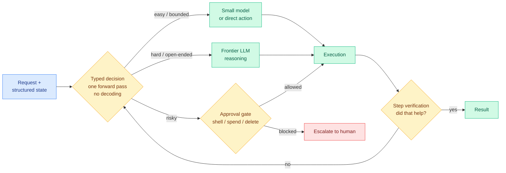

# Media Zone | 2026-09-20

> Rebuilt off the last capture of the US day, which lands in the US early afternoon, so this is the conversation at full volume. It spent the whole day on one question: which decisions in an agent loop deserve a frontier model, and what the rest should cost.

## Today's signal

- **Dominant story: the decision layer got measured.** JevBench shipped as the first independent leaderboard for decision-only models, and the hosted original leads the open field by less than a point.
- **The cost argument stopped being theoretical.** Three separate teardowns today put real invoices behind the routing claim, including one build that cost $23 instead of $1,100.
- **Counter-signal, and it is the good kind.** Two practitioners tested the leading open clone directly and found short context and near coin-flip accuracy before fine-tuning. Fast and wrong is still wrong.
- **Pattern: everyone independently landed on the same trick.** Stop sampling, read the logits. Six clone architectures, one mechanism, because nobody knows what is actually inside the closed model.
- **Second use case nobody predicted: evaluation.** LangChain, Hamel Husain and two more converged on typed evaluators replacing LLM judges, on repeatability rather than accuracy.
- **Quiet areas: training and semiconductors.** Everything today is inference, serving and scaffolding. No saved posts were captured in any of today's three bookmark runs, and LinkedIn returned an empty feed, so this is X and YouTube only.

---

## Routing, KV cache, compression, GPU

### The decision layer gets a scoreboard

The story this wiki has been tracking since 15 September reached its measurement phase. Jev, TypeSafe AI's closed decision-only model, takes application state plus a fixed list of options and returns which option with a calibrated probability, in one forward pass, with no generated text to parse. On 09-16 the digest filed a falsifiable prediction: an independent benchmark within 30 days or treat it as vapor. Today that benchmark exists.

- **JevBench is live and the gap is under a point.** Hosted Jev leads at 75.3, the open SemIf is second at 74.6. The score deliberately blends intelligence, calibration, speed and cost as a geometric mean, so no single axis can carry a model. GPT-5.6 Luna scores higher on raw hard-case accuracy and still loses the composite, which is the honest read: this measures a narrow typed-decision workload, not general capability.
- **Cost angle: the whole point is that the cheap axis is now scored.** Every prior decision-model claim was accuracy-only, which let a 400ms hosted call look equivalent to a 38ms local one. Pricing latency and cost into the leaderboard is what makes the routing argument checkable.
- **Nimble-9B is the cleanest open recipe so far.** Bespoke Labs LoRA fine-tuned Qwen3.5-9B on 2,676 examples, no distillation from Jev and no RL, and got 90.12% on their held-out set against Jev's 93.21%. The base model scored 66.36%. Built in a day, open data, open recipe.
- **decider-2b goes for latency instead of accuracy.** A 1.9B Qwen3.5 base reporting 4.0ms single-request latency with CUDA graphs and 1,670 decisions per second batched at FP8, up to 32k context and up to 255 options per question.
- **Cheapest version of the idea needs no new model at all.** LLM2Jev wraps any HuggingFace causal model with next-token scoring over a constrained option set, prefill-only, served through Transformers or SGLang. You already have the weights, you just stop letting them generate.

Benchmark · the day's resolution
<h4>JevBench: the first independent leaderboard for decision-only models</h4>

Until today every claim about this model class came from the vendor or from a weekend reproduction with its own eval. JevBench scores models whose output is a bounded software decision rather than prose, and it combines four axes into one geometric mean: intelligence, calibration, speed and cost. The geometric mean is the design choice that matters, because it stops a model from buying a good score with accuracy alone while being too slow or too expensive to deploy. The result is that GPT-5.6 Luna beats Jev on hard-case accuracy and still loses overall. Hosted Jev sits at 75.3, the open SemIf at 74.6, which is the strongest evidence yet that the capability replicates and the hosted edge is thin.

<a href="https://benchmarkheaven.com/jev-models">See the leaderboard →</a>

Open model · fully reproducible recipe
<h4>Bespoke Nimble: a 9B open decision model built in one day</h4>

Nimble is a LoRA fine-tune of Qwen3.5-9B trained on 2,676 examples, with no distillation from the closed model and no reinforcement learning anywhere in the recipe. Instead of writing JSON or an explanation, it scores the allowed answers directly and returns the choice with probabilities. On a 324-example held-out test the base model gets 66.36%, a 27B model gets 84.88%, and Nimble gets 90.12% against the hosted original's 93.21%. Median latency is around 106ms on an H100 and 444ms on an M5 Pro laptop. The reason to care is not the score, it is that the data, weights and training recipe are all public, so this is the first clone anybody else can rebuild from scratch.

<a href="https://github.com/bespokelabsai/nimble">Open the repo →</a>

Open model · read with the caveat below
<h4>Laya: a 421M open decision engine claiming 38ms and 100+ languages</h4>

Laya is the most-shared open alternative of the day, a ModernBERT-style encoder of roughly 421M parameters trained with RLCD, reporting 38ms per query against the hosted model's 400ms and multilingual routing across more than a hundred languages. It is also the item with the most credible pushback attached, so read the two together. An MLX port landed the same day running 60 decisions per second in under a gigabyte on an M3 Max. Its author separately claims prior art from a March 2025 arXiv paper, which turned into the day's small priority dispute. Treat the speed numbers as real and the accuracy numbers as unverified until someone benchmarks it at realistic context lengths.

<a href="https://huggingface.co/convaiinnovations/laya">Open the model card →</a>

[@rohanpaul_ai on JevBench](https://x.com/rohanpaul_ai/status/2101435924790026437) · [@airesearch12 launching it](https://x.com/airesearch12/status/2101311769113178270) · [@TeksEdge on Nimble](https://x.com/TeksEdge/status/2101400940523946131) · [decider-2b](https://huggingface.co/Mapika/decider-2b) · [LLM2Jev](https://github.com/Yinsongxu/LLM2Jev) · [laya-mlx](https://github.com/mizorewww/laya-mlx) · [jev-align](https://github.com/sutro-sh/jev-align)

### What it actually costs: three teardowns with invoices attached

This is the cluster that matters most for your work, because it is the first day the routing argument came with real bills rather than vendor multipliers. The self-reported "193x faster and 444x cheaper" figures circulating today are marketing. The three numbers below are not.

- **938 of 1,284 tool calls in one agent session were binary questions.** Tagging every call in a single run showed $38.61 of a $64.77 bill went to yes-or-no decisions: does this page link, is this a duplicate, safe to apply, keep or drop from context. Rerouted to a classifier the same session cost $26.16, at 38ms and $0.000041 per decision against 1.84s on the frontier model. Twenty-eight minutes of that run was a frontier model thinking about yes and no.
- **A whole prototype for $23 instead of $1,100.** The freshest cost post of the day, and the argument underneath it is about option value rather than margin. At $1,000 the first speculative build often never happens because you talk yourself out of it. At $23 you build it, watch it fail, change the loop and rerun. Cheap decisions do not just lower the invoice, they lower the threshold for trying anything.
- **The KV cache is the other half of the bill.** A 50-agent cluster hit $48,600 a month because it re-read roughly a million tokens of raw repository files on every prompt, treating the context window like disk instead of volatile memory. The fix was structural: lock a stable system prefix to hit a 99.1% KV cache hit rate, then strip function bodies with AST elision before anything reaches the model. Cache-hit discipline first, model choice second.
- **NVIDIA and MIT went after the scaffold instead of the model.** SoL-Pi evolves the agent's runtime machinery automatically rather than hand-patching it, holding task scores on GPT-5.6 Sol and Opus 5 across 51 real coding tasks while cutting token consumption 49%, which they price at $8.75 to $13.50 saved per hour of running. The framing is the useful part: teams watch model prices fall while their own scaffolding burns the savings.

Cost teardown · freshest post of the US day
<h4>The same token volume: $23, $1,100, or $2,258</h4>

One builder ran the identical simulation workload through three options and published the spread. On the decision-only model it cost $23. The same token volume on a mid-tier frontier model would have been about $1,100, and on the top-tier one about $2,258. The interesting claim is not the ratio, it is what the ratio does to behaviour. There is a hidden tax on every new idea, which is the cost of finding out whether it is even feasible, and at four figures that tax quietly kills most prototypes before they exist. This is the clearest statement yet of why a cheap decision layer changes what gets built rather than just what gets billed.

<a href="https://x.com/MKhordoo/status/2101707803261886744">Read the post →</a>

NVIDIA + MIT · scaffold optimization
<h4>SoL-Pi: evolve the agent harness instead of hand-tuning it</h4>

Most agent scaffolding is written by engineers who test a handful of cases, declare it tuned, and then watch it fall apart on long multi-step tasks. SoL-Pi replaces the hand-patching with an automatic evolutionary search over four runtime mechanisms, letting the algorithm discover the scheduling and context policy instead of hardcoding it. Evaluated on 51 real coding tasks against GPT-5.6 Sol and Claude Opus 5, task scores held flat while token consumption dropped 49%, which the authors convert to $8.75 to $13.50 saved per hour of agent runtime. The lesson lands squarely on the efficiency axis: teams have been waiting for model prices to fall while their own harness burns the difference.

<a href="https://x.com/AYi_AInotes/status/2101465984284443129">Read the thread →</a>

[$64.77 to $26.16 teardown](https://x.com/0xCarnagee/status/2101456270909690202) · [KV cache serving floor](https://x.com/marfinxx/status/2101446532511731962) · [ranked use cases for the decision layer](https://x.com/suraj_sharma14/status/2101559482941849632) · [Jev Engineering as a control system](https://x.com/0xRicker/status/2101705843200721203)

### GPU and inference craft: a good day for the fundamentals

Away from the decision-model noise, the actual engineering content today was unusually strong, and most of it is video.

- **A CUDA guide circulating as the third resource in an AI performance engineering repo**, pitched as putting you ahead of 90% of people if you work through it properly. Worth the time on the kernel side.
- **GPU MODE ran a full lecture on formal verification of GPU kernels**, which pairs sharply with a skeptical post today arguing that fields keep claiming correctness because "we use Lean" without a formal semantics of the language being verified. Garbage semantics in, garbage verification out.
- **Sebastian Raschka shipped part four of his reasoning-model series, on inference scaling.** It builds temperature scaling, top-p filtering and multinomial sampling from scratch, then uses that diversity for self-consistency and best-of-N, reporting better than 2x accuracy improvement. His shorter companion video on different tokens getting different compute is the more interesting one for routing work.
- **Four AI Engineer talks landed at once**, and the useful pair is weight folding plus CUDA streams, and a vLLM debugging walkthrough. There is also a serving talk on running large clusters for small models, which is the infrastructure face of everything in the cluster above.
- **Serving 100 fine-tuned models on one GPU** resurfaced, the LoRA multi-tenancy argument against one endpoint per fine-tune. Standard material, squarely on the serving-cost axis, and directly relevant if the decision-layer trend means shipping dozens of small task-specific adapters.

[CUDA guide](https://x.com/gpusteve/status/2101423188605555033) · [Raschka on inference scaling](https://x.com/rasbt/status/2101313945835368684) · [formal verification skepticism](https://x.com/RosuGrigore/status/2101279118159483194) · [100 fine-tunes on one GPU](https://x.com/_avichawla/status/2101397834637717878) · [FriendliAI inference cloud talk](https://youtube.com/watch?v=Hvb2LfMH58c)

---

## LLMs, agents, safety

### Evaluation turned out to be the second killer app

Nobody predicted this one. The routing use case was obvious from day one. Using a typed decision model as the judge in an eval pipeline was not, and four independent voices converged on it today.

- **The argument is about repeatability, not accuracy.** An LLM judge phrases its verdict differently on every run, so the same output can score differently twice. A model that can only emit a typed choice cannot do that, which makes continuous evals and regression testing practical in a way they currently are not.
- **The load-bearing observation is that an LLM judge was always a classifier.** Once you accept that, swapping in something built to classify is not a downgrade, it is removing a generation step that was never doing any work. The caveat attached is the right one: test your classifiers against human labels and do not overfit to them.
- **The linked substance is the case for binary pass/fail over 1-to-5 Likert scales**, which pairs naturally with a model that only emits typed choices. If your evaluator cannot produce a 3.5, a whole category of mushy scoring disappears.
- **Influence angle: this is the quiet one to watch.** Routing saves money per call. Evaluation changes what teams can measure at all, and measurement is what gates every other improvement in the loop.

Evals · cross-source confirmed
<h4>Decision models as judges, and the case for binary grading</h4>

LangChain published a head-to-head of typed decision models against LLM judges on accuracy, repeatability, latency and cost, and the repeatability column is where the gap opens. Hamel Husain made the conceptual version of the same point in one line: an LLM judge is already a classifier, so using something purpose-built to classify is not a compromise. The linked essay is the substantive part, arguing binary pass/fail beats 1-to-5 Likert scales because raters, human or model, cannot apply a five-point scale consistently, and gradual progress is better tracked with several separate binary checks. It is a good pairing, since a model that can only return typed choices forces exactly that discipline on you.

<a href="https://hamel.dev/blog/posts/evals-faq/why-do-you-recommend-binary-passfail-evaluations-instead-of-1-5-ratings-likert-scales.html">Read the essay →</a>

Agent memory · circulating tonight
<h4>Anthropic's five-layer memory note for agents</h4>

A thirteen-page note on agent memory started circulating in the US afternoon, structured as five layers starting from working memory, which is just the context window and everything the agent can see right now. The failure mode it opens with is the familiar one: when the window fills, old context is silently lost, and most agents stop at that layer and then act surprised when they contradict decisions they made twenty turns ago. The headline claim is a 90% reduction in token cost alongside agents that actually retain what they learn. Treat the number as a vendor figure until somebody reproduces it, but the layering is a clean frame, and it sits directly on top of today's context-compaction thread where a cheap classifier decides what to keep after every tool call.

<a href="https://x.com/angeldot_/status/2101681591093256419">Read the thread →</a>

[LangChain: Jev-as-a-Judge](https://x.com/LangChain/status/2101454284927959080) · [@sydneyrunkle](https://x.com/sydneyrunkle/status/2101472983587909999) · [@_vmlops](https://x.com/_vmlops/status/2101470551340421321)

### Multi-agent, deflated by the person best placed to deflate it

- **Noam Brown put concrete figures on the Navier-Stokes result**: 10,000 agents, 130 billion tokens, 88 hours, which the interviewer converts to roughly 4,000 years of one person thinking. Then he credited multi-agent with under 10% of the result and said the model itself did the work.
- **His actual framing of multi-agent is the useful part.** It converts serial test-time compute into parallel test-time compute, and you pay for that in efficiency because context is not shared. Their Ultra Mode defaults to four agents for roughly 2x speed at 2x cost, and scaling to sixteen keeps helping while getting steadily less efficient.
- **The coordination design is unusually minimal.** No orchestrator handing out subtasks. Agents get one primitive, sending messages to each other, and learn coordination themselves. The transcripts apparently read like a team on Slack disagreeing about an answer until one broadcasts a correction.
- **On recursive self-improvement he gave a number: 3x.** The argument is that a model does not need to be good at everything to build a better model, it needs to be good at the narrow, measurable target that machine learning research happens to be. His own extrapolation had the millennium problem falling around 2028, and it arrived early.

### Verification is becoming the harness's job, not the model's

- **A zero-trust agent architecture where "done" means nothing without evidence.** Three layers: graph engineering gating every state transition on verification evidence, loop engineering owning failure with up to 20 diagnose-repair-retry attempts under hard time, token, cost and tool budgets, and a harness that authorizes every action and writes an audit trail.
- **The numbers across 3,360 executions**: verified completion from 56.4% to 95.0%, recovery success from 51.0% to 93.1%, unauthorized capability denial 140 out of 140. The framing is the quotable part. Models decide how well, the harness decides whether.
- **Self-improving agents got two more entries.** Google's ScientistTwo autonomously improved 86 of 107 human-defined ML problems with an 80.4% success rate and 25.2% average relative improvement over human baselines, using its own discovery as the next baseline. A separate MIT and Sakana result on self-improving coding agents circulated alongside it.
- **The honest read on both**: experimentation is being automated long before scientific judgment is. Choosing which problem is worth attacking is still untouched.

[zero-trust harness thread](https://x.com/N01ennn/status/2101354068425793652) · [graph engineering writeup](https://x.com/imryven/status/2101662866709287404) · [ScientistTwo](https://x.com/rohanpaul_ai/status/2101449041091657746) · [Noam Brown on Dwarkesh](https://www.dwarkesh.com/p/noam-brown) · [the Chinese-language breakdown](https://x.com/AI_Whisper_X/status/2101289475435590032)

### Safety, credit, and the argument about who benefits

- **A priority dispute broke out over the decision-model idea.** Laya's author published a piece arguing he built non-autoregressive decision models with RL a year ago, complete with a March 2025 arXiv paper and weights, and watched a frontier lab get credited with the breakthrough. Several people amplified it today with the same lesson attached: shipping the artifact is not enough, you have to make the world notice.
- **Three separate posts pushed the safety-as-regulatory-capture thesis**, from Palantir's CEO arguing on television that the safety movement is really a bid for nationalization, through a commercial version about open weights undercutting incumbents, to Gary Marcus taking the personal-credibility angle. One thesis, three framings, no evidence beyond motive in any of them.
- **A class action landed in California federal court** alleging four frontier labs coordinated an "AI slowdown" pact in violation of Sherman Act Section 1, tracing it to a 12 September call for industry coordination that three rivals publicly supported the same day. The theory treats slower capability growth as reduced output, since paying subscribers expect continued improvement.
- **Marcus also took a victory lap on agent security**, reprising his 2023 warning about giving agents unrestricted read and write internet access. The lap is tiresome and the underlying point still tracks with the harness-permissions material above.

[prior-art writeup](https://dev.to/nandakishor_m_6cc0adfde9f/i-built-non-autoregressive-decision-models-a-year-ago-then-a-frontier-lab-called-it-a-18me) · [@arpit_bhayani](https://x.com/arpit_bhayani/status/2101510083842875529) · [Karp on regulation](https://x.com/VaibhavSisinty/status/2101446314743775632) · [Marcus](https://garymarcus.substack.com/p/top-three-ways-dario-amodei-has-blown) · [antitrust filing](https://x.com/rohanpaul_ai/status/2101425402946478208)

---

## Multimodal / vision / audio

- **Qwen-Image-2.1 landed as a 7B open-weight model doing both generation and editing**, with native RGBA support, up to 10 reference images, and a pitch aimed at portraits, product shots, panoramas and infographics. The efficiency angle is the size: 7B for both tasks rather than a separate editing stack.
- **Probe guidance for flow-based language models** is the one genuinely interesting research item outside the decision-model story. It trains a tiny MLP on a frozen model's intermediate hidden states as a deliberately weak predictor, then guides generation with the strong-minus-weak difference. The efficiency point is that it needs no second model and no extra forward pass at inference, and it sets a new state of the art on unconditional generation for continuous diffusion language models.
- **Diffusion language models got an unexpected boost from the decision-model story.** One of the six clone architectures reproduced the behaviour with a diffusion model and came close on benchmarks, which prompted the observation that a fast-intuition model may be the form factor diffusion LMs were waiting for.

[Qwen-Image-2.1](https://x.com/ai_for_success/status/2101676302227083427) · [probe guidance paper](https://arxiv.org/abs/2609.19356) · [diffusion form factor](https://x.com/IntuitMachine/status/2101418704353591709)

---

## Industry and business

- **The token-volume number of the day: open weights are now 78.4% of traffic through Vercel's AI Gateway**, against 21.6% closed. That share was roughly 40% in June, so it has nearly doubled in three months. One open model alone accounts for 59.3% of tokens moving through the gateway.
- **The spend column tells the opposite story, and that is the whole point.** A single closed model takes 13.7% of spending on 1.7% of token volume. Open models do not need to own the frontier or match anyone's margins. They need to become the default for everything that does not require the frontier, and traffic is where that shows up first.
- **Step 5 open weights announced for 15 October**: 600B total parameters, 27B active, 1M context, with vision. If the active-parameter count holds, that is a serving-cost profile competitive with much smaller dense models.
- **Tencent open-sourced a full assistant stack under MIT**, which continues the pattern of Chinese labs releasing permissively while Western labs hold weights back.
- **The enterprise bottleneck is context, not intelligence**, per Databricks' CEO: meetings, decisions, workflow history and institutional knowledge sitting in employees' heads. A useful corrective to the capability-race framing, and it lines up with the agent-memory thread above.
- **Semiconductor signal came from video rather than text today.** SEMICON India 2026 ran its full program with the PM inaugurating, plus a fireside on moving from concept to chip and three days of announcements and agreements. Low social engagement, but it is the domestic fab-policy story worth a scan.

[gateway token share](https://x.com/MelvinInvests/status/2101363203381006778) · [the spend split](https://x.com/rohanpaul_ai/status/2101432372923363367) · [Step 5 announcement](https://x.com/superalesha/status/2101558750419013903) · [Tencent stack](https://x.com/JafarNajafov/status/2101234287089701110) · [Ghodsi on context](https://x.com/rohanpaul_ai/status/2101509306378313787)

---

## Practitioner ground truth

The best thing about today's feed is that the pushback came from people who actually ran the thing.

- **The leading open clone caps at 512 to 1K context** and scores close to a coin flip on direct measurement until you fine-tune it first. Short context rules out most real agent use cases, where the whole point is deciding about a long transcript.
- **A second practitioner spent a night training it to play a game** the closed model handled out of the box, and reported the base model doing essentially nothing before that training. His framing is the fair one: the work is genuinely good and will be useful, but it should stop being sold as something it is not.
- **Taken together these complicate the commoditization read from 09-19.** An interesting research artifact is not a usable product. The capability replicates easily, the deployable version does not, and the gap between those two is where the hosted vendor still lives.
- **On the other side, structured output is quietly arriving in the browser.** Transformers.js 4.3 shipped it, which is the same "output cannot be malformed" guarantee arriving through a completely different route, with no server and no API bill at all.

[context and accuracy caveat](https://x.com/kunchenguid/status/2101534610710761923) · [the overnight Doom training run](https://x.com/shantanugoel/status/2101561111598543131) · [laya-mlx on an M3 Max](https://x.com/mizorewww/status/2101473552956555427)

---

## Also crossed your feeds

- **A zero-shot classification service over plain HTTP with no API key**, with a cheap tier that re-asks whatever it was unsure about, which is confidence-threshold routing in its simplest form ([classifier.dev](https://x.com/DataChaz/status/2101584363356037281)).
- **jev-align**, a CLI for calibrating an off-the-shelf decision model to your own criteria with GEPA instead of a fine-tune ([repo](https://github.com/sutro-sh/jev-align)).
- **A calibrated classifier for $2**, the argument that most classification never needed a frontier model and a short fine-tune closes the gap ([Fireworks](https://fireworks.ai/blog/Finetuning-LLMs-as-Classifiers)).
- **A 706K-parameter, 2.8MB form-filling model** reporting 99.7% against the hosted decision model's 83.6%, running locally in under a gigabyte of RAM ([thread](https://x.com/EngMoElgaraihy/status/2101311129410539908)).
- **An agentic engineering handbook** collecting 179 resources from lab blogs, SDK docs and papers into one path from hand-written agent loops to production ([repo](https://github.com/keyuchen21/agentic-engineering-handbook)).
- **A Japanese breakdown of the six earliest clone architectures**, each one a different guess at what is inside the closed model ([@KUMAN_R](https://x.com/KUMAN_R/status/2101473262693994936) · [Latent Space](https://www.latent.space/p/ainews-here-are-6-clones-of-jev-in)).
- **Two 2022-to-2024 self-improvement classics resurfaced**, chain-of-thought plus majority voting to filter confident rationales, and self-play fine-tuning against previous checkpoints ([2210.11610](https://arxiv.org/abs/2210.11610) · [SPIN](https://arxiv.org/abs/2401.01335)).
- **3Blue1Brown on the last IMO problem AI could not solve**, the day's most-watched AI video by a wide margin ([watch](https://youtube.com/watch?v=Nbwv5wHQoj0)).
- **Two demos proving nothing**: a high-frequency trading system built on typed decisions under 100ms per block, and an onchain trading bot down $31,680 that still out-engaged every serious post in the feed. A standing reminder that raw engagement is the worst available ranking signal here.

---

*Sources: X home feed across four captures on 2026-09-20 (morning, afternoon, and two evening runs covering US morning through US early afternoon), plus YouTube subscriptions. No saved posts were captured in any of the three bookmark runs today, and the LinkedIn feed returned empty, so neither contributed.*
