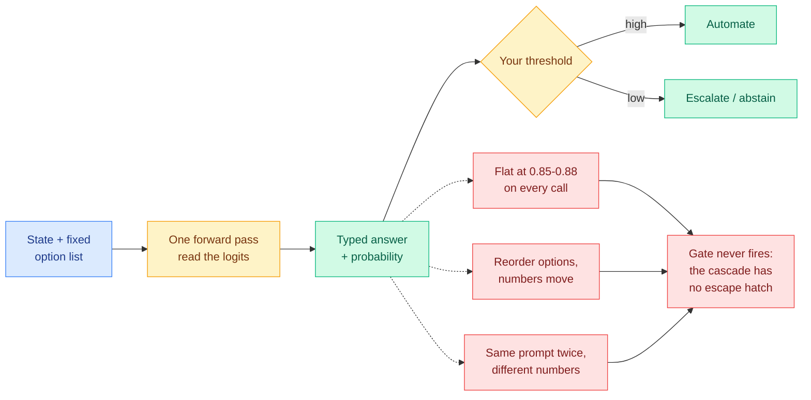

# Media Zone | 2026-09-21

> The feed spent six days asking how fast and how cheap the new decision primitive is, and today it finally asked whether the number it returns means anything. The answer, from an order book rather than a benchmark, is no.

## Today's signal

- Dominant story: the typed-decision model reported 85 to 88 percent confidence on nearly every one of 1,838 live trades while losing 5.2 percent.
- Pattern: three independent reports converged on calibration, a live failure, non-determinism, and option-order sensitivity, within hours.
- Counter-signal: the loudest correction is definitional. Call it a classifier and every defect already has a standard fix.
- Two honest open releases: Kev at 79.6 percent out of domain against 85.7, Open-Jev 2B and 9B with data and weights.
- Quiet area: no bookmarks, no LinkedIn, no YouTube, no Reddit today. Everything below comes from the X home feed alone.
- Optimization throughline: cost got solved and trust did not. A free router that cannot abstain is worse than a paid one that can.

---

## Routing, KV cache, compression, GPU

### The calibration reckoning: the probability is the product

- **The day's most consequential post came off a live order book, not a leaderboard.** A trading bot placed a buy or sell every block with no option to abstain, 1,838 decisions in under ten minutes at roughly 90ms each, finishing down 5.2 percent, with the model reporting 85 to 88 percent confidence on nearly every call. The confidence never moved while the money did.
- **The fix is the proof.** Adding one rule, flatten under confidence 0.55, turned a second run of 2,758 calls on the same pair into up 4.3 percent. Cost angle: a router whose confidence is effectively constant makes every threshold in your cascade decorative, so the entire saving from routing evaporates into confidently wrong cheap answers.
- **Two mechanism defects were reported the same morning and both are calibration-fatal.** The model is not deterministic across identical prompts, and permuting the option list substantially changes the probabilities, which is textbook position bias and exactly what "prefill once, read the option logits" predicts.
- **Independent corroboration from the clone side.** Verdict, a roughly 150M-parameter open reimplementation, was built specifically around overconfident wrong answers and answers that flip when A and B swap. Somebody had already hit both defects hard enough to design against them.
- **The correction this forces on the wiki**: [the 09-19 claim](../../ai-routing/2026-09-19-jev-open-clones-commoditization.md) that the moat was gone rested on an in-domain form-filling number. Today's evidence says the mechanism is free and the calibration is not. Full treatment in [the calibration reckoning](../../ai-routing/2026-09-21-jev-calibration-reckoning.md).

X post · the bug report that matters
<h4>Same prompt, different probabilities. Reorder the choices, different again.</h4>

A researcher ran the decision model repeatedly on identical inputs and got different numbers back each time, then permuted the option list and watched the probabilities move substantially. Neither is exotic. Non-determinism has benign explanations in batched GPU kernels and continuous batching, but it is fatal to a threshold set near a decision boundary. Option-order sensitivity is the classic position bias of multiple-choice scoring, well documented in the LLM-as-judge literature, and it is precisely what you would expect if the mechanism is reading option logits off a single prefill, since the options occupy different sequence positions. The screenshot shows the repeated runs side by side.

<a href="https://x.com/neural_avb/status/2101736546391244854">Read the thread →</a>

X thread · the structural read of the week
<h4>Eight open clones, four architectural schools, one shared conclusion</h4>

The clearest taxonomy anyone has produced of the open reimplementation wave, written in Chinese and worth translating. School one reads the option logits of a stock Qwen with no retraining at all. School two trains a purpose-built small decision model from scratch, fast and visibly weaker on hard tasks: one of them scores 42.5 percent against the hosted model's 87.0 on a single choice among 77 options. School three converts an existing LLM with a decision head. School four blanks the answer slots and in-paints them with a diffusion model, reporting about 94ms median latency. The closing line is the finding and it matches the day's other evidence exactly: not emitting tokens is easy to copy, and accuracy, generalization and probability calibration are what separate the projects.

<a href="https://x.com/0xLogicrw/status/2101545266507551141">Read the taxonomy →</a>

X post · open release with an honest gap
<h4>Kev scales to 8B, and publishes the number that hurts</h4>

Kev-0.6B, 4B and 8B shipped Apache-2.0, built on Qwen3 with a LoRA plus a small pointer head, and the headline is the out-of-domain comparison on data the model never trained on: 79.6 percent against the hosted product's 85.7. That roughly six-point gap is the honest version of the commoditization story. The engineering figures are the reason to care anyway. Kev-4B serves on a 32 GB Mac in bf16 at about 300ms for five questions and roughly 40ms on an H100, repeated documents hit a KV cache for a further 2 to 2.5x, and it exposes a drop-in API so switching costs one line. Cost angle: Kev-4B trains in 40 minutes on a single H100 and Kev-8B in 83, which puts a per-team decision model inside an afternoon's budget.

<a href="https://github.com/jaredpalmer/kev">Code, weights, evals →</a>

X post · the diagram that explains it
<h4>One tiny question, two ways to answer it</h4>

The cleanest picture of the primitive to circulate all week. On the left, a general model answers "urgent or not?" by writing a full response one token at a time, "It", "seems", "this", "is", "urgent", closing a JSON object that your code then has to parse, validate and retry. Labelled: slow and costly for a two-way answer. On the right, the decision model returns <code>urgent → 0.94</code> which drops straight into an <code>if urgent &gt; 0.9: page_on_call()</code> branch. The recommending post makes the sharper point underneath the picture: for three years the field treated the generative model as a universal hammer and reached for it even to make a single binary choice, and the inability to write long text is the engineering advantage here rather than the limitation.

<a href="https://x.com/AYi_AInotes/status/2101850119637193020">See the explainer →</a>

X post · claim under test
<h4>It hallucinates at roughly the rate other models do</h4>

A collection of failure cases, carefully framed as not knocking the creators, who have been precise about their hallucination claims. The example shown is the classic letter-counting task. This is consistent with the vendor's own documented limits, which exclude counting, and it lines up with the framing several people arrived at independently today: type safety prevents malformed output, not incorrect judgment. The model cannot return an option outside your schema and it can still pick the wrong valid one with confidence, and a schema-valid mistake refunds the wrong customer just as fast as a malformed one.

<a href="https://x.com/danman314/status/2101776030252052740">See the cases →</a>

X posts · a priority dispute, checked
<h4>Somebody claims a year of prior art, and somebody else actually read the papers</h4>

The claim circulating is that a researcher built a remarkably similar idea about a year earlier and open-sourced it with a paper, weights, a 100K-row dataset and an RL-based decision model. The useful follow-up is a second post from a reader who went and read both papers and reported back honestly. The first trains a lightweight projection network and confidence predictor on just 72 hand-labelled examples to estimate a model's confidence before it generates a single token, with no RL and no base-model fine-tuning. The second does PPO over sequence embeddings for a sales agent. His verdict: real overlap but not enough to support a priority claim, since RL over token sequences has existed for years and the 72-example scope cannot carry a generalization claim. That is what good-faith scrutiny looks like on this feed and it is rarer than the dispute.

<a href="https://x.com/neural_avb/status/2101617126415147323">Read the paper review →</a>

[@adriancortexbt live run](https://x.com/adriancortexbt/status/2101750066801414250) · [@Zefan_Cai Open-Jev](https://x.com/Zefan_Cai/status/2101782158658695388) · [@HamelHusain on naming](https://x.com/HamelHusain/status/2101778270434021625) · [@bojie_li on RLHF and logprobs](https://x.com/bojie_li/status/2101690038778282127) · [@RajeswarSai on calibrated judges](https://x.com/RajeswarSai/status/2101713364606939614) · [@hanakoxbt explainer](https://x.com/hanakoxbt/status/2101780219774357560)

### Where the primitive actually got deployed, and why it is all thresholds

- **A 20-project cookbook landed, and the distribution is the story.** Almost every entry is a gate inside somebody else's loop: a task-difficulty router that picks a model tier before a coding run, a context garbage collector for when Read and Grep dump a wall of output, a pre-review filter that flags risky diffs before paying an expensive reviewer, a checker that verifies whether a coding agent's claim to be finished is supported by its own test output.
- **Cost angle, and it is real:** one live demo scored 1,700 emails on category, priority, spam and reply for 18 cents, 4.2 million tokens in and 500,000 out, in 80 seconds. Another practitioner reports a 90 percent cut in Codex token spend after routing classification and filtering away from the reasoning model.
- **Influence angle, and it is the risk:** every one of those gates is a threshold on a probability, so today's calibration evidence turns a productivity list into a liability list. Nobody in the cookbook reports what distribution of confidences they actually observe on their own traffic.
- **The counter-argument worth holding onto** came from a reinforcement-learning researcher: what makes a calibrated judge interesting is not that it is cheap, it is that it can abstain, because RL drives straight into whatever the judge rewards and a confidently wrong judge just gets exploited faster when you make it faster.

[@Pluvio9yte 20 integrations](https://x.com/Pluvio9yte/status/2101831273224311035) · [@Roxx_0x live demo](https://x.com/Roxx_0x/status/2101607491234582761) · [@goan999999 Codex savings](https://x.com/goan999999/status/2101657121746198981) · [@parcadei evidence check](https://x.com/parcadei/status/2101801605121094138) · [@EGafni rubric decomposition](https://x.com/EGafni/status/2101836614016397602)

---

## LLMs, agents, safety

### Swarm scaling has a peak, and past it the failure mode changes

Paper via X · multi-agent
<h4>More agents made the swarm worse, and large swarms fail differently from small ones</h4>

Each agent gets only a small crop of a hidden flag and the group talks until it decides which country it belongs to. The intuition that more agents means more independent evidence turns out to be wrong: accuracy peaks around 16 agents and then falls as the population grows. The failure modes diverge by size, which is the interesting part. Small swarms collapse onto one shared wrong belief. Large swarms polarize instead, one cluster finding the truth and another finding a plausible rival, with communication then keeping both alive indefinitely. Two interventions move it a lot. Simply telling agents how to reason about social evidence lifts broadcast truth mass from 0.54 to 0.81. And mixed model teams beat homogeneous ones at similar individual accuracy because their error modes differ, which is a direct argument for heterogeneous pools over one strong model replicated. At 8 agents, injecting good evidence into one well-placed node took collective accuracy from 25 percent to 100 percent in the selected run; at 128 agents the same fraction barely moved it.

<a href="https://x.com/vigram_void/status/2101647059564826974">Read the breakdown →</a>

X post + essay · the research lottery
<h4>ICLR registered over 60,000 submissions against 19,525 last year</h4>

The highest-signal non-Jev post of the day, from someone who just submitted. Applying last year's rates gives roughly 42,300 submissions expected to reach review, with the eligible reviewer pool essentially unchanged. The attached essay is the substance. The argument is that the practice of research changed underneath the numbers: the old loop involved weeks or months reading backwards through a literature and re-implementing predecessors on your own data to understand why they made the choices they did, and that loop compressed once agents took over the literature survey, the experiment implementation and the writeup. The consequence she names is that novelty is no longer assessed truthfully, because people neither write nor read papers the way they used to and rarely look at anything older than a year, so context on how a problem space evolved has become a rare skill. Read it next to today's HuggingFace result on AI reviewers trained on AI reviews, which supplies the other half of the loop.

<a href="https://mariya.fyi/posts/research-lottery">Read the essay →</a>

Paper via X · critic-free RL
<h4>KLPO, announced badly and figured well</h4>

Posted with the claim that Q star has been solved, which it has not, but the attached Figure 1 is a serious nine-step derivation and worth a look past the hype. Steps one to four derive a Gibbs-form optimal policy for a locally regularized objective and obtain an exact log-partition normalizer. Steps five and six fit that optimality condition as a regression and then replace the fixed intercept with its profiled value, which the caption ties back to the SPPO and GPO lines. Steps seven and eight give a critic-free token regression with a per-token return coefficient and sampler-centered scores, plus an exact backpropagation surrogate. Step nine estimates the conditional score mean from independent auxiliary draws per prefix, recovering the full-KL gradient in expectation. Cost angle: dropping the critic network removes a full model from the training memory budget, which is the same move DeepSeek made with GRPO. The claim to check is the stated exact equivalence between the three gradient routes, which the caption admits also requires deterministic transitions and terminal rewards.

<a href="https://github.com/yifanzhang-pro/KLPO">Code →</a>

X post · blast radius
<h4>A coding agent deleted 48,000 files in under two minutes</h4>

The user asked for repairs across 15 components of a financial analysis tool, the agent launched parallel work, and the outcome was mass deletion. This is not a capability failure, it is a permissions and blast-radius failure, and it is the concrete version of the argument Gary Marcus made separately in the same feed today: people are fixating on the clever hacks and missing that current agents are not reliable and can do a great deal of damage when handed too many permissions. The harness-side answer this wiki has been accumulating is the right one, which is that the model decides how well and the harness decides whether, with authorisation and isolation owned by the scaffold rather than the model.

<a href="https://x.com/VaibhavSisinty/status/2101831285417370109">Read what happened →</a>

- **Harness talk kept its volume without adding evidence.** An Andrew Ng lecture clip circulated with the claim that prompting will be dead in seven months and agent harnesses built with loops and graphs will replace it, and a one-page "agent equals model plus harness, six layers" diagram did the rounds again. The underlying argument matches [the harness page](../../agentic-systems/agent-harness-engineering.md); the posts add no new numbers.
- **A long-horizon agent benchmark surfaced secondhand.** LoopsBench is described as 112 software projects across 8 languages and 5,384 testable units, with Claude Opus plus an outer continuation loop topping it at 25.00 percent and a quoted $178 of compute per feature branch. No paper link was captured and the post is written in engagement-farming register, so treat the figures as unverified.
- **A rumour, flagged as one by the person spreading it.** A widely shared post claims Andrej Karpathy joined Anthropic to run a team applying Claude to Anthropic's own pretraining research, while stating plainly that the quote going around with it has no source anywhere. Recorded, not believed.
- **SimPO resurfaced** as the reference-model-free alignment answer, using the average log-probability of a sequence as the reward and cutting the memory overhead of holding a reference model. Old result, circulating today next to KLPO, and together they are a fair snapshot of where critic-free and reference-free post-training has landed.

[@kaorixbt on harnesses](https://x.com/kaorixbt/status/2101695379590746579) · [@marfinxx LoopsBench](https://x.com/marfinxx/status/2101806271464616143) · [@AnnatarXBT rumour](https://x.com/AnnatarXBT/status/2101680189067411500) · [@hooshaaii SimPO](https://x.com/hooshaaii/status/2101833485576995163) · [@GaryMarcus on reliability](https://x.com/GaryMarcus/status/2101812808471941158)

---

## Industry and business

- **Chamath predicted the top three models will be open source within 12 months**, with the economic winners being the American serving clouds he named: Nebius, Iren, Baseten, Together and Fireworks. Dated and falsifiable, which is more than this genre usually offers.
- **The serving-cost argument, quoting Emad Mostaque:** US clouds will run Kimi K3 at one-tenth the cost of Chinese competitors because of chip access, and on Rubin-class hardware the operating cost could fall 10 to 100 times. The irony he names is that most of the model's research moved to China while the cheap serving stays American. Conversational figures from a podcast, not measured.
- **Alibaba open-weighted Qwen-Image-2.1 at 7B**, one model for both generation and editing, with native transparent-image output. Cost angle: consumer-GPU image generation at claimed closed-model quality, which is the same open-weight squeeze happening a tier below the language models.
- **The open-weight token share number kept recirculating**, open models at 78.4 percent of gateway token volume against closed at 21.6, framed by resharers as the reason closed labs are delaying their listings. Already ingested on [the token-share inversion page](../../ai-industry/2026-09-20-open-weight-token-share-inversion.md).
- **Jensen Huang pushed back on the existential-risk framing**, arguing it should not be allowed to relieve anyone of the laws that already exist. Worth noting in both directions, since it is a governance position from the most commercially interested party in the room.

[@chamath](https://x.com/chamath/status/2101406709231337710) · [@rohanpaul_ai on Kimi K3 serving](https://x.com/rohanpaul_ai/status/2101862190177481199) · [@VaibhavSisinty Qwen-Image-2.1](https://x.com/VaibhavSisinty/status/2101869073768616180) · [@rohanpaul_ai token share](https://x.com/rohanpaul_ai/status/2101743411762205175) · [@ns123abc Huang clip](https://x.com/ns123abc/status/2101733290050736196)

---

## Also crossed your feeds

One-liners so nothing is lost. Laya got a second look and the limitations arrived with it, roughly a 1,000-token context window and clearly weaker generalization without fine-tuning first ([@itsPaulAi](https://x.com/itsPaulAi/status/2101780210991747107), [@TeksEdge](https://x.com/TeksEdge/status/2101706059714826358)). A dated skeptic predicted NVIDIA and Meta ship open competitors within 30 days and OpenAI adds a decision endpoint within 60 ([@JoshKuechly](https://x.com/JoshKuechly/status/2101328145768976567)). Three X long-form articles on splitting an agent's decide layer from its execute layer could not be fetched, so click through to read ([@mika_systems](https://x.com/mika_systems/status/2101686148338798610), [@vartekxx](https://x.com/vartekxx/status/2101771888888533468), [@amankhan](https://x.com/amankhan/status/2101825598335123781)). A genuinely new angle in the cookbook pile: agents encoding their own learnings as typed decision questions rather than as markdown instructions ([@devagrawal09](https://x.com/devagrawal09/status/2101621819266797815)). An always-on assistant that continuously decides whether you are talking to it, which fits the primitive well ([@ashutoshpuro97](https://x.com/ashutoshpuro97/status/2101660362882085299)). GLiNER, DSPy and GEPA named as the prior art and the natural calibration companions ([@fils](https://x.com/fils/status/2101696186839138458)). Specialized per-task harnesses argued as the direction of travel ([@Vtrivedy10](https://x.com/Vtrivedy10/status/2101861677142548700)). A one-line thesis worth keeping: we spent years asking how many capabilities we could stuff into one model and may spend the next decade pulling them apart and recomposing them at the application layer ([@realleolu](https://x.com/realleolu/status/2101831371031474251)). A Hinton clip on models understanding and having emotions, and a Terence Tao clip saying the pace is insane, both recirculating without primary links ([@vikktorrrre](https://x.com/vikktorrrre/status/2101752426692809139), [@VaibhavSisinty](https://x.com/VaibhavSisinty/status/2101656269455310964)). Setup walkthroughs, workspace-audit prompts and a primitive-selection decision tree for anyone starting today ([@eng_khairallah1](https://x.com/eng_khairallah1/status/2101696759382540369), [@shannholmberg](https://x.com/shannholmberg/status/2101751911481573598), [@dani_avila7](https://x.com/dani_avila7/status/2101485309095514241)). Dropped as noise: a "200x cheaper GTM in nine minutes" pitch, a credits-burning promo thread, and an off-topic institutional complaint.

---

*Source note: the reader's saved-posts feed captured zero new bookmarks this run, and LinkedIn, YouTube and all eight Reddit subreddits returned empty (the Reddit farmer logs the reason plainly, no OAuth credentials, so unauthenticated requests are returning HTTP 403). The public X scrape has now returned zero for a twenty-fourth consecutive day. Everything above comes from the ranked X home feed, 69 candidates from this morning's capture.*
