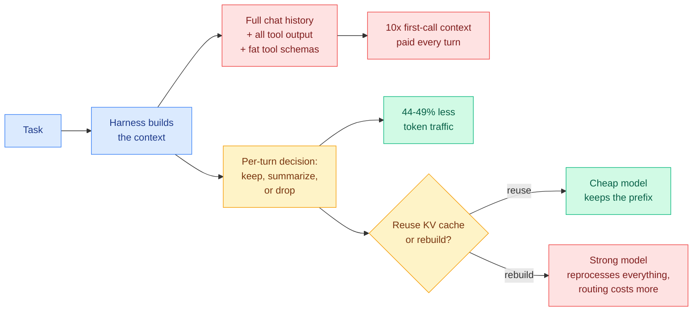

# Media Zone | 2026-09-21

> The US morning reopened the day on a different question. Overnight the feed argued about whether a probability means anything. By midday New York it had moved one layer out, to the context the model is handed before it decides anything at all, and three independent sources landed on the same answer.

## Today's signal

- Dominant story: the harness, not the model, is where the token bill actually lives.
- Cross-source lock: NVIDIA's SoL-Pi, a Berkeley harness benchmark, and TypeSafe's own design draft all blame context handling.
- Best paper of the US day: communicating agent teams beat independent sampling, and the gap compounds.
- Tension worth holding: that result sits uneasily next to this morning's swarm study, which found a ceiling.
- Carried forward: the calibration problem is unresolved, and the judge numbers arriving now are narrow.
- Quiet area: LinkedIn empty again, Reddit still down. Video is the one feed that came back.

---

## Routing, KV cache, compression, GPU

### The context layer is the bottleneck, and three sources said so within hours

- **Three sources, one claim, arrived independently.** NVIDIA searched for harness mechanisms and found context compaction among the four that survived. Berkeley benchmarked harnesses and found the expensive ones are expensive because of context. TypeSafe's founder published a design draft saying the KV cache is what has been distorting agent design all along. Nobody cited anybody.
- **Cost angle, and it is the largest concrete number on the feed today.** SoL-Pi cuts recorded token traffic by 44.7 to 49.0 percent and API cost by roughly a third, at equal task performance. Expressed as an hourly rate for an always-on agent: 8.75 to 13.50 dollars saved per hour against native Codex and Claude Code, 4.36 to 5.71 against the minimal baseline.
- **The uncomfortable corollary for routing.** The draft argues that splitting a task to a cheap model and then escalating can cost more, not less, because the strong model has to reprocess the long context from scratch. That is a direct warning to every cascade built this week, and it reframes the KV cache as a routing constraint rather than a serving optimization.
- **Practitioner confirmation from the other direction.** A community port of NVIDIA's ideas onto the minimal harness circulated the same afternoon, described plainly as stopping agents from reading the same output twice. Every feature off by default, which is the honest way to ship a token-saving layer.

Saved by you · NVIDIA, NTU, MIT
<h4>SoL-Pi: search the harness, not the model, and keep what survives</h4>

The one bookmark you saved today, and it turned out to be the anchor of the whole US day. Instead of hand-tuning an agent harness, the authors run automated research loops at the harness layer across many repository-derived and verifier-driven environments, then keep only the mechanisms that survive selection across all of them. Four survived. Action Fusion changes how actions execute, batching an edit with the check that follows it. Online Context Compact compresses context mid-run rather than at a hard boundary. ObservationPack keeps large tool outputs retrievable without resending them into the prompt. An Evidence-Preserving Reducer shortens logs while keeping the originals reachable. On the 51-task EdgeBench evaluation it matches the baseline harness on both GPT-5.6 Sol and Opus 5 while cutting token traffic by 44.7 to 49.0 percent. The part that matters most is that the discovered mechanisms transfer beyond the environments they were found in, which is what separates a harness search from harness overfitting.

<a href="https://arxiv.org/abs/2609.20519">Read the paper →</a>

X thread · benchmark, read skeptically
<h4>The harness tax: 21 model and framework pairs, and the minimal one usually wins</h4>

A UC Berkeley and Arena study benchmarked five frontier models across three coding harnesses on SWE-bench Lite and Terminal-Bench 2.0, and reports that models did better on a barebones open framework than on the vendor's own agent in 75 percent of pairs. The mechanism named is first-call bloat: proprietary agents load large system instructions, heavy guardrails and verbose tool schemas, so the claim is that one of them sends roughly ten times the initial context of the minimal harness, and you pay for that dead weight on every turn. Two figures anchor it. One model scored 83.3 percent on the minimal harness against 78.9 on the vendor CLI at roughly half the cost per rollout. Another hit 97.8 percent on the vendor harness for 1.33 dollars and 96.7 percent for 0.67 on the minimal one, which is a hundred percent markup for a point of accuracy. Treat the framing with suspicion, since the thread is written in engagement register and the cost numbers come from one rollout budget, but the underlying direction matches SoL-Pi exactly.

<a href="https://x.com/analogalok/status/2102006741193957839">See the data →</a>

X post · design draft, in Chinese
<h4>Meta-attention: rebuild the context every turn, and stop letting the KV cache dictate the architecture</h4>

A summary of a public design draft that TypeSafe's founder released for the community to build rather than ship himself. The core proposal is that a coding agent should re-decide its context on every turn: what to keep in full, what to keep as a summary, what to discard entirely, and critically whether reusing the existing KV cache or rebuilding the prompt from scratch is actually cheaper this turn. His sharper claim is the diagnosis. He argues many awkward agent designs exist because the KV cache has them tied down. Routing a task to a cheap model and then escalating means the strong model reprocesses the long context anyway, so the routing can cost more than not routing. Tool definitions sit permanently in the system prompt because moving them would break the cache. If the context can be recomposed dynamically, then model routing, sub-agents, MCP tools and project instruction files all become load-on-demand. He is calling the idea meta-attention. There is no implementation, and that is the point of publishing it.

<a href="https://x.com/0xLogicrw/status/2101956106545209379">Read the summary →</a>

X post · the same work, shipped
<h4>The token-waste extension, in plain language</h4>

The practitioner-facing account of the same NVIDIA work, useful because it says what the mechanisms do without the paper vocabulary. It combines file edits with the follow-up checks that verify them, keeps large outputs available without repeatedly sending them to the model, shortens logs while preserving access to the originals, and compacts context as parts of a task complete. Cross-source presence here is a conviction boost rather than duplication: the paper landed in your saved posts and the shipped extension landed in your feed on the same day, which is the cleanest signal available that this is not just a benchmark result.

<a href="https://x.com/agenticgirl/status/2101848385632477239">Read the summary →</a>

[@akshay_pachaar on harness routing](https://x.com/akshay_pachaar/status/2101937960925139417) · [HarnessRouter repo](https://github.com/HarnessRouter/harnessrouter) · [@CompleteSkeptic design notes](https://x.com/CompleteSkeptic/status/2101894250401271876) · [@_avichawla on Beacon](https://x.com/_avichawla/status/2101966536798040332)

### The calibration question is still open, and the first judge numbers are too narrow to close it

- **Carried forward from the overnight story, unchanged.** A live trading run placed 1,838 decisions with no ability to abstain, reported 85 to 88 percent confidence on nearly every one, and finished down 5.2 percent. Adding a single rule to flatten below 0.55 confidence turned a second run into a gain. The mechanism is cheap, the calibration is not, and that remains the day's most important unresolved claim. Full treatment in [the calibration reckoning](../../ai-routing/2026-09-21-jev-calibration-reckoning.md).
- **The first serious judge measurement arrived, and it is honest about its own limits.** A framework vendor tested the typed-decision model as an evaluation judge: 0.44 seconds per evaluation, roughly 0.00035 dollars, and scoring variance between one ninety-second and one nine-hundredth of the comparison models on repeat evaluation. The caveat is stated by the author, not buried. Five fixed weather tasks, each evaluated 100 times. That establishes stability on a tiny fixed set, not accuracy. A judge can be perfectly stable and stably wrong.
- **Cost angle that actually holds up:** if evaluating an agent run costs a third of a cent, you can evaluate every run instead of a sample, which is the real unlock for catching regressions early. The precondition is calibrating the judge first, and nobody has published that yet.
- **Fine-tuning is emerging as the differentiator, not raw quality.** A careful read of one open competitor found it fourth overall and clearly weaker on hard questions, 34 percent against 74. But its fine-tuned checkpoint scored 0.766 on a 2,000-decision benchmark against the hosted model's published 0.727 zero-shot. That is a narrow same-distribution win and the reviewer says so plainly. The structural point survives anyway: closed weights cannot be fine-tuned at all.
- **The cleanest strategic framing of the day** came from someone reading it through the innovator's dilemma. The typed-decision layer is commoditizing the bottom of the market, classifiers, routers, scoring and context triage, and those workloads have revenue per decision too small for a frontier lab to defend. Disruption from below is the correct shape of the argument even if the conclusion is premature.

X post · good-faith benchmark read
<h4>The fine-tunable clone is the one to watch, not the fastest one</h4>

An unusually careful evaluation of one of the open competitors that emerged this week. It ranks fourth overall on a community leaderboard, well behind on intelligence, calibration and speed, and far behind on hard questions. Its one real advantage is cost. The genuinely interesting number is buried: fine-tuned on 6,000 decisions from four synthetic workflows, its typed-decision checkpoint went from about 0.36 at base to 0.766, passing the hosted model's published zero-shot 0.727 on that specific benchmark. The reviewer is explicit that this is a same-distribution comparison and proves very little about generalization. The structural conclusion is the durable part, and it is the strongest argument for open weights anyone made today: whoever ships a highly fine-tunable decision model captures the teams whose traffic does not look like the training distribution.

<a href="https://x.com/m_newhaus/status/2101734191289471321">Read the analysis →</a>

X post · another open clone
<h4>A 9B open reimplementation, built in a day, recipe included</h4>

The clone count kept climbing through the US morning. This one is a 9B model trained on 2,676 curated examples, running locally on Apple Silicon or an NVIDIA GPU, with the full training recipe published alongside the weights. The claim that it performs just as well is the part to discount, since nobody has run it against the out-of-domain comparisons that separated the honest releases from the optimistic ones overnight. What the release does confirm is the shape of the week: the mechanism reproduces in a day, and the 2,676-example training set is a reminder that the data curation, not the architecture, is the scarce part.

<a href="https://x.com/DataChaz/status/2101787241165267425">See the release →</a>

[@Xudong07452910 on judge stability](https://x.com/Xudong07452910/status/2101849885842555389) · [@nicbstme innovator's dilemma](https://x.com/nicbstme/status/2101904295730016377) · [@jerryjliu0 DocJev](https://x.com/jerryjliu0/status/2101738281046294552) · [@charliejhills 20 builds](https://x.com/charliejhills/status/2101957500669169711) · [@aisearchio clone list](https://x.com/aisearchio/status/2101720039779086414)

### GPU and inference engineering, the week's teaching material

- **One repo consolidated the whole performance-engineering ladder**, from GPU fundamentals through kernel optimization, profiling, inference engines and distributed inference to current hardware, with specific depth on Triton, CUTLASS, attention, KV caches, quantization, speculative decoding, MoE serving and disaggregated inference. Influence angle: this is the kind of artifact that quietly becomes the default onboarding path for a whole subfield.
- **Kernel formal verification got a full GPU MODE lecture**, which is a notable direction. Kernel correctness is normally established by differential testing against a reference, and moving any part of that to proof changes what you can safely fuse.
- **A hands-on counterpoint circulated with real traction**, arguing the only way to learn inference is to implement it yourself, which lands differently in a week where everyone is composing hosted primitives instead of writing kernels.
- **Two talks from the AI Engineer channel are worth the time**, one on weight folding and CUDA streams told through a debugging story, and one on the inference-cloud architecture for agent workloads specifically, which is where the harness cost argument above eventually gets settled in hardware.

[GPU perf engineering repo](https://github.com/wafer-ai/gpu-perf-engineering-resources) · [@TensorTonic on implementing inference](https://x.com/TensorTonic/status/2101654963843916140) · [Raschka on inference scaling](https://youtube.com/watch?v=t5y-kS9nNxU) · [Kernel workshop](https://x.com/VizuaraAI/status/2100216598028320918)

---

## LLMs, agents, safety

### Team-of-N beats Best-of-N, and it contradicts this morning's swarm result in a productive way

Paper · the US day's best result
<h4>Give identical agents a shared text file and tell them to collaborate</h4>

No roles, no orchestration, no prescribed protocol. N identical agents work the same task with access to one shared log, and the instruction is simply to collaborate. On ARC-AGI-3, a team of five matches best-of-33 independent attempts, and solves one game 65 percent of the time that no single agent cracked in 64 tries. On polyomino packing, a team of three surpasses best-of-60 and appears to set a new record for the benchmark. On MNIST compression, a task that has been optimized to death, a team of four found a 1,957-byte model at 99.4 percent accuracy, 20 percent smaller than the best human solution, while no independent agent got below 3KB. The mechanism is clean once stated. A lone agent must make every breakthrough itself, while a team needs each insight found only once by any member, so you are comparing a minimum over sums against a sum over minimums, and that gap can grow exponentially in the number of breakthroughs a solution requires. The authors are careful about scope: prior work found unclear benefits from communication, and they agree, on inherently serial tasks. The claim is specifically about search-heavy research problems.

<a href="https://arxiv.org/pdf/2609.21032">Read the paper →</a>

Paper · the other half of the tension
<h4>The swarm study that found a ceiling around 16 agents</h4>

Circulating since the IST morning and now worth rereading against the result above. Each agent sees a small crop of a hidden flag and the group talks until it decides which country it belongs to. Accuracy peaks near 16 agents and then falls as the population grows, and the failure mode changes with size: small swarms collapse onto one shared wrong belief, large swarms polarize into a true cluster and a plausible rival that communication then keeps alive indefinitely. The reconciliation with the Team-of-N paper is the interesting part and neither paper makes it. That study is a consensus task with one right answer where communication propagates error as readily as truth. Team-of-N is a search task where a broadcast partial solution is independently verifiable, so bad broadcasts die and good ones compound. The predicted boundary is verifiability, and it is testable: run the team protocol on a task where partial solutions cannot be checked and the scaling should invert.

<a href="https://x.com/vigram_void/status/2101647059564826974">Read the breakdown →</a>

Paper · EMNLP 2026, MIT-licensed
<h4>T-Mem: store the memory with a prediction of when it will be needed</h4>

Nearly every production memory system retrieves by similarity, which means it can only reach a memory when the query shares surface features with it, lexically or in embedding space. T-Mem attacks the other case. At write time a memory is stored alongside a trigger, essentially an answer to "what situation will make this relevant later?" At read time those triggers pull memories in by situation even with zero keyword overlap. The worked example is clean: the user once said a colleague is allergic to shellfish, and later asks where to hold a team dinner. Almost no shared vocabulary, and a similarity-based store misses it entirely. On a benchmark built specifically to strip keyword overlap, mainstream systems drop 28 to 50 points while this drops 5.45, and ablating the forward-looking trigger collapses most of the gain. It sits as an architecture layer with no fine-tuning required, which is the practical reason to care.

<a href="http://arxiv.org/abs/2606.15405">Read the paper →</a>

Paper · Google
<h4>Put the workflow in an editable graph, not in the chat history</h4>

The failure this targets is familiar to anyone running long agent tasks: the agent forgets where it is, repeats a tool it already called, or executes steps out of order, because its procedure exists only as sediment in a growing conversation. The proposal gives the agent a small explicit map of what can happen next while leaving it free to reason inside each step. The self-improving part is disciplined rather than greedy: after runs complete, a second model compares successes against failures and proposes edits to the map, but an edit is kept only if it does not degrade held-out tasks. Across 24 model and benchmark combinations it ranked first or tied first in 21, and it repaired a deliberately flawed human-designed workflow from 58.93 to 92.86 percent on one benchmark. The authors note the guidance costs extra tokens, so the value is concentrated where long workflows are the actual bottleneck. Read it next to the harness-context thread above: both say the durable structure belongs outside the context window.

<a href="https://x.com/rohanpaul_ai/status/2101973711612190756">Read the summary →</a>

- **A counterweight on self-improving harnesses arrived the same day.** One paper argues that patching every individual failure teaches the runtime the wrong lesson, hard-coding one model's quirks into shared infrastructure. It groups recurring failures across tasks and only edits the harness when the same failure shape repeats, reporting higher accuracy, faster training and better cross-model transfer. That is the same discipline as the held-out check in the graph paper, arrived at independently.
- **A 4B coding agent reached 61.5 percent on SWE-bench Verified with no frontier distillation.** Two ingredients: RL on about 1,500 synthetic tasks regenerated as the model improves so difficulty tracks current ability, and a deliberately simpler five-tool interface. The interface change alone moved the base model from 8.3 to 37.2 percent, which is a startling amount of headroom sitting in tool design rather than weights, and it is the research-side echo of the harness-tax argument above.
- **Anthropic published five workshops on self-improving agentic systems**, covering a first agent, tools and skills, memory, proactive triggering, and full autonomy. Three hours of primary-source material on exactly the loop architecture this feed keeps arguing about from the outside.
- **A useful skeptical intervention on the AI-welfare discourse.** A paper identifying pain-related representations in language models, and showing that manipulating them changes behavior, is circulating as evidence of moral standing. A researcher pushed back hard and correctly: representational and behavioral similarity does not imply subjective experience, the authors themselves allow role-play as an explanation, and the inference being drawn is not the one the results support.

[@rohanpaul_ai on failure patterns](https://x.com/rohanpaul_ai/status/2101937724311965798) · [@rohanpaul_ai FrogNano](https://x.com/rohanpaul_ai/status/2101957605354557806) · [@ZaneOnAI workshops](https://x.com/ZaneOnAI/status/2101983791661081062) · [@ValerioCapraro on pain claims](https://x.com/ValerioCapraro/status/2102035277485060350) · [@SmartScience agent society](https://x.com/SmartScience/status/2101936419497242624) · [@omarsar0 duplex tool calls](https://x.com/omarsar0/status/2101597276242325864)

---

## Industry and business

- **Amazon blocked Meta's shopping agent with a popup**, telling Muse users an unauthorized AI agent violates its terms, and saying Meta gave no notice, the agent does not identify itself, and it appears to store customer logins. Meta refused to exclude Amazon and says credentials sit in secure storage. The infrastructure detail is the real story: Meta runs the agent on its own machines and calls Amazon from Meta's address, which made it trivial to detect.
- **The durability question around Anthropic's lead got sharper.** Annualized revenue at 65 billion in July with investors expecting to clear 120 billion by year end, against a first-in-two-and-a-half-years reversal where a competitor overtook it in weekly OpenRouter spending after a model release. Switching costs are falling and open-weight models are approaching frontier performance on more workloads, which is the same squeeze the token-share inversion recorded on [the 09-20 page](../../ai-industry/2026-09-20-open-weight-token-share-inversion.md).
- **An open standard appeared for running any coding harness behind one interface**, Apache-2.0 and self-hosted, with a Unified Harness Protocol exposing an OpenAI Responses-compatible API across a dozen or more harnesses. Influence angle: if the harness is where the cost lives, an abstraction layer over harnesses is worth more than one over models.
- **Google open-sourced a phone-control agent** that drives a real device end to end over MCP from any of the major coding clients, reporting above 99 percent task completion on AndroidWorld and 3 to 5 seconds per step in its fast mode, with targeting that fuses accessibility APIs, OCR and vision.
- **Carried from earlier today, still standing:** a prediction that the top three models will be open source within twelve months with American serving clouds capturing the value, an open-weight 7B image model doing generation and editing in one checkpoint with native transparency, and the argument that US clouds will serve the next Chinese open model an order of magnitude cheaper than Chinese ones can.
- **Self-criticism worth noting from inside the industry.** A founder quoted an engineer describing a team where specs, code, tests, tickets and reports are all agent-generated, nobody on the team likes it, and they are being pushed to ship anyway. His line is the useful one: use the tools, never cede understanding to them.

[@alex_verem on Amazon vs Muse](https://x.com/alex_verem/status/2102049211969888614) · [@rohanpaul_ai on Anthropic economics](https://x.com/rohanpaul_ai/status/2101378665145835558) · [@dr_cintas phone agent](https://x.com/dr_cintas/status/2101768566164840752) · [@svembu on ceding understanding](https://x.com/svembu/status/2101972121987498022) · [@GaryMarcus on the panic trade](https://x.com/GaryMarcus/status/2101751683802157320)

---

## Also crossed your feeds

One-liners so nothing is lost. A curated list of twenty things built on the typed-decision API in a week, spanning browser agents, context compaction, generative UI, code-review triage and market making, which is the clearest available map of where the primitive is actually landing ([@charliejhills](https://x.com/charliejhills/status/2101957500669169711)). An open memory layer that captures agent history across twenty-plus harnesses and uses cheap typed decisions to pick which runs are worth learning from, then converts those into reusable skills ([@_avichawla](https://x.com/_avichawla/status/2101966536798040332)). A fast document classifier and splitter claiming 6x over a hosted model at equivalent accuracy, with a choice of OCR backends ([@jerryjliu0](https://x.com/jerryjliu0/status/2101738281046294552)). A 16-day experiment running eight parallel societies of ten agents each, where injected phishing and misinformation produced lying, theft and one group voting to delete another agent ([@SmartScience](https://x.com/SmartScience/status/2101936419497242624)). NVIDIA gave full-duplex speech models tool calls by routing the decision out to a text backend, lifting tool-call recall to the low nineties while holding turn-taking and intelligibility flat ([@omarsar0](https://x.com/omarsar0/status/2101597276242325864)). An ICLR paper arguing a vision-language model should not drive, only emit up to three spatial key points that a dedicated planner turns into a trajectory ([@EBlakeAI](https://x.com/EBlakeAI/status/2101812398466146638)). A robotics result splitting a slow background policy from a lightweight online editor, 42 to 97 percent real-world success with ten minutes of robot data ([@askalphaxiv](https://x.com/askalphaxiv/status/2101857472206324068)). A claim that 1,100 models across architectures collapse to the same 16-dimensional subspace, interesting if true and reported with no link to the paper ([@KanikaBK](https://x.com/KanikaBK/status/2102030621208150254)). A Kaggle notebook fine-tuning typed decisions on two T4s, genuinely useful teaching material ([@_vmlops](https://x.com/_vmlops/status/2101991933694575031)). A grounded document agent with per-answer citations and inspectable sources, built on layout-aware parsing ([@Sumanth_077](https://x.com/Sumanth_077/status/2102030466937438397)). An autonomous red-team framework chaining recon, exploitation and automatic pull-request fixes, reporting a 97.1 percent solve rate on one security benchmark ([@KanikaBK](https://x.com/KanikaBK/status/2101959716192821728)). A loop-architecture explainer covering self-evaluation, error recovery, exit conditions and continuation, correct and by now well-trodden ([@Mahaximus_](https://x.com/Mahaximus_/status/2101727042806964482)). A thirteen-page agent-memory breakdown organized as working, episodic, semantic, procedural and forgetting, the last of which most systems skip ([@AnnatarXBT](https://x.com/AnnatarXBT/status/2101925393322091005)). An argument that the primitive is just producing probability distributions and the whole thing is undergraduate statistics, which is not wrong ([@ShenSeanChen](https://x.com/ShenSeanChen/status/2101893924394840178)). A speculative note on combining typed decisions with graphical models for reasoning under uncertainty ([@fdellaert](https://x.com/fdellaert/status/2101828698756325825)), and confirmation that a prompt-optimization framework works against the same API ([@matei_zaharia](https://x.com/matei_zaharia/status/2101929666848371105)). A news roundup channel covering leaked model releases across four labs, low signal but a fair snapshot of release rumor volume ([WorldofAI](https://youtube.com/watch?v=i00isgmGgGg)). Dropped as noise: a six-agent company claiming 150 to 6,888 dollars in 48 hours, an off-topic education-policy thread that went viral, a third-kind-of-magnetism popular-science post, and the usual "X killed Y" one-liners in both directions.

---

*Source note: one saved post this run, the NVIDIA harness paper, and it turned out to anchor the day. The X home feed was captured four times, at morning, afternoon and twice in the evening, covering the US morning through early afternoon Eastern, which is why the harness and context material leads this page while the overnight calibration story now sits under it. YouTube returned after several empty days and contributed the GPU and inference material. LinkedIn returned an empty feed with no logged error. All eight Reddit subreddits remain down on the same unauthenticated 403, and the public X scrape has now returned zero for a twenty-fourth consecutive day.*
