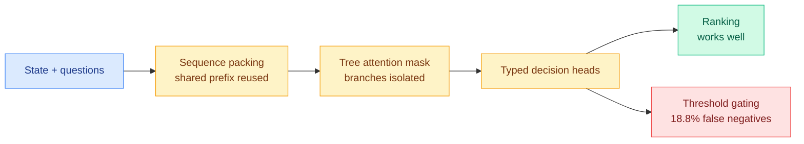

# Media Zone | 2026-09-22

> The decision-model conversation finally turned from claims to measurement, and every number that arrived made the category narrower and more useful at the same time.

## Today's signal

- **Dominant story:** decision models, day seven, but the content shifted from vendor marketing to independent benchmarks, and the benchmarks are unkind.
- **Cross-source convergence:** Xiaomi's MiMo-V2.6 hit the X research feed and YouTube's largest AI channel on the same day, with researchers praising the open RL report rather than the model.
- **Counter-signal:** a six-year-old zero-shot classifier does the same job multimodally in under 50 ms, and existing extraction models were never used as a baseline.
- **The optimization throughline:** cost optimization, and specifically that **standing context is the recurring cost nobody was billing for**, confirmed today by a harness pricing grid, a token-pruning paper and a routing hand-off number.
- **Quiet areas:** no new saved posts in either bookmark run, LinkedIn returned empty, and all eight tracked subreddits were empty for a further day.

---

## Routing, KV cache, compression, GPU

### The decision primitive gets measured, and places third

The week's loudest category finally produced numbers from people who are not selling it, and the picture that emerges is narrower than the pitch but more useful than the backlash. The headline is that a frontier generative model saturates the benchmark built to showcase the specialized alternative. The more practically important finding is about *where* the probability can be trusted: it orders candidates well and it gates actions badly, which is exactly the distinction that decides whether you can put it in a production path.

Benchmark · the day's sharpest number
<h4>Open-Jev completes the first apples-to-apples ladder</h4>

Five full runs on JevBench's 231 public tasks put the open 2B at 64.94% and the open 9B at 77.49%, hosted Jev at 86.58%, GPT-5.6 Luna at 89.18%, and GPT-6 Astra at 100%. Two readings matter. The gap between open clones and the hosted product widened to 9.1 points rather than closing, which undercuts the commoditization story that circulated three days ago. And a general-purpose generative model saturating the suite means the accuracy column has stopped carrying information, so the comparison now rests entirely on latency and price. That is still a real pitch, but it kills the stronger claim that a purpose-built discriminative head is better at deciding rather than merely cheaper at it.

<a href="https://zefan-cai.github.io/open-jev/#jevbench">See the results →</a>

Independent study · first production number
<h4>Milvus tests it as a RAG reranker, and finds the gate leaks</h4>

On 80 SciFact queries over an identical candidate shortlist, the decision model improved nDCG@10 by 0.0778 against a conventional reranker's 0.0446, so it genuinely ranked best on quality. The costs are the catch: median reranking latency 10.2 times higher and estimated cost per run 6.7 times higher, largely because the state-plus-questions interface turned 30 candidates into 30 concurrent requests. The buried result is the important one. Using the returned probability as a filter at a 0.5 threshold, top-5 precision reached 49.4% while 18.8% of genuinely relevant documents were thrown away. That is a published false-negative rate at the natural operating point, and it says the probability is usable for ordering and unusable for gating.

<a href="https://x.com/milvusio">Read the thread →</a>

Mechanism · demystification
<h4>The "parallel sampler" is three standard tricks in a trench coat</h4>

The clearest public explanation of why the forward pass is cheap: sequence packing, plus tree attention masks, plus typed decision heads. One forward pass scores every candidate, shared prefixes are reused across branches, branches are isolated by the mask, and there is no token-by-token decoding loop. Every component is a standard inference-engine feature, which explains both why five open reimplementations appeared inside a week and why practitioners keep reporting that permuting the option list changes the probabilities. Branches sharing a packed prefix under a tree mask is precisely the configuration where option position leaks into the score, so the order-sensitivity bug is predicted by the architecture rather than incidental to it.

<a href="https://di-zhang-llm.github.io/blog/what-is-rlcd-the-secret-behind-jev/">Read the explainer →</a>

[@Zefan_Cai](https://x.com/Zefan_Cai) · [@milvusio](https://x.com/milvusio) · [@di_zhang_fdu](https://x.com/di_zhang_fdu) · [JevBench](https://benchmarkheaven.com/jev-models)

### The routing tax, and the local-inference endgame

- **The most damaging number of the day came from the vendor's own harness blueprint.** An Opus to Sonnet to Opus route costs 6.19 against 4.15 for pure Opus, because handing context back reprocesses it. **Cost angle:** a three-hop route costs roughly 1.5 times what never routing costs, which means a large share of published routing savings were measured against a baseline that does not exist in a cached serving stack.
- **The same document reports where the tokens actually are:** reading and searching consume 56.2% of tool turns and 46.5% of tokens, while writing code is under 10%. If retrieval is the cost centre, the highest-value routing decision in a coding agent is not which model writes the code.
- **Local inference removed the hosted product's last structural advantage.** Laya ported to CoreML runs 3.7 ms per decision on an M5 Pro with 99.5% of operations on the Apple Neural Engine; the MLX build does 7 to 14 ms under 1 GB of RAM. In a Tetris head-to-head on a 16 GB MacBook Air, local at roughly 45 ms beat cloud at roughly 300 ms. **Pricing arguments about $0.042 per million tokens are moot against zero.**
- **The category is now distilling itself away.** `jimothy` turns saved decision queries into task-specific classifiers of 15 to 45 MB that run 10 to 20 times faster in a browser or on a server, with fallback when confidence drops. The decision model becomes a labelling teacher for the small model that replaces it.

[@0xMovez](https://x.com/0xMovez) · [@Alex_tra_memory](https://x.com/Alex_tra_memory) · [@atomic_chat_hq](https://x.com/atomic_chat_hq) · [@AndrewPrifer](https://x.com/AndrewPrifer) · [jimothy](https://github.com/AndrewPrifer/jimothy)

### Free inference-efficiency curriculum, two substantial drops

- **Wafer published an AI performance engineering repository** covering GPU fundamentals and CUDA, kernel optimization, FlashAttention, KV caching, quantization, and NVIDIA, AMD and TPU architectures, with links out to primary docs. **Influence angle:** free, structured coverage of exactly the stack that gates serving cost.
- **`tiny-llm` teaches inference by making you build it.** A hands-on course by @skyzh implementing attention, rotary position embeddings, grouped-query attention and KV caching to construct a small vLLM-equivalent serving Qwen3 from scratch on Apple Silicon with MLX.
- **A short curated list pointed at three primary sources:** the Modular handbook, the JAX scaling book's inference chapter, and Baseten's inference-engineering writeups. The JAX chapter is the closest public analogue to the SemiAnalysis four-regime piece in today's digest.

[@Hesamation](https://x.com/Hesamation) · [@_vmlops](https://x.com/_vmlops) · [@shubh6200](https://x.com/shubh6200) · [JAX scaling book](https://jax-ml.github.io/scaling-book/inference/) · [Modular handbook](https://handbook.modular.com/)

---

## LLMs, agents, safety

### The harness gets priced, and the bill is standing context

This is the reader's most-saved theme, and it had its strongest day of the month. Three results from three directions said the same thing, and none of them is about model quality.

Study · buying-decision shaped
<h4>HarnessTax: the same model bills 5x more in a different wrapper</h4>

Twenty-one model-harness combinations across 60 tasks. Cost per attempt spanned $0.67 to $1.33 while success spanned 96.7% to 97.8%, so roughly a 2x cost spread bought 1.1 points of accuracy, and nine of twelve configurations beat vendor-default Claude Code. The mechanism is not extra reasoning: Pi averaged 15 turns yet the heavy setup carried more than ten times the initial context, because longer instructions and larger tool definitions ride along on every single call. The lean four-tool setup of read, write, edit and bash still holds the cost-success frontier. A co-author's framing is the honest one, that most harness choices run on tribal knowledge and word of mouth.

<a href="https://x.com/AlphaSignalAI">Read the thread →</a>

Google Research · arXiv
<h4>RRSI: harness self-improvement overfits, and the fix saves 30% of tokens</h4>

Automated harness evolution proposes and selects edits to the scaffolding around a frozen model, which is recursive self-improvement at the system level. This paper's finding is that the loop memorizes its training tasks: up to 14.1 points on the split it evolves against, but only up to 4.7 on five out-of-distribution benchmarks. The fix applies classical regularization to the search rather than to a model, with a temporally annealed edit budget, a critic that screens benchmark-specific proposals, and a pruner that removes edits which are too small, too costly or no longer earning their keep. The pruner is why the evolved harness runs on 30% fewer policy tokens: unregularized evolution accretes scaffolding and never deletes it.

<a href="https://arxiv.org/abs/2609.24972">Read the paper →</a>

Talk · AI Engineer
<h4>The Dark Arts of Skill Engineering</h4>

Paul Bakaus on skill engineering, the practitioner-side counterpart to the week's harness research. The conference circuit has now caught up with what this wiki has tracked as a research thread since August, which is a reliable marker that a practice has stabilized enough to teach. Worth pairing with the RRSI result above: the talk covers how practitioners assemble skills by hand, while the paper covers what happens when you let a search loop do it and forget to regularize.

<a href="https://youtube.com/watch?v=SQMCtZX3trg">Watch →</a>

- **A practitioner counterweight worth recording:** Salesforce research finds that once an agent's prompts, tools and workflow are tuned around a weaker model, transplanting a stronger model's configuration makes things worse, and targeted fixes to the weaker model's own failures work better. **Harnesses are fitted to a backbone, not portable assets.**
- **JevHarness fuses the week's two dominant threads.** An LLM writes a task-specific decision policy once, the policy is frozen, and at runtime only code plus fast decision calls execute with no generation in the loop. Reported demo: a Pokémon agent going from 25% to 75% win rate over five iterations.
- **A team published 53 distinct harness bugs** they hit during development. No claim to extract, but a 53-item bug taxonomy from one team is itself evidence of how much implementation surface a harness carries.
- **Reverse-engineering a well-regarded agent memory system found Git, Markdown and grep.** Worth holding against the day's Jev-Mem paper, which builds a multi-relational graph memory with a learned control plane. The baseline being beaten in agent-memory papers is rarely the simple thing that already works.

[@AlphaSignalAI](https://x.com/AlphaSignalAI) · [@rohanpaul_ai](https://x.com/rohanpaul_ai) · [@mfpiccolo](https://x.com/mfpiccolo) · [@DataChaz](https://x.com/DataChaz) · [JevHarness](https://github.com/TianyuCodings/JevHarness)

### Open RL environments become the bottleneck everyone names

Cross-source · X research feed + YouTube
<h4>Xiaomi MiMo-V2.6 Pro, and why researchers care about the report more than the model</h4>

The model is claimed as the strongest open-source option and is reported as roughly 15 times cheaper than Kimi K3, 6 times cheaper than GLM 5.3 and 2 times cheaper than DeepSeek. What actually drew serious researchers is the release contents rather than the benchmarks: reward plots, hyperparameters, data mixtures, costs, roughly 7,000 RL environments, the full RL framework, and a distilled Qwen variant. The model and technical report shipped less than a week after the final RL run started. One substantive caveat circulated alongside the praise: Xiaomi handled reward hacking by red-teaming their own RL environments and iteratively fixing them, which is better than most practice but may not survive explicitly goal-oriented exploitation.

<a href="https://youtube.com/watch?v=Nv_kTdHIVNY">Watch the review →</a>

- **Thomas Wolf argues open RL environments are now the highest-leverage open contribution available,** the equivalent of sharing high-quality pretraining data in the previous paradigm. **Influence angle:** read against Xiaomi shipping 7,000 environments the same day, this reads as a description of where the bottleneck already moved rather than advocacy.
- **CodeMidas automates environment construction from open repositories,** with agents in the loop for task creation, robustness testing (they let an agent try to cheat) and difficulty calibration via pass@n. It sits at #5 on this week's Kurate cs.AI board, so it carries independent quality and social signal.
- **The first retrieval move in a deep-research agent is worth 7.4 points:** GPT-5.5 improved from 83.1% to 90.5% on BrowseComp-Plus with the same retriever and the same loop, purely from the opening context.

[@Thom_Wolf](https://x.com/Thom_Wolf) · [@eliebakouch](https://x.com/eliebakouch) · [@deedydas](https://x.com/deedydas) · [@wassname](https://x.com/wassname) · [@omarsar0](https://x.com/omarsar0) · [CodeMidas](https://arxiv.org/abs/2609.22068)

### Skeptics worth reading

- **CLIP is the counter-signal nobody in the hype cycle wanted.** A zero-shot multimodal classifier released nearly six years ago searches 25,000 images in under 50 ms with no labeling, running locally in a browser on WebGPU. The discriminative-head-instead-of-generation idea is old and already solved in vision.
- **GLiNER2.5's maintainers invited benchmarking** after a wave of loose comparisons, pointing out that existing lightweight extraction models are the obvious baseline the new category has largely not been measured against.
- **Chollet named a gap none of the day's work addresses:** coding can be delegated but understanding cannot, and if code was the artifact through which you maintained understanding, you now need a different one. Every result today optimizes agent cost or success; none measures what the operator still understands afterward.
- **Sebastian Raschka asks whether looped transformers hide chain of thought,** a quiet, low-view video on whether recurrence in depth substitutes for reasoning in tokens. Directly relevant to the test-time-compute thread.

[@xenovacom](https://x.com/xenovacom) · [@george_onx](https://x.com/george_onx) · [@fchollet](https://x.com/fchollet) · [GLiNER2.5 weights](https://huggingface.co/fastino/gliner2.5-multi-v1)

---

## Industry and business

- **Treasury Secretary Bessent placed responsibility for the HuggingFace incident on OpenAI management** rather than on the agents involved, and pushed back on liability exemptions for frontier labs. **The substantive item in a noisy policy day:** it names a principal rather than a tool as accountable.
- **Jensen Huang told CBS that executives calling for AI rules "must be doing it for ulterior reasons."** Notable mainly for who is saying it, and for landing the same week that a paper showed GPU-kernel benchmarks miss 78.6% of precision faults.
- **Alibaba announced the Qwen4 family** at its Yunqi conference: Max, Flash, Plus and a 27B, with 5 to 10 trillion parameter training signalled.
- **Harvey's $15.5B valuation drew public scrutiny** on the feed, with the argument that a seat-priced frontier-model wrapper sees margins improve when usage falls, which is an awkward incentive now that the underlying models got good.

[@Skoorbkaz](https://x.com/Skoorbkaz) · [@Paul__Walsh](https://x.com/Paul__Walsh) · [@MaxForAI](https://x.com/MaxForAI) · [@Allinallnotbad](https://x.com/Allinallnotbad)

### Semiconductor, the quiet lane

- **SEMICON India 2026 produced a short explainer series** on wafer-to-chip manufacturing and India's fab talent pipeline, reporting 70,000-plus engineers trained. Small audiences, but it is the rare primary-source video on fab process aimed at a general technical viewer.

---

## Also crossed your feeds

Meta deployed A-MLE internally to automate ML experimentation across ads-ranking models · a Google paper argues agent workflows belong in an editable procedure graph, with a companion warning that rewriting the runtime after every bad decision teaches the wrong lesson · a 4B coding agent reported 61.5% on SWE-bench Verified without frontier distillation · HelixDB proposes one Rust engine for graph, vector and key-value agent memory · Schmidhuber posted a four-decade retrospective on recursive self-improvement from 1987 onward, useful context for today's RRSI paper · Kev refactored onto Qwen3.5 with 0.8B, 4B and 9B checkpoints · JevBench shipped v1.2.16 and v1.3.0, with Winnow-12B entering at #5 and the original holding #1 at 74.4 against 47 competitors · a widely-reshared developer post on engineering burnout circulated among researchers · CMU released Fall 2026 bootcamp and lab recordings for its Introduction to Deep Learning course · MLST published two Alexander Mattick interviews, on prior structure versus data and on world models in chess.

---

*Sourcing note: no newly-saved bookmarks were captured in either of today's runs, so the usual saved-reading knowledge section has no items and this Media Zone is built from the ranked X home feed and YouTube subscriptions. LinkedIn returned empty, and all eight tracked subreddits were empty for a further day, so there is no practitioner ground-truth section.*
