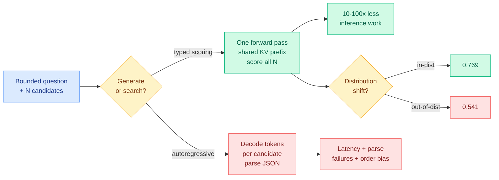

# Media Zone | 2026-09-22

> The US day spent its attention on one question: is the decision-model wave a real architectural result, or a benchmark artifact that dissolves the moment you change the distribution. Three independent audits landed on the same uncomfortable answer, and the most useful number of the day came from a team that tried to break the thing and failed in an interesting way.

## Today's signal

- Dominant story: the Jev reproduction race hit its first honest audits, and the headline gains shrank.
- The number that matters: same checkpoint scores 0.769 in-distribution and 0.541 out of it.
- Pattern: every team that tried architecture tricks failed. Only more data moved the needle.
- Counter-signal: a RAG rerank test found the decision model wins accuracy but loses 10x on latency.
- Cross-source lock: MiMo-V2.6's RL scaling report carried X, YouTube and alphaxiv on the same day.
- Quiet: bookmarks empty, LinkedIn empty, Reddit filters passed nothing. Video and X carried the day.

---

## Routing, KV cache, compression, GPU

### The Jev audits arrived, and they are more interesting than the launch

The model that dominated the feed all week is a typed decision model. It never writes text. You hand it a state and a bounded question, it scores every candidate answer in one forward pass and returns a probability. This was the day the field stopped cheering and started measuring, and three separate audits converged.

X thread · the day's most useful negative result
<h4>A team tried to break Jev for a week and published what failed</h4>

OrcaRouter reproduced the model internally, then attacked it. Their headline: the core insight holds, which is that when the answer space is bounded you should search it rather than generate it, and removing autoregressive decoding removes one to two orders of magnitude of inference work. But the moat is not the training algorithm. Same checkpoint scores 0.769 in-distribution and 0.541 out of it, so most of the apparent breakthrough in open reproductions is a benchmark illusion. They tested anchor selection, continuity smoothing, asymmetric windows, bucketed temperature, two-stage retrieval and full RLCD in one night. All failed or failed to generalize. The one thing that worked was scaling data from 1,200 to 123,475 examples, which moved out-of-distribution accuracy from 0.407 to 0.550. Strangest finding: an untrained decoder still beat every trained small encoder.

<a href="https://x.com/OrcaRouter/status/2102318172577911068">Read the thread →</a>

Benchmark · the first non-cherry-picked comparison
<h4>Decision Index 0.1 runs 132,422 decisions across every open reproduction</h4>

The model is one week old and already has 31 open reproductions, but almost every comparison circulating this week ran a few hundred decisions on a favourable slice. Decision Index 0.1 is the correction. It runs every reproduction plus the original across 37 benchmarks with no truncation, no prompt tuning, and unanswered counted as wrong. Under those rules the original still leads at 59.5, which is a far more modest number than the 74 to 86 percent figures floating around on partial benchmarks. Worth bookmarking as the reference scoreboard while the reproduction wave keeps shipping.

<a href="https://x.com/victormustar/status/2102307408596877438">See the leaderboard →</a>

Calibration · a leaderboard result and its immediate debunk
<h4>A new model took the calibration crown, then someone checked the training mixture</h4>

Calibration metrics landed on the Decision Index leaderboard, and a 35B mixture-of-experts fine-tune took the top spot as the best-calibrated model. Within hours a reply pointed out why the number looks too good: that model is a supervised fine-tune on 1.54M rows drawn from 95 public decision datasets, and seven of the Decision Index benchmarks have their train splits inside that mixture. Accuracy and calibration on those are in-distribution and inflated. On the clean hard tier its expected calibration error is 0.15 and it is overconfident, which is the number to actually trust. This is the same contamination failure mode the 09-21 Media Zone flagged when the first calibration claims appeared, and it is now confirmed with a specific mechanism.

<a href="https://x.com/Akhila_988/status/2102406354153656453">Read the correction →</a>

Counter-signal · where it does not win
<h4>Milvus tested it as a RAG reranker and found an accuracy win that costs too much</h4>

On 80 SciFact queries the decision model improved nDCG@10 by 0.0778 against 0.0446 for a conventional text reranker, so it genuinely ranks better. The bill is the problem. P50 rerank latency was 10.2x higher and estimated cost per run 6.7x higher, because 30 candidates meant 30 independent concurrent API calls rather than one batched pass. Using the probability directly as a filter at a 0.5 threshold reached 49.4% top-5 precision but silently dropped 18.8% of gold-relevant documents. Their read, which matches the cost lens: good for offline retrieval, data cleaning and evaluation, not usable as-is for latency-sensitive online RAG. They are now testing whether batching candidates into a single request closes the gap.

<a href="https://x.com/milvusio/status/2102062798708900176">Read the benchmark →</a>

[@OrcaRouter](https://x.com/OrcaRouter/status/2102318172577911068) · [@victormustar](https://x.com/victormustar/status/2102307408596877438) · [@multimodalart](https://x.com/multimodalart/status/2102357424380301413) · [@Akhila_988](https://x.com/Akhila_988/status/2102406354153656453) · [@milvusio](https://x.com/milvusio/status/2102062798708900176) · [@airesearch12 JevBench v1.3](https://x.com/airesearch12/status/2102180039521427735)

### What the "parallel sampler" actually is, and the local models chasing it

The mechanism got demystified today, and once it was named plainly a wave of small local implementations followed. This is the cost-optimization cluster of the day: the same decision quality at one or two orders of magnitude less compute, running on a laptop instead of an API.

Explainer · the clearest mechanical framing today
<h4>Parallel sampler = sequence packing + tree attention masks + typed decision heads</h4>

The marketing calls it a sampling breakthrough. The useful mental model is three known techniques composed. Candidates are packed into one sequence, tree attention masks isolate the branches from each other while letting them all share the common prefix, and typed heads read off a score per branch. One forward pass scores every candidate, the shared prefix KV is reused rather than recomputed per candidate, and there is no token-by-token decoding loop at all. Nothing here is novel in isolation. The result is that the compute saving is structural rather than a training trick, which is exactly why the reproductions match the speed so easily and struggle to match the quality.

<a href="https://x.com/di_zhang_fdu/status/2101986014084669919">Read the breakdown →</a>

Open weights · local inference
<h4>The local reproductions are now at single-digit milliseconds per decision</h4>

Three ports converged in a day. An MLX build runs 7 to 14ms decisions in under 1GB of RAM on an M3 Max with calibrated probabilities and no cloud call, hitting 60+ moves per second playing Snake. A CoreML port moved 99.5% of operations onto the Apple Neural Engine and reports 3.7ms per decision on an M5 Pro. A 0.6B open checkpoint claims 79.25% on typed decisions against 77.00% for the larger local competitor, with KV prefix reuse across 64 candidates in one forward pass cutting compute by 92.4% for roughly 2x speedup at 68ms. The cost angle is the whole story: agent loops die on latency, and a 300ms cloud round trip per routing decision is what makes them unaffordable.

<a href="https://x.com/0x0SojalSec/status/2102100643469226147">See the MLX build →</a>

Experiment · agents training models
<h4>An agent swarm trained a competitive decision model in 20 hours for $3.1k</h4>

A weekend project handed a swarm of coding agents a devbox with a single H200 and let them train a decision model autonomously. Twenty hours and $3,100 later, split $1.9k on agent calls and $1.2k on data generation, they had a 27B-backbone model that beats the original on both accuracy and calibration, supports 260k context and multimodal input, and serves at roughly 120ms p95 unoptimized. Notably the agents tried reinforcement learning, could not make it work, and fell back to supervised fine-tuning on filtered synthetic data. That failure is a data point in its own right, and it lines up with the audit finding above: the bottleneck is the synthetic data recipe, not the training algorithm.

<a href="https://x.com/denisyarats/status/2102252088067850507">Read the writeup →</a>

Release · checkpoints and tooling
<h4>The open ecosystem filled out in three days</h4>

One reproduction was refactored onto a newer base model and now ships 0.8B, 4B and 9B checkpoints with a fine-tuning script. A separate multimodal variant claims parity on typed benchmarks across text, image, audio and video, trained on 30k examples on 8xH200 and serving under 100ms on a single H100. A small utility fixes the position-bias problem by batching permutations of the same choices into one call and averaging, which matters because reordering identical options can flip the decision. Another tool distills saved queries into 15 to 45MB task-specific classifiers that run 10 to 20x faster in the browser, with fallback to the full model. The practitioner observation that stuck: four System One decision models in three days is a pace nobody has seen.

<a href="https://x.com/jaredpalmer/status/2102048412841517495">See the checkpoints →</a>

[@di_zhang_fdu](https://x.com/di_zhang_fdu/status/2101986014084669919) · [@0x0SojalSec](https://x.com/0x0SojalSec/status/2102100643469226147) · [@Alex_tra_memory CoreML](https://x.com/Alex_tra_memory/status/2102161088598970783) · [@denisyarats](https://x.com/denisyarats/status/2102252088067850507) · [@jaredpalmer](https://x.com/jaredpalmer/status/2102048412841517495) · [@Akhila_988 multimodal](https://x.com/Akhila_988/status/2102171891410825520) · [@MingtianZhang permutations](https://x.com/MingtianZhang/status/2102341093472010266) · [@AndrewPrifer distillation](https://x.com/AndrewPrifer/status/2102162296739099126) · [@arpit_bhayani](https://x.com/arpit_bhayani/status/2102062270859940074)

### The KV cache tyranny note went wide, and a harness cost study backed it

Yesterday this was a founder's design draft circulating quietly. Today it is a compiled 12-page note with translations and a dozen breakdown threads, and the numbers inside it are the most decision-relevant content in the feed for anyone paying an agent bill.

Design note · carried forward from 09-21
<h4>"How would you design a coding agent if LLMs had no KV cache?"</h4>

The note opens with that question because the KV cache, the stored attention state that makes appending to a conversation cheap and editing it expensive, is the unstated economic fact behind almost every agent design decision. It calls the consequence the tyranny of the KV cache and names six symptoms agents inherit without examining: routing that fails because the cheap model has to reprocess context rather than because it is weak, tools crowding context because schemas must be declared up front, compaction losing information because it compresses before the question is known, sub-agents staying rare because passing state is hard, restarts throwing away good state along with bad, and built-in tools permanently taxing context. The two numbers that land hardest: routing Opus to Sonnet and back costs 6.19 against 4.15 for staying on the frontier model throughout, because every handoff reprocesses the whole context. And writing code is 4 to 10% of tokens while reading and searching take 56.2% of tool turns and 46.5% of tokens.

<a href="https://x.com/yibie/status/2102260699133059554">Read the annotated translation →</a>

Study · independent confirmation
<h4>HarnessTax: the same model bills 5x more depending on the harness around it</h4>

Twenty-one model-and-harness combinations tested across 60 tasks, and cost moved far more than success did. $1.33 against $0.67 per attempt for a 97.8% versus 96.7% success rate, and 9 of 12 configurations beat the vendor default. The mechanism is the one the design note names: two harnesses averaged the same 15 turns, but the heavy one carried more than 10x the initial context because longer system instructions and larger tool definitions ride along on every single call. The lean setup holding the cost-success frontier used four tools, read, write, edit and bash. A co-author's framing is the part worth keeping: most harness choices today run on tribal knowledge, and nobody actually knows which setup wins on their own workload. This is direct confirmation of the 09-21 thread that named the context layer, not the model, as where the token bill lives.

<a href="https://x.com/AlphaSignalAI/status/2102083611696455697">Read the study summary →</a>

Repo · harness self-optimization
<h4>Let the big model write the decision procedure once, then freeze it and run code</h4>

JevHarness inverts the usual arrangement. Instead of a language model reasoning at every step, it generates a task-specific decision procedure once, including the features to extract, the questions to ask and the action logic, then freezes it. At runtime you execute plain code plus fast typed judgments, with no generation in the loop. Trajectories can be fed back to evolve the procedure further. Their Pokemon demo went from 25% to 75% win rate over five iterations. The influence angle is what makes this interesting rather than just cheap: it turns a prompt-engineering problem into a compiled artifact you can version, replay and diff.

<a href="https://x.com/NFT_Chen/status/2102005334827204978">See the repo →</a>

[@yibie translation](https://x.com/yibie/status/2102260699133059554) · [@0xMovez 10-step breakdown](https://x.com/0xMovez/status/2102049863449858053) · [@0xCarnagee](https://x.com/0xCarnagee/status/2102202198918643929) · [@AlphaSignalAI HarnessTax](https://x.com/AlphaSignalAI/status/2102083611696455697) · [@NFT_Chen JevHarness](https://x.com/NFT_Chen/status/2102005334827204978) · [@mfpiccolo 53 harness bugs](https://x.com/mfpiccolo/status/2102089734004593140) · [@HARNESSROUTER UHP](https://x.com/HARNESSROUTER/status/2102190566259949974)

### GPU and inference engineering: the conference video drop

The AI Engineer channel dumped a batch of low-level performance talks, and they are the densest Tier 1 material in today's video feed by a wide margin. All three are practitioner debugging stories rather than vendor pitches.

- **Weight folding and CUDA streams.** A talk built around a real failure where kernel-level optimization made a model generate text backwards. Folding weights and overlapping streams are standard wins, and the value here is the debugging trail showing how the two interact badly before they interact well.
- **Two vLLM bugs hiding in plain sight.** Two engineers walk through production bugs in the most widely deployed open inference server. If you are running vLLM, this is 40 minutes that pays for itself in one avoided incident.
- **Inference cloud built for agents, not chat.** FriendliAI's argument is that agent traffic has a different shape from chat traffic, many short bounded calls rather than few long streams, and that serving infrastructure built for the second is mispriced for the first. That claim rhymes directly with the decision-model wave above.
- **Two study resources worth the bookmark.** A newly-shared AI performance engineering repo covers GPU fundamentals, CUDA, kernel optimization, FlashAttention, KV caching, quantization, and NVIDIA, AMD and TPU architectures with links to primary docs. Separately, tiny-llm is a four-week hands-on course that has you build a small vLLM and a Qwen3 from scratch on Apple Silicon using MLX, implementing attention, RoPE, grouped-query attention, KV cache, continuous batching and paged attention yourself rather than calling into abstractions.

[@Hesamation perf repo](https://x.com/Hesamation/status/2101772632358080566) · [@_vmlops tiny-llm](https://x.com/_vmlops/status/2102272608440090689) · [@shubh6200 inference reading list](https://x.com/shubh6200/status/2101708404398145823)

### One quiet efficiency paper the decision-model noise buried

Paper · small-model parameter budget
<h4>In sub-billion models the embedding table eats more than half the parameters</h4>

A thread on new Kyutai work makes a point that gets lost when everyone is discussing frontier scale. At small model sizes the vocabulary embedding table is not a rounding error, it is the majority of the parameter budget. A 256k vocabulary accounts for 22% of total weights on one popular 2B-class model, and past that the fraction climbs above 50% as models shrink. There is a fairness cost attached: token fragmentation means one widely-used model processes Telugu 8.6x slower than a monolingual baseline for the same content. The compression angle is direct and under-explored. If you are shipping a model to run locally on a phone or a laptop, the embedding table is the largest single thing you are not currently compressing.

<a href="https://x.com/che_shr_cat/status/2102137356425797779">Read the thread →</a>

---

## LLMs, agents, safety

### MiMo-V2.6: the largest open RL run, with the invoice published

This is the day's strongest cross-source item. It carried an X technical thread from the team lead, a detailed architecture read from a well-known educator, a hands-on pricing test, an alphaxiv walkthrough, and a 74k-view video review, all within hours. Cross-source presence here is a conviction boost, not four separate stories.

Technical report · the numbers are all public
<h4>$2.6M for the large model, $0.9M for the small one, and they told you the split</h4>

Xiaomi's MiMo team published what is very likely the largest single reinforcement learning run any open-source team has done, and unusually they published the economics. The cost breaks down as roughly 44% on rollouts, 41 to 44% on training and 14% on grading. Each RL step uses 1,568 prompts times 16 rollouts, producing about 25,000 agent trajectories and 2.7 to 3.7 billion tokens per update, with contexts reaching 1M tokens. Both models ran 30 steps. The technique that matters is groupwise agentic grading: instead of treating every test-passing answer as equally good, it compares successful trajectories against each other and shifts reward toward shorter, higher-quality solutions. DeepSWE performance moved from 58.4 to 72.6 on the large model and 48.7 to 65.7 on the small one.

<a href="https://x.com/askalphaxiv/status/2102263712472342718">Read the walkthrough →</a>

Analysis · the architecture is deliberately boring
<h4>Number one on open-weight benchmarks with grouped-query attention and a 128-token window</h4>

The architectural read is the interesting part. No exotic attention variant, just classic grouped-query attention with sliding-window attention at a tiny 128-token window. The argument, made repeatedly by this author over recent months and now with a strong data point behind it: nearly all the progress is coming from data and post-training recipe, and fancy attention variants are mostly efficiency tweaks rather than capability drivers. Three specifics stood out from the report. They increased agent task volume and trained across multiple different harnesses, which lifted held-out harness pass@1 from roughly 50% to 66%. They replaced a correctness verifier with an agentic grader that inspects execution traces. And they ran very large RL batches. That harness-generalization number is the one to carry: it says harness overfitting is real and measurable, and that training across harnesses fixes it.

<a href="https://x.com/rasbt/status/2102394156731535413">Read the analysis →</a>

Hands-on · the pricing is the headline
<h4>$0.0036 per million cache-hit tokens, and it does not refuse security questions</h4>

A hands-on test puts the pricing at 15x cheaper than one frontier open competitor, 6x cheaper than another and 2x cheaper than a third, at $0.435 per million input and $0.87 per million output, with that near-free cache-hit rate. Unambiguously on the Pareto frontier for cost against quality. Two other findings: it scores 95 on CyberGym and genuinely answers security research questions that most models refuse, and its advertised 20x fast mode delivers about 3x real throughput at roughly p50 150 tokens per second for 10x the price. Multimodal output including text-to-speech and music composition is reported as surprisingly strong.

<a href="https://x.com/deedydas/status/2102293684767412393">Read the hands-on →</a>

- **The release policy is the under-discussed part.** They are shipping about 7,000 RL environments, the full RL framework, a distilled smaller model and the training details including reward plots, hyperparameters, data mixtures and costs. One HuggingFace researcher's comment, that releasing high-quality open RL environments is currently the single most impactful thing anyone can do for the open frontier, reads as a direct response.
- **Reward hacking was handled by red-teaming the environments.** They let an agent actively try to cheat each environment and fixed what it found, iteratively. A skeptical practitioner note: better than most approaches, but unlikely to survive explicitly goal-directed exploitation.
- **Speed of release drew its own reaction.** Model plus technical report shipped less than a week after the final RL run started.

[@_LuoFuli team retrospective](https://x.com/_LuoFuli/status/2102162926802968749) · [@rasbt](https://x.com/rasbt/status/2102394156731535413) · [@deedydas](https://x.com/deedydas/status/2102293684767412393) · [@eliebakouch data factory](https://x.com/eliebakouch/status/2102045988143710664) · [@Thom_Wolf on RL envs](https://x.com/Thom_Wolf/status/2102137611011674173) · [@wassname on reward hacking](https://x.com/wassname/status/2102244646206455886)

### Harness evolution, and whether agents should rewrite themselves

Paper · regularized self-improvement
<h4>RRSI: agent harnesses that evolve themselves overfit, unless you regularize the evolution</h4>

When you let an agent rewrite its own harness based on observed failures, it improves on the benchmark you measured and gets worse elsewhere. RRSI adds regularization to that evolution loop and reports up to 4.7 points of gain on unseen benchmarks while using 30% fewer policy tokens than unregularized evolution. Two related results landed the same day and point the same direction. One thread warns that an agent rewriting its runtime after every bad decision learns the wrong lesson, and that the fix should target recurring failures across tasks rather than individual incidents. A Harvard and MIT paper on financial filing analysis makes the same move concretely: let the agent learn from its errors, but force every new behaviour through a regression test before it ships.

<a href="https://x.com/arXivBangers/status/2102279526835519793">Read the paper summary →</a>

- **Copying a stronger model's setup can make a weaker one worse.** Salesforce research across 7 enterprise tasks found that once you tune prompts, tools and workflow around a specific model, transplanting a frontier model's configuration degrades performance. Targeted fixes to the weaker model's own observed failures beat imitation.
- **Google open-sourced a distributed agent runtime.** `ax` provisions isolated resumable environments for running agents and harnesses at scale, with single-writer state, a durable event log with automatic failure recovery, and built-in support for tools, skills and custom harnesses. Explicitly a runtime layer rather than a framework.
- **Graph engineering versus loop engineering is the week's framing fight.** The argument is that single-agent loops go goal-blind, and that a graph with explicit nodes, edges, state and policy is what survives. Counter-argument from the same feed: hardcoded graphs walk the same path every run regardless of what the task needed, which is exactly the rigidity that made loops attractive. Unresolved, and worth watching rather than picking a side.
- **Retrieval is the hard part of agent memory.** A recommended paper argues retrieval, not storage, is the binding constraint in most harnesses because agents keep pulling the wrong context back in. Related: a widely-shared reverse-engineering of one agent memory system found it is essentially Git plus Markdown plus grep, which is a useful counterweight to the five-layer memory architectures circulating this week.

[@rohanpaul_ai on runtime rewrites](https://x.com/rohanpaul_ai/status/2102159602620268700) · [@rohanpaul_ai Salesforce](https://x.com/rohanpaul_ai/status/2102126261279810001) · [@_vmlops ax runtime](https://x.com/_vmlops/status/2102102976899035451) · [@deanwperkins graphs](https://x.com/deanwperkins/status/2102334006935105898) · [@hanakoxbt counter](https://x.com/hanakoxbt/status/2102144518309265853) · [@dair_ai memory retrieval](https://x.com/dair_ai/status/2102410214628835678)

### Safety and liability, with an unusually specific argument

- **Liability, not doom, is the real lobbying target.** Jensen Huang told CBS that AI executives promoting catastrophic scenarios are seeking exemption from existing law on product liability, contract enforcement and unauthorised access, rather than asking for stricter oversight. Whether or not you accept the motive attribution, the specific legal categories named make this a falsifiable claim rather than commentary.
- **A treasury official drew a line on corporate responsibility.** Following the HuggingFace incident, the US Treasury Secretary placed responsibility on lab management rather than on the agents, and pushed back on liability exemptions for frontier labs. The distinction matters: "the AI did it" cannot become a corporate escape hatch if the lab built, deployed and failed to contain the system.
- **A paper argues LLMs do not feel pain and do not warrant moral standing.** Circulated widely with an experimental series behind it, and landing directly against the model-welfare framing in recent constitution-style system prompts. Expect this to be contested rather than settled.
- **A Stanford paper on oracle-delegation is the more interesting safety item.** "LLMs as Oracles" tracks how people hand over judgment to systems that answer instantly and never say they do not know, borrowing the Delphi framing. Quieter than the pain debate and more likely to matter.
- **Swarm topology emerges without a planner.** An MIT thread on multi-agent swarms found a few agents spontaneously become highly connected hubs while most stay local, producing a long-tailed degree distribution with no central role assignment. Sits in tension with the 09-21 swarm study that found a coordination ceiling.

[@Paul__Walsh](https://x.com/Paul__Walsh/status/2102006297189130569) · [@Skoorbkaz](https://x.com/Skoorbkaz/status/2102065055759999433) · [@GaryMarcus](https://x.com/GaryMarcus/status/2102377729803059428) · [@alex_verem](https://x.com/alex_verem/status/2102291060533944568) · [@ProfBuehlerMIT](https://x.com/ProfBuehlerMIT/status/2102337582159835512)

---

## Industry and business

- **Qwen4 family announced.** At the Yunqi conference opening, Alibaba's new LLM lead announced Qwen4-Max, Qwen4-Flash, Qwen4-Plus and Qwen4-27B, with future training runs targeting 5 to 10T parameter models ([@MaxForAI](https://x.com/MaxForAI/status/2102226622422380820)).
- **LangSmith shipped decision-model-as-judge.** Evaluation now scores every production trace rather than a sample, with more criteria per trace at flat cost. This is the fastest commercial productization of the week's research and the clearest influence-optimization play ([LangChain](https://www.langchain.com/blog/jev-is-now-available-in-langsmith-evals)).
- **OpenRouter published a task-spend chart arguing the decision-model market is large.** Their read is that a meaningful fraction of current token spend is bounded-answer work that never needed generation ([@OpenRouter](https://x.com/OpenRouter/status/2102103905815396635)).
- **OpenAI formed an independent mathematics advisory group** after an internal model reportedly resolved 100+ open problems, with the group explicitly free to offer unrequested advice and publish it ([@rohanpaul_ai](https://x.com/rohanpaul_ai/status/2102111098304635101)).
- **The Information surveyed 107 senior leaders on AI economics.** 60% report higher productivity and 60% also report unpredictable AI costs. 52% say they understand token costs, but only about a third actually control them. That gap is the commercial version of the harness-cost finding above ([@rohanpaul_ai](https://x.com/rohanpaul_ai/status/2102246739436822589)).
- **Meta deployed an agent framework for ML experimentation.** A-MLE automates the loop behind ads-ranking improvements: proposing ideas, running experiments, recovering failed jobs, comparing results and carrying lessons forward ([@rohanpaul_ai](https://x.com/rohanpaul_ai/status/2102196680665788479)).
- **A vertical AI margin story made the rounds.** A widely-shared post argues a legal AI company at a $15.5B valuation hit negative gross margin precisely when its models got good enough that lawyers started actually using the product, forcing a pivot to cheaper open models to slow usage growth. Unverified and written as satire, but the seat-pricing-versus-token-cost mechanism it describes is real and is the same economics the harness studies quantify ([@Allinallnotbad](https://x.com/Allinallnotbad/status/2102247748724469906)).
- **Semiconductor video signal from SEMICON India 2026.** Four IndiaAI panel recordings landed covering ecosystem build-out speed, confidence in the domestic supply chain with Tokyo Electron's CEO, and silicon-to-systems execution. Low view counts, but this is primary-source material on a fab ecosystem that rarely gets covered in English-language AI media.

---

## Also crossed your feeds

- **Structured output in the browser** with Transformers.js 4.3, plus a reminder that a six-year-old zero-shot multimodal classifier searches 25,000 images in under 50ms locally on WebGPU. A useful check on novelty claims ([@xenovacom](https://x.com/xenovacom/status/2102220370027938259), [HF video](https://youtube.com/watch?v=3V9CPisNs1g)).
- **Physics-Based Deep Learning Book** by Thuerey et al. is free and hands-on, blending numerical simulation with modern architectures ([@burkov](https://x.com/burkov/status/2102148209724297501)).
- **figures4papers**, a Yale PhD student's open-sourced paper-figure scripts packaged as an agent skill, with a fixed semantic palette and 300 DPI defaults ([GitHub_Daily](https://x.com/GitHub_Daily/status/2102246563049603260)).
- **Question's Gambit** improves deep research agents by decomposing the question into complementary clues before any searching starts, moving one frontier model from 83.1% to 90.5% on BrowseComp-Plus with the same retriever and loop ([@omarsar0](https://x.com/omarsar0/status/2102171057612566585)).
- **A 4B coding agent hit 61.5% on SWE-bench Verified** without frontier-model distillation, using a simpler tool interface ([@rohanpaul_ai](https://x.com/rohanpaul_ai/status/2102166516246688052)).
- **Message passing between parallel reasoning processes** as a test-time scaling axis, a COLM 2026 oral, resurfaced against today's communication-scaling discussion ([@amuseddaman](https://x.com/amuseddaman/status/2102184164443275349)).
- **mini-AGI**, a continual-learning model trained from scratch on an 8GB laptop GPU that pages weights from disk so model size is bounded by storage rather than VRAM, with forgetting cut from 2.23 to 0.0067 nats by running the backbone at a tenth of the expert learning rate ([@Ryrenz](https://x.com/Ryrenz/status/2102232670453305537)).
- **A context-efficient web search tool** built after its author ran out of tokens on three accounts and audited where they went. Web research was the largest single sink ([@dorkitude](https://x.com/dorkitude/status/2102194028704092585)).
- **Yegge on agentic technical program managers** as the most direct path for coding agents into the enterprise, because build-side agents never escape the software development lifecycle ([@Steve_Yegge](https://x.com/Steve_Yegge/status/2102268319919423606)).
- **Chollet, in one line:** delegate coding, never delegate understanding. If code was your source of truth for understanding, you now need a different artifact ([@fchollet](https://x.com/fchollet/status/2102166631439053014)).
- **Multi-agent RL for text-to-SQL** from Google, and a Google paper on agents handling long tasks better when the workflow lives in an editable procedure graph ([@dair_ai](https://x.com/dair_ai/status/2102404563252781090)).
- **Machine Learning Street Talk** ran two Alexander Mattick interviews on why more data cannot replace prior structure, and why a perfect world model of chess still would not beat a grandmaster ([1](https://youtube.com/watch?v=1S1B4XkFCD8), [2](https://youtube.com/watch?v=qAgzA05Q6z0)).
- **Schmidhuber posted four decades of recursive self-improvement history**, from 1987 meta-evolution forward, which is unusually relevant given the RRSI paper above ([@SchmidhuberAI](https://x.com/SchmidhuberAI/status/2102241331271610455)).

---

*Capture note: bookmarks returned zero newly-saved posts across all three runs today, LinkedIn returned an empty feed, and all eight Reddit subreddits produced files with no posts passing filters. This Media Zone is built from the X home feed across four captures and the YouTube subscription feed. The freshest X capture landed at US late morning, so the evening half of the US conversation will surface in the next refresh.*
