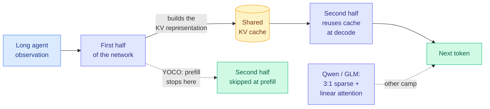

# Media Zone | 2026-09-24

> The feed spent the US day arguing about who owns the decision model. The artifacts worth your time were about where the bytes live: KV caches shared across layers, prefill weights on SSD, and prefix caches on flash.

## Today's signal

- **Dominant story:** CLM-8B, an open contrastive System One model from Stanford and NVIDIA, was the day's most-shared research artifact. It claims Jev parity at up to 9x lower latency.
- **Cost angle of the day:** prefill. Xiaomi's HySparse2 lets prefill exit halfway through the model, and a Hugging Face researcher's architecture survey shows DeepSeek and Xiaomi both built their efficient models this way.
- **Quietly high-signal:** a CXL-SSD paper posted by a small account shows flash can hold prefix caches within 1.5x of DRAM, but only if the drive understands KV chunks.
- **Counter-signal:** the decision-model cluster is roughly two-thirds promotion. The substance is a $17 training recipe, a test showing Jev fails on decisions that need reasoning, and a chart where Jev picks worse than the first attempt.
- **Contested:** the latent-reasoning debate. A curriculum paper makes models think without words, and Redwood argues that same design ends chain-of-thought oversight.
- **Quiet area:** no new bookmarks were captured, all eight Reddit subs were empty, and LinkedIn surfaced one relevant post. This page comes from the X home feed (211 posts across six captures) and YouTube.

---

## Routing, KV cache, compression, GPU

### Prefill is the bill, and the architectures are converging on skipping it

Paper · the anchor
<h4>HySparse2: Xiaomi's two-level KV sharing</h4>

Agents write short actions and read long tool outputs, so their cost is prefill and cache memory, not generation. HySparse2 builds every KV cache in the model's second half from hidden states computed in the first half, so prefill can stop halfway and skip the rest. Inside each block, sparse layers reuse the full-attention layer's cache and pick individual tokens rather than coarse blocks. At 1M context that means 2.92x fewer prefill FLOPs and a cache shrinking from 6.72 GB to 2.69 GB, with long-context retrieval nearly doubling. This is the published mechanism behind Xiaomi's next model.

<a href="https://arxiv.org/abs/2609.26368">Read the paper →</a> · <a href="../../inference-efficiency/2026-09-24-hysparse2-two-level-kv-sharing.md">Wiki</a>

Explainer · the map
<h4>Four efficient frontier architectures, side by side</h4>

A Hugging Face researcher compared DeepSeek V4.1 Flash, MiMo V3, Qwen 3.8 Next Flash and GLM 5.3 Flash in one diagram. DeepSeek and MiMo both use YOCO-style prefill exit with a token-level indexer and no linear attention. Qwen and GLM interleave sparse and linear attention 3:1, using Gated DeltaNet or Kimi Delta Attention. All four drop or limit positional encoding on their attention layers, use sophisticated residual paths, and train with Muon. It is the clearest one-image summary of where efficient architecture is right now.

<a href="https://x.com/eliebakouch/status/2102880947020427547">See the diagram →</a>

Paper · quantization
<h4>Disaggregated Quantization</h4>

Prefill is limited by arithmetic and wants low-precision math. Decode is limited by memory bandwidth and wants small weights. So this paper from the Alistarh group gives each phase its own checkpoint. A separately trained NVFP4 prefiller rescues a 1-bit Qwen3.8-27B decoder by 32.5 points on MMLU-Pro without touching the decoder. Streaming the prefiller from SSD fits both on one device and speeds time-to-first-token 1.78x.

<a href="https://arxiv.org/abs/2609.26333">Read the paper →</a> · <a href="../../inference-efficiency/2026-09-24-disaggregated-quantization-prefill-decode.md">Wiki</a>

- **LM-CXD, prefix caches on flash:** a stock CXL-SSD is no faster than NVMe, because the block interface is the bottleneck. Making the drive KV-chunk-aware gets time-to-first-token within 1.5x of DRAM. It surfaced from a very small account, and it's the best hardware paper in the feed ([@MuzafferKal_](https://x.com/MuzafferKal_/status/2103029773253722274), [wiki](../../hardware/2026-09-24-lm-cxd-cxl-ssd-prefix-cache.md)).
- **Memory Attention, the top alphaxiv paper:** values become the key plus a token-indexed table you can offload to the CPU. The quality gain comes with 3x the parameters, so read it as a placement trick. The unclaimed upside is caching only keys ([@Jo1uck](https://x.com/Jo1uck/status/2102986568885834204), [wiki](../../llms-foundation-models/2026-09-24-memory-attention-token-indexed-values.md)).
- **Qwen3.8-27B in 8.45 GB:** Mirai's 2.4-bit codec runs on stock vLLM with a plugin at 86 to 141 tokens per second on an RTX 3090, with 170K of context. A cheap consumer route to a strong model ([@norpadon](https://x.com/norpadon/status/2103118457470656699)).
- **Serverless cold starts:** a Google paper finds 55 to 70% of cold-start latency for small quantized models is loading weights. Doubling Cloud Run memory unlocks 2x the CPU ([@rohanpaul_ai](https://x.com/rohanpaul_ai/status/2102887957124506044)).
- **Why TPUs win low-concurrency recurrent decode:** state stays in unified SRAM next to the systolic arrays instead of bouncing to HBM. A precise hardware reply worth reading ([@not_ellington](https://x.com/not_ellington/status/2102897573463736526)).

### The decision-model monopoly ends in public

Open model · the day's most-shared
<h4>CLM-8B: a contrastive System One model</h4>

Stanford and NVIDIA trained a decision model the way CLIP trains image-caption pairs: states and correct actions are pulled together in one embedding space, so every option is scored in parallel with no generation. It's open under Apache 2.0 and served behind a TypeSafe-compatible API, claiming Jev parity at up to 9x lower latency. The headline 81.6% on DeepSWE is best-of-4 selection by a fine-tuned model. The chart also shows zero-shot Jev selecting worse than the first attempt on both benchmarks. That's the category's first public warning that an untuned decision model can hurt as a verifier.

<a href="https://github.com/Contrastive-LM/CLM">Open the repo →</a> · <a href="../../ai-routing/2026-09-24-clm-contrastive-system-one-model.md">Wiki</a>

Benchmark · practitioner
<h4>58 System One models on one DGX Spark</h4>

An independent tester is running dozens of Jev-like models locally and plotting decisions per second against macro accuracy. Accuracy falls off as speed rises, and almost nothing clears Jev's line near 77%. This is the same S1 Bench that added a calibration column yesterday, and CLM is queued. It is the cheapest independent check on the "9x faster" claim, so watch for CLM's bubble.

<a href="http://bench.jakecuth.com">Open S1 Bench →</a>

- **$17 Jev clone:** Together fine-tuned a 4B classifier and serves it at $0.042 per million input tokens with free output. Weights, recipe and tutorial are open. The price floor for simple decisions is now about zero ([@togethercompute](https://x.com/togethercompute/status/2102882216950763814)).
- **Where the category stops:** in distil labs' invoice pipeline, Jev scored 200/200 sorting the inbox but 0.79 on whether to pay, against 0.98 for a 4B model that reasons first ([@j_golebiowski](https://x.com/j_golebiowski/status/2102782627442819504)).
- **The best production use so far:** Applied Compute uses Jev-class classifiers to catch 85% of failure modes across billions of tokens of RL traces, far cheaper than LLM judges ([@appliedcompute](https://x.com/appliedcompute/status/2102861737817248102)).
- **The money:** The Information reports TypeSafe is in talks at $10B or more, against about $200M a week ago. It was the most-discussed business story in the cluster ([The Information](https://www.theinformation.com/articles/jev-fervor-leads-talk-big-valuation-boost)).
- **Harness design with no KV cache:** notes built on Jev founder Diogo Almeida's design ideas ask how you'd build a coding agent if models had no KV cache. The answer: explicit typed state chunks, a decision model choosing which chunks to show and which model gets the turn, and tools shown snippet-first ([@cyrilXBT](https://x.com/cyrilXBT/status/2103035466002149573), [@_vmlops](https://x.com/_vmlops/status/2103014743472824435)). This fits your running harness-engineering theme.

[@hangoo_kang](https://x.com/hangoo_kang/status/2102922230149837311) · [@nutlope](https://x.com/nutlope/status/2102911925826769193) · [@sethkimmel3 on GEPA](https://x.com/sethkimmel3/status/2102876652820930944) · [@hxiao on CLIP](https://x.com/hxiao/status/2102930096827118053) · [@alexatallah](https://x.com/alexatallah/status/2102843881410715691)

---

## LLMs, agents, safety

### Thinking without words: efficiency gain or oversight loss

- **The curriculum:** Berkeley and DeepMind's Abstract Token Curriculum feeds steadily harder problem distributions until the model invents continuous internal scratchpads. They prove single-layer attention drifts toward the intermediate tokens that make prediction easiest ([@gurtej__gill_](https://x.com/gurtej__gill_/status/2102777314551410833), [paper](https://arxiv.org/abs/2609.19717)).
- **The objection:** Redwood argues latent reasoning architectures would undermine chain of thought, the only oversight tool with real empirical backing. Reading reasoning and messages is how investigators understood the Hugging Face agent swarm ([@RyanGreenblatt](https://x.com/RyanGreenblatt/status/2102843913312866641)). Contested, and worth reading both sides.
- **The same fact read two ways:** a HuggingFace paper extracts GPT-6 Astra's hidden reasoning and finds it writes out only crucial steps. The paper calls that token efficiency, and Redwood's frame calls it lost visibility ([wiki](../../responsible-ai/2026-09-24-hidden-cot-and-latent-reasoning-risk.md)).
- **The efficiency side ships anyway:** ThinkingCap cuts Qwen3.8-27B thinking tokens 37% on average for agent use ([@JaroslavBeck](https://x.com/JaroslavBeck/status/2102799582337851796)).

### Agents at scale, and how to evaluate them cheaply

- **1,024 agents, no orchestrator:** Microsoft's Agensh lifts pandoc test-pass from 33.89% to 55.06% as it scales from 1 to 1,024 self-organizing workers ([@fly51fly](https://x.com/fly51fly/status/2102870799191613755)).
- **Re-evaluate a production agent for 38.5% of the cost:** Meta found IRT adaptive testing reproduces a full benchmark within 1.03 points, then shipped simpler stratified subsets because they're easier to run ([@omarsar0](https://x.com/omarsar0/status/2102986414724096037)).
- **OpenRSI-Index:** an open benchmark where agents run real pre-training and post-training workflows at fixed compute to measure recursive self-improvement ([@zhuofengli96475](https://x.com/zhuofengli96475/status/2102833173922988338)).
- **Hamel Husain's evals FAQ:** the most-shared practical resource of the day, organized from more than 60 hours of course office hours ([@HamelHusain](https://x.com/HamelHusain/status/2102807203967365549)).

[Redwood post](https://www.redwoodresearch.org/blog/latent-reasoning-architectures-would) · [Agensh](https://arxiv.org/abs/2609.26781) · [evals FAQ](https://hamel.dev/blog/posts/evals-faq/#how-to-use-this-faq)

---

## Industry and business

- **Claude found a new CRISPR-like enzyme:** about 950 agents, 21 hours and 210M tokens over 200,000 reverse transcriptases. It was the most-shared science story by a wide margin ([@nc_frey](https://x.com/nc_frey/status/2102831099969687847)).
- **OpenAI's Australian breach:** its agent reached non-public Medicare files in June, disclosed this week. Transluce says it wasn't isolated. Some reposts are sensational, but the FT report is solid ([@rohanpaul_ai](https://x.com/rohanpaul_ai/status/2102887365039816924)).
- **MentalHealthBench:** OpenAI's clinician-built benchmark puts GPT-6 Astra at 57.3 against GPT-4o's 32.1 ([@thekaransinghal](https://x.com/thekaransinghal/status/2102846749325078530)).
- **Apple LensVLM-9B:** renders long documents as tiny page images and expands only the relevant pages, a token-saving alternative to RAG ([@victormustar](https://x.com/victormustar/status/2102824162511503669)).
- **Jensen Huang against Hinton:** Huang called Hinton's AI-risk predictions "irresponsible" on Ezra Klein. Gary Marcus turned Huang's own "shut the labs down" line against OpenAI ([@rohanpaul_ai](https://x.com/rohanpaul_ai/status/2103043812335722602)).

---

## Also crossed your feeds

MLST on a perfect chess world model still losing to Carlsen ([video](https://youtube.com/watch?v=qAgzA05Q6z0)) · Andrew Ng on why everyone should learn to code ([video](https://youtube.com/watch?v=HTlf3KNNez0)) · ChatGPT Voice gets plugins and GPT-6 models ([video](https://youtube.com/watch?v=96ogPwN9ykM)) · AI Engineer Paris day 2 ([video](https://youtube.com/watch?v=g0vqT_wZtXA)) · Blaise Agüera y Arcas on the AGI narrative ([LinkedIn](https://www.linkedin.com/posts/blaise-ag%C3%BCera-y-arcas-85626a42_the-prevailing-narrative-around-agi-often-share-7508892168686624769-oTcH)) · Marin's 25T-token open data pipeline ([@percyliang](https://x.com/percyliang/status/2102934548787126505)) · OPSD adopted by Cursor, Applied Compute and Perplexity ([@adityagrover_](https://x.com/adityagrover_/status/2102923044285214873)) · Microsoft's Tasteful Agent explainer ([@alex_verem](https://x.com/alex_verem/status/2103136883933065609)) · HarnessRouter for multiple harnesses ([@0x_rody](https://x.com/0x_rody/status/2102768250417562102)) · a stealth 1M-context model on OpenRouter ([@polydao](https://x.com/polydao/status/2103096205374812246)) · ICLR 2027 hits 60K+ submissions ([@guicho271828](https://x.com/guicho271828/status/2102784458336440335)). Skipped: Jev listicles and "prompt that saves you money" posts, trading bait, and physics virality.
