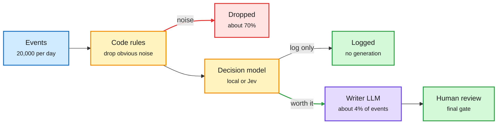

# Media Zone | 2026-10-02

> *Live draft: this window is still open. It is finalized with the 2026-10-02 digest at the 10:30 IST cutoff.*

> The US day's conversation so far is about where the compute bill gets decided. A Meta paper shows long-running agents scale only when a separate manager spends the budget. Practitioners show the same thing at the router: most of an agent's bill is set before the big model is ever called. On the hardware side, the price of GPU hours went up at AWS and down at the neoclouds, and DeepSeek's open kernels kept chipping at CUDA lock-in.

## Today's signal

- **Dominant story:** spend compute on deciding, not doing. Meta's agentic meta-reasoning controller beats an identical agent without one in all 12 head-to-heads at the top budget.
- **Router economics:** builders now publish per-stage bills. One loop routes 20,000 daily events so only 4% reach the writer model; another moves a safety gate to an 18 ms local model.
- **Compute pricing splits:** AWS reportedly raises reserved H100/B200/B300 prices about 15%, while CoreWeave claims GB200 tokens at well under half the hyperscaler rate.
- **Kernels:** DeepSeek's DeepGEMM (FP8/FP4 MoE matmuls for Hopper and Blackwell) circulates again as its Ascend ports land; Transformers.js ships open WebGPU kernels for 200+ ops.
- **Contested:** "Apple proved RLHF causes hallucination" is a viral overreach of a calibration result. Read the claim, skip the thread.
- **Quiet areas:** no new X bookmarks or curated reposts this window, and no new YouTube or LinkedIn captures yet. The X Following feed and Gmail carry the draft.

---

## Routing, KV cache, compression, GPU

### The bill is decided before the model is called

Yesterday's story was the decision model going local and cheap. Today the feed moved to the arithmetic around it: where the money actually goes in a routed agent loop, and how much of it a small gate can remove.

Most events never reach the expensive model

Code rules and a small decider filter first. The writer model only sees what survives.

Blue is input, amber is a cheap filter, red is discarded work, purple is the costly model, green is the outcome.

X post · routing cost breakdown
<h4>"Optimize the 4% before the writer"</h4>

A builder posted the full funnel of a Jev-gated pipeline: 20,000 events a day, 14,000 dropped as noise, 4,700 logged, 800 drafted, 500 sent to a human. Only about 4% reach the writing model. The decision layer costs $0.84 a day while the whole loop lands at $29.04. The point: once a router exists, the remaining cost lives almost entirely in the generation step, so that is where to optimize next. Quietly high-signal off a small account.

<a href="https://x.com/gippp69/status/2105629068330709120">Read the post →</a>

X post · local gate
<h4>An 18 ms local decider for your agent's safety hook</h4>

A ten-step write-up on moving a coding agent's allow/ask/deny hook off a cloud decision API. Plain code rules run first, narrow questions go to a 1.5 GB local model at about 18 ms per call, and only fuzzy judgment goes to Jev or a human. A router in front makes moving a question between local and cloud a config change. The honest number is accuracy: 93.5% local against Jev's 97.2%, so local is for the questions you never wanted to upload, not all of them.

<a href="https://x.com/Asteri_eth/status/2105584994538160441">Read the post →</a>

Product · enterprise decision API
<h4>Databricks AI Decide</h4>

Databricks launched an `ai_decide` function that turns raw text into structured decisions over governed data, explicitly positioned for customers who cannot send data to TypeSafe's Jev. It runs in batch from SQL over millions of documents or in real time over REST, and Databricks names model routing as a target use. Permissions will be governed through its Unity Gateway. This is the third vendor in a week to ship the "decision endpoint" shape, after OpenAI and Ollama.

<a href="https://x.com/jjanezhang/status/2105414552586432810">Read the launch →</a>

- **Serving loop, explained.** A clear walkthrough of how a vLLM-style scheduler admits requests each step under two limits, token budget and free KV cache (the stored attention keys and values for past tokens), with chunked prefill so long prompts do not stall decodes ([@_avichawla](https://x.com/_avichawla/status/2105566603131920835)).
- **One API for every team.** Red Hat's Model-as-a-Service puts approved models behind one OpenAI-compatible endpoint with rate limits and metering, on vLLM and llm-d. The cost angle is consolidation: fewer idle per-team deployments ([@RedHat_AI](https://x.com/RedHat_AI/status/2105680426173882738)).
- **Gateway as chokepoint.** LiteLLM launched Lens, pitched as observability over all enterprise AI traffic since the proxy already sees every call. Reposted by YC and Garry Tan ([@garrytan RT](https://x.com/garrytan/status/2105649934229963168)).

### Kernels keep leaving CUDA

Repo · GPU kernels
<h4>DeepGEMM and the Ascend ports</h4>

DeepGEMM is DeepSeek's open matrix-multiply library for Hopper and Blackwell, with FP8, FP4 and BF16 paths, grouped GEMMs for mixture-of-experts layers, compute and communication overlap, and kernels compiled at runtime so installation needs no CUDA build. It resurfaced today because DeepSeek's Ascend ports (covered yesterday) report DeepGEMM-Ascend at 431 of a 432 BF16 TFLOPS ceiling. One catch from the feed: DeepEP-Ascend shipped without a license file, so it cannot legally be reused yet.

<a href="https://x.com/simplifyinAI/status/2105633301625282924">DeepGEMM post →</a> · <a href="https://x.com/rohanpaul_ai/status/2105528237984280642">Ascend details</a> · <a href="https://github.com/deepseek-ai/TileKernels">TileKernels repo</a>

Open source · browser inference
<h4>WebGPU kernels for 200+ ops</h4>

Xenova (Transformers.js) open-sourced what they call the fastest WebGPU kernels for over 200 machine learning operations, specialized per hardware. For cost, it pushes more inference onto the user's own device, which is free compute from the provider's point of view. Amplified by Hugging Face with a high engagement rate for its reach; benchmarks are not in the capture yet.

<a href="https://x.com/huggingface/status/2105652542151839860">Read the post →</a>

Paper · parameter-efficient generation
<h4>Looped Diffusion Transformer</h4>

Looped-DiT reuses the same Transformer blocks several times inside each denoising step, trading parameters for depth-by-repetition. The reported result: a 260M model beats a model 6.5x larger on text-to-image benchmarks while using 4.9x less inference compute. Looping (weight-tied recurrence) has been a language-model efficiency theme; this is the image-generation version, and it fits more capability into a small VRAM budget.

<a href="https://arxivb.org/abs/2609.40305">Read the paper →</a> · <a href="https://x.com/arXivBangers/status/2105541033610318317">X post</a>

### GPU hours: dearer at AWS, cheaper at neoclouds

- **AWS raises reserved GPU prices about 15%** across H100, B200 and B300 starting next week, per a markets account. If confirmed, premium capacity is still supply-constrained ([post](https://x.com/StockSavvyShay/status/2105625484549824885)).
- **CoreWeave claims about $0.75 per million tokens on GB200 NVL72** against roughly $1.86 at major hyperscalers on the same Nvidia hardware. That gap is the stated reason labs move workloads to neoclouds. Vendor-favourable framing; treat as a claim ([post](https://x.com/StockSavvyShay/status/2105663555278344242)).
- **Nebius buys Inferize** to cut model cold starts and idle GPU time, so the same fleet serves more inference at a lower cost per token ([post](https://x.com/StockSavvyShay/status/2105621400291819812)).
- **Oracle and Tencent's $7B deal** for about 100K chips in Southeast Asia, roughly 30% paid upfront. Ed Zitron's back-of-envelope puts it near $1.60 per GPU-hour, cheap for H100 and very cheap for Blackwell ([deal](https://x.com/StockSavvyShay/status/2105587755753652722), [math](https://x.com/edzitron/status/2105549020802466280)).
- **Micron follow-through.** After yesterday's blowout quarter, the CEO says growth now comes from bit volume and mix (HBM, server DRAM, enterprise SSD) rather than spot price jumps ([post](https://x.com/StockSavvyShay/status/2105675656688459844)).
- **Cerebras inside a paid OpenAI tier** at about 750 output tokens per second. The bull case is that latency alone is now worth a product line ([post](https://x.com/StockSavvyShay/status/2105642582739141013)).

---

## LLMs, agents, safety

### Long-running agents need a manager

Paper · inference-time scaling
<h4>Thinking Before Thinking: agentic meta-reasoning</h4>

As agent runs get longer, each step forces control choices: which partial work to build on, whether to restart, when to stop. This Meta paper splits those out. Workers do the task; a controller keeps a compact summary of what the run has established, weighs next options against the remaining budget, and decides which past results each worker sees. On ProgramBench it reaches 71.5% with GPT-5.5 against Codex's 58.0%, and 67.2% with Opus 4.8 against Claude Code's 65.5%. Tripling the budget lifted the managed agent from 64.1% to 71.5% while the unmanaged one stalled near 64%. The lesson for cost: extra compute is wasted unless something decides where it goes.

<a href="https://arxiv.org/abs/2609.38147">Read the paper →</a> · <a href="https://x.com/rohanpaul_ai/status/2105576075552239720">Explainer</a>

Paper · small coding agents
<h4>Marathoner: a 9B model that codes for 10+ hours</h4>

Ant Group, Peking University and the University of Macau train Qwen3.5-9B to sustain 1,000+ tool calls. Tasks are mined from 100,000 GitHub PRs and chained to make them harder, the model is first trained on successful Kimi K3 runs, then RL runs in real execution environments. A bonus rewards useful progress late in a run, such as finding a hidden bug. SWE-bench Verified goes from 43.8% to 77.5% and Terminal-Bench 2.0 from 27.3% to 57.2%. Persistence, not just raw skill, looks trainable into a cheap model.

<a href="https://x.com/mark_k/status/2105648133443125703">Read the post →</a>

Repo · harness evolution
<h4>Google's RRSI: evolving the harness, not the model</h4>

Regularized Recursive Self-Improvement automatically evolves every part of an agent harness (prompts, control flow, tools, memory) around a frozen LLM, with regularization to keep changes from overfitting. It lands the same day as the meta-reasoning paper, and both say the same thing: the leverage is in the loop around the model.

<a href="https://github.com/google-research/rrsi">See the repo →</a> · <a href="https://x.com/rohanpaul_ai/status/2105593886886531100">X post</a>

- **Harness essays, X Articles edition.** Three long reads on harness design: Comma's Salix uses programmable event loops so always-on agents can watch more sources than fit in context ([@heyang_zhou](https://x.com/heyang_zhou/status/2105517547500253434)); a reverse-engineering of the Instinct assistant's single-threaded chat, memory and background tasks ([@yashhsm](https://x.com/yashhsm/status/2105380670688346335)); and a guide to building agent software for knowledge work ([@arscontexta](https://x.com/arscontexta/status/2105397004226494487)).
- **Grading agents on live data.** An Adobe paper writes the expected answer as code that re-fetches the current result at test time. The AI grader then agrees with human experts 29% more often and uses 16% fewer tokens ([explainer](https://x.com/rohanpaul_ai/status/2105614200273879146), [paper](https://arxiv.org/abs/2609.16487)).
- **Review the package, not the PR.** Qodo 3.0 groups the several PRs one agent task produces across repos into one scored work package with a single review brief ([@omarsar0](https://x.com/omarsar0/status/2105664489534230830), [Qodo](https://www.qodo.ai/blog/introducing-qodo-3.0/)).
- **Contested: "RLHF causes hallucination."** A viral thread credits Apple with "proving" this. The underlying idea, that preference tuning rewards confident answers and erodes calibration, is real and well-studied; "proved" and "the reason" are the thread's additions ([thread](https://x.com/thesupermannx/status/2105554102558351724)).

### Retrieval and self-improvement

- **Perplexity's contextual embeddings.** The model encodes the whole document once and pools per-chunk vectors, so each chunk sees full context. Training labels are distilled from Perplexity's context-compression model, which scores every token against the query. The 9B preview leads ConTEB and turbopuffer's blind context-bench by 14.4 points recall@10, and still wins at 1 KB int8 vectors against an 8 KB rival. Open-sourced ([@denisyarats](https://x.com/denisyarats/status/2105380502203195835), [@AravSrinivas](https://x.com/AravSrinivas/status/2105377088249426229)).
- **UniEvo-VL.** One multimodal model plays both teacher and student: the teacher sees its own critique, the student does not, and training closes the gap on the student's own trajectories. GenEval rises from 0.747 to 0.808 on Qwen-image; text rendering stays mixed ([@WUFang40615703](https://x.com/WUFang40615703/status/2105536438171586944), [paper](https://arxiv.org/abs/2609.38721)).
- **Invent a dataset.** Adaption Labs' technical report on going from zero data to a training set for a new capability ([@sarahookr](https://x.com/sarahookr/status/2105643841282076970), [report](https://www.alphaxiv.org/abs/2609.invent-a-dataset-zero-seed)).

---

## Industry and business

- **Broadcom to finance up to $42B of Anthropic's buildout,** locking in years of compute demand ([post](https://x.com/StockSavvyShay/status/2105622873713062317)).
- **Google sends four TPUs to orbit** for Project Suncatcher, its solar-powered space compute test. Google's own math says it only pays off near $200/kg launch costs around 2035 ([post](https://x.com/StockSavvyShay/status/2105638422451036337)).
- **Halluminate raises a $30M Series A** led by Oak HC/FT with YC participating ([YC RT](https://x.com/ycombinator/status/2105678977285427448)).
- **Gemini 4 Argon, day two.** Launch reposts keep coming (1M-token output, 12 of 18 benchmarks led, cyber defenders first). Yesterday's caveat still applies: cheap per token, heavy per task ([post](https://x.com/VaibhavSisinty/status/2105615691324043465)).
- **Accountability thread continues.** Altman's declined Senate hearing and OpenAI's distillation accusation recirculate; a CNN report on a chatbot-fabricated intelligence near-miss with China drives the AI-harm-is-here-now argument ([@mmitchell_ai](https://x.com/mmitchell_ai/status/2105665447404224680), [Guardian](https://www.theguardian.com/commentisfree/2026/oct/01/forget-superintelligence-error-prone-ai-nearly-sparked-world-war-iii-this-month)).
- **SynthID Bio.** DeepMind watermarks AI-designed protein sequences without changing their function, released openly for research ([post](https://x.com/GoogleDeepMind/status/2105624656170643854)).
- **Orchestration over "god models."** A Business Analytics Review essay argues compounding error rates cap single-model workflows and push value to orchestration layers ([essay](https://businessanalytics.substack.com/p/why-single-ai-models-fail-at-complex)).

---

## Also crossed your feeds

AI System Design study guide repo ([link](https://x.com/pallavishekhar_/status/2105553110534144320)) · Meta's Muse coming to its glasses ([link](https://x.com/StockSavvyShay/status/2105668265326588309)) · ServiceNow Flow service desk ([link](https://x.com/StockSavvyShay/status/2105670142889971871)) · webAI's 3.6B TwIL-LM3-Pro beats VibeThinker-3B ([link](https://x.com/rohanpaul_ai/status/2105606771725553678)) · Red Hat thread on model backdoors ([link](https://x.com/RedHat_AI/status/2105676814748197290)) · Gary Marcus on LLMs and alignment ([link](https://x.com/GaryMarcus/status/2105640814290596092)) · 75% of chip capacity still in Asia ([link](https://x.com/StockSavvyShay/status/2105657841218621589)) · TRL at 1M trainings a month ([link](https://x.com/huggingface/status/2105577057744757119)) · Anil Seth's Noema essay on conscious AI ([link](https://www.noemamag.com/the-mythology-of-conscious-ai)) · Towards Data Science's September roundup (Claude Skills, graph engineering, Jev) · Skip: "Opus 5.5 prompt" and "make money in 7 days" bait.
