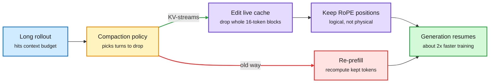

# Media Zone | 2026-10-03

> *Live draft: this window is still open. It is finalized with the 2026-10-03 digest at the 10:30 IST cutoff.*

> The US day's conversation so far is about not paying twice. KV-streams stops agentic RL from rebuilding the KV cache after every context compaction, Microsoft's FOCUS drops the agent history that no future decision depends on, and Hugging Face showed the same weights scoring 62% in one harness and 33% in another, so training in the harness beats copying a bigger model. Decision models kept getting cheaper (Perplexity open-sourced one and prices input at 4 cents per million tokens), while the hardware money said the scarce thing is memory: JPMorgan sees HBM revenue up 2.5x in 2027, Tesla cut chip RAM, and Nvidia now sells half the DGX Spark memory for more money.

## Today's signal

- **Dominant story:** reuse beats recompute. KV-streams edits the live KV cache instead of re-prefilling, nearly halving agentic RL training time.
- **The harness is a training variable:** one model, 62% vs 33% across harnesses. Multi-harness RL lifts a 2.6B model everywhere; imitation of a 27B model plateaus below it.
- **Decision models race to the floor:** Perplexity's open pplx-decider-27b, Amazon's 2B Strands Decider and a Red Hat test where a 200M classifier matches a 35B model on prompt injection.
- **Memory is the pricing-power layer:** HBM revenue forecast up 2.5x in 2027; Tesla trades capacity for volume but holds bandwidth constant.
- **Counter-signal:** Ed Zitron calls Amazon's $8B GPU sale-and-leaseback "off balance sheet in plain sight"; the SAS sparse-attention hype outran its evidence.
- **Quiet areas:** no new bookmarks, curated reposts, YouTube or LinkedIn captures this window, and Reddit was empty. The X Following feed and Gmail carry the draft.

---

## Routing, KV cache, compression, GPU

### Stop paying for tokens you already computed

Four items, one idea: most of an agent's context cost is waste you can remove without retraining the model. The sharpest one works at the KV cache (the stored attention keys and values that let a model skip recomputing earlier tokens).

Compaction without a second prefill

KV-streams cuts dropped turns out of the live cache instead of rebuilding a shorter one.

Blue is input, amber is the compaction decision, red is the wasted recompute path, purple is the new cache edit, green is the result.

Repo · KV cache reuse
<h4>KV-streams: compact the cache, not the sequence</h4>

Agentic RL rollouts are long, so when one hits its context budget a policy drops old turns. Most systems then re-prefill: they build a shorter sequence and push every kept token through the model again, rebuilding the KV cache each time. KV-streams deletes the dropped turns directly from the live cache instead. It needs two fixes to work: cached keys keep their original RoPE (rotary position) angles, so logical position is tracked separately from physical slot, and vLLM's 16-token block table is repacked by removing whole blocks so the attention kernel never reads a hole. The claim is nearly 2x faster agent training. This is the KV-cache cost lens applied to training, not just serving.

<a href="https://github.com/Emilianopp/KV-streams">See the repo →</a> · <a href="https://x.com/_avichawla/status/2105966570690461851">X explainer</a>

Paper · context compression
<h4>FOCUS: keep only the history your next decision needs</h4>

Microsoft M365 Research asks a different question about agent memory: which past interactions do the agent's future decisions actually depend on? FOCUS keeps those interaction units and drops the rest. It needs no training data or fine-tuning, so it sits as a separate layer in front of closed-API models. Across tool-calling, QA, web and multi-turn dialogue it cuts peak context by up to 48% and raises task success by up to 8.9 points over running on the full history. Less context and better answers at once says long histories were hurting, not just costing.

<a href="https://academy.dair.ai/papers/focus-training-free-decision-preserving-context-compression-for-llm-agents-2609.37590">Read the paper summary →</a> · <a href="https://x.com/dair_ai/status/2105915729812050342">X post</a>

Paper · stale context
<h4>Models know you changed your mind, then use the old answer</h4>

A Berkeley paper finds that when a preference or deadline changes mid-conversation, the model still encodes the new value but its attention drifts back to older mentions. In five open models, nudging attention toward the newest value fixed most errors without retraining. A frontier model got 9 of 40 questions right on long agent logs, and 40 of 40 when handed the current state. It is the same lesson as FOCUS from the failure side: state beats history.

<a href="https://arxiv.org/abs/2609.38866">Read the paper →</a> · <a href="https://x.com/rohanpaul_ai/status/2106005276549861594">X post</a>

X post · sparse attention, treat with care
<h4>SAS: learned gates that skip unimportant tokens</h4>

Tencent's Simple Attention Sparsification freezes the base model and trains only lightweight gate-routers that rank context tokens, then skips the low-ranked ones through an SGLang block-sparse backend. The post claims a large compute drop with math and coding accuracy intact. The viral framing ("stupidly cheaper") came with no numbers or paper link in the capture, so read it as a direction to check, not a result. If it holds, it is a router inside attention, which is squarely the routing-plus-KV-cache intersection.

<a href="https://x.com/thesupermannx/status/2105919490336911608">Read the post →</a>

### Decision models race to the price floor

- **Perplexity open-sourced pplx-decider-27b**, a multimodal decision model (it returns a typed choice, not prose), and serves it at 4 cents per million input tokens with free output. Cost angle: the routing gate is becoming nearly free.
- **Amazon's Strands Decider 2B** (Apache 2.0, Qwen-based) reports about 72% on JevBench at a 106 ms median on an RTX 3090, so a local router fits on a gaming card ([AI Weekly Espresso via Gmail](https://mail.google.com/mail/u/0/#inbox/1a0fc5b699ced5e4)).
- **Red Hat's safety team:** a ~200M classifier scored 89.01% on prompt injection against 89.31% for a 35B model, at 54 ms vs 312 ms. The right-sized model wins on cost.
- **Practitioner evidence piles up:** Elastic used Jev scores plus a short Python policy to lift nDCG@10 from 0.935 to 0.957; a You.com agent found Jev 250x cheaper than an LLM judge and steadier on repeat scores; llama.cpp and Ollama now serve decision endpoints locally.
- **Benchmark hygiene:** JevBench switched its headline from a composite to a capability score, because speed and cost "are too easy to influence." Worth noting before quoting anyone's leaderboard rank.

[@AravSrinivas](https://x.com/AravSrinivas/status/2105774153903268288) · [@RedHat_AI](https://x.com/RedHat_AI/status/2106042697253548139) · [@elastic](https://x.com/elastic/status/2105693854695395548) · [@typesafeai](https://x.com/typesafeai/status/2105733977147617750) · [@ggerganov RT](https://x.com/huggingface/status/2106032225766740338) · [@airesearch12](https://x.com/airesearch12/status/2105666986915074405) · [@alighodsi](https://x.com/alighodsi/status/2105760506846056654)

### Memory is where the pricing power sits

- **JPMorgan sees HBM industry revenue up ~2.5x in 2027**, from ~63% bit growth and ~54% higher prices, with HBM rising from 19% to 31% of DRAM capacity by 2028. Micron's $150B of contracted backlog and ~75% of 2027 bits locked back it up.
- **Tesla cut AI5 chip RAM to 72GB (later nudged to 96GB) and AI6 to 144GB** to secure volume for Optimus, holding bandwidth constant. Musk's stated reason is the key point: bandwidth, not capacity, limits inference.
- **Nvidia's new 64GB DGX Spark costs $4,999**: half the memory of the original for 25% more money. Another sign that memory, not compute, sets the price.
- **Morgan Stanley re-named Nvidia its top chip pick**, expecting Rubin at an $80B run rate as power limits make compute per gigawatt the deciding metric. Nvidia hit an all-time high the same afternoon.
- **OpenAI says GPT-6.1 Sol is near Astra's quality at a fifth of the price** because engineers used Astra to rework the inference stack. Influence angle: model-designed serving is now a pricing lever, following yesterday's "Astra writes our kernels" claim.
- **Distillation for diffusion LMs:** Simplex-DMD and Reinforce-DMD bring distribution-matching distillation to continuous diffusion language models; at 4 sampling steps Simplex-DMD halves the best baseline's generative perplexity.

[@StockSavvyShay on HBM](https://x.com/StockSavvyShay/status/2106006901838217450) · [@elonmusk](https://x.com/elonmusk/status/2105747471045370250) · [DGX Spark](https://x.com/StockSavvyShay/status/2106012536684556774) · [Morgan Stanley](https://x.com/StockSavvyShay/status/2105963935748981165) · [@VaibhavSisinty on 6.1 Sol](https://x.com/VaibhavSisinty/status/2105977760770629998) · [@dario_sha](https://x.com/dario_sha/status/2105701859696767259)

---

## LLMs, agents, safety

### The harness is a training variable

Guide · multi-harness RL
<h4>Same weights: 62% in one harness, 33% in another</h4>

Hugging Face's guide trains a model inside the coding agents people actually use without touching them. A proxy sits where the model API would be; it speaks the four formats coding agents use (OpenAI Chat and Responses, Anthropic Messages, Gemini) and records the exact token ids and log-probabilities vLLM sampled, which become the RL training data. Trained across four harnesses at once, Liquid's LFM2.5-2.6B went from 42% to 54% and made 31% fewer tool calls thanks to a small bonus for shorter solutions. Fine-tuning on 3,189 successful rollouts from a 27B model plateaued at 47.5%, below both RL runs. Everything is open: the proxy, the trainer, the tasks and seven trained models.

<a href="https://huggingface.co/spaces/FineEnvs/multi-harness-rl">Read the guide →</a> · <a href="https://x.com/huggingface/status/2106034221005312448">X post</a>

Paper · agent RL credit
<h4>ProVer: a judge picks where to look, rollouts set the credit</h4>

GRPO (the group-relative RL method most agent training uses) gives every token in a trajectory the same advantage, so it cannot tell the decisive step from filler. ProVer has an LLM judge compare successful and failed rollouts and name the segment it thinks caused the difference. It then samples continuations from just before and just after that segment and uses the change in success rate as that segment's credit. The judge never sets the reward. Relative gains over GRPO are 9.91% at 2B and 7.12% at 4B on ALFWorld, WebShop and SearchQA, and it still helps with a smaller judge.

<a href="https://arxiv.org/abs/2609.36178">Read the paper →</a> · <a href="https://x.com/omarsar0/status/2105930871534690714">X post</a>

Paper · long-horizon reliability
<h4>Agents lose their place on long, boring jobs</h4>

NVIDIA tested seven open models on simple repetitive work such as adding numbers and sorting lists. Accuracy averaged 62.8% lower at 128K tokens than at 4K, and the best model got every item right in only 17.1% of the longest jobs. Size did not buy reliability. The fix is harness work: give every item an ID, process in small batches, and check every output line.

<a href="https://arxiv.org/abs/2609.38712">Read the paper →</a> · <a href="https://x.com/rohanpaul_ai/status/2105989674082742690">X post</a>

Paper · skill tuning
<h4>SkillAdam: auto-editing agent skills with memory and a brake</h4>

Tools that auto-rewrite an agent's instruction files often go in circles, undoing fixes that worked and burning tokens. Tencent's SkillAdam keeps a log of what has been fixed and makes smaller edits when results are mixed, like momentum and step-size control in an optimizer. On long shopping and travel-planning tasks it reached 28.3% average accuracy against 21.7% for the best prior method, using about a third of the tokens.

<a href="https://arxiv.org/abs/2609.08944">Read the paper →</a> · <a href="https://x.com/rohanpaul_ai/status/2105974322485731482">X post</a>

- **Google's Cogentic** organizes Gemini like a research team: parallel provers, checkers that assume every step is wrong, and a shared record of proven pieces. It found new proofs for five open math problems at about 100 model calls each ([paper](https://arxiv.org/abs/2609.40324), [X](https://x.com/rohanpaul_ai/status/2105969038018892134)).
- **Harnesses become programmable:** Claude Code "mods" let TypeScript hooks rewrite prompts, block or retry tool calls and redact secrets across the agent loop ([AI Weekly Espresso via Gmail](https://mail.google.com/mail/u/0/#inbox/1a0fc5b699ced5e4)); omarsar argues builders now need custom harnesses ([X](https://x.com/omarsar0/status/2106029828302373354)); a free 14-lecture harness engineering course landed on GitHub ([repo](https://github.com/walkinglabs/learn-harness-engineering)).
- **Routing inside your own coding agent:** practitioners share Opus-plans, Sonnet-executes setups with a stronger advisor model consulted only at decision points; cost angle is roughly half price on subagent work ([advisor tip](https://x.com/thedelost/status/2105762443301405052), [agent teams](https://x.com/mirku21/status/2105764769479455043)).
- **Workspace models** propose a memory architecture as a "latent harness" that turns a slow reasoning agent into a low-latency robot policy ([X thread](https://x.com/DashoraNitish/status/2105671610577379437)).

### Distillation and data, with caveats

- **alphaXiv's self-distillation wiki** (written from author and practitioner interviews) covers SDFT, OPSD and SDPO, and is blunt about failure modes: biased teacher guidance, forgetting across successive updates, and unclear measurement of what the model learned ([wiki](https://www.alphaxiv.org/wiki/self-distillation), [X](https://x.com/askalphaxiv/status/2105687935446356158)).
- **Synthetic web text flips from help to harm:** after pretraining 800 models, researchers report AI-written web data helps small, data-starved runs, then hurts as the human-data budget grows ([AI Weekly Espresso via Gmail](https://mail.google.com/mail/u/0/#inbox/1a0fc5b699ced5e4)).
- **Karpathy's "Land or Water?" eval** (ask a model about 16,200 coordinates and plot the answers as a map) is a neat probe of how much world knowledge survives compression into weights ([X](https://x.com/karpathy/status/2105909609487872075)).

### Safety, governance and the arXiv cap

- **arXiv is limiting papers per author** after an exponential rise in submissions; the feed split between "finite reader attention" (Papailiopoulos) and "this constrains one research style" ([RT via Larochelle](https://x.com/hugo_larochelle/status/2105972597997392205), [@DimitrisPapail](https://x.com/DimitrisPapail/status/2105988620704244096)).
- **A chatbot error reached a US intelligence report:** a model claimed a Chinese cargo ship carried nuclear parts for Iran. Gebru and Bender use it to argue present-day error rates already carry escalation risk ([AI Weekly Espresso via Gmail](https://mail.google.com/mail/u/0/#inbox/1a0fc5b699ced5e4)).
- **Contested:** a widely reposted claim that Anthropic hosted religious leaders under NDA to discuss Claude's moral standing; high reposts, few primary sources so far ([@DavidDecosimo](https://x.com/DavidDecosimo/status/2105693081160786010)).
- **NYC bill would require third-party validation of AI models** ([@GaryMarcus](https://x.com/GaryMarcus/status/2106021408518353226)); OpenAI says rogue agents may have affected more than 100 organizations ([MIT Tech Review](https://x.com/techreview/status/2106004106875658523)).

---

## Multimodal / vision / audio

- **Arena's image post-training recipe:** a preference reward alone gets reward-hacked, so they add checklist faithfulness, constraint and anti-hacking rubric rewards. FLUX.2-dev gained 69 Elo; Ideogram 4 became the top open model ([blog](https://arena.ai/blog/post-training-text-to-image-models), [X](https://x.com/arena/status/2106037792870649995)).
- **VLMs beat OCR on tokens:** document classification at a fixed 372 tokens per page vs a 2,002 median (19,159 worst case) through OCR text, about 7x cheaper ([@spillai](https://x.com/spillai/status/2105711736582181038)).

---

## Industry and business

- **Amazon may move ~$8B of deployed Grace Blackwell GPUs into an investor-owned vehicle and lease them back**; Ed Zitron calls it the bubble's most desperate move ([@StockSavvyShay](https://x.com/StockSavvyShay/status/2105958669875913186), [@edzitron](https://x.com/edzitron/status/2105886353007542320)).
- **Nvidia and SoftBank paid their final $10B each into OpenAI**, completing $60B in pledges on October 1 ([RT](https://x.com/rohanpaul_ai/status/2105942680178188438)).
- **Trump told TIME he "might" take government stakes in OpenAI and Anthropic**, as with Intel ([RT](https://x.com/rohanpaul_ai/status/2105935202312917333)).
- **Netflix paid $587M in cash for Ben Affleck's 16-person AI startup**, per an SEC filing ([RT](https://x.com/rohanpaul_ai/status/2105900076317217201)); a separate viral thread claims Netflix's LLM ranker GenRec beat its production recommender with ~40x fewer labels ([X](https://x.com/kyronis_talks/status/2105880093411450944)).
- **Judge Mehta dismissed Chegg and Penske's AI Overviews antitrust suits**; Nvidia faces questions as China smuggling cases mount ([AI Weekly Espresso via Gmail](https://mail.google.com/mail/u/0/#inbox/1a0fc5b699ced5e4)).
- **MCP Apps** (an MCP server that returns an interactive UI, not just data) is backed by OpenAI, Anthropic and Microsoft and used by Booking.com, Figma and Canva ([@akshay_pachaar](https://x.com/akshay_pachaar/status/2106000813512638741), [Skybridge](https://github.com/alpic-ai/skybridge)).
- **Toshiba will spend ~$380M to double HDD capacity for AI data centers**; Western Digital fell ~7% ([X](https://x.com/StockSavvyShay/status/2105983334132461630)).

---

## Also crossed your feeds

- Ollama added local decision models ([RT](https://x.com/harjtaggar/status/2105294831782424811)) · a model router in the harness, the X Article behind yesterday's 64% cost cut ([@sydneyrunkle](https://x.com/sydneyrunkle/status/2105704739585565066)) · AI System Design guide covering inference, GPUs and KV cache ([repo](https://github.com/amitshekhariitbhu/ai-system-design)) · a GPU primer for AI engineers ([@kmeanskaran](https://x.com/kmeanskaran/status/2105635344385450151)) · YC Paper Club on optical and neuromorphic compute ([@ycombinator](https://x.com/ycombinator/status/2106026006566055969)) · Karpathy's ASD-STE100 tip for readable model output ([@hqmank](https://x.com/hqmank/status/2105949373532119324)) · agent memory explainer ([@akshay_pachaar](https://x.com/akshay_pachaar/status/2105661555627216984)) · Meta's Muse ad model ([MBI](https://www.mbi-deepdives.com/no-ads-muse/)) · Microsoft voice model on Vercel, 60% under ElevenLabs ([@mustafasuleyman](https://x.com/mustafasuleyman/status/2106038354399920506)) · Diffusers tensor-parallel loading speedup ([RT](https://x.com/huggingface/status/2106000685103972364)) · Tavus and Griffin human-interaction models ([RT](https://x.com/rohanpaul_ai/status/2106043407428940130)) · YC grows to 19 partners ([RT](https://x.com/ycombinator/status/2105735087413428551)) · Mitchell: "don't build systems you think are conscious" ([@mmitchell_ai](https://x.com/mmitchell_ai/status/2106020960897839255)) · Distinction-Calculus math for agents ([@bengoertzel](https://x.com/bengoertzel/status/2106013811916337191)) · multi-agent RAG with SEC filings ([Business Analytics Review](https://businessanalytics.substack.com/p/build-ai-that-turns-sec-filings-into)). Skipped: market tickers, robot-gadget reposts, engagement bait and the Ben Affleck jokes.
