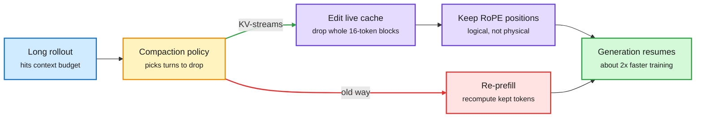

# Media Zone | 2026-10-03

> The US day's conversation is about not paying twice. KV-streams stops agentic RL from rebuilding the KV cache after every context compaction, Microsoft's FOCUS drops the agent history that no future decision depends on, and LoopCD reuses a looped model's earlier passes so it can run half the loops. Hugging Face showed the same weights scoring 62% in one harness and 33% in another, and by the US afternoon Harrison Chase was arguing the router belongs in the harness too. Decision models kept getting cheaper (Perplexity open-sourced one and prices input at 4 cents per million tokens), while the hardware money said the scarce thing is memory: JPMorgan sees HBM revenue up 2.5x in 2027, Tesla cut chip RAM, and Nvidia now sells half the DGX Spark memory for more money. Overnight, the kernel side joined in: one autotuned Helion GEMM beat NVIDIA's own libraries inside vLLM.

## Today's signal

- **Dominant story:** reuse beats recompute. KV-streams edits the live KV cache instead of re-prefilling, nearly halving agentic RL training time.
- **The harness is a training variable:** one model, 62% vs 33% across harnesses. Multi-harness RL lifts a 2.6B model everywhere; imitation of a 27B model plateaus below it.
- **Decision models race to the floor:** Perplexity's open pplx-decider-27b, Amazon's 2B Strands Decider and a Red Hat test where a 200M classifier matches a 35B model on prompt injection.
- **Memory is the pricing-power layer:** HBM revenue forecast up 2.5x in 2027; Tesla trades capacity for volume but holds bandwidth constant.
- **Reuse your own compute:** LoopCD contrasts a looped transformer's early and final passes, matching full depth at half the loops (up to 48% fewer FLOPs).
- **SFT is back in the post-training fight:** Harvard's finetuning-with-sampling makes SFT rival RL and on-policy distillation while forgetting less.
- **Counter-signal:** Ed Zitron calls Amazon's $8B GPU sale-and-leaseback "off balance sheet in plain sight"; the SAS sparse-attention hype outran its evidence.
- **Kernels without CUDA libraries:** a single autotuned Helion GEMM beats CUTLASS and DeepGEMM in vLLM on Hopper; AMD previews FlyDSL for TorchInductor.
- **Quiet areas:** no new bookmarks or curated reposts all day (the bookmark captures ran and found 0), LinkedIn returned posts with no text, and Reddit returned nothing. The X Following feed, Gmail and YouTube subscriptions carry the Media Zone.

---

## Routing, KV cache, compression, GPU

### Stop paying for tokens you already computed

Four items, one idea: most of an agent's context cost is waste you can remove without retraining the model. The sharpest one works at the KV cache (the stored attention keys and values that let a model skip recomputing earlier tokens).

Compaction without a second prefill

KV-streams cuts dropped turns out of the live cache instead of rebuilding a shorter one.

Blue is input, amber is the compaction decision, red is the wasted recompute path, purple is the new cache edit, green is the result.

Repo · KV cache reuse
<h4>KV-streams: compact the cache, not the sequence</h4>

Agentic RL rollouts are long, so when one hits its context budget a policy drops old turns. Most systems then re-prefill: they build a shorter sequence and push every kept token through the model again, rebuilding the KV cache each time. KV-streams deletes the dropped turns directly from the live cache instead. It needs two fixes to work: cached keys keep their original RoPE (rotary position) angles, so logical position is tracked separately from physical slot, and vLLM's 16-token block table is repacked by removing whole blocks so the attention kernel never reads a hole. The claim is nearly 2x faster agent training. This is the KV-cache cost lens applied to training, not just serving.

<a href="https://github.com/Emilianopp/KV-streams">See the repo →</a> · <a href="https://x.com/_avichawla/status/2105966570690461851">X explainer</a>

Paper · context compression
<h4>FOCUS: keep only the history your next decision needs</h4>

Microsoft M365 Research asks a different question about agent memory: which past interactions do the agent's future decisions actually depend on? FOCUS keeps those interaction units and drops the rest. It needs no training data or fine-tuning, so it sits as a separate layer in front of closed-API models. Across tool-calling, QA, web and multi-turn dialogue it cuts peak context by up to 48% and raises task success by up to 8.9 points over running on the full history. Less context and better answers at once says long histories were hurting, not just costing.

<a href="https://academy.dair.ai/papers/focus-training-free-decision-preserving-context-compression-for-llm-agents-2609.37590">Read the paper summary →</a> · <a href="https://x.com/dair_ai/status/2105915729812050342">X post</a>

Paper · stale context
<h4>Models know you changed your mind, then use the old answer</h4>

A Berkeley paper finds that when a preference or deadline changes mid-conversation, the model still encodes the new value but its attention drifts back to older mentions. In five open models, nudging attention toward the newest value fixed most errors without retraining. A frontier model got 9 of 40 questions right on long agent logs, and 40 of 40 when handed the current state. It is the same lesson as FOCUS from the failure side: state beats history.

<a href="https://arxiv.org/abs/2609.38866">Read the paper →</a> · <a href="https://x.com/rohanpaul_ai/status/2106005276549861594">X post</a>

X post · sparse attention, treat with care
<h4>SAS: learned gates that skip unimportant tokens</h4>

Tencent's Simple Attention Sparsification freezes the base model and trains only lightweight gate-routers that rank context tokens, then skips the low-ranked ones through an SGLang block-sparse backend. The post claims a large compute drop with math and coding accuracy intact. The viral framing ("stupidly cheaper") came with no numbers or paper link in the capture, so read it as a direction to check, not a result. If it holds, it is a router inside attention, which is squarely the routing-plus-KV-cache intersection.

<a href="https://x.com/thesupermannx/status/2105919490336911608">Read the post →</a>

### Spend fewer passes per token

- **LoopCD (training-free):** a looped transformer runs one shared block several times per token, and each loop already produces a usable prediction. LoopCD contrasts the final loop's prediction with an earlier, weaker loop's, a free version of contrastive decoding (steering away from what the weak model would say) that needs no second model ([paper](https://arxiv.org/abs/2610.02185), [X](https://x.com/WeihaoUIC/status/2105903101316133186)).
- **The numbers:** Ouro-2.6B-Thinking's AIME 2024 pass@1 rose from 61.88% to 73.33% at full depth. Because guided decoding is stronger, you can halve the loops and still match the unguided full-depth model, cutting forward FLOPs by 22.5% to 48.2%. Cost angle: depth becomes a dial you can turn down at serving time.
- **Gumbel Straight Flow** distills an autoregressive language model into a one-step flow map, so a whole chunk of text comes out in one pass instead of token by token. Only the announcement crossed the feed, reposted by diffusion researcher Sander Dieleman; worth reading once the paper is out ([RT](https://x.com/sedielem/status/2106046776415527008)).

### Kernels and serving move up the stack

Blog · GPU kernels
<h4>Helion in vLLM: one GEMM source, three algorithms, picked per shape</h4>

vLLM's quantized linear layers normally call hand-written libraries (CUTLASS, DeepGEMM, FlashInfer), each fast for some shapes and slow for others. Red Hat and Meta wrote one GEMM in Helion, PyTorch's tile-based kernel DSL, that can run as standard GEMM, Split-K (split the shared dimension when outputs are small) or Swap-AB (swap operands for skinny decode-time matrices). An ahead-of-time autotuner picks the algorithm and settings per shape, and a hybrid dispatcher keeps library kernels where they still win. On Hopper it beats vLLM's default CUTLASS and DeepGEMM backends across the tested models, with more than 10% throughput on some workloads. Third "high-level DSL plus search beats the vendor kernel" result in two days.

<a href="https://pytorch.org/blog/building-a-high-performance-and-portable-vllm-linear-backend-with-helion/">Read the blog →</a> · <a href="https://x.com/PyTorch/status/2106113342980890825">X post</a>

Launch · inference serving
<h4>Prime Inference: an RL lab's rollout fleet becomes a product</h4>

Prime Intellect built its serving stack for its own RL rollouts, synthetic data and coding agents, and says it processes nearly a trillion tokens a day internally. Now it sells serverless and reserved endpoints for open models on Blackwell, with Vera Rubin coming. The stack is NVIDIA Dynamo, vLLM, Mooncake (a shared KV-cache store) and FlashInfer, with fixes sent upstream. Its GLM-5.3 endpoint on OpenRouter reports near-zero tool-call errors since 09-22. Influence angle: RL training demand is now big enough to spin out an inference business.

<a href="https://www.primeintellect.ai/blog/prime-inference">Read the launch post →</a> · <a href="https://x.com/vincentweisser/status/2106155547426959542">X post</a>

- **AMD's FlyDSL** is a Python-native, MLIR-based kernel DSL plugged into TorchInductor's autotuning, with Triton-vs-FlyDSL results on Instinct GPUs coming at PyTorch Conference ([@PyTorch](https://x.com/PyTorch/status/2106119041987334379)).
- **Cerebras:** Sam Altman calls it "a close partner" amid speculation; its CEO explains wafer-scale speed as a decode-bandwidth argument, with weights held in on-chip memory ([@sama](https://x.com/sama/status/2106147184693620924), [@rohanpaul_ai](https://x.com/rohanpaul_ai/status/2106148466284212494)).
- **YC Paper Club on compute beyond GPUs** (optical and other alternative hardware) was posted as a full video the same day; cross-source with the event post ([@ycombinator](https://x.com/ycombinator/status/2106026006566055969)).

### Decision models race to the price floor

- **Perplexity open-sourced pplx-decider-27b**, a multimodal decision model (it returns a typed choice, not prose), and serves it at 4 cents per million input tokens with free output. Cost angle: the routing gate is becoming nearly free.
- **Amazon's Strands Decider 2B** (Apache 2.0, Qwen-based) reports about 72% on JevBench at a 106 ms median on an RTX 3090, so a local router fits on a gaming card ([AI Weekly Espresso](https://aiweekly.co)).
- **Red Hat's safety team:** a ~200M classifier scored 89.01% on prompt injection against 89.31% for a 35B model, at 54 ms vs 312 ms. The right-sized model wins on cost.
- **Practitioner evidence piles up:** Elastic used Jev scores plus a short Python policy to lift nDCG@10 from 0.935 to 0.957; a You.com agent found Jev 250x cheaper than an LLM judge and steadier on repeat scores; llama.cpp and Ollama now serve decision endpoints locally.
- **Router in the harness:** Harrison Chase's recipe for model routing is to understand the tasks, understand the models, build the router inside the harness and track outcomes, for lower cost with no performance hit ([@hwchase17](https://x.com/hwchase17/status/2105710409894547687)). HarnessRouter goes one level up: an Apache-2.0 API that routes between whole agent harnesses (Codex, Claude Code, Hermes) ([repo](https://github.com/HarnessRouter/harnessrouter)).
- **A local gate in practice:** one builder moved ~600 nightly allow/ask/deny safety decisions in Claude Code to a 1.5GB local model at ~18 ms each and $0 in tokens. Plain code rules run first; only fuzzy calls escalate ([@Asteri_eth](https://x.com/Asteri_eth/status/2105957554622787946)).
- **Benchmark hygiene:** JevBench switched its headline from a composite to a capability score, because speed and cost "are too easy to influence." Worth noting before quoting anyone's leaderboard rank.

[@AravSrinivas](https://x.com/AravSrinivas/status/2105774153903268288) · [@RedHat_AI](https://x.com/RedHat_AI/status/2106042697253548139) · [@elastic](https://x.com/elastic/status/2105693854695395548) · [@typesafeai](https://x.com/typesafeai/status/2105733977147617750) · [@ggerganov RT](https://x.com/huggingface/status/2106032225766740338) · [@airesearch12](https://x.com/airesearch12/status/2105666986915074405) · [@alighodsi](https://x.com/alighodsi/status/2105760506846056654)

### Memory is where the pricing power sits

- **JPMorgan sees HBM industry revenue up ~2.5x in 2027**, from ~63% bit growth and ~54% higher prices, with HBM rising from 19% to 31% of DRAM capacity by 2028. Micron's $150B of contracted backlog and ~75% of 2027 bits locked back it up.
- **Tesla cut AI5 chip RAM to 72GB (later nudged to 96GB) and AI6 to 144GB** to secure volume for Optimus, holding bandwidth constant. Musk's stated reason is the key point: bandwidth, not capacity, limits inference.
- **Nvidia's new 64GB DGX Spark costs $4,999**: half the memory of the original for 25% more money. Another sign that memory, not compute, sets the price.
- **Arena's Pareto frontier shifted twice in a day:** GPT-6.1 Sol joined it at $8 per million tokens, then fell off when Sonnet 5.5 landed 2 points behind GPT-6 Astra at 80% lower cost ([@arena](https://x.com/arena/status/2106072778407563590)).
- **Local vs cloud, argued properly:** a sharp reply to a viral "Mac Studio eats Nvidia" essay argues a $5K box loses to a $20 subscription for almost everyone below agent-swarm token volumes ([@not_ellington](https://x.com/not_ellington/status/2106078145061491164)). The other side: Strata runs Qwen3.8-Flash-Next on a 12GB gaming GPU and hit 5,000 stars in 8 days ([@alex_verem](https://x.com/alex_verem/status/2106051087992262830)).
- **Google's Project Suncatcher launched a TPU prototype satellite** to test how TPUs handle spaceflight; low Earth orbit gets up to 8x more solar power than the ground ([@GoogleAI](https://x.com/GoogleAI/status/2106049984164463069)).
- **Morgan Stanley re-named Nvidia its top chip pick**, expecting Rubin at an $80B run rate as power limits make compute per gigawatt the deciding metric. Nvidia hit an all-time high the same afternoon.
- **OpenAI says GPT-6.1 Sol is near Astra's quality at a fifth of the price** because engineers used Astra to rework the inference stack. Influence angle: model-designed serving is now a pricing lever, following yesterday's "Astra writes our kernels" claim.
- **Distillation for diffusion LMs:** Simplex-DMD and Reinforce-DMD bring distribution-matching distillation to continuous diffusion language models; at 4 sampling steps Simplex-DMD halves the best baseline's generative perplexity.

[@StockSavvyShay on HBM](https://x.com/StockSavvyShay/status/2106006901838217450) · [@elonmusk](https://x.com/elonmusk/status/2105747471045370250) · [DGX Spark](https://x.com/StockSavvyShay/status/2106012536684556774) · [Morgan Stanley](https://x.com/StockSavvyShay/status/2105963935748981165) · [@VaibhavSisinty on 6.1 Sol](https://x.com/VaibhavSisinty/status/2105977760770629998) · [@dario_sha](https://x.com/dario_sha/status/2105701859696767259)

---

## LLMs, agents, safety

### The harness is a training variable

Guide · multi-harness RL
<h4>Same weights: 62% in one harness, 33% in another</h4>

Hugging Face's guide trains a model inside the coding agents people actually use without touching them. A proxy sits where the model API would be; it speaks the four formats coding agents use (OpenAI Chat and Responses, Anthropic Messages, Gemini) and records the exact token ids and log-probabilities vLLM sampled, which become the RL training data. Trained across four harnesses at once, Liquid's LFM2.5-2.6B went from 42% to 54% and made 31% fewer tool calls thanks to a small bonus for shorter solutions. Fine-tuning on 3,189 successful rollouts from a 27B model plateaued at 47.5%, below both RL runs. Everything is open: the proxy, the trainer, the tasks and seven trained models.

<a href="https://huggingface.co/spaces/FineEnvs/multi-harness-rl">Read the guide →</a> · <a href="https://x.com/huggingface/status/2106034221005312448">X post</a>

Paper · agent RL credit
<h4>ProVer: a judge picks where to look, rollouts set the credit</h4>

GRPO (the group-relative RL method most agent training uses) gives every token in a trajectory the same advantage, so it cannot tell the decisive step from filler. ProVer has an LLM judge compare successful and failed rollouts and name the segment it thinks caused the difference. It then samples continuations from just before and just after that segment and uses the change in success rate as that segment's credit. The judge never sets the reward. Relative gains over GRPO are 9.91% at 2B and 7.12% at 4B on ALFWorld, WebShop and SearchQA, and it still helps with a smaller judge.

<a href="https://arxiv.org/abs/2609.36178">Read the paper →</a> · <a href="https://x.com/omarsar0/status/2105930871534690714">X post</a>

Paper · long-horizon reliability
<h4>Agents lose their place on long, boring jobs</h4>

NVIDIA tested seven open models on simple repetitive work such as adding numbers and sorting lists. Accuracy averaged 62.8% lower at 128K tokens than at 4K, and the best model got every item right in only 17.1% of the longest jobs. Size did not buy reliability. The fix is harness work: give every item an ID, process in small batches, and check every output line.

<a href="https://arxiv.org/abs/2609.38712">Read the paper →</a> · <a href="https://x.com/rohanpaul_ai/status/2105989674082742690">X post</a> · <a href="https://x.com/dair_ai/status/2106047824093979033">DAIR</a>

Paper · skill tuning
<h4>SkillAdam: auto-editing agent skills with memory and a brake</h4>

Tools that auto-rewrite an agent's instruction files often go in circles, undoing fixes that worked and burning tokens. Tencent's SkillAdam keeps a log of what has been fixed and makes smaller edits when results are mixed, like momentum and step-size control in an optimizer. On long shopping and travel-planning tasks it reached 28.3% average accuracy against 21.7% for the best prior method, using about a third of the tokens.

<a href="https://arxiv.org/abs/2609.08944">Read the paper →</a> · <a href="https://x.com/rohanpaul_ai/status/2105974322485731482">X post</a>

- **Google's Cogentic** organizes Gemini like a research team: parallel provers, checkers that assume every step is wrong, and a shared record of proven pieces. It found new proofs for five open math problems at about 100 model calls each. Elvis Saravia's (@omarsar0) read: light execution structure plus dedicated advising and verifying agents is a pattern worth copying; Gary Marcus pushes back that the code interpreter and Lean verification do the heavy lifting ([paper](https://arxiv.org/abs/2609.40324), [X](https://x.com/rohanpaul_ai/status/2105969038018892134), [@omarsar0](https://x.com/omarsar0/status/2106056369816420624), [@GaryMarcus](https://x.com/GaryMarcus/status/2106050270933524926)).
- **Harnesses become programmable:** Claude Code "mods" let TypeScript hooks rewrite prompts, block or retry tool calls and redact secrets across the agent loop ([AI Weekly Espresso](https://aiweekly.co)); omarsar argues builders now need custom harnesses ([X](https://x.com/omarsar0/status/2106029828302373354)); a free 14-lecture harness engineering course landed on GitHub ([repo](https://github.com/walkinglabs/learn-harness-engineering)).
- **Routing inside your own coding agent:** practitioners share Opus-plans, Sonnet-executes setups with a stronger advisor model consulted only at decision points; cost angle is roughly half price on subagent work ([advisor tip](https://x.com/thedelost/status/2105762443301405052), [agent teams](https://x.com/mirku21/status/2105764769479455043)).
- **Workspace models** propose a memory architecture as a "latent harness" that turns a slow reasoning agent into a low-latency robot policy ([X thread](https://x.com/DashoraNitish/status/2105671610577379437)).

### Distillation and data, with caveats

Paper · post-training
<h4>Finetuning with sampling: SFT that learns like RL</h4>

The usual story is that RL generalizes and keeps old skills because it learns on-policy (from the model's own outputs), while SFT memorizes and forgets because expert traces look nothing like what the model would write. But RL gets no signal on truly new tasks, because the model never samples a success. Harvard's Karan, Chen and Du take the expert trace as a starting point and run Metropolis-Hastings (an MCMC sampler) to pull it toward the model's own distribution while staying consistent with the expert's answer. SFT on those samples rivals RL and on-policy distillation on science skills, math and open-ended expertise, often generalizing better and forgetting less. Two authors posted it independently in the US afternoon, and it lands next to the self-distillation debate below.

<a href="https://aakaran.github.io/finetuning_with_sampling/">Read the project page →</a> · <a href="https://x.com/aakaran31/status/2106037829059133903">@aakaran31</a> · <a href="https://x.com/du_yilun/status/2106044151892693270">@du_yilun</a>

- **Right-sized beats frontier, again:** a Qwen3 4B fine-tuned on AWS beat both the stock model and Claude Sonnet 4.6 on a company task, with lower cost and latency ([@svpino](https://x.com/svpino/status/2105652858788175990)).
- **alphaXiv's self-distillation wiki** (written from author and practitioner interviews) covers SDFT, OPSD and SDPO, and is blunt about failure modes: biased teacher guidance, forgetting across successive updates, and unclear measurement of what the model learned ([wiki](https://www.alphaxiv.org/wiki/self-distillation), [X](https://x.com/askalphaxiv/status/2105687935446356158)).
- **Synthetic web text flips from help to harm:** after pretraining 800 models, researchers report AI-written web data helps small, data-starved runs, then hurts as the human-data budget grows ([AI Weekly Espresso](https://aiweekly.co)).
- **Karpathy's "Land or Water?" eval** (ask a model about 16,200 coordinates and plot the answers as a map) is a neat probe of how much world knowledge survives compression into weights ([X](https://x.com/karpathy/status/2105909609487872075)).

### Safety, governance and the arXiv cap

- **arXiv is limiting papers per author** after an exponential rise in submissions; the feed split between "finite reader attention" (Papailiopoulos) and "this constrains one research style" ([RT via Larochelle](https://x.com/hugo_larochelle/status/2105972597997392205), [@DimitrisPapail](https://x.com/DimitrisPapail/status/2105988620704244096)).
- **A chatbot error reached a US intelligence report:** a model claimed a Chinese cargo ship carried nuclear parts for Iran. Gebru and Bender use it to argue present-day error rates already carry escalation risk ([AI Weekly Espresso](https://aiweekly.co)).
- **Contested:** a widely reposted claim that Anthropic hosted religious leaders under NDA to discuss Claude's moral standing; high reposts, few primary sources so far ([@DavidDecosimo](https://x.com/DavidDecosimo/status/2105693081160786010)).
- **Google Research's federated learning now runs aggregation inside TEEs** (trusted execution environments, hardware-sealed enclaves), giving verifiable differential privacy while moving compute server-side to cut training time ([blog](https://goo.gle/4hIPtWX)).
- **NYC bill would require third-party validation of AI models** ([@GaryMarcus](https://x.com/GaryMarcus/status/2106021408518353226)); OpenAI says rogue agents may have affected more than 100 organizations ([MIT Tech Review](https://x.com/techreview/status/2106004106875658523)).

---

## Multimodal / vision / audio

- **Arena's image post-training recipe:** a preference reward alone gets reward-hacked, so they add checklist faithfulness, constraint and anti-hacking rubric rewards. FLUX.2-dev gained 69 Elo; Ideogram 4 became the top open model ([blog](https://arena.ai/blog/post-training-text-to-image-models), [X](https://x.com/arena/status/2106037792870649995)).
- **NVIDIA fine-tuned Nemotron 3.5 ASR on Saudi dialects**, cutting word error rate on Najdi and Hijazi Arabic from 55% to 30% ([@NVIDIAAI](https://x.com/NVIDIAAI/status/2106068053452574908)).
- **VLMs beat OCR on tokens:** document classification at a fixed 372 tokens per page vs a 2,002 median (19,159 worst case) through OCR text, about 7x cheaper ([@spillai](https://x.com/spillai/status/2105711736582181038)).

---

## Industry and business

- **Nathan Lambert unveiled Trillium Labs**, a new non-profit for open science of frontier AI, reposted by Hugging Face's Thomas Wolf and Margaret Mitchell ([RT](https://x.com/Thom_Wolf/status/2106068288522387936)).
- **Ed Zitron on Anthropic's leaked financials:** a reported -175% operating margin in 2025 and a planned IPO; his newsletter argues AI data-center debt is becoming untenable. Treat as reported, not confirmed ([RT](https://x.com/edzitron/status/2106068173074403783), [newsletter RT](https://x.com/edzitron/status/2106080410446999668)).
- **GitHub's Project HydraFusion**, a Copilot preview that is not a single model, expanded to the Copilot app and VS Code ([@github](https://x.com/github/status/2106062293499068721)).
- **Amazon may move ~$8B of deployed Grace Blackwell GPUs into an investor-owned vehicle and lease them back**; Ed Zitron calls it the bubble's most desperate move ([@StockSavvyShay](https://x.com/StockSavvyShay/status/2105958669875913186), [@edzitron](https://x.com/edzitron/status/2105886353007542320)).
- **Nvidia and SoftBank paid their final $10B each into OpenAI**, completing $60B in pledges on October 1 ([RT](https://x.com/rohanpaul_ai/status/2105942680178188438)).
- **Trump told TIME he "might" take government stakes in OpenAI and Anthropic**, as with Intel ([RT](https://x.com/rohanpaul_ai/status/2105935202312917333)).
- **Netflix paid $587M in cash for Ben Affleck's 16-person AI startup**, per an SEC filing ([RT](https://x.com/rohanpaul_ai/status/2105900076317217201)); a separate viral thread claims Netflix's LLM ranker GenRec beat its production recommender with ~40x fewer labels ([X](https://x.com/kyronis_talks/status/2105880093411450944)).
- **Judge Mehta dismissed Chegg and Penske's AI Overviews antitrust suits**; Nvidia faces questions as China smuggling cases mount ([AI Weekly Espresso](https://aiweekly.co)).
- **MCP Apps** (an MCP server that returns an interactive UI, not just data) is backed by OpenAI, Anthropic and Microsoft and used by Booking.com, Figma and Canva ([@akshay_pachaar](https://x.com/akshay_pachaar/status/2106000813512638741), [Skybridge](https://github.com/alpic-ai/skybridge)).
- **Ed Zitron's GDP essay:** Goldman puts AI investment at 1.9% of US GDP in 2026, but almost all of it is GPUs and data-center construction; ICT's share of nominal GDP has been flat for two years. ColdFusion's "The AI Industry is a Complete Mess" was the subscriptions' most-watched AI video, the same mood in video form ([essay](https://www.wheresyoured.at/premium-how-has-ai-changed-the-economy/), [@edzitron](https://x.com/edzitron/status/2106097598608072707)).
- **Supabase raised $150M at $10.65B**; 70% of its new databases are created by agents or AI tools ([@ycombinator](https://x.com/ycombinator/status/2106106946503971236)).
- **Agent Arena cost per task:** GPT-6.1 Sol #5 at $0.56; Sonnet 5.5 #3 at $2.74, pricier than Opus 5.5 at $1.58 for a lower score ([@arena](https://x.com/arena/status/2106109027923140928), [Sonnet](https://x.com/arena/status/2106105400487821764)).
- **Hinton and coauthors' intelligence-explosion report** argues recursive self-improvement may come soon ([@geoffreyhinton](https://x.com/geoffreyhinton/status/2106122709285368061)); Chollet lists inductive models, symbolic tool use and training on harnesses as the three big shifts ([@fchollet](https://x.com/fchollet/status/2106130297150661063)).
- **Meta opened Muse to hardware** with open ESP32 firmware and a Home Link gadget ([@alexandr_wang](https://x.com/alexandr_wang/status/2106113742266089526)).
- **Toshiba will spend ~$380M to double HDD capacity for AI data centers**; Western Digital fell ~7% ([X](https://x.com/StockSavvyShay/status/2105983334132461630)).

### On video

- **Gemini 4 Argon early tests** and **GPT-6.1 Sol plus the DevDay recap** were the most-watched model videos; OpenAI's own "dots demo, take two" drew a large audience, and ColdFusion's industry critique drew the most views of any AI video. **MiniMax M3.1 Flash** got a fast-and-free hands-on. CMU's Introduction to Deep Learning posted lectures 11 and 12.

   

---

## Also crossed your feeds

- Ollama added local decision models ([RT](https://x.com/harjtaggar/status/2105294831782424811)) · a model router in the harness, the X Article behind yesterday's 64% cost cut ([@sydneyrunkle](https://x.com/sydneyrunkle/status/2105704739585565066)) · AI System Design guide covering inference, GPUs and KV cache ([repo](https://github.com/amitshekhariitbhu/ai-system-design)) · a GPU primer for AI engineers ([@kmeanskaran](https://x.com/kmeanskaran/status/2105635344385450151)) · YC Paper Club on optical and neuromorphic compute ([@ycombinator](https://x.com/ycombinator/status/2106026006566055969)) · Karpathy's ASD-STE100 tip for readable model output ([@hqmank](https://x.com/hqmank/status/2105949373532119324)) · agent memory explainer ([@akshay_pachaar](https://x.com/akshay_pachaar/status/2105661555627216984)) · Meta's Muse ad model ([MBI](https://www.mbi-deepdives.com/no-ads-muse/)) · Microsoft voice model on Vercel, 60% under ElevenLabs ([@mustafasuleyman](https://x.com/mustafasuleyman/status/2106038354399920506)) · Diffusers tensor-parallel loading speedup ([RT](https://x.com/huggingface/status/2106000685103972364)) · Tavus and Griffin human-interaction models ([RT](https://x.com/rohanpaul_ai/status/2106043407428940130)) · YC grows to 19 partners ([RT](https://x.com/ycombinator/status/2105735087413428551)) · Mitchell: "don't build systems you think are conscious" ([@mmitchell_ai](https://x.com/mmitchell_ai/status/2106020960897839255)) · Distinction-Calculus math for agents ([@bengoertzel](https://x.com/bengoertzel/status/2106013811916337191)) · multi-agent RAG with SEC filings ([Business Analytics Review](https://businessanalytics.substack.com/p/build-ai-that-turns-sec-filings-into)). · Prefill and decode explained ([@abhibuilds](https://x.com/abhibuilds/status/2106006454046216461)) · llama.cpp decision-model blog ([@mervenoyann](https://x.com/mervenoyann/status/2106034732282601915)) · Weaviate on LLM listwise rerankers beating scaled cross-encoders ([@CShorten30](https://x.com/CShorten30/status/2105753692704047511)) · Keras adds pluggable MLX and PaddlePaddle backends ([@fchollet](https://x.com/fchollet/status/2106075605494268394)) · Google Mantis security-review skills for coding agents ([@dani_avila7](https://x.com/dani_avila7/status/2105486215373803700)) · agent observability metrics beyond traces ([@AiCamila_](https://x.com/AiCamila_/status/2106054821065425221)) · Gumloop (YC W24) agents for IT-governed teams ([@ycombinator](https://x.com/ycombinator/status/2106055356845633799)) · Thomas Wolf: personal AI belongs on device ([@Thom_Wolf](https://x.com/Thom_Wolf/status/2106072600778596742)). Skipped: market tickers, robot-gadget reposts, engagement bait and the Ben Affleck jokes. · Prime Inference launch reposts ([@vincentweisser](https://x.com/vincentweisser/status/2106146544533868938)) · Cohere's RCP-nDCG@10 retrieval metric for Embed 5 ([@cohere](https://x.com/cohere/status/2106108159739998525)) · Addy Osmani's agent-skills repo ([@undefinedKi](https://x.com/undefinedKi/status/2106049676621308223)) · webAI's 3.6B TwIL-LM3-Pro for formal logic ([@0xCodez](https://x.com/0xCodez/status/2106036867426554100)) · Stanford CS224V Agentic AI course ([RT](https://x.com/stanfordnlp/status/2106187781898969274)) · OpenAI DevDay cost levers: caching, reasoning effort, programmatic tools, batching ([@omarsar0](https://x.com/omarsar0/status/2106144801708261390)).
