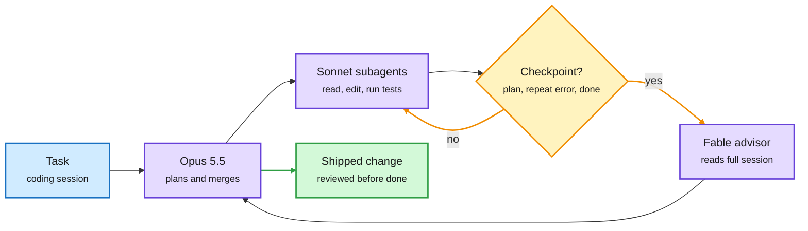

# Media Zone | 2026-10-04

> *Live draft: this window is still open. It is finalized with the 2026-10-04 digest at the 10:30 IST cutoff.*

> A quiet US Saturday, and the useful posts are about putting the expensive model only where it changes the outcome. Anthropic's advisor tool keeps its strongest model on call for three moments of a coding session, Cloudflare's Clef decision models now run locally on Ollama, and a Postgres extension puts a decision model inside a WHERE clause. Under that, a PyTorch Conference poster spends saved inter-GPU bandwidth on fixing quantization error, and memory forecasts keep climbing. The loudest thread, though, was not technical: another OpenAI safety resignation, and a long argument about whether AI deserves moral concern at all.

## Today's signal

- **Dominant story:** escalation instead of default. Anthropic's advisor tool runs Sonnet for the work, Opus to plan, and calls Fable only at three checkpoints.
- **Decision models keep spreading:** Cloudflare's Clef (27B) and Clef Flash (9B) land on Ollama; pg-jev runs semantic filters inside SQL.
- **Bandwidth as a budget:** ERRC compresses tensor-parallel traffic and uses the freed bandwidth to correct quantization error.
- **Memory is still the scarce layer:** a forecast puts memory revenue near $1.5T in 2027, with Micron saying supply stays tight through 2028.
- **Counter-signal:** Garry Tan deleted a thousand lines of agent instructions because frontier models no longer need them. Some harness complexity is debt, not leverage.
- **Quiet areas:** no new bookmarks or curated reposts (both captures ran and found 0), LinkedIn was not re-scraped this window, Reddit had nothing new. The X Following feed carries the Media Zone.

---

## Routing, KV cache, compression, GPU

### Call the expensive model only when it matters

Three items from the US day make one argument. Most steps in an agent loop do not need a frontier model. The skill is deciding which ones do.

The strongest model is on call, not on shift

Anthropic's advisor setup: cheap models do the work, the top model only reviews at three checkpoints.

Blue is input, purple is a model, amber is the escalation decision and its loop, green is the result.

Docs · model routing in the harness
<h4>Claude Code's advisor tool</h4>

The advisor tool pairs your main model with a stronger one that Claude consults only at key moments. Those moments are before committing to a plan, when the same error keeps coming back, and before calling a task done. The advisor reads the whole session, every tool call included, and returns guidance. The setup being shared runs Opus 5.5 as planner, Sonnet 5.5 subagents as workers, and Fable 5.1 as the advisor. This is routing by moment rather than by query, and it is the cost lever: the top model's tokens are spent on three decisions, not on every file read. The docs flag it as experimental and note it affects prompt caching.

<a href="https://code.claude.com/docs/en/advisor">Read the docs →</a> · <a href="https://x.com/thedelost/status/2106121351798927652">X thread</a>

Model release · local decision models
<h4>Cloudflare's Clef and Clef Flash on Ollama</h4>

Clef is a 27B decision model and Clef Flash a 9B variant. A decision model returns a category, a yes or no, or a score instead of free text, so it can label a bug report or route a support ticket. Both take images as well as text and run on your own machine. This adds a fourth vendor to the week's decision-model wave, after TypeSafe's Jev, Perplexity's open pplx-decider-27b and Amazon's 2B Strands Decider. The router layer is becoming a commodity you can pull with one command.

<a href="https://ollama.com/library/clef-flash">Clef Flash on Ollama →</a> · <a href="https://docs.ollama.com/capabilities/decision">Decision docs</a>

Repo · decisions inside the database
<h4>pg-jev: a decision model in your WHERE clause</h4>

Questions like "is this article mainly about software engineering?" normally mean exporting rows, calling a model, parsing the reply and writing it back. pg-jev is an open-source Postgres extension that exposes Jev as SQL functions. jev() filters inside WHERE, jev_prob() returns a probability, jev_choice() picks a label and jev_score() ranks rows. It batches rows under the hood and needs no embedding index. The cost angle: semantic filtering becomes a cheap per-row call next to exact predicates, not a separate pipeline.

<a href="https://github.com/realZachi/pg-jev">See the repo →</a> · <a href="https://x.com/_avichawla/status/2106328920211800165">X demo</a>

X Article · batching the review step
<h4>300 results, 1 review call</h4>

A Kimi agent swarm finishes 300 tasks at once, then a loop grades each result with its own model call. That is a serial queue bolted onto a parallel system. The fix argued here is to grade the batch in one call. Small idea, but it is the same lesson as the advisor tool: count where the model calls actually go before buying more throughput.

<a href="https://x.com/0xNeuroBlue/status/2106400922641354773">Read the article →</a>

[Recursive Decision Models take](https://x.com/kmad/status/2106083479540601219) · [Simplest system first](https://x.com/pauliusztin_/status/2106300723457892797) · [gstack trims 1,000 lines](https://x.com/garrytan/status/2106298398441951497)

### Bandwidth, compression and memory

- **ERRC (PyTorch Conference poster):** compresses the data GPUs exchange during tensor-parallel inference (where one layer is split across GPUs), then spends the saved bandwidth on correcting quantization error. Cost angle: interconnect traffic becomes a tunable budget, not a fixed tax ([@PyTorch](https://x.com/PyTorch/status/2106353692605636739)).
- **Aleph Alpha's Kolibri:** a 78B mixture-of-experts model (each token uses only a few expert sub-networks) with 3.46B active parameters, about 4% of the total, and up to 1M tokens of context, built in Europe ([via @cohere](https://x.com/cohere/status/2106396436875313462)).
- **Last week's compression recap:** Last Week in AI's late episode covered DeepSeek-V4.1-Flash's KV cache compression (shrinking the stored attention keys and values) and Bonsai 2 27B, claimed near-lossless at a 9x smaller footprint ([LWiAI #258](https://lastweekin.ai/p/lwiai-podcast-258-opus-55-sol-and)).
- **Memory supercycle math:** a widely shared forecast has memory revenue at about $1.5T in 2027 and only $1.6T in 2028. Micron says supply tightens through 2028, so the 2028 number may be low if cleanroom shortages persist ([@StockSavvyShay](https://x.com/StockSavvyShay/status/2106388251078713416)).
- **Fabs for hire:** TSMC is reportedly exploring owning and running a Texas fab for Musk's Terafab, with SpaceX anchoring capacity through purchase commitments ([X](https://x.com/StockSavvyShay/status/2106331553303502990)).
- **Compute goes home:** a popular post argues most personal AI compute will run locally within a couple of years as unified memory grows. Meta's open Muse Gadgets firmware for $5 ESP32 boards is the cheap-hardware version of the same bet ([@VaibhavSisinty](https://x.com/VaibhavSisinty/status/2106352488312144279), [Muse Gadgets](https://gadgets.muse.ai/)).

---

## LLMs, agents, safety

### RL that does less work

Video · on X and YouTube
<h4>Raschka: Reasoning from scratch, part 6 (GRPO for RLVR)</h4>

Sebastian Raschka's sixth chapter implements RLVR (reinforcement learning with verifiable rewards, where a checker scores answers) and GRPO (Group Relative Policy Optimization, which compares a group of sampled answers to each other instead of training a separate value model). It walks through accuracy and format rewards, the DeepSeek-R1 "aha moment", answer length as reasoning effort, and why GRPO drops PPO's critic. It was quietly one of the day's most-engaged technical posts. A companion short explains how top-p sampling filters tokens.

<a href="https://youtube.com/watch?v=237Hf7Q3lgg">Watch →</a> · <a href="https://x.com/rasbt/status/2106369670680871031">X post</a> · <a href="https://youtube.com/watch?v=L2PUqHhB-ig">top-p short</a>

Paper teaser · RL compute
<h4>Stop rollouts early by trusting a better critic</h4>

Shared by Stanford NLP: a new actor-critic method asks whether every RL rollout needs to finish. If the critic (the model that estimates how good a partial answer is) is accurate enough, you can stop generation early and use its estimate instead. Rollout generation is the most expensive part of LLM RL, so cutting it is a direct compute saving. Note the irony next to Raschka's video: GRPO became popular by removing the critic. Details are thin in the post; worth reading once the paper surfaces.

<a href="https://x.com/stanfordnlp/status/2106393609721528397">See the post →</a>

Paper · agent verification
<h4>VeriHarness: give the verifier its own harness</h4>

Long agent tasks often have no unit test or ground truth to check against. VeriHarness treats verification as an agent task in its own right, with a dedicated harness (the tools, loop and context management around the model) for the verifier. It continues this week's thread that the harness, not just the weights, decides outcomes. Last Week in AI's recap also flagged RRSI, a regularized method for agent harnesses that improve themselves.

<a href="https://x.com/HanRujun/status/2106061620795621544">See the thread →</a>

### Watermarks that survive open weights

Paper · COLM 2026
<h4>OpenStamp: the watermark lives in the weights</h4>

Most text watermarks nudge sampling probabilities at decode time, so anyone running an open model can switch them off. OpenStamp writes the signal into the final unembedding layer instead, the matrix that turns hidden states into token scores. The authors report near-perfect detection at a 0.1% false-positive rate and more robustness to paraphrasing, fine-tuning and quantization than other open-source schemes. They release watermarked versions of four popular open models.

<a href="https://arxiv.org/abs/2608.27899">Read the paper →</a> · <a href="https://x.com/danish037/status/2106263836395553024">X thread</a>

Video · Google DeepMind
<h4>From deepfakes to DNA: the science of watermarking AI</h4>

DeepMind's explainer on how watermarking works across text, images and other media landed the same day. It is the closed-model view of the problem OpenStamp attacks from the open-weights side.

<a href="https://youtube.com/watch?v=HIUzrxQxTtw">Watch →</a>

### Safety and the consciousness argument

- **Another OpenAI safety exit:** David Robinson, one of the longest-tenured staff and a safety lead, resigned this week, per The Atlantic. Several safety researchers amplified it ([@IntuitMachine](https://x.com/IntuitMachine/status/2106392321424007653), [The Atlantic](https://www.theatlantic.com/technology/2026/10/openai-safety-team-resignation/688881)).
- **Altman on AI as religion:** he called ascribing religious force or surrendering human judgment to models "a real safety issue" ([@sama](https://x.com/sama/status/2106388373221118198)).
- **Apple restricts full-disk access** to curb abuse by AI agents on macOS, a concrete OS-level answer to agent permissions ([Ars Technica](https://arstechnica.com/security/2026/10/apple-changes-full-disk-access-permissions-to-curb-abuse-from-ai-agents/)).
- **Contested:** a long argument on AI moral status. Anil Seth revived Dennett's "counterfeit people" warning, philosophers debated non-experiential harm, and Timnit Gebru called machine consciousness a media story that helps data centers. Lots of replies, little evidence on either side ([@anilkseth](https://x.com/anilkseth/status/2106371389976412270), [@dioscuri](https://x.com/dioscuri/status/2106374471192064125)).
- **LeCun at ETH Zürich:** an LLM's 30T training tokens equal what a 4-year-old sees in under two years, so scaling text alone cannot reach AGI ([@rohanpaul_ai](https://x.com/rohanpaul_ai/status/2106337846198214728)).

---

## Multimodal / vision / audio

- **FreeVideo (Berkeley):** runs MiniMax H3 video generation on a laptop using Video DeltaNet, a linear-attention variant whose memory does not grow with sequence length. The efficiency angle is the point here ([via @berkeley_ai](https://x.com/berkeley_ai/status/2106268355187675600)).
- **Real-time video at voice prices:** LemonSlice's CWM-1 Lite ([via @ycombinator](https://x.com/ycombinator/status/2106397188586967106)). Cartesia's Sonic 3.6 clones a voice from 15 seconds and speaks 44 languages ([@omarsar0](https://x.com/omarsar0/status/2106392210023309338)).
- **Object permanence in world models:** a large collaboration trains video world models so objects do not vanish behind obstacles ([paper](https://arxiv.org/pdf/2609.28654), [@gurtej__gill_](https://x.com/gurtej__gill_/status/2106238737197990089)). MLST posted two episodes on how voice agents learn conversational rhythm.

 

---

## Industry and business

- **AI czar, two stories:** Trump is reportedly set to name Jay Clayton as White House AI czar; Last Week in AI's recap had Bessent in the frame a week earlier ([via @rohanpaul_ai](https://x.com/rohanpaul_ai/status/2106289967026864405), [LWiAI](https://lastweekin.ai/p/lwiai-podcast-258-opus-55-sol-and)).
- **Circular money:** 55.2% of the money AI companies raise comes from other AI companies, per a new analysis ([via @rohanpaul_ai](https://x.com/rohanpaul_ai/status/2106273770843652428)). Damodaran's dot-com comparison circulated alongside it.
- **Muse economics:** Deutsche Bank sees Muse reaching about 8% of Meta revenue by 2030, mostly from agent-commerce fees ([X](https://x.com/StockSavvyShay/status/2106358924526117183)). Meta says Muse Spark and mathematicians solved six open math problems ([via @ChrSzegedy](https://x.com/ChrSzegedy/status/2106167497007464774)).
- **Uber's MCP Gateway:** how Uber moved from ad-hoc MCP (Model Context Protocol) integrations to a managed platform for its internal agents ([@UberEng](https://x.com/UberEng/status/2106071967619322330)).
- **Agent tooling:** Supabase local dev now runs without Docker and supports multiple instances per worktree; Cua Spaces lets agents work across all your computers ([via @ycombinator](https://x.com/ycombinator/status/2106397291565482132), [via @garrytan](https://x.com/garrytan/status/2106102445499912440)).
- **Pentagon autonomy:** a permanent autonomous-warfare group seeking $55B for 2027 ([X](https://x.com/StockSavvyShay/status/2106373317288661368)). Tesla Q3: 486,532 deliveries, 13.7 GWh storage ([via @elonmusk](https://x.com/elonmusk/status/2106259023117050123)).
- **Recognition:** Timnit Gebru named a 2026 Right Livelihood Award recipient ([via @timnitGebru](https://x.com/timnitGebru/status/2106392955821207854)).

---

## Also crossed your feeds

- Schmidhuber reposted his 2008 "compression progress" paper (curiosity as the drive to compress data better) in reply to the Pope on AI art ([arXiv](https://arxiv.org/abs/0812.4360)) · Stanford CS336 language-model-from-scratch course ([RT](https://x.com/stanfordnlp/status/2106395910762860608)) · YC Paper Club on alternative compute, continued from yesterday ([RT](https://x.com/garrytan/status/2106297733166645345)) · Karpathy's ASD-STE100 tip turned into an HTML-answer agent skill, claimed 7.4x fewer tokens than normal HTML output ([repo](https://github.com/QingYunA/answer-me-with-html)) · Claude skills install charts ([@VaibhavSisinty](https://x.com/VaibhavSisinty/status/2106315836898382009)) · REA agent reverse-engineering toolkit ([@DanKornas](https://x.com/DanKornas/status/2106032461968761052)) · JarvisCore P2P agent mesh ([repo](https://github.com/Prescott-Data/jarviscore-framework)) · Nature: AI bots flooding researchers with requests ([RT](https://x.com/Ronald_vanLoon/status/2106279339054489747)) · Anthropic's AI biolab finds CRISPR-like DNA in viruses ([RT](https://x.com/Ronald_vanLoon/status/2106397110065074256)) · Eric Schmidt on why an AI pause cannot be verified ([@rohanpaul_ai](https://x.com/rohanpaul_ai/status/2106248442536419345)) · Ed Zitron's premium essay on AI and the economy ([RT](https://x.com/edzitron/status/2106253980531843357)) · Nvidia on chip smuggling ([RT](https://x.com/Miles_Brundage/status/2106264508545245419)) · Domingos on why he uses Gemini ([@pmddomingos](https://x.com/pmddomingos/status/2106278200586441176)) · Boston Dynamics eyes 25,000 Atlas units ([X](https://x.com/Ronald_vanLoon/status/2106290161491300732)). Skipped: market tickers and Fib levels, robot-gadget reposts, "paste this prompt" engagement bait and the Karpathy-lecture hype threads.
