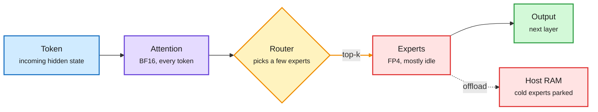
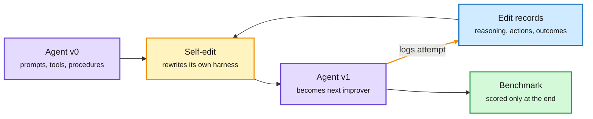

# Media Zone | 2026-10-06

> *Live draft: this window is still open. It is finalized with the 2026-10-06 digest at the 10:30 IST cutoff.*

> The US Monday's conversation has one cost idea underneath it: stop paying frontier prices for work that does not need them. A coding agent rewrote its own harness to Codex level for $4.03, and a Microsoft curriculum method cut harness-tuning spend from $1,360 to $298. Two context papers cut agent tokens by a third to a half while scoring higher. Red Hat shipped a 125B MoE with only its experts squeezed to FP4, and Cloudflare, OpenAI and llm-d all shipped small classifiers that decide where a call goes. GPT-6's 100x price spread makes that routing layer a necessity, not an optimization.

## Today's signal

- **Dominant story:** harnesses are becoming things you search, train and grade. Four harness papers in one US day: SelfSearch (self-edits, $4.03), ActiveSaddler (pick the failures worth fixing, 4.6x cheaper), a Wavestone teardown of 11 coding agents, and a Harvard-MIT result that "plan ahead" prompts make agents worse.
- **Pattern:** context is now a cost line the model manages itself. Context Language Models and CorpusMap both raise accuracy while cutting compute or input tokens by 21-59%.
- **Routing goes mainstream:** Cloudflare's open Clef, OpenAI's Decisions API and llm-d's Semantic Classifier are all small models whose only job is to decide where a call goes.
- **Compression in practice:** mixed-precision MoE checkpoints (FP4 experts, BF16 everything else) and expert offloading to host RAM keep putting 100B+ models on single GPUs.
- **Counter-signal:** memory pricing hit the desktop. NVIDIA's 128GB DGX Spark went from $3,999 at launch to $6,950.
- **Noise:** "Karpathy's 24/7 AI employee" threads, "free gold" repo lists and a Stanford orchestration claim citing an unverifiable arXiv id. Skipped.
- **Evening turn:** the NYC AI hearing became the US afternoon's loudest thread. A draft bill would fine vendors $25K per unvalidated model sale and require a shutdown capability.
- **Quiet areas:** no new X bookmarks in any of today's three bookmark runs, the curated retweet scrape came back empty, YouTube and LinkedIn have no capture in this window, and HuggingFace has served no new list since 10-03.

---

## Routing, KV cache, compression, GPU

### Big MoE models, small hardware

The practical compression story of the day: keep the shared parts of a mixture-of-experts (MoE, where each token runs through only a few specialist sub-networks) at full precision, and crush the experts, which hold most of the weights but are each used rarely.

Squeeze the experts, keep the shared path precise

Most MoE weights sit in experts that any one token barely touches, so that is where the bits go.

Blue is input, purple runs at full precision, amber is the routing decision, red is the compressed or offloaded part, green is the result.

Hugging Face · quantized checkpoint
<h4>Qwen3.8-Flash-Next in NVFP4, experts only</h4>

Red Hat AI published an NVFP4 (NVIDIA's 4-bit floating-point format with fine-grained scaling, native on Blackwell) checkpoint of Qwen3.8-Flash-Next. Only the MoE experts are quantized to FP4. Attention, embeddings and the router stay in BF16. The model takes text, image and video and loads directly in vLLM. Red Hat posted benchmarks against other popular checkpoints, and a team member separately pitched their Hub as the place for "the most accurate quantized checkpoints." This was the top-ranked post in the feed for fit and engagement rate. Expert-only quantization is the cheap, low-risk default: it cuts most of the memory while leaving the precision-sensitive shared path alone.

<a href="https://huggingface.co/RedHatAI/Qwen3.8-Flash-Next-NVFP4">See the model →</a> · <a href="https://x.com/RedHat_AI/status/2107128095354265664">X</a>

Newsletter · expert offloading
<h4>The same 125B model on a 12GB gaming GPU</h4>

AI Weekly's toolbox picked up Strata, an open-source engine that claims to run the same 125B-parameter Qwen3.8-Flash-Next on one 12GB consumer GPU with 32GB of system RAM. It parks experts in host memory and pulls them in as the router needs them. The project quotes roughly 100 to 140 tokens per second on an RTX 3090. Those are the project's own numbers, so wait for LocalLLaMA reproductions. Together with the NVFP4 release, it shows two routes to the same goal: shrink the experts, or move them off the GPU.

via AI Weekly Espresso (10-05)

Hardware · memory pricing
<h4>DGX Spark gets a 64GB model, and the 128GB one jumps 74%</h4>

NVIDIA added a 64GB DGX Spark at $4,999, shipping October 23, on the same GB10 superchip with half the unified memory. Two units cluster to 128GB over ConnectX-7. The other half of the news: the 128GB model is now $6,950, up from $3,999 at launch. AI Breakfast read it as memory shortage pricing reaching a desktop box rather than a datacenter invoice. It also explains the demand for expert offloading and 4-bit checkpoints above.

<a href="https://www.storagereview.com/news/nvidia-dgx-spark-64gb-october-23-4999-two-units-cluster-to-128gb">Read the story →</a>

### Context is a cost line: let the model manage it

Two papers from the US afternoon attack the same bill from different ends: the tokens an agent re-reads. One makes the model edit its own context. The other pre-builds a map so the agent stops re-searching.

Paper · UW, Meta Superintelligence Labs, MIT · context management
<h4>Context Language Models: the context is a file the model edits</h4>

Today most agents rely on the harness to decide what stays in the context window, with fixed rules like "summarize after N tokens." Context Language Models (CLMs) hand that job to the model. The context is treated as a file, and the model can rewrite it freely: compress, delete, keep or reorganize. Built zero-shot from existing models, CLMs scored 11.4% higher on BrowseComp-Plus (a deep web-research benchmark) with 21.5% fewer FLOPs, and 5% higher on a 12-hour EdgeBench run with 59% fewer FLOPs. Because the policy now lives in the model, RL can train it, and the authors show it improves further. The author list (Zettlemoyer, Lewis, Yih, Lambert, Koh) makes this one to read. It is the learned answer to the UT Austin context-compression study from 10-05, which compared hand-built compression rules.

<a href="https://arxiv.org/abs/2609.37725">Read the paper →</a> · <a href="https://x.com/askalphaxiv/status/2106759570668585463">X</a>

Paper · Microsoft · agentic search
<h4>CorpusMap: follow the entities, stop re-searching</h4>

When an agent searches a large document set exposed as a flat folder, a useful document gives no hint about which other documents relate to it. So the agent rediscovers the same links on every query, misses evidence and burns tokens. CorpusMap builds, offline and without LLM calls, an "entity page" for every recurring person, project or product, linking every document that mentions it. The agent reads a document, then follows an entity to the related ones. Across 7 models and 3 benchmarks, answer quality rose 6.4 to 11.7 points while input tokens fell 34% to 57%. It also beat an LLM-written wiki layer. That is close to how this wiki itself works, and it shows the cheap, deterministic version wins.

<a href="https://arxiv.org/abs/2609.37226">Read the paper →</a> · <a href="https://x.com/dair_ai/status/2107146326639358188">X</a>

### Decoding faster: smarter drafts, or no left-to-right at all

vLLM · speculative decoding
<h4>Variable-length speculation without a confidence head</h4>

Speculative decoding has a cheap draft model guess several tokens ahead. The big model then checks them in one pass. Deciding how many tokens to draft used to need an extra trained confidence head. vLLM 0.30 generalized "adaptive verification" to any draft-based method, including Eagle and DFlash, using an online acceptance estimator that learns the acceptance rate as it serves. Draft length now adapts to how predictable the text is, with no retraining. Version 0.31 is already out and will be covered at the next vLLM office hours.

<a href="https://x.com/RedHat_AI/status/2107107063876723051">Read the thread →</a>

DeepMind · diffusion language model
<h4>Write 256 tokens at once, then refine</h4>

A widely shared breakdown says Google DeepMind shipped a language model that drafts a 256-token block in parallel and refines the whole block repeatedly, instead of writing one token at a time. It is described as a 26B MoE with 3.8B active parameters. The pitch is editing work: infilling, formatting fixes and keeping several sections consistent, where seeing the whole output helps. DeepMind's Sander Dieleman called 2026 "the year of continuous diffusion for language" and re-shared his long post on why continuous diffusion, written off a few years ago, is coming back. For serving cost, parallel decoding swaps memory-bound token-by-token decode for fewer, more compute-heavy passes. Those are the same economics speculative decoding is chasing.

<a href="https://x.com/Ronald_vanLoon/status/2107037748494258510">Read the breakdown →</a> · <a href="https://sander.ai/2026/08/24/continuous-dlms.html">Dieleman's post</a>

### Decision models: the router becomes a product

vLLM / llm-d · routing classifier
<h4>llm-d Semantic Classifier, and why it is not a guardrail</h4>

The vLLM Office Hours #58 recording went up this afternoon. Beyond the v0.29 and v0.30 changes and a new Tenstorrent hardware backend (one more non-NVIDIA chip that vLLM can serve on), it introduced the llm-d Semantic Classifier. llm-d is the Kubernetes-native distributed serving layer built around vLLM. The classifier is a lightweight service that labels requests at high throughput so the serving layer can route them. The talk explicitly argues it is not a guardrail: it exists to send traffic to the right model or pool, not to block it. With Clef and the Decisions API below, that makes three "small model decides where the call goes" launches in one day, one of them inside the open serving stack.

<a href="https://x.com/RedHat_AI/status/2107138493763801260">Watch + slides →</a>

Cloudflare + OpenAI · gating layer
<h4>Clef and the Decisions API return a probability, not prose</h4>

"Decision models" take some input and a fixed list of possible answers, then return a calibrated confidence for each. They are built for routing an email, scoring a lead or choosing an agent's next step. Jev started the category. Cloudflare's open-weight Clef (27B) and Clef-flash (9B) are Apache 2.0, read text, JSON, images and video across 65K tokens, and cost $0.24 and $0.09 per million input tokens on Workers AI. Cloudflare reports them 2.5x and 13x faster than Jev at the median, behind a Jev-compatible API. OpenAI's Decisions API, built on GPT-6 Luna, is in limited preview. This is the routing layer from the 10-05 cache-aware routing post, sold as a product. The open weights matter because a gating model sits on every call, so self-hosting it is where the savings are.

<a href="https://developers.cloudflare.com/changelog/post/2026-10-01-clef-workers-ai/">Read the changelog →</a>

Pricing · routing pressure
<h4>GPT-6 spans 100x, and the fast tier burns 8x</h4>

OpenAI's GPT-6 build guide lists Astra at $10/$50, Sol at $2/$10 and Luna at $0.10/$0.50 per million input/output tokens. That is a 100x spread inside one model family. OpenAI also launched a $500/month Pro tier with "Astra Ultrafast" at up to 8x speed, which uses up the plan's allowance 8x faster. Meanwhile, existing $200 Pro users lose part of their allowance after October 29. A feed thread made the same point from the local side: an agent makes a thousand calls an hour, and maybe forty need a frontier model. Small accounts also pushed "progressive determinism": once an agent's query has been verified, cache it as code so it never goes back to the LLM.

<a href="https://openai.com/index/practical-guide-building-gpt-6/">GPT-6 guide →</a> · <a href="https://x.com/zodchiii/status/2107083533097611731">local-first thread</a> · <a href="https://x.com/Ronald_vanLoon/status/2107102513849889232">progressive determinism</a>

### Chips, power and who builds the fabs

- **TSMC may help run Musk's Terafab** fabs in Texas, per a report Musk called "just discussions." TSMC rose and Intel fell premarket, though Intel can still win 14A orders there ([X](https://x.com/StockSavvyShay/status/2107079160577626227)).
- **Qualcomm will pay Huawei** under a patent deal for the first time. It covers 5G, AI, 3D stacking and near-packaged optics, the layers where scaling now happens ([X](https://x.com/StockSavvyShay/status/2107059720528027890)).
- **Power is the scarce asset.** TeraWulf doubled contracted power at one site to 1 GW, and its Anthropic lease implies about $2.4B a year of revenue at that scale ([X](https://x.com/StockSavvyShay/status/2107085050416439411)). Toshiba will double datacenter hard-drive output by FY2027 to fill the AI memory gap ([Nikkei](https://asia.nikkei.com/business/electronics/toshiba-to-double-hard-disk-drive-supply-to-fill-ai-chip-memory-gap)).
- **NetworkOcean (YC) floated an H100 at sea**: OASIS-00 runs on floating solar with seawater cooling, sketch to water in 53 days. A stunt today, but it shows where power-hunting is heading ([X](https://x.com/VaibhavSisinty/status/2107139141448483320)).
- **PyTorch's Accelerator Integration Working Group** published its yearly update: a cross-repo CI relay, device-agnostic tests and the OpenReg reference backend, all to make new non-NVIDIA chips cheaper to support ([PyTorch](https://bit.ly/4hpHZsY)).

---

## LLMs, agents, safety

### Harnesses become trainable objects

The harness (the loop, tools, prompts and memory wrapped around a model) was the most-discussed theme of the US morning, with two concrete artifacts behind it.

The agent improves the agent, with no task reward

SelfSearch learns from records of earlier self-edits, not from benchmark scores.

Purple is the agent, blue is the experience log, amber is the self-modification loop, green is the final evaluation.

Paper · Seoul National University · self-improving agents
<h4>SelfSearch: a Codex-level harness for $4.03</h4>

Coding agents can read and edit their own instructions, tools and procedures. Earlier work searched over those edits by re-running benchmarks after each change, which is expensive and overfits to the benchmark. SelfSearch drops the reward. Each agent edits itself using records of earlier edit attempts (the reasoning, tool actions and what happened), and the edited agent becomes the next improver. Average success rose over the starting agent in all six model-benchmark settings, by up to 11.2 points on Terminal-Bench 2.1. On SWE-bench Multilingual one evolved agent gained 5.0 points and spent 38.5% less on the tasks both versions solved. With $4.03 of search spend, it produced a harness where DeepSeek V4 Flash solves 82.0% of Terminal-Bench 2.1, matching Codex, the top harness in a public nine-harness comparison. This extends the 10-05 "spend compute on the verifier" thread: the cheapest gains are now in the scaffold, not the weights.

<a href="https://arxiv.org/abs/2609.37968">Read the paper →</a> · <a href="https://x.com/omarsar0/status/2107123966792052859">X</a>

Hugging Face · multi-harness RL
<h4>Claude Code, Codex and friends as RL environments</h4>

Clem Delangue announced that Hugging Face turned Claude Code, Codex, Hermes, Pi, opencode and other coding harnesses into RL (reinforcement learning) environments with no changes to the harnesses. One open-weight model can now be trained against the real loops it will run in. Akshay Pachaar's guide to multi-harness RL, reshared by Hugging Face, was among the fastest-rising posts this afternoon. This closes the gap where models were trained in one scaffold and deployed in another. Expect "harness-robust" to become a training target.

<a href="https://x.com/huggingface/status/2107123500599460122">Delangue →</a> · <a href="https://x.com/huggingface/status/2107130132922335432">guide</a>

Paper · Microsoft · harness optimization
<h4>ActiveSaddler: tune the harness on the failures still open</h4>

Automatic harness tuners improve an agent's prompts, tools and control logic from execution feedback. They focus on how to patch the harness and feed it a fixed task list. ActiveSaddler argues that which tasks produce the feedback matters as much, and that the best tasks change as the harness improves. It groups recurring failures into "failure-pattern arms" and treats picking the next one as a bandit problem (balancing known weaknesses against exploring new ones). With the same optimizer, test pass rates rose 4.4 points on GAIA2 and 7.5 on Terminal-Bench 2.0. Reaching 58.5% on GAIA2 dev cost $298 versus $1,360 with a fixed task order. Paired with SelfSearch, the lesson is that harness search is now cheap enough that its budget allocation is the research question.

<a href="https://arxiv.org/abs/2610.00906">Read the paper →</a> · <a href="https://x.com/rohanpaul_ai/status/2107132234373468545">X</a>

Paper · Wavestone AI Lab · harness survey
<h4>Eleven coding agents, one seven-part harness</h4>

This survey takes apart Claude Code, Codex, Gemini CLI, Aider and seven more, starting from "agent = model + harness." Every one has the same seven parts, differing only in size: the loop (plain while-loop up to replayable runs), the LLM layer, tools (bash only up to 43 typed tools), memory, safety (a step limit up to rules plus a reviewer model plus a sandbox), orchestration (sub-agents or not), and extensions (SKILL.md in 9 of 11, MCP in 8). It notes almost nobody uses agent frameworks or embeddings. It ends with 18 design rules and a 90-line reference harness. It crossed the feed twice, from Spanish- and English-language accounts, which is a fair sign it is becoming the standard reference.

<a href="https://arxiv.org/abs/2609.00006">Read the paper →</a> · <a href="https://x.com/santtiagom_/status/2107119653117898762">X</a> · <a href="https://x.com/AnnatarXBT/status/2107028518983131548">X</a>

Paper · Harvard and MIT · scaffolds vs interfaces
<h4>"Plan ahead" prompts make agents worse. Simpler interfaces fix it.</h4>

The authors use auctions and matching markets, where the optimal strategy is known, so every choice can be scored. Prompts that tell the agent to plan through rounds or model the other players made play worse overall. Changing the interface helped instead: an ascending auction, which offers one safe choice at a time, cut bid errors across four model families. Spelling out payoffs and why truthful bidding is safe also helped. The agents' written plans did not track their actual choices. Some changes improved bids without improving the plans, and some improved the plans without improving bids. The practical rule: judge a scaffold by the decisions it produces, not by how good its reasoning reads.

<a href="https://arxiv.org/abs/2609.36365">Read the paper →</a> · <a href="https://x.com/dair_ai/status/2107140669194064288">X</a>

Debate · who owns the harness
<h4>Lab harnesses burn tokens. Verification is the new bottleneck.</h4>

Garry Tan argued that lab-built harnesses have an incentive to burn tokens, and Y Combinator amplified it into the evening. Startup harnesses are useful because they can watch agent behavior and replace repeated token spend with deterministic, tested code. Elvis Saravia (omarsar0) says he now spends more time verifying agent-written code than writing it. ContextQA's Ship, an autonomous QA agent that reproduces Slack or Linear bug reports and hands the context to Claude Code or Codex, launched into that gap. NVIDIA open-sourced 391 signed agent skills with benchmarks (CUDA, Jetson, RAG, robotics) under Apache 2.0. Anthropic's Claude Mods, which let users change how Claude Code itself works, got its first follow-up releases.

<a href="https://x.com/garrytan/status/2107129959550685660">Tan →</a> · <a href="https://x.com/omarsar0/status/2107109255421563227">Ship</a> · <a href="https://x.com/Arindam_1729/status/2106753709455687926">NVIDIA skills</a> · <a href="https://code.claude.com/docs/en/changelog">Claude Code changelog</a>

### Agents meet the web and the enterprise

- **Six ways an agent reaches a website**, from raw API to WebMCP (which Chrome and Edge are building together). Pages declare their actions with names and typed inputs, so agents stop paying vision tokens to find a button ([thread](https://x.com/DailyDoseOfDS_/status/2107040613275463861)).
- **Personal agents vs "factories."** Nathan Baschez argues the end state is shared multi-agent systems, because they allow specialization and trade. ChatGPT Dots, Grok bots and Muse are the personal-agent wave he is arguing against ([essay](https://www.gettheleverage.com/p/against-the-personal-agents-theory)).
- **Cohere North 2** adds reusable agents, multi-agent orchestration and memory across sessions, pitched on sovereignty and security ([blog](https://cohere.com/blog/introducing-north-2)).

### Grade the outcome, not the agent's last message

The evening's agent-eval theme: stop trusting what the agent says it did, and check the state it left behind.

- **Microsoft ThinkingBox is now an OpenEnv environment.** It simulates a customer, gives the agent MCP tools over a real database, then grades what changed in the database, and asks whether the agent can do it twenty times in a row. ThinkingBox-Bench has 507 tasks across retail, insurance, travel, banking and consulting ([HF blog](https://huggingface.co/blog/microsoft/thinkingbox) · [X](https://x.com/SergioPaniego/status/2107115844350427607)).
- **Era by Eon generates a whole simulated company** across Salesforce, Zendesk, Slack, Jira and Gong, down to vendor rate limits and error codes. Because Era wrote every record, code computes each answer exactly, so grading needs no LLM judge. NVIDIA is a research partner ([Era](https://console.era.eon.io/) · [omarsar0](https://x.com/omarsar0/status/2107144368326934732) · [rohanpaul](https://x.com/rohanpaul_ai/status/2107140507755548858)).
- **flow-1**, a YC-backed model trained with RL to find errors in agent traces, claims to match GPT-6 Sol at trace analysis. Only the launch tweet so far ([RT](https://x.com/ycombinator/status/2107162743149338661)).
- **Lizard moved its agent sandboxes to Firecracker microVMs** (one kernel per sandbox) with templates that ship Claude Code, Codex, opencode and Pi preinstalled, pitched as the cheapest on the market. Vendor post, but the highest engagement rate of the evening ([X](https://x.com/LizardBuild/status/2107137362941641147)).

### Swarms: speed, or new capability?

- **Understanding AI asks whether agent swarms are the next scaling law.** Noam Brown credits under 10% of OpenAI's Navier-Stokes result to the 10,000-agent swarm. The Claude Opus 5.5 system card found most multi-agent gain comes from going 1 to 10 agents. Toby Ord estimates a "stepping on toes" parallelism factor of 0.5 to 0.7 for GPT-5.6 Sol swarms, close to human teams ([essay](https://www.understandingai.org/p/why-agent-swarms-could-be-the-next)).
- **The counterpoint is a Microsoft-Berkeley paper** finding that bigger coding-agent teams score higher than solo agents even with generous time, and that one task was only solvable by a team. It resurfaced on X this evening ([RT](https://x.com/rohanpaul_ai/status/2107146600288325999)). For cost, the open question is whether swarms buy capability or just buy wall-clock time at a token premium.

### Safety and policy, live from New York

- **NYC City Council AI-risk hearing** ran through the US day. Gary Marcus testified and pushed back on ex-Anthropic researcher Jacob Coxon's "we don't know how to control any AI system." Marcus says that is true of generative AI specifically, so pause that ([X](https://x.com/GaryMarcus/status/2107131096924291404) · [testimony](https://garymarcus.substack.com/p/coming-soon-new-york-citys-hearing)).
- **The bill behind the hearing**: no AI model sold or deployed in NYC without outside validation (accuracy, calibration, determinism, latency, provenance, bias, privacy, safety), certified to the city's Cyber Command, plus a mandatory shutdown capability and a $25K fine per unvalidated sale ([X](https://x.com/rohanpaul_ai/status/2107150709942849837)).
- **Testimony highlights:** ex-DeepMind researcher Alex Turner described Google backing away from earlier safety commitments. Daniel Kokotajlo said the ability to notice misalignment is "quite poor and set to get much worse," and argued for several independent evaluators. Speaker Menin asked firms to testify under oath that their systems follow safety instructions ([Turner](https://x.com/GaryMarcus/status/2107134864269128067) · [Kokotajlo](https://x.com/GaryMarcus/status/2107132353562984898) · [Menin](https://x.com/GaryMarcus/status/2107153498328764901)).
- **OpenAI will watermark text in the EU** to meet regulation, while saying plainly that text watermarks are often undetectable in short passages and vanish under rewriting or translation. The detector goes only to approved researchers for now ([X](https://x.com/OpenAI/status/2107164650249101695) · [OpenAI](https://openai.com/index/eu-text-provenance/)).
- **Trump's "Super Intelligence Force,"** chaired by DNI Jay Clayton, has 120 days to report, with a charter warning against overregulation ([TechCrunch](https://techcrunch.com/2026/10/04/trump-unveils-his-new-super-intelligence-force/)). Researchers on X mocked the forced "SI" relabeling.
- **Anthropic's human reviewers reported a Florida user's threatening Claude chat to police**, at least the third such referral since August, per Tom's Hardware ([link](https://www.tomshardware.com/tech-industry/artificial-intelligence/anthropic-reports-florida-womans-claude-diary-threat-to-shoot-up-sheriffs-office-felony-charge-follows-its-at-least-the-third-such-conversation-to-reach-police-since-august)).
- **Mustafa Suleyman** called Anthropic's treatment of Claude as possibly conscious "a dangerous anthropomorphism." Pedro Domingos argued unfaithful chains of thought are hallucinations, not deception ([X](https://x.com/rohanpaul_ai/status/2107049650402525417) · [Domingos](https://x.com/pmddomingos/status/2106987460563443731)).

---

## Multimodal / vision / audio

- **Deepgram Flux TTS** keeps acoustic state across a streaming conversation, so the voice keeps its tone after interruptions. It tracks which words the caller actually heard, and first audio arrives in under 200 ms ([X](https://x.com/_avichawla/status/2107009822738854255) · [product](https://fandf.co/3UJLAsY)).
- **NVIDIA open-sourced an image-to-explorable-3D-world tool**. It was among the fastest-rising Hugging Face reshares, but it is off-lens for this reader ([RT](https://x.com/huggingface/status/2107129228231684565)).

---

## Industry and business

- **OpenAI will test visual ads during ChatGPT image generation** in the US later this month. It cites 1.2B weekly users and a WeightWatchers CPA 15.3% below paid search ([OpenAI](https://openai.com/index/new-chatgpt-ads-format-and-measurement/)).
- **Beijing "transfer stations" resell Claude at 70-90% off** through overseas accounts, sometimes passing off Qwen output as Claude (The Information, via AI Weekly Espresso).
- **US-China model gap at a record-low ~3%**. DeepSeek V4.1 Flash scores 81.1 on LiveBench against Anthropic's 83.4 ([Bloomberg](https://www.bloomberg.com/news/articles/2026-10-04/us-lead-in-ai-over-china-narrows-after-deepseek-gains-bi-says)).
- **OpenAI and Synopsys are co-developing GPT-Synopsys** for chip-design workflows ([The Stack](https://www.thestack.technology/synopsys-openai-chip-design-model/)).

**Funding, valuations, and compute deals**

- **Ex-Groq engineers sued Groq's board** over the $20B "non-exclusive" NVIDIA deal, alleging common shareholders were short-changed. The DoJ is already probing it (FT, via AI Weekly Espresso).
- **Schneider Electric is near a $20B+ deal for PTC** ([Bloomberg](https://www.bloomberg.com/news/articles/2026-10-04/schneider-said-to-near-deal-to-buy-ptc-for-more-than-20-billion)). **Firmus** (NVIDIA-backed) is reserving half of its A$5.5B ASX IPO for existing holders ([Bloomberg](https://www.bloomberg.com/news/articles/2026-10-05/firmus-said-to-plan-allocating-half-of-ipo-to-existing-investors)).
- **Anthropic committed $100M** to train 10,000 "Frontier Deployed Engineers" by end of 2027 ([Anthropic](https://www.anthropic.com/news/claude-frontier-academy)). **Reflection** (NVIDIA-backed) is readying its first open-weight model ([Axios](https://www.axios.com/2026/10/04/reflection-open-weight-ai)).
- **BMO initiated Vertiv at Outperform**: about 85% of revenue is datacenter, with roughly $3.5M of content per MW that should rise as liquid cooling spreads ([X](https://x.com/StockSavvyShay/status/2107167581228683310)). **Higgsfield** ranks #5 on a16z's consumer AI revenue leaderboard ([RT](https://x.com/omarsar0/status/2107156911611084818)).
- **Melius upgraded Microsoft** on the thesis that enterprises want a "secure wrapper" that routes models and governs agents, which is a sell-side note making the routing argument ([X](https://x.com/StockSavvyShay/status/2107063047168897120)).

---

## Also crossed your feeds

New this evening: Episteme ran four models as forecasters on 25 open scientific hypotheses; the interesting part is where they disagree ([post](https://epistemesci.substack.com/p/four-forecasters-twenty-five-futures)) · Gautam Kamath wants AI to find simpler proofs of known theorems, and Caltech's Mathathon is built on exactly that ([thread](https://x.com/thegautamkamath/status/2107162860526723491) · [Mathathon](https://mathathonchallenge.com)) · the Nobel medicine committee declined to link this year's neuron-switching prize to neural networks ([X](https://x.com/rohanpaul_ai/status/2107156793743040514)) · LinkedIn: data annotators lead its estimate of 750K+ new US AI jobs, at a $51K median ([RT](https://x.com/rohanpaul_ai/status/2107154995909140914)) · a single-source claim that Claude Cowork tasks move to Anthropic's servers tomorrow; check the official changelog before acting on it ([X](https://x.com/alex_verem/status/2107138014732328965)) · Atlassian's AI SDLC playbook ([blog](https://www.atlassian.com/blog/ai-at-work/ai-sdlc-transformation-playbook)) · "How to keep learning in the age of LLMs" ([essay](https://ogzhanolguncu.com/blog/how-to-keep-learning-in-the-age-of-llms)). Resurfaced from 10-05: Google's VeriHarness (agreement across rollouts can hide shared errors) and CheatBench's "Don't cheat!" result ([X](https://x.com/rohanpaul_ai/status/2107131164901421455)) · the UT Austin context-compression study ([RT](https://x.com/omarsar0/status/2107109078761894381)) · Schmidhuber on the 1991 linear Transformer, whose cost scales linearly with input length ([link](https://people.idsia.ch/~juergen/1991-unnormalized-linear-transformer.html)) · PyImageSearch's DeepSeek-V3-from-scratch tutorial ([link](https://pyimg.co/36gvk)) · a 2M-citation study finding that answer engines cite pages matching the prompt, with content in the top third, and SEO tricks barely matter ([X](https://x.com/HowToPrompt__/status/2107065915150066025)) · Meta's six Muse Spark math papers ([Meta](https://research.meta.ai/blog/solving-open-research-problems-together)) · Mercor: Claude Opus 5 hit 100% on month-end close where CPAs averaged ~37% ([Mercor](https://www.mercor.com/blog/human-baselines-for-benchmarks-ai-now-outperforms-junior-accountants/)) · GitLab patched a CVSS 9.9 AI Gateway flaw ([THN](https://thehackernews.com/2026/10/gitlab-patches-critical-self-hosted-ai.html)) · Suleyman: $100B training runs are coming ([X](https://x.com/rohanpaul_ai/status/2106992735307911226)) · ex-OpenAI safety writer David Robinson's "culture is broken" essay ([TechCrunch](https://techcrunch.com/2026/10/03/openai-safety-employee-resigns-claiming-the-companys-culture-is-broken/)) · Nollahealth's AI can now prescribe acne treatment in Utah ([X](https://x.com/omarsar0/status/2107129885000884328)) · Cambridge opened a PhD in AI and Society ([link](https://www.postgraduate.study.cam.ac.uk/courses/directory/iethpdais)). Skipped: a "DeepGEMM saves 98% on tokens" thread (DeepGEMM is DeepSeek's FP8 matrix-multiply kernel library; it speeds up GPU math, it does not cut token counts), "Boris runs 100+ agents in self-improving graphs" engagement bait, "50 repos replace your subscriptions" and "300+ agents leaked" lists, keep4o campaign posts, the "Stanford orchestrates Opus and Astra" thread (single-source claim, unverified), Karpathy course and "AI employee" bait, second-brain repo hype, stock-picking posts, robot-gadget reposts and politics retweets.
