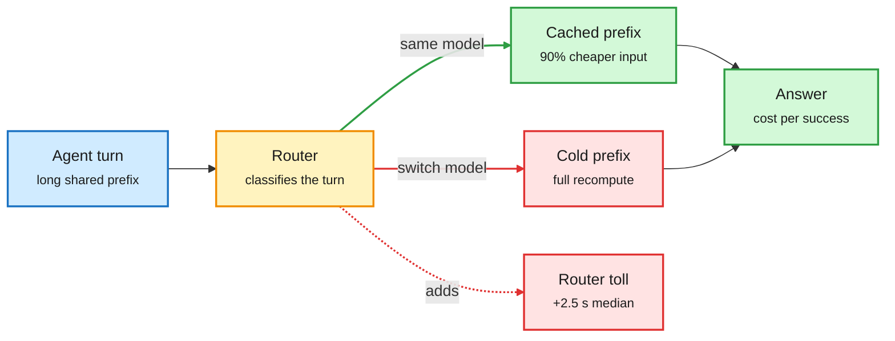

# Media Zone | 2026-10-08

> The US Wednesday's feed was about where the bill really sits. The first independent test of a commercial router found it costs more than skipping it. Microsoft moved routine coding onto a 3-bit model on your own PC. Claude Haiku 5.5 cut list prices while its tokenizer quietly adds tokens. On the agent side, a controlled study found harnesses change your bill, not your score.

## Today's signal

- **Dominant story:** routing got its first real audit. LMArena found Jev Router picks good models and still costs 38% more than one cheap model.
- **Pattern:** inference cost is moving onto customer hardware. Microsoft (3-bit MAI-Code on-device), GitHub (local routing) and 1.6-bit DeepSeek V4 Flash on a laptop.
- **Cache is the hidden currency:** SambaNova's cached tokens are 90% cheaper, Anthropic halved Sonnet cache reads, and an analyst pitches SSDs on agent KV cache.
- **Counter-signal:** the OpenAI math drop is now being graded rather than cheered. Marcus, the Association for Human Mathematics, and a Lean-translation paper all push back.
- **Quiet areas:** no new bookmarks were saved this window, the LinkedIn capture was empty, and no Reddit post passed the filters. Skipped: "pure treasure" prompt threads, stock-pick bait, Starlink politics, robot reels.

---

## Routing, KV cache, compression, GPU

### Routing gets graded, and moves to the device

A router pays a toll before it saves anything

Arena's result in one picture: good choices, but latency and lost cache come first.

Amber is the routing decision, green the cheap path, red the two costs a router adds.

Benchmark thread · the day's key routing result
<h4>Arena: Jev Router chooses well, but costs 38% more</h4>

LMArena ran TypeSafe's Jev Router over more than 4,700 real agentic sessions. It mostly routes to Pareto-efficient models (DeepSeek V4.1 Flash, GPT-6.1 Sol, GPT-6 Luna), and its steerability (+10%) nearly matches Claude Opus 5.5 High. But calling DeepSeek V4.1 Flash directly gives similar success for 38% less, with median latency of 3.64 s against 6.18 s, and the gap doubles at P90. Arena's own conclusion: balancing success, steerability, cost and latency at once "remains an open challenge." This is the first independent system-level test of a commercial router the wiki has seen.

<a href="https://x.com/arena/status/2107961555363213482">Read the thread →</a> · <a href="https://x.com/arena/status/2107961562858492338">Latency detail →</a>

Explainer · why routing can cost more
<h4>Routing breaks the prefix cache</h4>

Akshay Pachaar's explainer names the mechanism behind Arena's result. Every classification adds latency, and general models misread intent. Above all, switching models mid-session throws away the prefix cache (the stored attention state for the prompt's shared opening). His fix is session pinning and model affinity, so you route once per session, not once per turn. The video is a DigitalOcean promo, but the argument holds.

<a href="https://x.com/akshay_pachaar/status/2107746747674239324">Read the post →</a>

Product · routing to the device
<h4>Copilot hands routine coding to a 3-bit on-device model</h4>

Microsoft will route routine Copilot work from Claude Haiku 4.5 to its own MAI-Code-1.1-Flash, a 137B MoE with 6.8B active parameters. It runs at 3 bits with a 256K context on Nvidia RTX Spark PCs, and local calls carry no inference charge. Microsoft says 3-bit scores match full precision on SWE-Bench Verified and Terminal-Bench 2.1. GitHub separately announced local-model routing under Project HydraFusion. The cost does not vanish; it moves onto the customer's $2,599-$5,999 machine.

<a href="https://x.com/rohanpaul_ai/status/2107914219408736463">Read the post →</a> · <a href="https://x.com/github/status/2107896916595884177">GitHub →</a>

X post · routing as product policy
<h4>Grok Bot: most requests go to a fast Grok 4.8</h4>

Musk says Grok Bot's operating principle is the best mix of speed and intelligence, so most simple requests will go to a "lightning-fast" Grok 4.8 once it ships. This follows his line the day before that Grok Bot will pick the best back end for any task, including Claude. It is difficulty routing stated as consumer-product policy. Arena's result is the caution: the savings depend on how often the router switches mid-session.

<a href="https://x.com/elonmusk/status/2107894231922876510">Read the post →</a>

- **Decision models keep shrinking.** Liquid AI released Open d1 (a 3B text+vision model and an experimental 600M omni model) for edge decisions. Unsloth's recipe lifts Qwen3.5 0.8B from 20.7% to 74.3% on three decision benchmarks in 4GB of VRAM ([HF blog](https://huggingface.co/blog/LiquidAI/open-d1), [Unsloth](https://unsloth.ai/docs/basics/train-your-own-decision-model-with-unsloth)).
- **Jev-Mem** applies the same idea to agent memory: store, update and drop decisions made by a scorer and thresholds, not a generating LLM. Mem0 says its thresholds were tested with one model on one benchmark, so treat it as a pattern ([Mem0](https://x.com/mem0ai/status/2107873474517889201)).
- **Haiku 5.5** is the cheap tier's new reference at $0.10/$0.50 per million tokens up to 100K, matching GPT-6 Luna, but its tokenizer uses about 1.25x more tokens ([Simon Willison](https://simonwillison.net/2026/Oct/7/claude-haiku-5-5/)).

[@arena](https://x.com/arena/status/2107961564821405897) · [@akshay_pachaar](https://x.com/akshay_pachaar/status/2107746747674239324) · [@github](https://x.com/github/status/2107896916595884177) · [@UnslothAI](https://x.com/UnslothAI/status/2107868866361930236) · [@liquidai via HF](https://x.com/huggingface/status/2107894672207266029)

### Cache is the hidden currency

Vendor blog · prompt caching numbers
<h4>SambaNova: MiniMax M3 cached tokens at $0.06 per million</h4>

SambaCloud now serves MiniMax M3 prefixes of 4,096 to 192,000 tokens from cache with no code changes. Cached input is billed 90% below the standard rate, and time-to-first-token falls 35% at 8K and 88% at 192K (8.4 s to 1.0 s). Under sustained agent traffic, hit rates climb above 90%. These are the numbers that make a mid-session model switch expensive.

<a href="https://bit.ly/4emDQ71">Read the blog →</a>

Market signal · memory hierarchy
<h4>SanDisk's data-center bet rides on KV-cache offload</h4>

A market analyst projects SanDisk data-center revenue growing about 30x to roughly $8B a quarter by 2028, citing agents pushing KV cache (the saved attention state a model reuses instead of recomputing) onto enterprise SSDs. This is an investor's forecast, not company guidance, so weight it lightly. The structural point matters more. Long agent sessions make the cache tier a storage purchase, not only an HBM one.

<a href="https://x.com/StockSavvyShay/status/2107879684944130201">Read the post →</a>

Explainer thread · serving fundamentals
<h4>Inference engineering is the underrated skill</h4>

A clear primer on why serving is its own field. Prefill (processing the prompt) is compute-heavy and parallel. Decode (one token per step) is bound by memory bandwidth, because it rereads the weights and a growing KV cache at every step. Batching, cache capacity, scheduling, kernel choice and tail latency all follow from that split. Nothing new for a specialist, but a good one-page map of where serving cost comes from.

<a href="https://x.com/techNmak/status/2107678022094790933">Read the thread →</a>

### Low-bit and local: big models on small machines

- **DeepSeek V4 Flash (284B) at 1.6 bits** fits in about 60GB, and Microsoft demoed it on a 128GB Surface Laptop Ultra. The extreme-quantization frontier is now a laptop SKU ([@rohanpaul_ai](https://x.com/rohanpaul_ai/status/2107976531918323717)).
- **MiMo 2.6 Flash split across an RTX 6000 and an M5 laptop** over 10 GbE runs at about 40 tokens per second. Pipeline-splitting across mismatched consumer devices is now usable ([@pcuenq via HF](https://x.com/huggingface/status/2107891092762890588)).
- **Qwen 3.8 Flash Next (125B) at 100 tokens/s on one RTX 4090** was #6 on Hacker News, with 924 points. Practitioners still trade expert-offload tricks to fit big MoEs on consumer GPUs ([HN](https://news.ycombinator.com/item?id=49953495)).
- **Looped transformers, a field guide.** AlphaSignal separates depth, time and flow loops. Nanbeige4.2-3B runs 22 layers twice, so budget it as 44 layer applications and a 2x KV cache. The viral Recurrent Looped Transformer lost to a plain transformer at 140M while using ~20x the GPU-hours ([AlphaSignal](https://alphasignal.ai/news/looped-transformers-three-different-machines)).
- **Contested:** Emad Mostaque cites a Prism ML claim that Qwen 27B at 1.5 bits keeps 95% of performance in 6GB, "brain-level efficiency." It is a podcast clip with no artifact, so treat it as a claim ([@rohanpaul_ai](https://x.com/rohanpaul_ai/status/2108031933628494161)).

### Compute supply and infrastructure tools

Open source · infrastructure optimization
<h4>Meta open-sources Rebalancer</h4>

Rebalancer is the assignment solver Meta has used for nine years to place hardware, services, tasks and traffic. It separates how a problem is specified from how it is stored and solved, and offers both an exact MIP solver and a parallel local-search solver. At Meta it solves about 40 million assignment problems a day across 30+ formulations, with a P99 of 12 seconds on 265K objects and 3.2K bins. It is directly useful for GPU-fleet placement and request-to-replica assignment.

<a href="https://engineering.fb.com/2026/09/21/open-source/rebalancer-generic-high-performance-library-assignment-problems/">Read the blog →</a>

Infrastructure · public compute
<h4>National Compute: MI355X and B300 nodes for .edu and .gov</h4>

Anjney Midha says hundreds of AMD MI355X and NVIDIA B300 nodes are now live on the National Compute grid, subsidized for academic and government users. The site already shows a demand-surge notice. A mixed AMD and NVIDIA pool for researchers matters if academic labs are to test frontier-scale efficiency work.

<a href="https://nationalcompute.com">Visit the grid →</a>

- **CUDA 13.4** shipped ([NVIDIA AI](https://x.com/NVIDIAAI/status/2107895725162119499)). **Wafer** launched an AI performance-engineering repo series ([YC retweet](https://x.com/ycombinator/status/2107956579228368933)).
- **XPU Grasshopper**, pitched as a chip "co-designed with AI," got a YC retweet but no specs, node or benchmarks. Track it, do not trust it yet ([YC](https://x.com/ycombinator/status/2107890049534849433)).
- **Nebius** has about 250 MW active against 3.5 GW contracted, per Rosenblatt's Buy initiation ([post](https://x.com/StockSavvyShay/status/2107945557235032339)).

---

## LLMs, agents, safety

### Training agents to recover and verify themselves

NVIDIA paper · on-policy distillation for agents
<h4>PivotOPD: fix the one early mistake, then teach recovery</h4>

NVIDIA found that 59% of failed ALFWorld rollouts contain one "pivotal" mistake, usually around turn 8-12 of 30, after which the agent wastes the episode. Fixing just that turn lifts replayed success from 8% to 59%. Standard on-policy distillation barely helps, because the recovery action has under 1% probability and is never sampled. PivotOPD steers the student away from the pivot (reverse KL) and separately teaches recovery from the bad state (forward KL), beating 13 baselines and adding 3.2% on SWE-Bench Verified for a Nemotron student.

<a href="https://research.nvidia.com/labs/lpr/pivotopd">Read the project page →</a>

Salesforce paper · judge-free test-time scaling
<h4>CLIFT: a web agent that grades its own rollouts</h4>

Training web agents needs per-step feedback, but frontier judges are too expensive to call every step and absent at deployment. CLIFT has the agent answer verification questions about its own rollouts and keeps only questions whose answers agree with a training-time judge, using a conformal certifier. The same frozen question bank then picks between a greedy run and a few retries at test time. A 31B Gemma-4 agent reaches 74.6% on WebArena Infinity, above Gemini 3 Flash with browser use, and the bank even transfers to GPT-5.5.

<a href="https://arxiv.org/abs/2610.06829">Read the paper →</a>

- **Scale AI open-sourced AgentEnv**, the framework behind every RL environment it builds. Environments are the bottleneck for agent RL, so this lowers the cost of building them ([post](https://x.com/omarsar0/status/2107874375227601082)).
- **Elvis Saravia: "own your intelligence stack."** He argues many real tasks need a specialized model, harness and data flywheel rather than AGI, and that a new post-training era is starting ([post](https://x.com/omarsar0/status/2107885815875395612)).

### Harnesses set the bill, and state lives outside the context

- **What a harness buys: tokens, mostly.** Same model, three production harnesses: scores within rerun noise, but cost per task up to 3x apart, driven by the system prompt and tool schemas resent every step ([@dair_ai](https://x.com/dair_ai/status/2107920656788767098), [summary](../../agentic-systems/2026-10-08-harness-buys-tokens-and-stopping-rules.md)).
- **JAZ (MIT).** The agent sees its own prompt and history as Python variables it can pass to subagents by reference. A plain loop then beats Letta and ACE at under half the cost ([@rohanpaul_ai](https://x.com/rohanpaul_ai/status/2107810421097042199)).
- **Unverified "Stanford" search harness.** Opus 5.5 plans, GPT-6.1 Sol proposes, and a graph database holds lineage so sessions reset. It claims 3.2x lower spend. No paper is linked, but the idea of keeping state in a graph, not in tokens, is worth taking ([thread](https://x.com/marfinxx/status/2107455916643647984)).
- **Agent-to-agent under a personal agent.** Elvis describes going from single sessions to a persistent team of about eight role bots messaging each other. A practitioner signal, and the opposite view to the AI Engineer talk below on why agent-to-agent still breaks ([post](https://x.com/omarsar0/status/2107880581216477417)).

### Agent safety: tools dilute refusals, agents trust brands

- **Tools make multimodal models refuse less.** NVIDIA (NeurIPS 2026): every model tested refused harmful requests less often with tools, up to +68.7% relative. Restating the request before the final answer partly fixes it ([@omarsar0](https://x.com/omarsar0/status/2108029716267671600)).
- **Agents pick by brand.** With prices missing, agents assume Walmart is cheaper. 10 of 12 models prefer Booking.com, and scholarly search favors arXiv over Medium for equally relevant results ([@rohanpaul_ai](https://x.com/rohanpaul_ai/status/2107735642004414771)).
- **Governance:** Anthropic's Responsible Scaling Officer is now Sam McCandlish, replacing Jared Kaplan. Sen. Cantwell proposed mandatory independent auditing before model release ([@Miles_Brundage](https://x.com/Miles_Brundage/status/2108006750687564286), [Cantwell](https://x.com/Miles_Brundage/status/2107901794793984404)).

### The math drop gets graded

Essay · Marcus and Tao
<h4>"The real news isn't the result, it's what we weren't told"</h4>

Gary Marcus argues OpenAI's 722 AI-written manuscripts came from an unreleased model with an undisclosed procedure. There is no failure rate, no architecture, and no word on whether Lean verification was iterative. Without that, nobody can say whether the gains generalize beyond verifiable math. Terence Tao's remarks in the same post are more measured, but both point to the same gap: impressive output, little method.

<a href="https://garymarcus.substack.com/p/complementary-remarks-from-gary-marcus">Read the essay →</a>

Paper · verification limits
<h4>Navier-Stokes lost in translation</h4>

This paper argues that Lean verification of an AI auto-formalization does not guarantee the natural-language proof is correct. The formal statement can drift from the theorem people care about, and the checker then verifies the wrong thing. It is the sharpest technical objection yet to reading "Lean-verified" as "solved."

<a href="https://arxiv.org/abs/2610.08144">Read the paper →</a>

- **The Association for Human Mathematics urged mathematicians to stop working with OpenAI**, and Tao reposted the statement. Debate is heated, with replies dismissing it as "guild" turf protection ([AHM](https://www.ahmath.org/statements)).
- **Noam Brown:** LLMs have crossed from just below to just above top human experts on some research problems, which is why the results feel sudden. **François Chollet** questions whether math reasoning transfers to other domains at all. This is the live disagreement ([Brown](https://x.com/polynoamial/status/2107947189184164056), [Chollet](https://x.com/fchollet/status/2107898096927858949)).

---

## Industry and business

- **Claude Haiku 5.5** is GA, including in GitHub Copilot, where GitHub says it matched Sonnet 5 on many coding tasks with fewer tokens. Arena added it to Agent Arena ([GitHub](https://x.com/github/status/2107934117581189271), [Arena](https://x.com/arena/status/2107906881276826082)).
- **GPT-6 with Intelligent UI** is rolling out to all ChatGPT users, with answers rendered as interactive charts, buttons and mini-apps ([OpenAI](https://x.com/OpenAI/status/2107895006350791071)).
- **Nous Research** raised a Series B, per the WSJ, to push Hermes Agent further and build a mobile app ([note](https://nousresearch.com/a-note-on-our-fundraise)).
- **Mecka** raised a $60M Series B led by Sequoia to build an internet-scale robotics dataset ([post](https://x.com/rohanpaul_ai/status/2107894323811672152)).
- **Meta's Muse** agent is reportedly coming to Windows, beside Copilot ([post](https://x.com/StockSavvyShay/status/2107888998362513447)).
- **Agentic commerce:** Brainbase and Stripe launched agent purchases. Paul Graham says Amazon banning agents opens room for a competitor. Satya Nadella says insurers will price agent liability ([Brainbase](https://x.com/harjtaggar/status/2107894073441046645), [PG](https://x.com/ycombinator/status/2108052921338466702), [Nadella](https://x.com/rohanpaul_ai/status/2107999198255944031)).
- **Perplexity** released pplx-embed-v2-late, 0.6B and 9B late-interaction embedding models for text and image retrieval ([@tomaarsen](https://x.com/stanfordnlp/status/2107886986401075202)).
- **FT:** AI agents that shop for better deposit rates could cost US banks $500B ([@rohanpaul_ai](https://x.com/rohanpaul_ai/status/2107962255711359066)).

---

## Videos

- **Sebastian Raschka, "How LLM self-refinement works":** a short explainer on a model critiquing and revising its own answer. It pairs with CLIFT's self-verification above.
- **Philipp Schmid (DeepMind), AI Engineer:** why each agent should run in its own sandbox. Microsoft and GitHub both shipped agent sandboxes the same day.
- **Vlad Luzin, AI Engineer:** why agent-to-agent communication still breaks in practice, a direct counterpoint to Elvis's optimism.
- **Hugging Face, Xet buckets:** chunk-level dedup so only changed bytes upload. It is the storage-side cousin of NeMo-DCR's delta refits in today's digest.

---

## Also crossed your feeds

[EmbeddingGemma 2 (covered yesterday)](https://x.com/demishassabis/status/2108024511773937838) · [Google: 180B items carry SynthID](https://the-decoder.com/google-says-180-billion-images-and-videos-now-carry-synthid-watermarks-as-detector-goes-public/) · [Jensen: agents use tools better than people](https://x.com/rohanpaul_ai/status/2107984164750536826) · [MSFT: agents the largest file-system users](https://x.com/StockSavvyShay/status/2107949878680961080) · [Adaption Labs: Invent a Dataset](https://adaptionlabs.ai/invent-a-dataset) · [O'Reilly agent memory showcase, Oct 13](https://www.oreilly.com/live/expert-showcase-agent-memory.html) · [OpenAI tests answers against the laws of war](https://x.com/rohanpaul_ai/status/2107722593184956905) · [IonQ in DARPA QBI final stage](https://x.com/StockSavvyShay/status/2107953265166180817) · [Envato: six image concepts per credit](https://x.com/StockSavvyShay/status/2107932019208642637) · [Anil Seth: creating fake people is a terrible idea](https://nautil.us/creating-fake-people-is-a-terrible-idea-1285598) · [OpenAI: Production monitoring with Codex](https://youtube.com/watch?v=DmCaBWv5yG8) · [OpenAI: R&D Part 2](https://youtube.com/watch?v=N5kTmoCKbe0) · [Sonar and McKinsey agent panel](https://youtube.com/watch?v=XqF-IFHBCkM) · [Google Cloud: voice agents controlling the browser](https://youtube.com/watch?v=xDL5DFMo1-Y) · [BigQuery graph measures for agents](https://youtube.com/watch?v=CEtOL6yDmMc)
