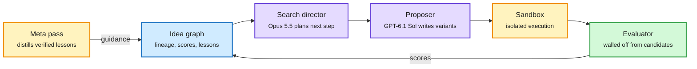

# Media Zone | 2026-10-08

> *Live draft: this window is still open. It is finalized with the 2026-10-08 digest at the 10:30 IST cutoff.*

> The US evening conversation stayed on cost. Grok Bot will send most requests to a fast small model, KV cache is now a reason flash-storage makers expect to grow, and a Stanford-attributed search harness claims 3.2x lower model spend by splitting planner and proposer across two frontier models. Anthropic shipped Claude Haiku 5.5 late in the US day, and the math-drop argument moved from hype to grading.

## Today's signal

- **Dominant story:** routing by difficulty keeps spreading. Musk says most Grok Bot requests go to a "lightning-fast" Grok 4.8, with a frontier model only for hard asks.
- **Pattern:** KV cache is leaving the GPU. Investors now pitch enterprise SSD demand on agent KV-cache offload, and a practitioner thread calls inference engineering the underrated skill.
- **Fresh launch:** Claude Haiku 5.5 dropped at the tail of the US day. Only the announcement crossed the feed so far; no pricing or benchmarks yet in this window.
- **Counter-signal:** the OpenAI math drop is now being graded, not cheered. One professor rates most results strong and one exceptional; Marcus and Tao flag that the method is undisclosed.
- **Quiet areas:** no new bookmarks were saved this window, no LinkedIn capture landed, and no Reddit post passed the filters. Skipped: Musk politics, stock-pick threads, "pure treasure" prompt bait, robot reels.

---

## Routing, KV cache, compression, GPU

### Cheap path first: routing and small decision models

X post · routing in a consumer product
<h4>Grok Bot: most requests go to a fast Grok 4.8</h4>

Musk says the "operating principle" of Grok Bot is the best mix of speed and intelligence, so most simple requests will be served by a lightning-fast Grok 4.8 once it ships. This follows yesterday's line that Grok Bot will pick the best back end for any task, including Claude. It is the same difficulty-routing pattern as OpenAI's Decisions API, now stated as product policy by a consumer assistant. The cost angle is direct: the expensive model only sees the hard tail.

<a href="https://x.com/elonmusk/status/2107894231922876510">Read the post →</a>

Repo + guide · decision models on 4GB VRAM
<h4>Unsloth: train your own Jev-style decision model locally</h4>

Jev (yesterday's decision model, which scores bounded choices from token logits instead of generating text) now has an open training recipe. Unsloth fine-tuned Qwen3.5 0.8B with a classification head and LoRA (r=64) for one epoch, lifting its average accuracy on three decision benchmarks from 20.7% to 74.3%. It fits in 4GB of VRAM. For routing and LLM-as-judge pipelines, this means the gate itself can be a sub-1B model you own, not an API call.

<a href="https://unsloth.ai/docs/basics/train-your-own-decision-model-with-unsloth">Read the guide →</a>

X Article · agent memory without generation
<h4>Jev-Mem: memory decisions without an LLM writing sentences</h4>

Mem0 applies the same idea to agent memory. Every memory system makes many small calls: store this, update that, drop the old fact. Jev-Mem makes those calls with a scorer and thresholds instead of a generative LLM, which cuts latency and tokens per turn. Mem0 is upfront that the thresholds were tested with one model on one benchmark, so treat it as a promising pattern, not a settled result.

<a href="https://x.com/mem0ai/status/2107873474517889201">Read the article →</a>

### KV cache leaves the GPU, and inference becomes its own discipline

Market signal · memory hierarchy
<h4>SanDisk's data-center bet rides on KV-cache offload</h4>

A market analyst projects SanDisk data-center revenue growing about 30x to roughly $8B a quarter by 2028, citing agents pushing KV cache (the saved attention state a model reuses instead of recomputing) onto enterprise SSDs. The forecast is an investor's, not a company guide, so weight it lightly. The structural point matters more: long agent sessions make the cache tier a storage purchase, not only an HBM one, echoing Micron's recent run.

<a href="https://x.com/StockSavvyShay/status/2107879684944130201">Read the post →</a>

Explainer thread · serving fundamentals
<h4>Inference engineering is the underrated skill</h4>

A clear primer on why serving is its own field. Prefill (processing the prompt) is compute-heavy and parallel; decode (one token per step) is bound by memory bandwidth because it rereads weights and a growing KV cache each step. Batching, KV capacity, scheduling, kernel choice and tail latency all follow from that split. Nothing new to a specialist, but it is a good one-page map of where serving cost actually comes from.

<a href="https://x.com/techNmak/status/2107678022094790933">Read the thread →</a>

Practitioner · heterogeneous serving
<h4>MiMo 2.6 Flash split across an RTX 6000 and an M5 laptop</h4>

A Hugging Face engineer ran MiMo 2.6 Flash across a workstation GPU and a laptop over 10 GbE at about 40 tokens per second. Pipeline-splitting a model across mismatched consumer devices used to be a curiosity; at this speed it is usable. Pairs with today's HN thread on running a 125B Qwen 3.8 Flash Next on one RTX 4090.

<a href="https://x.com/huggingface/status/2107891092762890588">Read the post →</a> · <a href="https://news.ycombinator.com/item?id=49953495">HN thread →</a>

### Compute supply and new silicon

Infrastructure · public compute
<h4>National Compute: MI355x and B300 nodes for .edu and .gov</h4>

Anjney Midha says hundreds of AMD MI355x and NVIDIA B300 nodes are now live on the National Compute Grid, subsidized for academic and government users. The site is already showing a demand-surge notice. It is a rare mixed AMD and NVIDIA pool aimed at researchers, which matters if academic labs are to test frontier-scale efficiency work.

<a href="https://nationalcompute.com">Visit the grid →</a>

Chip launch · YC retweet
<h4>XPU Grasshopper: an AI chip "co-designed with AI"</h4>

YC amplified the launch of XPU Grasshopper, pitched as a chip designed with AI help for recursive self-improvement workloads. Only the truncated launch post crossed the feed, with no specs, process node or benchmarks. Track it, do not trust it yet.

<a href="https://x.com/ycombinator/status/2107890049534849433">Read the post →</a>

---

## LLMs, agents, safety

### Search harnesses: split the planner from the proposer

The planner never sees the code, and the code never sees the grader

The claimed savings come from resetting sessions and keeping state in a graph, not in context.

Blue is persistent state, purple are the two models, amber is execution and learning, green is the isolated scorer.

X thread · unverified claim
<h4>Two frontier models, one idea graph, 3.2x lower spend</h4>

A viral thread credits a Stanford group with a code-search harness where Opus 5.5 plans, GPT-6.1 Sol proposes code, and a persistent graph database holds lineage, so each session resets and context never bloats. MAP-Elites and MCTS (two classic search strategies) become single graph queries. Claimed results: 3.2x lower model spend than fixed evolutionary loops, first place in 7 AtCoder heuristic contests, and SOTA on Anthropic's kernel-builder task. The thread links no paper, so the numbers are unverified; the design idea (state in a graph, not in tokens) is the takeaway.

<a href="https://x.com/marfinxx/status/2107455916643647984">Read the thread →</a>

Practitioner · own your harness
<h4>Agent-to-agent with a personal agent on top</h4>

Elvis Saravia describes a year of escalation: single Claude Code sessions, then subagents, then a persistent team of about eight role bots, and now agent-to-agent messaging under a personal agent. His claim is that packaged apps lag far behind, so everyone should build their own orchestrator, even from a fork. It continues the harness-engineering theme the reader has been saving all quarter.

<a href="https://x.com/omarsar0/status/2107880581216477417">Read the post →</a>

Open source · RL environments
<h4>Scale AI open-sources AgentEnv</h4>

Scale says every RL environment it builds runs on AgentEnv and is now releasing it. Environments are the bottleneck for agent RL, so a production-tested framework lowers the cost of building them. Elvis also noted more teams are realizing RL on today's open models is a business opportunity.

<a href="https://x.com/omarsar0/status/2107874375227601082">Read the post →</a>

### The math drop gets graded

Essay · Marcus and Tao
<h4>"The real news isn't the result, it's what we weren't told"</h4>

Gary Marcus argues OpenAI's 722 AI-written manuscripts came from an unreleased model with an undisclosed procedure: no failure rate, no architecture, no word on whether Lean verification was iterative. Without that, nobody can say if the gains generalize beyond verifiable math. Terence Tao's remarks, paired in the same post, are more measured. Both point to the same gap: impressive output, unreadable method.

<a href="https://garymarcus.substack.com/p/complementary-remarks-from-gary-marcus">Read the essay →</a>

Expert grading
<h4>A math professor sorts the 372 result families</h4>

Abhishek Saha (Queen Mary University of London) graded the drop on a four-level scale. His read: some results are solid but ordinary, most are exceptional or field-changing, and one, a quasi-Riemann hypothesis result, is a shock. He called it "a very big day for mathematics." The proofs are still not fully checked, and each took about three hours of compute.

<a href="https://x.com/IntuitMachine/status/2107891288666423436">Read the post →</a>

---

## Industry and business

- **Claude Haiku 5.5** launched late in the US day; only the announcement has landed so far, so pricing and benchmarks wait for the morning build ([Anthropic](https://x.com/AnthropicAI/status/2107894208547983705)).
- **SpaceX** is reportedly in early talks to borrow $40B for NVIDIA chips, with Apollo leading the package ([Bloomberg via @rohanpaul_ai](https://x.com/rohanpaul_ai/status/2107890277189062846)).
- **Nous Research** raised a Series B, per the WSJ, to push Hermes Agent further and build a mobile app ([YC retweet](https://x.com/ycombinator/status/2107886710621438010)).
- **Mistral Large 4** preview entered the top 15 labs on Code Arena WebDev, the only European lab there; it also topped Hacker News for the day ([Arena](https://x.com/arena/status/2107879883393384677)).
- **Perplexity** released pplx-embed-v2-late, 0.6B and 9B late-interaction embedding models for text and image retrieval ([@tomaarsen](https://x.com/stanfordnlp/status/2107886986401075202)).
- **Brainbase and Stripe** launched agentic payments, letting agents make purchases for users ([post](https://x.com/harjtaggar/status/2107894073441046645)).
- **Hinton, Bengio and 20+ experts** published a policy paper asking governments to act on frontier AI risk ([@rohanpaul_ai](https://x.com/rohanpaul_ai/status/2107881329639686201)).
- **Meta's Muse** agent is reportedly coming to Windows, extending one agent across phone, web, WhatsApp and PC ([post](https://x.com/StockSavvyShay/status/2107888998362513447)).

---

## Videos

- **Philipp Schmid (DeepMind), AI Engineer:** why each agent should run in its own sandbox. Same isolation principle as the search harness above.
- **Vlad Luzin, AI Engineer:** why agent-to-agent communication still breaks in practice. Direct counterpoint to Elvis's optimism.
- **Hugging Face, Xet buckets:** chunk-level dedup so only changed bytes upload. A storage-cost win for large checkpoint workflows.

---

## Also crossed your feeds

[OpenAI: Production monitoring with Codex](https://youtube.com/watch?v=DmCaBWv5yG8) · [OpenAI: R&D Part 2](https://youtube.com/watch?v=N5kTmoCKbe0) · [Sonar and McKinsey agent panel](https://youtube.com/watch?v=XqF-IFHBCkM) · [Google Cloud: voice agents controlling the browser](https://youtube.com/watch?v=xDL5DFMo1-Y) · [BigQuery graph measures for agents](https://youtube.com/watch?v=CEtOL6yDmMc) · [CMU 11-785 Lecture 13](https://youtube.com/watch?v=HA2absvNeYc) · [IndiaAI: future of AI safety panels](https://youtube.com/watch?v=Ts0z0MC3ePs) · [WorldofAI news roundup](https://youtube.com/watch?v=-mv1Tf26Vms) · [HN: Gemini 4 Argon](https://news.ycombinator.com/item?id=49913571) · [HN: Kolibri sovereign open-weight model](https://news.ycombinator.com/item?id=49942706) · [Berkeley: do human-LLM chat datasets agree?](https://x.com/berkeley_ai/status/2107893959322476609) · [SynthID Detector open to all](https://x.com/NVIDIAAI/status/2107882195738394716) · [ACL 2027 CFP](https://x.com/stanfordnlp/status/2107885568013283754) · [Pragmatic Engineer: Sam Newman on resilient systems and multi-vendor AI hedging](https://newsletter.pragmaticengineer.com/p/building-resilient-systems-with-sam)
